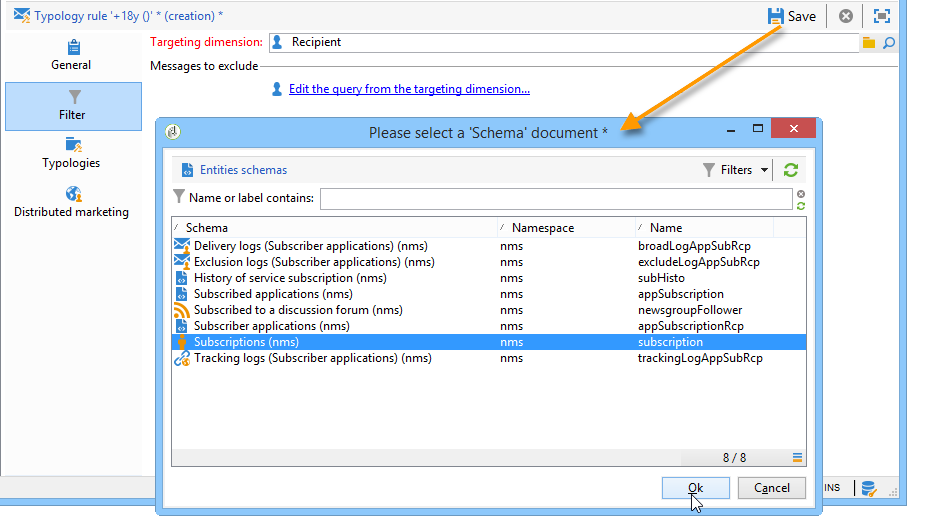
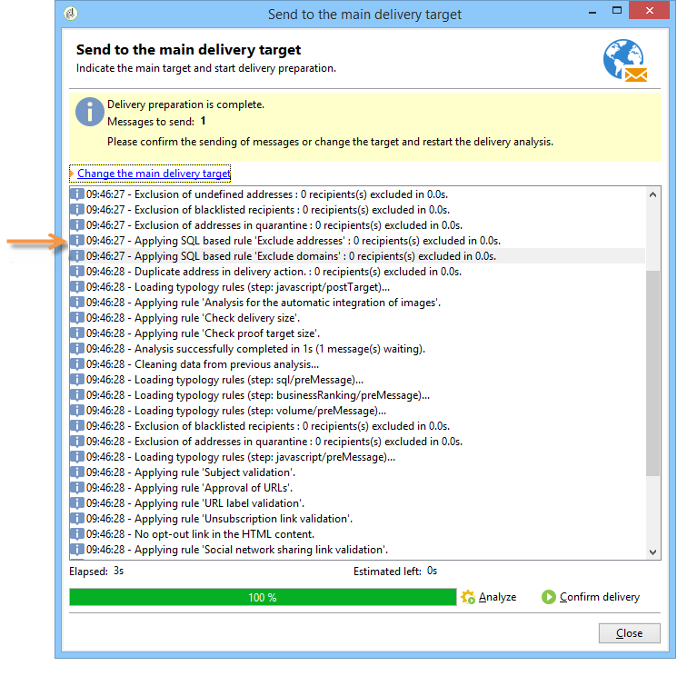

# Regole di filtro{#filtering-rules}

Le regole di filtro consentono di definire i messaggi da escludere in base ai criteri definiti in una query. Queste regole sono collegate a una dimensione di targeting.

Le regole di filtro possono essere collegate ad altri tipi di regole (controllo, pressione, ecc.) nelle tipologie o raggruppate in una tipologia **Filtro** dedicata. Per ulteriori informazioni, consulta [Creazione e utilizzo di una tipologia di filtro](#creating-and-using-a-filtering-typology).

## Creare una regola di filtro {#creating-a-filtering-rule}

Ad esempio, puoi filtrare gli abbonati alle newsletter per evitare che le comunicazioni vengano inviate a destinatari minorenni.

Per definire questo filtro, effettua le seguenti operazioni:

1. Creare una regola di tipologia **[!UICONTROL Filtering]** applicabile a tutti i canali di comunicazione.

   

1. Modificare la dimensione di targeting predefinita e selezionare le sottoscrizioni (**nms:subscription**).

   

1. Creare il filtro utilizzando il collegamento **[!UICONTROL Edit the query from the targeting dimension...]**.

   

1. Collega questa regola a una tipologia di campagna e salvala.

   

Quando questa regola viene utilizzata in una consegna, gli abbonati minorenni vengono esclusi automaticamente. Un messaggio specifico indica l’applicazione della regola:

## Condizione di una regola di filtro {#conditioning-a-filtering-rule}

Puoi limitare il campo dell’applicazione della regola di filtro in base alla consegna o alla struttura della consegna collegata.

A questo scopo, vai alla scheda **[!UICONTROL General]** della regola di tipologia, seleziona il tipo di restrizione da applicare e crea il filtro, come illustrato di seguito:

In questo caso, anche se la regola è collegata a tutte le consegne, verrà applicata solo a quelle che corrispondono ai criteri del filtro definito.

>[!NOTE]
>
>Le tipologie e le regole di filtro possono essere utilizzate in un flusso di lavoro, nell&#39;attività **[!UICONTROL Delivery outline]**. Per ulteriori informazioni al riguardo, consulta [questa sezione](../../workflow/using/delivery-outline.md).

## Creare e utilizzare una tipologia di filtro {#creating-and-using-a-filtering-typology}

È possibile creare **[!UICONTROL Filtering]** tipologie: contengono solo regole di filtro.

Queste tipologie specifiche possono essere collegate a una consegna quando la destinazione è selezionata: nella procedura guidata di consegna, fai clic sul collegamento **[!UICONTROL To]**, quindi sulla scheda **[!UICONTROL Exclusions]**.

Quindi seleziona la tipologia di filtro da applicare alla consegna. A tale scopo, fare clic sul pulsante **[!UICONTROL Add]** e selezionare le tipologie da applicare.

Puoi anche collegare le regole di filtro direttamente tramite questa scheda, senza raggrupparle in una tipologia. A tale scopo, utilizzare la sezione inferiore della finestra.

>[!NOTE]
>
>Nella finestra di selezione sono disponibili solo le tipologie e le regole di filtro.
>
>Queste configurazioni possono essere definite nel modello di consegna e applicate automaticamente a tutte le nuove consegne create utilizzando il modello.
>

## Regole di esclusione del recapito messaggi predefinite {#default-deliverability-exclusion-rules}

Per impostazione predefinita sono disponibili due regole di filtro: **[!UICONTROL Exclude addresses]** ( **[!UICONTROL addressExclusions]** ) e **[!UICONTROL Exclude domains]** ( **[!UICONTROL domainExclusions]** ). Durante l’analisi e-mail, queste regole confrontano gli indirizzi e-mail dei destinatari con gli indirizzi o i nomi di dominio non consentiti contenuti in un elenco di soppressione globale crittografato gestito nell’istanza di recapito messaggi. In caso di corrispondenza, il messaggio non viene inviato al destinatario.

Questo per evitare di essere aggiunti al inserisco nell&#39;elenco Bloccati di a causa di attività dannose, in particolare l’utilizzo di uno Spamtrap. Ad esempio, se utilizzi uno Spamtrap per abbonarti tramite uno dei tuoi moduli web, un’e-mail di conferma viene inviata automaticamente a quello Spamtrap, e il tuo indirizzo viene aggiunto automaticamente al inserisco nell&#39;elenco Bloccati di.

>[!NOTE]
>
>Gli indirizzi e i nomi di dominio contenuti nell’elenco di soppressione globale sono nascosti. Nei registri di analisi della consegna è indicato solo il numero di destinatari esclusi.
