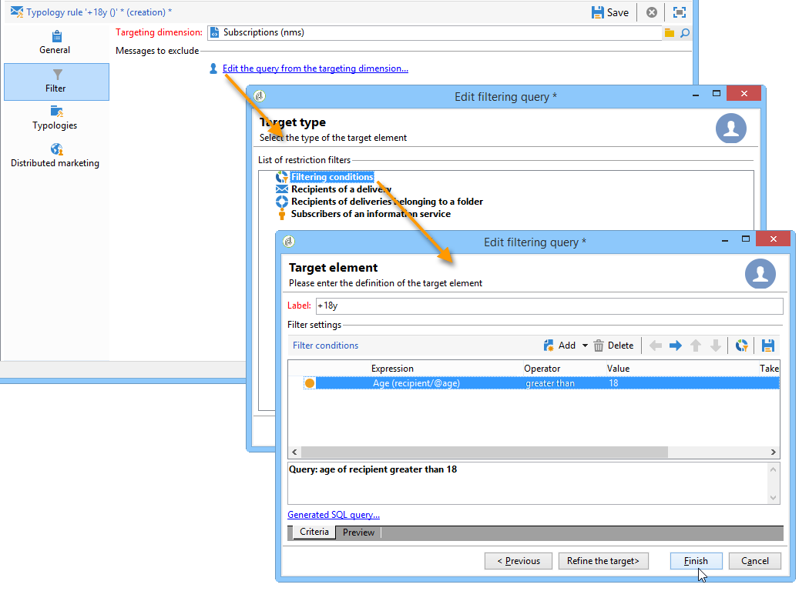

# Regole di filtro{#filtering-rules}

Le regole di filtro ti consentono di definire i messaggi da escludere in base ai criteri definiti in una query. Queste regole sono collegate a una dimensione di targeting.

Le regole di filtro possono essere collegate ad altri tipi di regole (controllo, pressione, ecc.) in tipologie o raggruppate in un **Filtro** tipologia. Per ulteriori informazioni, consulta [Creazione e utilizzo di una tipologia di filtro](#creating-and-using-a-filtering-typology).

## Creazione di una regola di filtro {#creating-a-filtering-rule}

Ad esempio, puoi filtrare gli abbonati alla newsletter per impedire l’invio di comunicazioni ai destinatari minorenni.

Per definire questo filtro, effettua le seguenti operazioni:

1. Crea un **[!UICONTROL Filtering]** regola di tipologia applicabile a tutti i canali di comunicazione.

   

1. Modifica la dimensione di targeting predefinita e seleziona le sottoscrizioni (**nms:abbonamento**).

   

1. Crea il filtro utilizzando **[!UICONTROL Edit the query from the targeting dimension...]** link.

   

1. Collega questa regola a una tipologia di campagna e salvala.

   

Quando questa regola viene utilizzata in una consegna, gli utenti con sottoscrizione inferiore vengono esclusi automaticamente. Un messaggio specifico indica l&#39;applicazione della regola:

## Condizionamento di una regola di filtro {#conditioning-a-filtering-rule}

Puoi limitare il campo dell’applicazione della regola di filtro in base al profilo di consegna o consegna collegato.

Per eseguire questa operazione, vai alla pagina **[!UICONTROL General]** scheda della regola di tipologia, seleziona il tipo di restrizione da applicare e crea il filtro, come illustrato di seguito:

In questo caso, anche se la regola è collegata a tutte le consegne, verrà applicata solo a quelle che corrispondono ai criteri del filtro definito.

>[!NOTE]
>
>Le tipologie e le regole di filtro possono essere utilizzate in un flusso di lavoro, nel **[!UICONTROL Delivery outline]** attività. Per ulteriori informazioni al riguardo, consulta [questa sezione](../../workflow/using/delivery-outline.md).

## Creazione e utilizzo di una tipologia di filtro {#creating-and-using-a-filtering-typology}

Puoi creare **[!UICONTROL Filtering]** tipologie: contengono solo regole di filtro.

Puoi collegare queste tipologie specifiche a una consegna quando viene selezionato il target: nella procedura guidata di consegna, fai clic su **[!UICONTROL To]** fai clic sul collegamento **[!UICONTROL Exclusions]** scheda .

Quindi seleziona la tipologia di filtro da applicare alla consegna. A questo scopo, fai clic sul pulsante **[!UICONTROL Add]** e selezionare le tipologie da applicare.

Puoi anche collegare le regole di filtro direttamente tramite questa scheda, senza raggrupparle in una tipologia. A questo scopo, utilizza la sezione inferiore della finestra.

>[!NOTE]
>
>Nella finestra di selezione sono disponibili solo le tipologie e le regole di filtro.
>
>Queste configurazioni possono essere definite nel modello di consegna da applicare automaticamente a tutte le nuove consegne create utilizzando il modello .

## Regole di esclusione del recapito messaggi predefinite {#default-deliverability-exclusion-rules}

Per impostazione predefinita sono disponibili due regole di filtro: **[!UICONTROL Exclude addresses]** ( **[!UICONTROL addressExclusions]** ) e **[!UICONTROL Exclude domains]** ( **[!UICONTROL domainExclusions]** ). Durante l’analisi delle e-mail, queste regole confrontano gli indirizzi e-mail dei destinatari con gli indirizzi o i nomi di dominio vietati contenuti in un elenco di eliminazione globale crittografato gestito nell’istanza di recapito messaggi. In caso di corrispondenza, il messaggio non viene inviato al destinatario.

Questo per evitare di essere aggiunti al elenco Bloccati a causa di attività dannose, soprattutto l&#39;uso di uno Spamtrap. Ad esempio, se si utilizza uno Spamtrap per effettuare l’abbonamento tramite uno dei moduli web, viene inviata automaticamente un’e-mail di conferma a tale Spamtrap, con conseguente aggiunta automatica dell’indirizzo al elenco Bloccati.

>[!NOTE]
>
>Gli indirizzi e i nomi di dominio contenuti nell’elenco di soppressione globale sono nascosti. Nei registri di analisi della consegna è indicato solo il numero di destinatari esclusi.
