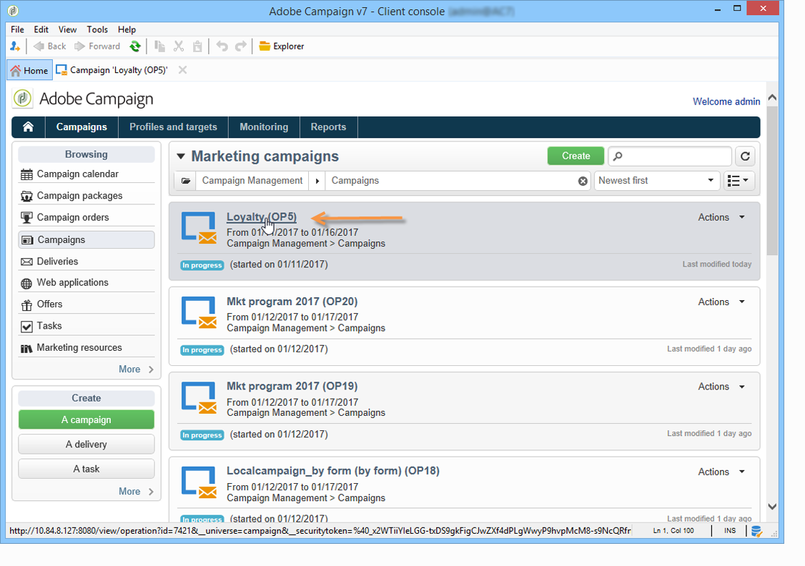

# Accesso alle campagne di marketing{#accessing-marketing-campaigns}

Adobe Campaign consente di creare, configurare, eseguire e analizzare campagne di marketing. Tutte le campagne di marketing possono essere gestite da un centro di controllo unificato.

## Nozioni di base su Workspace {#workspace-basics}

### Home page {#home-page}

Una volta connesso ad Adobe Campaign, sfoglia le varie funzionalità utilizzando i collegamenti nella barra di navigazione.

Gli elementi della campagna si trovano nella scheda **[!UICONTROL Campaigns]**: qui puoi vedere una panoramica dei programmi di marketing, delle campagne e dei loro sottoinsiemi. Un programma di marketing è costituito da campagne, che sono costituite da consegne, attività, risorse collegate, ecc. Nel contesto della gestione delle campagne di marketing tramite Campaign, le informazioni relative a consegne, budget, revisori e documenti collegati si trovano nelle campagne.

Il blocco **[!UICONTROL Browsing]** della scheda **[!UICONTROL Campaigns]** offre diverse voci, a seconda dei moduli installati nell&#39;istanza. Ad esempio, puoi accedere a:

* **Calendario campagne**: calendario di piani, programmi di marketing, consegne e campagne. Consulta il [calendario della campagna](#campaign-calendar).
* **Campagne**: accesso alle campagne contenute in tutti i programmi di marketing.
* **Consegne**: accesso alle consegne collegate alle campagne.
* **Applicazioni Web**: accesso alle applicazioni Web (moduli, pagine di destinazione, ecc.).

>[!NOTE]
>
>Per ulteriori informazioni sull&#39;ergonomia generale di Adobe Campaign, sulle autorizzazioni e sulle funzionalità di gestione dei profili, consulta [questa sezione](../../platform/using/adobe-campaign-workspace.md).
>
>Tutte le funzionalità relative a canali e consegne sono descritte in [questa sezione](../../delivery/using/steps-about-delivery-creation-steps.md).

### Calendario della campagna {#campaign-calendar}

Ogni campagna appartiene a un programma che a sua volta appartiene a un piano. I piani, i programmi e le campagne sono accessibili tramite il menu **[!UICONTROL Campaign calendar]** nella scheda **Campagne**.

Per modificare un piano, un programma, una campagna o una consegna, fare clic sul nome nel calendario e quindi su **[!UICONTROL Open...]**. Viene quindi visualizzato in una nuova scheda, come illustrato di seguito:

È possibile filtrare le informazioni visualizzate nel calendario della campagna: fare clic sul collegamento **[!UICONTROL Filter]** e selezionare i criteri di filtro.

>[!NOTE]
>
>Quando si applica un filtro in base a una data, vengono visualizzate tutte le campagne con una data di inizio successiva alla data specificata e/o con una data di fine precedente alla data specificata. Selezionare le date utilizzando i calendari a destra di ciascun campo.

È inoltre possibile utilizzare il campo **[!UICONTROL Search]** per filtrare gli elementi visualizzati.

Le icone collegate a ciascun elemento ti consentono di visualizzarne lo stato: completato, in corso, in corso di modifica, ecc.

### Esplorazione in un programma di marketing {#browsing-in-a-marketing-program}

Campaign ti consente di gestire un set di programmi composto da varie campagne di marketing. Ogni campagna contiene consegne e i processi e le risorse associati.

#### Esplorazione di un programma {#browsing-a-program}

Durante la modifica di un programma, utilizza le schede descritte di seguito per sfogliarlo e configurarlo.

* Nella scheda **Pianificazione** viene visualizzato il calendario dei programmi per un mese, una settimana o un giorno, a seconda della scheda su cui si fa clic nell&#39;intestazione del calendario.

  Se necessario, puoi creare una campagna, un programma o un’attività tramite questa pagina.

  

* La scheda **Modifica** ti consente di personalizzare il programma: nome, date di inizio e fine, budget, documenti collegati, ecc.

  

#### Navigazione nelle campagne {#browsing-campaigns}

È possibile accedere alle campagne tramite il calendario della campagna, la scheda **[!UICONTROL Schedule]** del programma o l’elenco delle campagne.

1. Tramite il calendario della campagna, selezionare la campagna da visualizzare, quindi fare clic sul collegamento **[!UICONTROL Open]**.

   

   La campagna viene modificata in una nuova scheda, come illustrato di seguito:

   

1. Tramite la scheda **[!UICONTROL Schedule]** del programma, la modalità di modifica è la stessa del calendario della campagna.
1. Tramite il collegamento **[!UICONTROL Campaigns]** della scheda **[!UICONTROL Campaigns]**, fare clic sul nome della campagna che si desidera modificare.

   

### Controllo di una campagna {#controlling-a-campaign}

#### Dashboard {#dashboard}

Per ogni campagna, processi, risorse e consegne sono centralizzati in un’unica schermata, la dashboard, che consente di gestire le azioni di marketing in collaborazione con gli altri.

Il dashboard di una campagna viene utilizzato come interfaccia di controllo. Accede direttamente alle fasi principali di creazione e gestione della campagna: consegne, file di estrazione, notifiche, budget, ecc.

Con Adobe Campaign puoi impostare processi collaborativi per la creazione e l’approvazione delle varie fasi delle campagne di marketing e comunicazione: approvazione del budget, target, contenuto, ecc.

>[!NOTE]
>
>La configurazione dei modelli di campagna è presentata in [Modelli di campagna](../../campaign/using/marketing-campaign-templates.md#campaign-templates).

#### Pianificazione {#schedule}

Una campagna centralizza una serie di consegne. Per ogni campagna, la pianificazione offre una visualizzazione globale di tutti i componenti: puoi visualizzare le attività e le consegne e accedervi facilmente.

#### Forum {#forum}

Per ogni campagna, gli operatori possono scambiarsi messaggi tramite un forum dedicato.

Ulteriori informazioni sono disponibili in [Forum di discussione](../../mrm/using/discussion-forums.md).

#### Rapporti {#reports}

Il collegamento **[!UICONTROL Reports]** ti consente di accedere ai rapporti della campagna.

>[!NOTE]
>
>I report sono descritti in [questa sezione](../../reporting/using/about-adobe-campaign-reporting-tools.md).

#### Configurazione {#configuration}

Le campagne vengono create tramite modelli di campagna. Puoi configurare modelli riutilizzabili per i quali sono selezionate alcune opzioni e altre impostazioni sono già salvate. Per ogni campagna sono offerte le seguenti funzionalità:

* Riferimento a [documenti e risorse](../../campaign/using/marketing-campaign-deliveries.md#managing-associated-documents): è possibile associare documenti alla campagna (breve, report, immagini, ecc.). Sono supportati tutti i formati di documento.
* Definizione dei costi: per ogni campagna, Adobe Campaign ti consente di definire [voci di costo e strutture di calcolo dei costi](../../campaign/using/providers-stocks-and-budgets.md#defining-cost-categories) che possono essere utilizzate durante la creazione della campagna di marketing. Ad esempio: spese di stampa, ricorso ad agenzie esterne, affitto di stanze.
* Definizione degli obiettivi: puoi definire obiettivi quantificabili per una campagna, ad esempio numero di abbonati, volume di business, ecc. Queste informazioni vengono successivamente utilizzate nei rapporti delle campagne.
* Gestione di [indirizzi seed](../../delivery/using/about-seed-addresses.md) e [gruppi di controllo](../../campaign/using/marketing-campaign-deliveries.md#defining-a-control-group).
* Gestione delle approvazioni: è possibile selezionare i trattamenti da approvare e, se necessario, selezionare gli operatori di revisione o i gruppi di operatori. [Ulteriori informazioni](../../campaign/using/marketing-campaign-approval.md#checking-and-approving-deliveries)

>[!NOTE]
>
>Per accedere alle configurazioni della campagna e apportare modifiche, fare clic sul collegamento **[!UICONTROL Advanced campaign parameters...]** nella scheda **[!UICONTROL Edit]**.

## Utilizzo dell’interfaccia web {#using-the-web-interface-}

Puoi accedere alle schermate della console Adobe Campaign tramite un browser Internet per visualizzare tutte le campagne e le consegne, nonché i rapporti e le informazioni sui profili nel database. Questo accesso non consente la creazione di record. A seconda dei diritti degli operatori, è possibile visualizzare e/o agire sui dati nel database. Ad esempio, puoi approvare il contenuto della campagna e il targeting, riavviare o interrompere una consegna, ecc.

1. Accedi come di consueto tramite https://`<your instance>:<port>/view/home`.
1. Utilizza i menu per accedere alle panoramiche.

   

Oltre a navigare tra le campagne e visualizzarle, puoi eseguire i seguenti tipi di attività:

* Monitorare l’attività su un’istanza
* Partecipa ai processi di convalida, ad esempio approva o rifiuta un contenuto di consegna
* Eseguire altre azioni rapide, ad esempio sospendere un flusso di lavoro
* Accedere a tutte le funzioni di reporting
* Partecipa alle discussioni del forum

Questa tabella fornisce un riepilogo delle azioni che è possibile eseguire sulle campagne da un browser:

| Pagina  | Azione |
| --- | --- |
| Elenco di campagne, consegne, offerte, ecc. | Eliminare una voce di elenco |
| Campaign | Annullare una campagna |
| Consegna | Approva il contenuto e la destinazione della consegna Invia il contenuto della consegna Conferma una consegna Sospendi e interrompi una consegna |
| Applicazione web | Crea un&#39;applicazione Web Modifica il contenuto e le proprietà dell&#39;applicazione Salva il contenuto dell&#39;applicazione come modello Publish l&#39;applicazione |
| Offerta | Approva il contenuto e l&#39;idoneità dell&#39;offerta Disattiva un&#39;offerta online |
| Attività Task | Termina un&#39;attività Annulla un&#39;attività |
| Risorse di marketing | Approva una risorsa Blocca e sblocca una risorsa |
| Pacchetto campagna | Invia un pacchetto per l&#39;approvazione Approva o rifiuta un pacchetto Annulla un pacchetto |
| Ordine delle campagne | Crea un ordine Accetta o rifiuta un ordine <!-- Je n'ai pas pu créer de campaign order pour vérifier cela. Peut-on accéder à ces fonctionnalités depuis l'accès web ? --> |
| Magazzino | Eliminare una linea di magazzino |
| Simulazione di offerta | Avviare e interrompere una simulazione |
| Flusso di lavoro di destinazione | Avviare, mettere in pausa e interrompere un flusso di lavoro |
| Report | Salva i dati correnti nella cronologia del rapporto |
| Forum | Aggiungi una discussione Rispondi a un messaggio in una discussione Segui una discussione e annulla l&#39;iscrizione |

### Approvazioni

Le approvazioni (ad esempio di un target o di un contenuto di consegna) possono essere eseguite tramite accesso web.

Puoi anche utilizzare il collegamento contenuto nei messaggi di notifica. Per ulteriori informazioni, consulta [Verifica e approvazione delle consegne](../../campaign/using/marketing-campaign-approval.md#checking-and-approving-deliveries).
