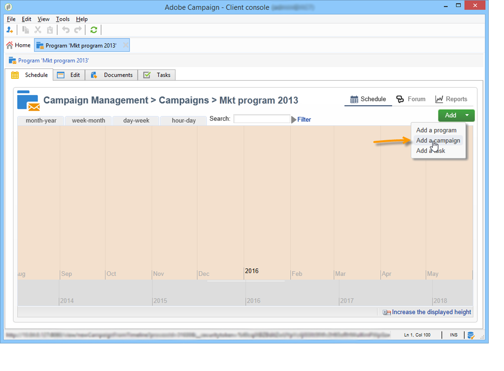

# Accesso alle campagne di marketing{#accessing-marketing-campaigns}

 Adobe Campaign consente di creare, configurare, eseguire e analizzare campagne di marketing. Tutte le campagne di marketing possono essere gestite da un centro di controllo unificato.

## Nozioni di base sull&#39;area di lavoro {#workspace-basics}

### Pagina Home {#home-page}

Una volta effettuata la connessione a  Adobe Campaign, verrà visualizzata la home page.

Fate clic sui collegamenti nella barra di navigazione per accedere ai vari universi.

Gli elementi della campagna si trovano nell&#39;universo **[!UICONTROL Campaigns]**: qui puoi vedere una panoramica dei programmi e delle campagne di marketing e dei loro sottoinsiemi. Un programma di marketing è costituito da campagne, costituite da consegne, attività, risorse collegate, ecc. Nel contesto della gestione delle campagne di marketing tramite Campaign, le informazioni relative a consegne, budget, revisori e documenti collegati sono reperibili nelle campagne.

Il blocco di navigazione dell&#39;universo **[!UICONTROL Campaigns]** offre varie voci, a seconda dei moduli installati nell&#39;istanza. Ad esempio, potete accedere a:

* **Calendario** campagna: calendario di piani, programmi di marketing, consegne e campagne. Fare riferimento a [Calendario campagna](#campaign-calendar).
* **Campagne**: accesso alle campagne contenute in tutti i programmi di marketing.
* **Consegne**: accesso alle consegne collegate alle campagne.
* **Applicazioni** Web: accesso alle applicazioni Web (moduli, sondaggi, ecc.).

>[!NOTE]
>
>Per ulteriori informazioni sull&#39;ergonomia generale  Adobe Campaign, sulle autorizzazioni e sulle funzionalità di gestione dei profili, consultare [questa sezione](../../platform/using/adobe-campaign-workspace.md).
>
>Tutte le funzionalità relative ai canali e alle consegne sono descritte in [questa sezione](../../delivery/using/steps-about-delivery-creation-steps.md).

### Calendario campagna {#campaign-calendar}

Ogni campagna appartiene a un programma che a sua volta appartiene a un piano. I piani, i programmi e le campagne sono accessibili tramite il menu **[!UICONTROL Campaign calendar]** nell&#39;universo **Campaigns**.

Per modificare un piano, un programma, una campagna o una consegna, fare clic sul nome corrispondente nel calendario e quindi su **[!UICONTROL Open...]**. Viene quindi visualizzato in una nuova scheda, come illustrato di seguito:

Potete filtrare le informazioni visualizzate nel calendario della campagna. A questo scopo, fate clic sul collegamento **[!UICONTROL Filter]** e selezionate i criteri di filtro.

>[!NOTE]
>
>Quando si applica un filtro a una data, vengono visualizzate tutte le campagne con una data di inizio successiva alla data specificata e/o con una data di fine precedente a quella specificata. Le date devono essere selezionate utilizzando i calendari a destra di ciascun campo.

È inoltre possibile utilizzare il campo **[!UICONTROL Search]** per filtrare gli elementi visualizzati.

Le icone collegate a ciascun elemento consentono di visualizzarne lo stato: finito, in corso, in corso di modifica, ecc.

### Esplorazione in un programma di marketing {#browsing-in-a-marketing-program}

Campaign consente di gestire una serie di programmi composti da diverse campagne di marketing. Ogni campagna contiene le consegne, i processi e le risorse associati.

#### Esplorazione di un programma {#browsing-a-program}

Durante la modifica di un programma, utilizzare le schede descritte di seguito per sfogliare e configurarlo.

* La scheda **Schedule** visualizza il calendario dei programmi per un mese, una settimana o un giorno, a seconda della scheda su cui si fa clic nell&#39;intestazione del calendario.

   Se necessario, potete creare una campagna, un programma o un&#39;attività tramite questa pagina.

   

* La scheda **Edit** consente di personalizzare il programma: nome, date di inizio e fine, budget, documenti collegati, ecc.

   

#### Campagne di ricerca {#browsing-campaigns}

Per accedere alle campagne è possibile utilizzare il calendario delle campagne, la scheda **[!UICONTROL Schedule]** del programma o l&#39;elenco delle campagne.

1. Mediante il calendario della campagna, selezionate la campagna da visualizzare, quindi fate clic sul collegamento **[!UICONTROL Open]**.

   

   La campagna viene modificata in una nuova scheda, come illustrato di seguito:

   

1. Tramite la scheda **[!UICONTROL Schedule]** del programma, la modalità di modifica è la stessa utilizzata per il calendario della campagna.
1. Tramite il collegamento **[!UICONTROL Campaigns]** dell&#39;universo **[!UICONTROL Campaigns]**, fare clic sul nome della campagna da modificare.

   

### Controllo di una campagna {#controlling-a-campaign}

#### Dashboard {#dashboard}

Per ogni campagna, i processi, le risorse e le consegne sono centralizzati in un&#39;unica schermata, il dashboard, che consente di gestire le azioni di marketing in collaborazione con altri utenti.

Il dashboard di una campagna viene utilizzato come interfaccia di controllo. Consente di accedere direttamente alle principali fasi di creazione e gestione delle campagne: consegne, file di estrazione, notifiche, budget, ecc.

Con  Adobe Campaign è possibile impostare processi collaborativi per la creazione e l&#39;approvazione delle varie fasi delle campagne di marketing e comunicazione: approvazione del bilancio, obiettivo, contenuto, ecc.

>[!NOTE]
>
>La configurazione dei modelli di campagna è presentata in [Modelli di campagna](../../campaign/using/marketing-campaign-templates.md#campaign-templates).

#### Pianificazione {#schedule}

Una campagna centralizza un insieme di consegne. Per ogni campagna, la pianificazione offre una visualizzazione globale di tutti i componenti: questo consente di visualizzare le attività e le consegne e di accedervi facilmente.

#### Forum {#forum}

Per ogni campagna, gli operatori possono scambiare messaggi tramite un forum dedicato.

Per ulteriori informazioni, consultare [Forum di discussione](../../campaign/using/discussion-forums.md).

#### Rapporti {#reports}

Il collegamento **[!UICONTROL Reports]** consente di accedere ai rapporti delle campagne.

>[!NOTE]
>
>I report sono descritti in [questa sezione](../../reporting/using/about-adobe-campaign-reporting-tools.md).

#### Configurazione {#configuration}

Le campagne vengono create tramite modelli di campagna. Potete configurare modelli riutilizzabili per i quali sono selezionate alcune opzioni e altre impostazioni sono già salvate. Per ogni campagna, sono disponibili le seguenti funzionalità:

* Riferimento a documenti e risorse: potete associare i documenti alla campagna (breve, rapporto, immagini ecc.). Sono supportati tutti i formati di documento. Vedere [Gestione dei documenti associati](../../campaign/using/marketing-campaign-deliveries.md#managing-associated-documents).
* Definizione dei costi: per ogni campagna,  Adobe Campaign consente di definire le voci di costo e le strutture di calcolo dei costi da utilizzare per la creazione della campagna di marketing. Ad esempio: spese di stampa, utilizzo di un&#39;agenzia esterna, noleggio di camere, ecc. Vedere [Definizione delle categorie di costi](../../campaign/using/providers--stocks-and-budgets.md#defining-cost-categories).
* Definizione degli obiettivi: potete definire obiettivi quantificabili per una campagna, ad esempio numero di abbonati, volume di affari, ecc. Tali informazioni vengono successivamente utilizzate nei rapporti sulle campagne.
* Gestione degli indirizzi iniziali (per ulteriori informazioni, fare riferimento a [questa sezione](../../delivery/using/about-seed-addresses.md)) e ai gruppi di controllo (fare riferimento a [Definizione di un gruppo di controllo](../../campaign/using/marketing-campaign-deliveries.md#defining-a-control-group)).
* Gestione delle approvazioni: è possibile selezionare i trattamenti da approvare e, se necessario, selezionare gli operatori di revisione o i gruppi di operatori. Vedere [Controllo e approvazione delle consegne](../../campaign/using/marketing-campaign-approval.md#checking-and-approving-deliveries).

>[!NOTE]
>
>Per accedere alle configurazioni della campagna e apportarvi modifiche, fate clic sul collegamento **[!UICONTROL Advanced campaign parameters...]** nella scheda **[!UICONTROL Edit]**. Per ulteriori informazioni sull&#39;impostazione dei parametri a livello di campagna in modo che le consegne ereditino automaticamente i valori, vedere [la nostra Technote](https://helpx.adobe.com/campaign/kb/simplifying-campaign-management-acc.html#Setparametersatthecampaignlevelsodeliveriesinheritvaluesautomatically).

## Utilizzo dell&#39;interfaccia Web {#using-the-web-interface-}

Potete accedere alle schermate della console  Adobe Campaign tramite un browser Internet per visualizzare tutte le campagne e le consegne, nonché i rapporti e le informazioni sui profili presenti nel database. Questo accesso non consente la creazione dei record. A seconda dei diritti dell&#39;operatore, è possibile visualizzare e/o agire in base ai dati presenti nel database. Ad esempio, potete approvare il contenuto della campagna e il targeting, riavviare o interrompere la consegna, ecc.

1. Accedete normalmente tramite https://`<your instance>:<port>/view/home`.
1. Usate i menu per accedere alle panoramiche.

   

Le approvazioni (ad esempio, di un target o di un contenuto di consegna) possono essere effettuate tramite accesso Web.

Potete anche utilizzare il collegamento contenuto nei messaggi di notifica. Per ulteriori informazioni, vedere [Controllo e approvazione delle consegne](../../campaign/using/marketing-campaign-approval.md#checking-and-approving-deliveries).
