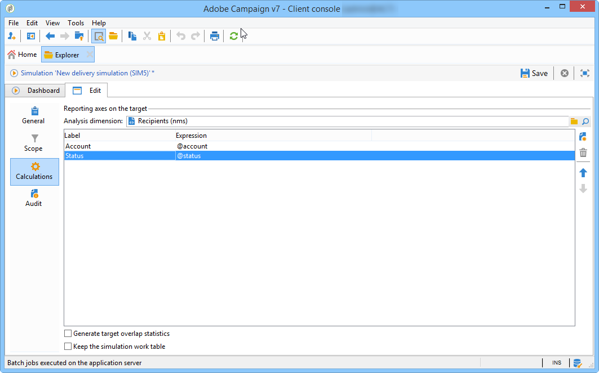
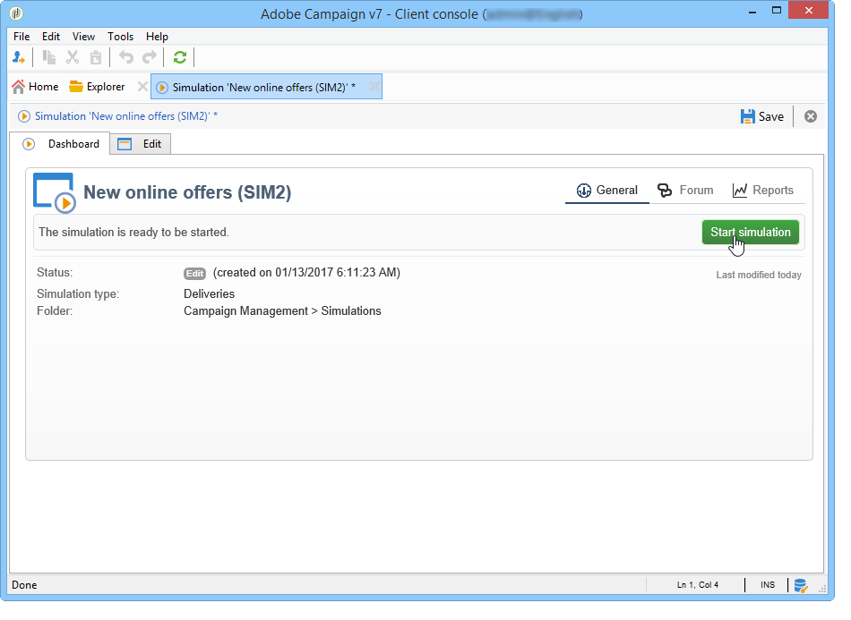
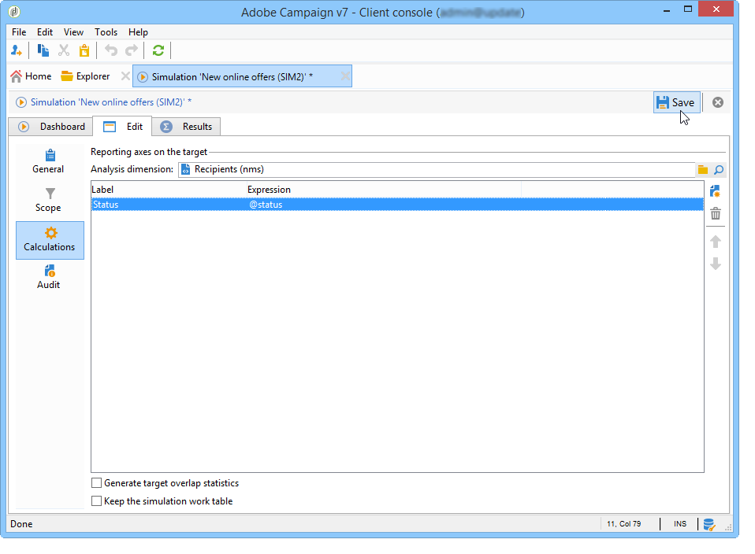

# Simulazioni delle campagne{#campaign-simulations}

## Informazioni sulle simulazioni {#about-simulations}

Ottimizzazione campagna consente di verificare l&#39;efficienza di un piano di campagna mediante simulazioni. Questo consente di misurare il potenziale successo di una campagna: ricavi generati, volume di destinazione in base alle regole di tipologia applicate, ecc.

La simulazione consente di monitorare e confrontare l&#39;impatto delle consegne.

>[!NOTE]
>
>Le consegne preparate in modalità di test non hanno alcun impatto l&#39;una sull&#39;altra, ad esempio nel valutare una campagna nel marketing distribuito, o finché le consegne non sono pianificate nel calendario provvisorio.\
>Ciò significa che le regole di pressione e capacità sono applicate solo alle consegne in **[!UICONTROL Target estimation and message personalization]** modalità. Le consegne in **[!UICONTROL Estimation and approval of the provisional target]** e in **[!UICONTROL Target evaluation]** modalità non sono prese in considerazione.\
>La modalità di consegna viene scelta nella **[!UICONTROL Typology]** sottoscheda delle proprietà di consegna.

## Impostazione di una simulazione {#setting-up-a-simulation}

### Creazione di una simulazione {#creating-a-simulation}

Per creare una simulazione, effettuate le seguenti operazioni:

1. Vai all&#39; **[!UICONTROL Campaigns]** universo, fai clic sul **[!UICONTROL More]** collegamento all&#39;interno della **[!UICONTROL Create]** sezione e seleziona l&#39; **[!UICONTROL Simulation]** opzione.

   

1. Inserite il modello e il nome della simulazione. Fate clic **[!UICONTROL Save]** per creare la simulazione.

   

1. Fare clic sulla **[!UICONTROL Edit]** scheda per configurarla.

   

1. Nella **[!UICONTROL Scope]** scheda, specificate le consegne da considerare per la simulazione. A questo scopo, fate clic sul **[!UICONTROL Add]** pulsante e specificate la modalità di selezione della consegna da tenere in considerazione.

   

   Potete selezionare ogni consegna uno per uno oppure ordinarli per campagna, programma o piano.

   >[!NOTE]
   >
   >Se selezioni le consegne tramite un piano, un programma o una campagna,  Adobe Campaign può aggiornare automaticamente l&#39;elenco delle consegne da tenere in considerazione ogni volta che viene avviata una simulazione. Per eseguire questa operazione, selezionare l&#39; **[!UICONTROL Refresh the selection of deliveries each time the simulation is started]** opzione.
   >  
   >In caso contrario, le consegne non disponibili nel piano, nel programma o nella campagna al momento della creazione della simulazione non verranno prese in considerazione: le consegne aggiunte in seguito verranno ignorate.

   

1. Selezionate gli elementi da includere nell’ambito della simulazione. Se necessario, selezionare più elementi utilizzando i tasti MAIUSC e CTRL.

   

   Click **[!UICONTROL Finish]** to approve the selection.

   Puoi combinare manualmente le consegne e le consegne selezionate appartenenti a piani, programmi o campagne.

   

   Se necessario, è possibile utilizzare una condizione dinamica tramite il **[!UICONTROL Edit the dynamic condition...]** collegamento.

   Fate clic **[!UICONTROL Save]** per approvare la configurazione.

   >[!NOTE]
   >
   >Nel calcolo delle simulazioni si tiene conto solo delle consegne il cui obiettivo è stato calcolato (stati: **Target ready** o **Ready to delivery**).

1. Nella **[!UICONTROL Calculations]** scheda, selezionare una dimensione di analisi, ad esempio lo schema del destinatario.

   

1. Potete quindi aggiungere espressioni.

   

### Impostazioni di esecuzione {#execution-settings}

La **[!UICONTROL General]** scheda della simulazione consente di specificare le impostazioni di esecuzione:

* L’ **[!UICONTROL Schedule execution for down-time]** opzione differisce l’avvio della simulazione a un periodo di tempo meno occupato, in base al livello di priorità scelto. Le simulazioni utilizzano notevoli risorse di database, ecco perché le simulazioni non urgenti dovrebbero essere programmate per essere eseguite di notte, ad esempio.
* È **[!UICONTROL Priority]** il livello applicato alla simulazione per ritardarne l’attivazione.
* **[!UICONTROL Save SQL queries in the log]**. I registri SQL consentono di diagnosticare una simulazione se termina con errori. Possono anche aiutarvi a scoprire perché una simulazione è troppo lenta. Questi messaggi saranno visibili dopo la simulazione nella **[!UICONTROL SQL logs]** sottoscheda della **[!UICONTROL Audit]** scheda.

## Esecuzione di una simulazione {#executing-a-simulation}

### Avvio di una simulazione {#starting-a-simulation}

Una volta definito l’ambito di simulazione, potete eseguirlo.

A tale scopo, aprite il dashboard di simulazione e fate clic su **[!UICONTROL Start simulation]**.

Al termine dell&#39;esecuzione, aprite la simulazione e fate clic sulla **[!UICONTROL Results]** scheda per visualizzare le destinazioni calcolate per ogni consegna.

1. Nella **[!UICONTROL Deliveries]** sottoscheda sono elencate tutte le consegne prese in considerazione dalla simulazione. Vengono visualizzati due conteggi:

   * L&#39;oggetto **[!UICONTROL Initial count]** è l&#39;oggetto così come è stato calcolato durante la sua stima nella consegna.
   * Il numero **[!UICONTROL Final count]** è il numero di destinatari contati dopo la simulazione.

      La differenza tra il conteggio iniziale e quello finale riflette l&#39;applicazione delle varie regole o filtri configurati prima della simulazione.

      Per ulteriori informazioni su questo calcolo, modificare la **[!UICONTROL Exclusions]** sottoscheda.

1. La **[!UICONTROL Exclusions]** sottoscheda consente di visualizzare la suddivisione dell&#39;esclusione.

   

1. La **[!UICONTROL Alerts]** sottoscheda raggruppa tutti i messaggi di avviso generati durante la simulazione. I messaggi di avviso possono essere inviati in caso di sovraccarico di capacità (ad esempio, se il numero di destinatari supera la capacità impostata).
1. La **[!UICONTROL Exploration of the exclusions]** sottoscheda consente di creare una tabella di analisi dei risultati. L&#39;utente deve indicare le variabili negli assi abscissa/ordinata.

   Per un esempio di creazione di tabelle di analisi, fare riferimento alla fine dell&#39; [esplorazione dei risultati](#exploring-results).

### Visualizzazione dei risultati {#viewing-results}

#### Audit {#audit}

La **[!UICONTROL Audit]** scheda consente di monitorare l&#39;esecuzione della simulazione. La **[!UICONTROL SQL Logs]** sottoscheda è utile per gli utenti esperti. Elenca i registri di esecuzione in formato SQL. Questi registri vengono visualizzati solo se l&#39; **[!UICONTROL Save SQL queries in the log]** opzione è stata selezionata nella **[!UICONTROL General]** scheda prima dell&#39;esecuzione della simulazione.

#### Esplorazione dei risultati {#exploring-results}

La **[!UICONTROL Exploration of the exclusions]** sottoscheda consente di analizzare i dati risultanti da una simulazione.

L&#39;analisi descrittiva è dettagliata in [questa sezione](../../reporting/using/about-adobe-campaign-reporting-tools.md).

## Risultati di una simulazione {#results-of-a-simulation}

Gli indicatori nelle schede **[!UICONTROL Log]** e **[!UICONTROL Results]** forniscono una prima panoramica dei risultati della simulazione. Per una visualizzazione più dettagliata dei risultati, aprite la **[!UICONTROL Reports]** scheda.

### Rapporti {#reports}

Per analizzare il risultato di una simulazione, modificatene i rapporti: mostrano esclusioni e cause.

Per impostazione predefinita, vengono forniti i seguenti rapporti:

* **[!UICONTROL Detail of simulation exclusions]** : la relazione fornisce un grafico dettagliato delle cause di esclusione per tutte le consegne interessate.
* **[!UICONTROL Simulation summary]** : questa relazione mostra le popolazioni escluse dalla simulazione per tutta la durata delle varie consegne.
* **[!UICONTROL Summary of exclusions linked to the simulation]** : questo rapporto mostra un grafico delle esclusioni causate dalla simulazione insieme alla regola di tipologia applicata e un grafico che mostra il rapporto di esclusione per regola.

>[!NOTE]
>
>Puoi creare nuovi rapporti e aggiungerli a quelli offerti. Per ulteriori informazioni al riguardo, consulta [questa sezione](../../reporting/using/about-adobe-campaign-reporting-tools.md).

Per accedere ai rapporti, fate clic sul **[!UICONTROL Reports]** collegamento della simulazione mirata tramite il relativo dashboard.

Potete anche modificare i rapporti utilizzando il **[!UICONTROL Reports]** collegamento accessibile dal dashboard di simulazione.

### Confronto delle simulazioni {#comparing-simulations-}

Ogni volta che viene eseguita una simulazione, il risultato sostituisce eventuali risultati precedenti: non è possibile visualizzare e confrontare i risultati di un&#39;esecuzione a un&#39;altra.

Per confrontare i risultati, è necessario utilizzare i rapporti. In effetti,  Adobe Campaign consente di salvare una cronologia dei report per visualizzarla nuovamente in un secondo momento. Questa storia viene salvata durante tutto il ciclo di vita delle simulazioni.

**Esempio:**

1. Create una simulazione su una consegna a cui viene applicata la tipologia **A** .
1. Nella **[!UICONTROL Reports]** scheda, modificate uno dei rapporti disponibili, ad esempio **[!UICONTROL Detail of simulation exclusions]** un rapporto.
1. Nella sezione in alto a destra del rapporto, fai clic sull&#39;icona per creare una nuova cronologia.

   

1. Chiudete la simulazione e modificate la configurazione della tipologia **A**.
1. Eseguire di nuovo la simulazione e confrontare il risultato con quello visualizzato nel report per il quale è stata creata una cronologia.

   

   Puoi salvare tutte le cronologie dei report necessarie.

### Assi di reporting {#reporting-axes}

La **[!UICONTROL Calculations]** scheda consente di definire gli assi di reporting sulla destinazione. Questi assi verranno utilizzati durante l&#39;analisi dei risultati (vedere [Risultati](#exploring-results)di esplorazione).

>[!NOTE]
>
>È consigliabile definire gli assi di calcolo nei modelli di simulazione anziché singolarmente per ogni simulazione.\
>I modelli di simulazione vengono salvati nel **[!UICONTROL Resources > Templates > Simulation templates]** nodo della struttura di Adobe Campaign .

**Esempio:**

Nell&#39;esempio seguente, vogliamo creare un asse di reporting aggiuntivo in base allo stato dei destinatari (&quot;Cliente&quot;, &quot;Prospettiva&quot; o nessuno).

1. Per definire un asse di reporting, selezionare la tabella che contiene le informazioni da elaborare nel **[!UICONTROL Analysis dimension]** campo. Queste informazioni sono obbligatorie.
1. Qui si desidera selezionare il campo Segmento della tabella dei destinatari.

   

1. Sono disponibili le seguenti opzioni:

   * **[!UICONTROL Generate target overlap statistics]** consente di recuperare tutte le statistiche di sovrapposizione nel rapporto di simulazione. Le sovrapposizioni sono destinatari mirati in almeno due consegne all&#39;interno di una simulazione.

      >[!IMPORTANT]
      >
      >Selezionando questa opzione si aumenta notevolmente il tempo di esecuzione della simulazione.

   * **[!UICONTROL Keep the simulation work table]** consente di mantenere tracce di simulazione.

      >[!IMPORTANT]
      >
      >Il salvataggio automatico di queste tabelle richiede una notevole capacità di storage: assicurarsi che il database sia sufficientemente grande.

Quando i risultati della simulazione vengono visualizzati, le informazioni sull&#39;espressione selezionata vengono visualizzate nella **[!UICONTROL Overlaps]** sottoscheda.

Le sovrapposizioni delle destinazioni di consegna indicano i destinatari con targeting in almeno due consegne di una simulazione.

>[!NOTE]
>
>Questa sottoscheda viene visualizzata solo se l&#39; **[!UICONTROL Generate target recovery statistics]** opzione è stata attivata.

Le informazioni sugli assi di reporting possono essere elaborate nei report di analisi dell&#39;esclusione creati nella **[!UICONTROL Exploring exclusions]** sottoscheda. For more on this, refer to [Exploring results](#exploring-results).
