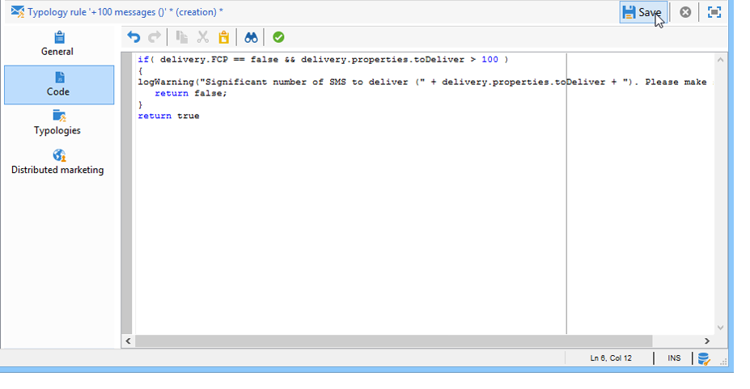
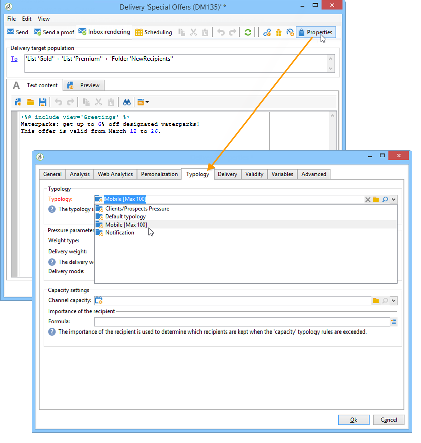

# Regole di controllo{#control-rules}

## Regole di analisi e di controllo dell&#39;arbitrato {#analysis-and-arbitration-control-rules}

Le regole di controllo consentono di garantire la validità e la qualità dei messaggi prima della consegna: visualizzazione del carattere, dimensioni dell&#39;SMS, formato dell&#39;indirizzo, ecc.

Una serie di regole pronte all&#39;uso consente di eseguire controlli consueti. Tali controlli (visualizzati in grassetto nell’interfaccia) sono:

* **[!UICONTROL Object approval]** (e-mail): controlla che l&#39;oggetto mittente e l&#39;indirizzo non contengano caratteri speciali che possono causare problemi a determinati agenti di posta elettronica.
* **[!UICONTROL URL label approval]** (e-mail): verifica che ciascun URL di tracciamento disponga di un’etichetta.
* **[!UICONTROL URL approval]** (e-mail): verifica gli URL di tracciamento (presenza del carattere &quot;&amp;&quot;).
* **[!UICONTROL Message size approval]** (mobile): verifica la dimensione dei messaggi SMS.
* **[!UICONTROL Validity period check]** (e-mail): controlla che il periodo di validità della consegna sia sufficientemente lungo per inviare tutti i messaggi.
* **[!UICONTROL Proof size check]** (tutti i canali): genera un messaggio di errore se la popolazione di destinazione della prova supera i 100 destinatari.
* **[!UICONTROL Wave scheduling check]** (e-mail): controlla che l&#39;ultima serie di consegne abbia inizio prima della fine del periodo di validità, se la consegna è suddivisa in più ondate.
* **[!UICONTROL Unsubscription link approval]** (e-mail): verifica la presenza di almeno un URL di annullamento iscrizione (rinuncia) in ciascun contenuto (HTML e testo).

## Creating a control rule {#creating-a-control-rule}

È possibile creare nuove regole di controllo in base alle proprie esigenze. A tal fine, create una regola di **[!UICONTROL Control]** tipologia e immettete la formula di controllo in SQL nella **[!UICONTROL Code]** scheda.

**Esempio:**

Nell&#39;esempio seguente, creeremo una regola per impedire che un&#39;offerta SMS venga inviata a più di 100 destinatari. Questa regola sarà collegata a una tipologia di campagna, quindi alle consegne via SMS per le quali l&#39;offerta interessata è disponibile.

Effettuate le seguenti operazioni:

1. Creare una regola di **[!UICONTROL Control]** tipologia. Selezionare un livello di **[!UICONTROL Warning]** avviso.

   

1. Nella **[!UICONTROL Code]** scheda, immettere lo script per applicare la soglia desiderata, come illustrato di seguito:

   

   Questo script attiva un avviso se la destinazione di consegna supera i 100 contatti:

   ```
   if( delivery.FCP == false && delivery.properties.toDeliver > 100 ) { logWarning("Significant number of SMS to deliver (" + delivery.properties.toDeliver + "). Please make sure the target is correct.") return false; } return true
   ```

1. Collegate questa regola a una tipologia di campagna e fate riferimento alla tipologia nella distribuzione di SMS interessati.

   

1. Durante l&#39;analisi del recapito, la regola viene applicata e, se applicabile, viene creato un avviso.

   

   Tuttavia, la consegna sarà ancora pronta per l&#39;invio.

   Se si aumenta il livello di avviso, la consegna non verrà avviata.

   

   Al termine dell&#39;analisi, il **[!UICONTROL Confirm delivery]** pulsante non sarà disponibile.

   

