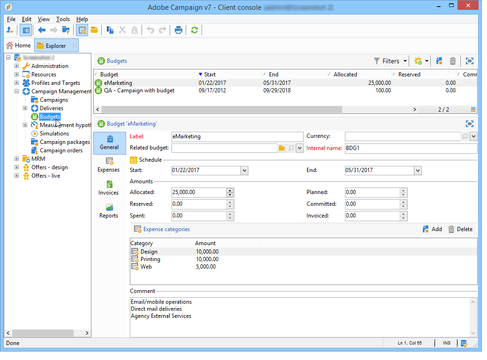
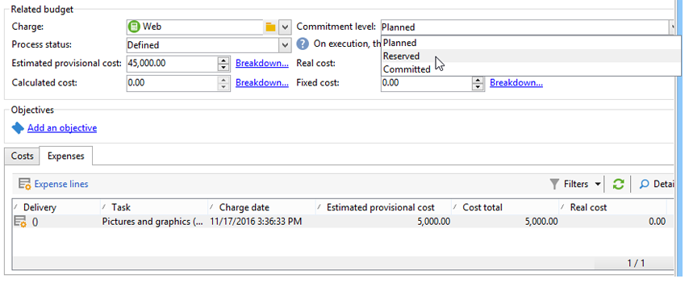
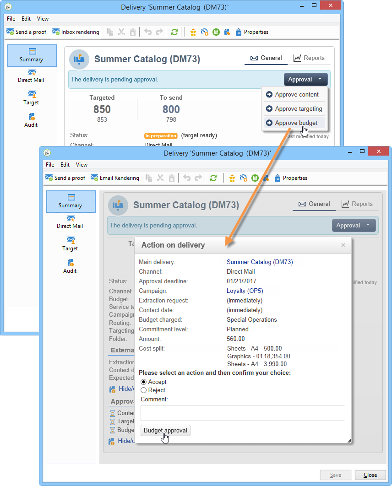

# Controllo dei costi{#controlling-costs}

## Informazioni sul controllo dei costi {#about-cost-control}

 Adobe Campaign consente di controllare i costi di marketing pianificati, impegnati e fatturati e di suddividerli per categoria utilizzando il modulo Gestione risorse di marketing.

I costi impegnati per i vari processi di una campagna vengono addebitati su un budget definito in anticipo dal reparto marketing. Gli importi possono essere suddivisi in diverse categorie per rendere le informazioni più leggibili e fornire una comunicazione più dettagliata degli investimenti di marketing.

La gestione e il tracciamento dei budget sono centralizzati in un nodo dedicato della struttura di Adobe Campaign . Questo consente di monitorare gli importi allocati, riservati, impegnati e spesi dalla stessa vista e per tutti i budget.

Per attuare la gestione del bilancio utilizzando l&#39;MRM si devono applicare le seguenti fasi:

1. Definizione del budget

   Per ulteriori informazioni, vedere [Creazione di un budget](#creating-a-budget).

1. Definizione del metodo di calcolo dei costi

   Le strutture dei costi sono definite per i fornitori di servizi. Vedere [Creazione di un provider di servizi e relative categorie di costi](../../campaign/using/providers--stocks-and-budgets.md#creating-a-service-provider-and-its-cost-categories).

1. Definizione dei costi della campagna (consegne/attività)

   I costi sostenuti per le consegne e le attività vengono inseriti singolarmente o globalmente per il modello della campagna. Vedere [Calcolo di costi e scorte](../../campaign/using/marketing-campaign-deliveries.md#calculation-of-costs-and-stocks).

1. Consolidamento

   In base allo stato di avanzamento dei compiti, delle consegne e della campagna, i costi saranno calcolati e trasferiti al bilancio corrispondente.

   Quando la creazione della campagna è sufficientemente avanzata, lo stato di avanzamento del budget della campagna può essere cambiato in **[!UICONTROL Specified]**. Il costo calcolato del programma viene quindi inserito automaticamente con i costi calcolati sulla campagna. Vedere [Impegno, calcolo e addebito dei costi](#cost-commitment--calculation-and-charging).

## Creazione di un budget {#creating-a-budget}

I budget vengono creati nella mappa, tramite il nodo **[!UICONTROL Campaign management > Budgets]**. Il pulsante **[!UICONTROL New]** nella barra degli strumenti consente di creare un budget.

* Aggiunta di un nuovo budget

   Fare clic sull&#39;icona **[!UICONTROL New]**, assegnare un nome e salvare il budget.

* Inserimento dell&#39;importo iniziale

   Indicare l’importo assegnato nel campo pertinente. Gli altri importi vengono inseriti automaticamente. Vedere [Calcolo degli importi](#calculating-amounts).

* Definizione del periodo di validità

   Specificate le date di inizio e di fine. Queste informazioni sono solo indicative.

* Spese

   Creare le categorie di spesa alle quali i costi assegnati a questo budget per campagne, attività, ecc. può essere collegato. Vedere [Categorie spese](#expense-categories).

   

>[!NOTE]
>
>È possibile selezionare un budget correlato.
>
>Per ulteriori informazioni, vedere [Collegamento di un budget a un altro](#linking-a-budget-to-another).

### Calcolo degli importi {#calculating-amounts}

Ciascun budget è definito da un importo iniziale che sarà decrementato dai costi delle varie campagne, consegne o attività ad essi correlate dopo che sono state programmate o eseguite. Lo stato degli importi (pianificati, riservati, impegnati, spesi o fatturati) dipende dal tipo di costo e dal livello di impegno definito nella campagna, nella consegna o nell&#39;attività.

>[!NOTE]
>
>Gli importi immessi per le categorie devono corrispondere alla dotazione di bilancio definita nel campo **[!UICONTROL Allocated]**.

Per le campagne, in base al livello di impegno, un costo può essere pianificato, impegnato o riservato per un&#39;azione futura.

>[!CAUTION]
>
>Quando viene creata una campagna, lo stato di avanzamento in **[!UICONTROL Budget]** deve essere impostato su **[!UICONTROL Defined]** affinché i costi vengano presi in considerazione al momento dell&#39;esecuzione. Se lo stato è **[!UICONTROL Being edited]**, i costi non saranno consolidati.
>   
>L&#39;opzione **[!UICONTROL Commitment level]** rappresenta una proiezione dei costi nel futuro prima che vengano addebitati al bilancio. In base all&#39;avanzamento di una campagna, un&#39;attività o una consegna, potete decidere di assegnare un livello di impegno superiore o inferiore (1). Pianificato, 2. Riservato, 3. Impegnato) utilizzando la casella combinata.

Ad esempio, il costo previsto per una campagna web è di 45.000 Euro.

Per la campagna, quando lo stato di creazione del budget è impostato su **[!UICONTROL Defined]**, il costo reale della campagna (o, in caso contrario, il costo calcolato) verrà riportato nei totali del budget.

In base al livello di impegno del budget della campagna, l&#39;importo verrà immesso nel campo **[!UICONTROL Planned]**, **[!UICONTROL Reserved]** o **[!UICONTROL Committed]**.

Il livello di impegno può essere modificato:

* al livello **campaign**, nella finestra **[!UICONTROL Budget]**, che si trova nella scheda **[!UICONTROL Edit]**. Qui sono configurati budget, costi e spese.
* nel livello **task**, nella finestra **[!UICONTROL Expenses and revenues]**.

Quando il budget è **[!UICONTROL Reserved]**, l&#39;aggiornamento viene eseguito automaticamente per il budget addebitato.

La procedura è la stessa a livello di attività.

Quando una spesa dà luogo a una fattura e la fattura viene pagata, il relativo importo viene quindi inserito nel campo **[!UICONTROL Invoiced]**.

### Categorie di spesa {#expense-categories}

Gli importi possono essere distribuiti in diverse categorie di spesa per una migliore leggibilità dei dati e per una segnalazione più dettagliata degli investimenti di marketing. Le categorie di spesa sono definite durante la creazione del budget, tramite il nodo **[!UICONTROL Budgets]** della struttura.

Per aggiungere una categoria, fate clic sul pulsante **[!UICONTROL Add]** nella sezione inferiore della finestra.

È possibile selezionare una categoria tra quelle esistenti o definire una nuova categoria inserendola direttamente nel campo. Quando si conferma l&#39;input, un messaggio di conferma consente di aggiungere questa categoria all&#39;elenco delle categorie esistenti e di associarla a una natura, se necessario. Tali informazioni verranno utilizzate nei rapporti sul bilancio.

### Collegamento di un budget a un altro {#linking-a-budget-to-another}

È possibile collegare un budget a un budget principale. A tal fine, selezionare il budget principale nel campo **[!UICONTROL related budget]** dei budget secondari.

Verrà aggiunta una scheda aggiuntiva al budget principale per visualizzare l&#39;elenco dei budget correlati.

Tali informazioni vengono riportate nelle relazioni di bilancio.

## Aggiunta di righe di spesa {#adding-expense-lines}

Le righe spese vengono aggiunte automaticamente al budget. Vengono creati durante l&#39;analisi della consegna e al termine di un&#39;attività.

Per ogni campagna, consegna o attività, i costi generati sono raggruppati nelle linee di spesa del budget a cui sono addebitati. Tali linee di spesa sono create in base alle linee di costo del fornitore di servizi interessato e calcolate attraverso le strutture di costo associate.

Ogni linea di spesa contiene pertanto le seguenti informazioni:

* La campagna e la consegna o l&#39;attività a cui è correlata
* Importo calcolato in base alle strutture di costo o al costo provvisorio stimato
* Costo reale della consegna o del compito in questione
* Linea fattura corrispondente (solo MRM)
* Elenco dei costi calcolati per categoria di costi (se esiste una struttura di costi)

Nell&#39;esempio precedente, la linea di spesa modificata contiene i costi calcolati per la consegna delle **nuove schede** per la campagna **Loyalty Spring Pack**. Quando la consegna viene modificata, la scheda **[!UICONTROL Direct Mail]** consente di vedere come viene calcolata la linea di spesa.

Il calcolo dei costi per questa consegna si basa sulle categorie di costi selezionate per il fornitore di servizi interessato:

In base alle categorie di costi selezionate, le strutture di costi corrispondenti vengono applicate per calcolare le linee di costo. In questo esempio, per il fornitore di servizi interessato, le strutture dei costi sono le seguenti:

>[!NOTE]
>
>Le categorie e le strutture dei costi sono presentate in [Creazione di un provider di servizi e delle relative categorie di costi](../../campaign/using/providers--stocks-and-budgets.md#creating-a-service-provider-and-its-cost-categories).

## Impegno in termini di costi, calcolo e addebito {#cost-commitment--calculation-and-charging}

I costi possono essere impegnati per consegne e attività. In base all&#39;avanzamento del processo a cui è correlato, lo stato di un costo viene aggiornato.

### Processo di calcolo dei costi {#cost-calculation-process}

I costi sono suddivisi in tre categorie:

1. Costo provvisorio stimato

   Il costo provvisorio stimato è una stima dei costi per i processi della campagna. Finché viene modificato, gli importi immessi non vengono consolidati. Deve avere uno stato **[!UICONTROL Specified]** per gli importi da prendere in considerazione nei calcoli.

   Questo importo viene immesso manualmente e può essere suddiviso in diverse categorie di spesa. Per ridurre un costo, fare clic sul collegamento **[!UICONTROL Breakdown...]**, quindi sul pulsante **[!UICONTROL Add]** per definire un nuovo importo.

   

   È possibile associare ogni costo a una categoria in modo che la disaggregazione dei costi per categoria di spesa possa essere visualizzata in un secondo momento nel budget correlato e nei rapporti sul budget.

1. Costo calcolato

   Il costo calcolato dipende dall&#39;elemento interessato (campagna, consegna, attività, ecc.) e il suo stato (in corso, in corso, completato). In ogni caso, se il costo reale è specificato, il costo calcolato utilizzerà questo importo.

   Se il costo reale non è fornito, si applicano le seguenti regole:

   * Per una campagna in corso di modifica, il costo calcolato è il costo provvisorio stimato della campagna oppure, se tale costo non è definito, il costo calcolato sarà la somma di tutti i costi provvisori delle consegne e dei compiti della campagna. Se la campagna è finita, il costo calcolato della campagna sarà la somma di tutti i costi calcolati.
   * Per una consegna che non è ancora stata analizzata, il costo calcolato è il costo provvisorio stimato. Se l&#39;analisi è già stata eseguita, il costo calcolato sarà la somma di tutti i costi calcolati dal servizio fornire strutture di costo e il numero di destinatari interessati.
   * Per un&#39;attività in corso, il costo calcolato utilizza il costo provvisorio stimato. Se l&#39;attività è finita, il costo calcolato sarà la somma di tutti i costi calcolati dalle strutture dei costi del fornitore di servizi e il numero di giorni completati.
   * Per il piano di marketing, come per il programma, il costo calcolato è la somma dei costi calcolati per le campagne. Se tali costi non vengono specificati, il costo calcolato utilizzerà i costi provvisori stimati.

   >[!NOTE]
   >
   >Il collegamento **[!UICONTROL Breakdown]** consente di visualizzare i dettagli del calcolo e la data dell&#39;ultimo calcolo del costo.

1. Costo reale

   Il costo reale viene immesso manualmente e, se necessario, è suddiviso in diverse categorie di spesa.

### Calcolo e ricarica {#calculation-and-charging}

I costi sono calcolati tramite strutture di costo e addebitati ai bilanci selezionati nelle campagne, nelle consegne o nelle attività interessate.

È possibile eseguire un controllo sugli importi impegnati nelle campagne tramite l&#39;approvazione del budget. In una campagna è possibile creare ulteriori attività in stile checkpoint per impostare altre approvazioni. Vedere [Tipi di attività](../../campaign/using/creating-and-managing-tasks.md#types-of-task).

### Esempio {#example}

Stiamo per creare una campagna con:

* Consegna diretta tramite posta mediante le strutture dei costi di un fornitore di servizi
* Un&#39;attività con un costo fisso
* Attività con un costo giornaliero

#### Passaggio 1 - Creazione del budget {#step-1---creating-the-budget}

1. Crea un nuovo budget tramite il nodo **[!UICONTROL Campaign management > Budgets]**.

1. Definire un budget di 10.000 Euro nel campo **[!UICONTROL Allocated]** della sezione **[!UICONTROL Amounts]**. Aggiungere due categorie di spesa nella sezione inferiore della finestra:

#### Passaggio 2 - Configurazione del provider di servizi e definizione delle strutture dei costi {#step-2---configuring-the-service-provider-and-defining-the-cost-structures}

1. Create un provider di servizi e un modello di servizio con la relativa struttura dei costi dal nodo **[!UICONTROL Administration > Campaigns]**. Per ulteriori informazioni, vedere [Creazione di un provider di servizi e delle relative categorie di costi](../../campaign/using/providers--stocks-and-budgets.md#creating-a-service-provider-and-its-cost-categories).

   Per le consegne per corrispondenza diretta, create le categorie di costi **[!UICONTROL Envelopes]** (tipi 114x229 e 162x229), **[!UICONTROL Postage]** e **[!UICONTROL Print]** (tipi A3 e A4). Quindi create le seguenti strutture di costo:

   

1. Aggiungere un costo fisso (nelle categorie di costi) il cui calcolo è fisso e il cui importo è vuoto (nella struttura di costi corrispondente) e che verrà specificato singolarmente per ogni consegna.

   

   Per le attività, creare le due seguenti categorie di costi:

   * **[!UICONTROL Room reservation]** (Camera piccola e Camera grande), con una struttura di costo  **** fissa di 300 e 500 Euro:

   

   * **[!UICONTROL Creation]** (**Content** Templatetype), con una struttura  **** giornaliera di 300 Euro:

   

#### Passaggio 3 - Addebito del budget nella campagna {#step-3---charging-the-budget-in-the-campaign}

1. Create una campagna e selezionate il budget creato al Punto 1.

   >[!NOTE]
   >
   >Per impostazione predefinita, il budget selezionato per il programma viene applicato a tutte le campagne del programma.

   

1. Specificare il costo provvisorio stimato, con la ripartizione:

   

1. Fare clic su **[!UICONTROL Ok]**, quindi su **[!UICONTROL Save]** per confermare queste informazioni. Il costo calcolato della campagna viene quindi aggiornato con il costo provvisorio stimato.

#### Passaggio 4 - Creazione della consegna diretta {#step-4---creating-the-direct-mail-delivery}

1. Create un flusso di lavoro per la campagna e posizionate le attività di query per selezionare la destinazione (avviso, è necessario specificare gli indirizzi postali del destinatario).

1. Create una consegna diretta e selezionate il provider di servizi creato al punto 2: le categorie di costi vengono visualizzate automaticamente.

1. Ignorare il costo delle buste e aggiungere un costo fisso. Selezionare anche le categorie interessate da tali costi.

   

   >[!NOTE]
   >
   >Se una delle categorie di costi non viene utilizzata, non genererà alcuna spesa.

1. Avviate il flusso di lavoro appena creato per avviare l&#39;analisi e calcolare i costi.

   

1. Se l&#39;approvazione del budget è abilitata per questa campagna, approva il budget dal dashboard. È possibile verificare l&#39;approvazione delle categorie di costi.

   

La riga spese relativa alla consegna viene aggiunta nella scheda **[!UICONTROL Edit > Budget]** della campagna. Modificatelo per visualizzare i dettagli del calcolo.

Il costo calcolato per la consegna viene aggiornato con le seguenti informazioni:

Quando si modifica il costo calcolato, è possibile controllare la disaggregazione dei costi e lo stato e la data del calcolo dei costi.

#### Passaggio 5 - Creazione di attività {#step-5---creating-tasks}

A questa campagna verranno aggiunti i due task per i quali le strutture dei costi sono state create in precedenza (vedere [Passaggio 2 - Configurazione del provider di servizi e definizione delle strutture dei costi](#step-2---configuring-the-service-provider-and-defining-the-cost-structures)). A questo scopo, nel dashboard della campagna, fate clic sul pulsante **[!UICONTROL Add a task]**. Assegnare un nome all&#39;attività e fare clic su **[!UICONTROL Save]**.

1. L&#39;attività viene quindi aggiunta all&#39;elenco delle attività. È necessario modificarlo per configurarlo.

1. Nella scheda **[!UICONTROL Properties]**, selezionare il servizio e la categoria di costi corrispondente:

   

1. Fare clic sull&#39;icona **[!UICONTROL Expenses and revenue]** dell&#39;attività e specificare il costo provvisorio stimato.

   

   Quando l&#39;attività è stata salvata, il costo calcolato viene specificato con il valore immesso per il costo provvisorio stimato.

   Al termine dell&#39;attività (stato **[!UICONTROL Finished]** ), il costo calcolato viene aggiornato automaticamente con il costo della stanza grande come inserito nella struttura dei costi. Questo costo appare anche in questa categoria nella disaggregazione.

1. Create quindi un secondo task secondo la stessa procedura; programmati in cinque giorni e relativi alla struttura dei costi creata in precedenza.

   

   Al termine dell&#39;attività, il costo calcolato viene specificato con il valore della struttura di costo correlata, ovvero 1500 Euro nel nostro esempio (5 giorni x 300 Euro):

   

#### Passaggio 6 - Aggiornare lo stato del budget della campagna {#step-6---update-the-campaign-budget-status}

Quando la campagna è configurata, il suo stato può essere aggiornato impostandolo su **[!UICONTROL Specified]**. Il costo calcolato della campagna indicherà quindi la somma dei costi calcolati della consegna e delle attività della campagna:

#### Approvazione budget {#budget-approval}

Quando l&#39;approvazione viene attivata, un collegamento speciale consente di approvare il budget dal dashboard della campagna. Questo collegamento viene visualizzato quando il flusso di lavoro di targeting è stato avviato e la consegna diretta della posta deve essere approvata.

Potete quindi fare clic sul collegamento per concedere o rifiutare l’approvazione, oppure utilizzare il collegamento nell’e-mail di notifica se la notifica è stata attivata per questa campagna.

Una volta approvato il budget e terminata la consegna, i costi vengono caricati automaticamente tramite uno speciale flusso di lavoro tecnico.

## Ordini e fatture {#orders-and-invoices}

Nel contesto di MRM, è possibile salvare gli ordini con un fornitore di servizi ed emettere fatture. L&#39;intero ciclo di vita di questi ordini e fatture può essere gestito tramite l&#39;interfaccia Adobe Campaign .

### Creazione ordine {#order-creation}

Per salvare un nuovo ordine con un fornitore di servizi, fare clic sul nodo **[!UICONTROL MRM > Orders]** della struttura, quindi fare clic sul pulsante **[!UICONTROL New]**.

Specificare il numero dell&#39;ordine, il fornitore di servizi interessato e l&#39;importo totale dell&#39;ordine.

### Rilascio e tracciamento delle fatture {#issuing-and-tracking-invoices}

Per ogni provider di servizi è possibile salvare le fatture e definirne lo stato e il budget addebitato.

Le fatture vengono create e memorizzate nel nodo **[!UICONTROL MRM > Invoices]** della struttura di Adobe Campaign .

Una fattura è costituita da linee di fattura il cui totale consente il calcolo automatico dell&#39;importo. Queste righe vengono create manualmente dalla scheda **[!UICONTROL Invoice lines]**. Possono essere associati a un ordine per caricare le informazioni negli ordini.

Le fatture di ciascun fornitore di servizi sono visualizzate nella scheda **[!UICONTROL Invoices]** del profilo:

La scheda **[!UICONTROL Details]** consente di visualizzare il contenuto della fattura.

Fare clic su **[!UICONTROL Add]** per creare una nuova fattura.
