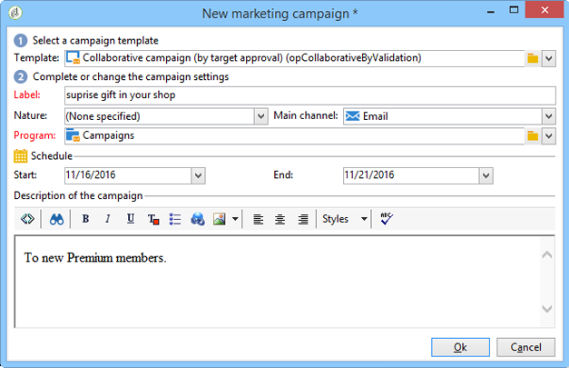
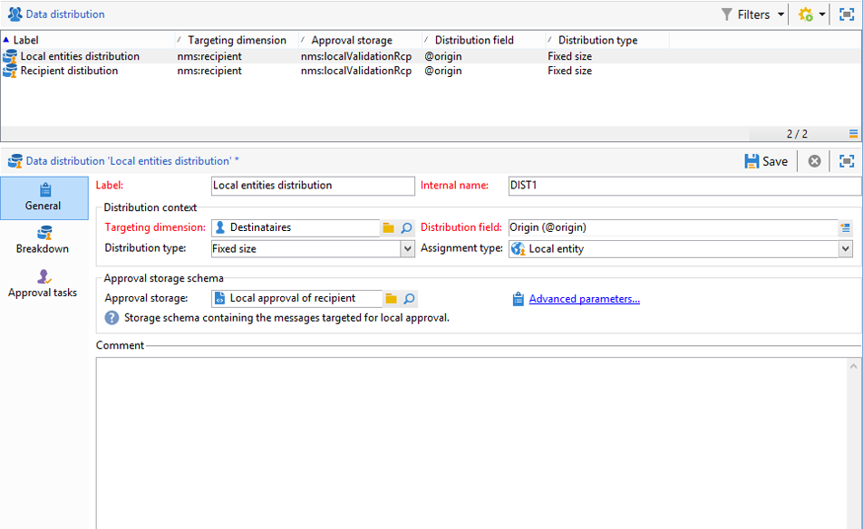

# Creazione di una campagna collaborativa{#creating-a-collaborative-campaign-intro}

L&#39;entità centrale crea campagne di collaborazione dai modelli di campagne **Distributed Marketing**. Consulta [questa pagina](../../campaign/using/about-distributed-marketing.md#collaborative-campaign).

## Creazione di una campagna collaborativa {#creating-a-collaborative-campaign}

Per configurare una campagna collaborativa, fai clic sul nodo **[!UICONTROL Campaign management > Campaigns]**, quindi sull&#39;icona **[!UICONTROL New]**.

>[!NOTE]
>
>Oltre a **[!UICONTROL collaborative campaigns (by campaign)]**, queste campagne possono essere configurate ed eseguite tramite un&#39;interfaccia Web.

Il processo di configurazione per un database di campagna collaborativa è simile a quello di un modello di campagna locale. Le specifiche dei diversi tipi di campagne collaborative sono descritte di seguito.

### Per modulo {#by-form}

Per creare una campagna collaborativa (in base al modulo), è necessario selezionare il modello **[!UICONTROL Collaborative campaign (by form)]**.

Nella scheda **[!UICONTROL Edit]**, fare clic sul collegamento **[!UICONTROL Advanced campaign settings...]** per accedere alla scheda **Distributed Marketing**.

Selezionare l&#39;interfaccia Web **By form**. Questo tipo di interfaccia consente di creare campi di personalizzazione che verranno utilizzati dalle entità locali per ordinare una campagna. Fare riferimento a [Creazione di una campagna locale (per modulo)](../../campaign/using/examples.md#creating-a-local-campaign--by-form-).

Salvate la campagna. È ora possibile utilizzarlo dalla vista **Pacchetti campagna** nell&#39;universo **Campaign**, facendo clic sul pulsante **[!UICONTROL Create]**.

La vista **[!UICONTROL Campaign Package]** consente di utilizzare modelli di campagna locali (out-of-the-box o duplicati), nonché campagne di riferimento per campagne collaborative, allo scopo di creare campagne per le diverse entità organizzative.

### Per campagna {#by-campaign}

Per creare una campagna collaborativa (per campagna), è necessario selezionare il modello **[!UICONTROL Collaborative campaign (by campaign) (opCollaborativeByCampaign)]**.

Quando ordinate la campagna, l&#39;entità locale può completare i criteri predefiniti dall&#39;entità centrale e valutare la campagna prima di ordinarla.

Quando un ordine per una **campagna collaborativa (per campagna)** viene approvato dall&#39;entità centrale, viene creata una campagna figlio per l&#39;entità locale. Una volta disponibili, l&#39;entità locale può quindi modificare:

* il flusso di lavoro della campagna,
* regole di tipologia,
* e campi di personalizzazione.

L&#39;entità locale esegue la campagna figlio. L&#39;entità centrale esegue la campagna padre.

L&#39;entità centrale può visualizzare tutte le campagne figlio collegate con una **campagna collaborativa (per campagna)** da questa dashboard (tramite il collegamento **[!UICONTROL List of associated campaigns]**).

### Per approvazione di destinazione {#by-target-approval}

Per creare una campagna collaborativa (per approvazione), è necessario selezionare il modello **[!UICONTROL Collaborative campaign (by target approval)]**.

>[!NOTE]
>
>In questa modalità, l&#39;entità centrale non deve specificare le entità locali.

Il flusso di lavoro della campagna deve integrare l&#39;attività di tipo **Approvazione locale**. I parametri dell&#39;attività sono i seguenti:

* **[!UICONTROL Action to perform]** : Notifica di approvazione di destinazione.
* **[!UICONTROL Distribution context]** : Esplicito.
* **[!UICONTROL Data distribution]** : Distribuzione di entità locale.

**È necessario creare la distribuzione** dei dati di tipo distribuzione locale. Il modello di distribuzione dei dati consente di limitare il numero di record da un elenco di valori di raggruppamento. In **[!UICONTROL Resources > Campaign management > Data distribution]**, fare clic sull&#39;icona **[!UICONTROL New]** per creare una nuova **[!UICONTROL Data distribution]**. Per ulteriori informazioni sulla distribuzione dei dati, fare riferimento alla guida [Flussi di lavoro](../../workflow/using/using-the-local-approval-activity.md#step-1--creating-the-data-distribution-template-).

Selezionare la **dimensione di targeting** e la **[!UICONTROL Distribution field]**. Per **[!UICONTROL Assignment type]**, selezionare **Entità locale**.

Nella scheda **[!UICONTROL Distribution]**, aggiungere un campo per ciascuna entità locale e specificare il valore.

È possibile aggiungere una seconda **approvazione di destinazione** dopo l&#39;attività di tipo **Consegna** per configurare un report su di essa.

Nel messaggio di notifica per la creazione della campagna, l&#39;entità locale riceve un elenco di contatti predefinito dai parametri dell&#39;entità centrale.

L&#39;entità locale può eliminare alcuni contatti in base al contenuto della campagna.

### Semplice {#simple}

Per creare una semplice campagna collaborativa, è necessario selezionare il modello **[!UICONTROL Collaborative campaign (simple)]**.

## Creazione di un pacchetto di campagna collaborativa {#creating-a-collaborative-campaign-package}

Per rendere disponibile una campagna alle entità locali, l&#39;entità centrale deve creare un pacchetto di campagna.

Effettuate le seguenti operazioni:

1. Nella sezione **[!UICONTROL Navigation]** della pagina **Campagne** fare clic sul collegamento **[!UICONTROL Campaign packages]**.
1. Fai clic sul pulsante **[!UICONTROL Create]**.
1. La sezione nella parte superiore della finestra consente di selezionare il modello **[!UICONTROL New collaborative package (mutualizedEmpty)]**.
1. Selezionate la campagna di riferimento.
1. Specificate l&#39;etichetta, la cartella e la pianificazione di esecuzione per il pacchetto della campagna.

### Date {#dates}

Le date di inizio e fine definiscono il periodo di visibilità della campagna nell&#39;elenco dei pacchetti della campagna.

Per **campagne collaborative**, l&#39;entità centrale deve specificare la scadenza per la registrazione e la personalizzazione.

>[!NOTE]
>
>La **[!UICONTROL Personalization deadline]** consente all&#39;entità centrale di scegliere una scadenza entro la quale le entità locali devono aver consegnato i documenti (fogli di calcolo, immagini) da utilizzare per configurare la campagna. Questa non è un&#39;opzione obbligatoria. L’utilizzo di questa data non influisce sull’implementazione della campagna.

### Pubblico {#audience}

L&#39;entità centrale deve specificare le entità locali coinvolte per campagna non appena viene creata la campagna collaborativa.

>[!CAUTION]
>
>**[!UICONTROL Simple, by form and by campaign collaborative campaign kits]** non può essere approvato a meno che non siano stati specificati gli enti locali pertinenti.

### Modalità di approvazione {#approval-modes}

Per **campagne collaborative**, è possibile specificare la modalità di approvazione dell&#39;ordine.

In modalità manuale, l&#39;entità locale deve sottoscrivere la campagna per poter partecipare.

In modalità automatica, l&#39;entità locale viene pre-sottoscritta per la campagna. Può annullare la sottoscrizione alla campagna o modificare i suoi parametri senza richiedere l&#39;approvazione dell&#39;entità centrale.

### Notifiche {#notifications}

La configurazione per le notifiche è identica alle notifiche per un&#39;entità locale. Fai riferimento a [questa sezione](../../campaign/using/creating-a-local-campaign.md#notifications).

## Ordinare una campagna {#ordering-a-campaign}

Quando una campagna collaborativa viene aggiunta all&#39;elenco dei pacchetti campagna, le entità locali appartenenti all&#39;audience definita dall&#39;entità centrale ricevono una notifica (le **campagne collaborative (per approvazione target)** non dispongono di un&#39;audience predefinita). Il messaggio inviato contiene un collegamento che consente di registrarsi per la campagna, come mostrato di seguito:

Questo messaggio consente inoltre alle entità locali di visualizzare la descrizione immessa dall&#39;operatore centrale che ha creato il pacchetto, nonché i documenti collegati alla campagna. Questi non appartengono alla campagna stessa, anche se forniscono informazioni aggiuntive al riguardo.

Una volta che gli operatori locali hanno eseguito l&#39;accesso tramite un&#39;interfaccia Web, possono inserire informazioni personalizzate nella campagna collaborativa che desiderano ordinare:

Dopo che un&#39;entità locale ha completato la registrazione, gli enti centrali ricevono una notifica via e-mail per approvare l&#39;ordine.

Per ulteriori informazioni, consultare la sezione [Processo di approvazione](../../campaign/using/creating-a-local-campaign.md#approval-process).

## Approvazione di un ordine {#approving-an-order}

La procedura per l&#39;approvazione di un ordine di pacchetti per campagne collaborative è la stessa utilizzata per una campagna locale. Fai riferimento a [questa sezione](../../campaign/using/creating-a-local-campaign.md#approving-an-order).
