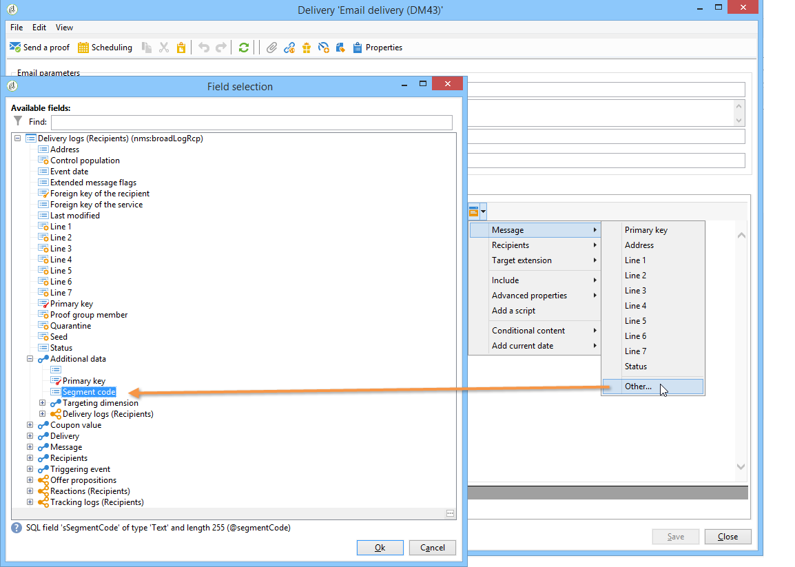
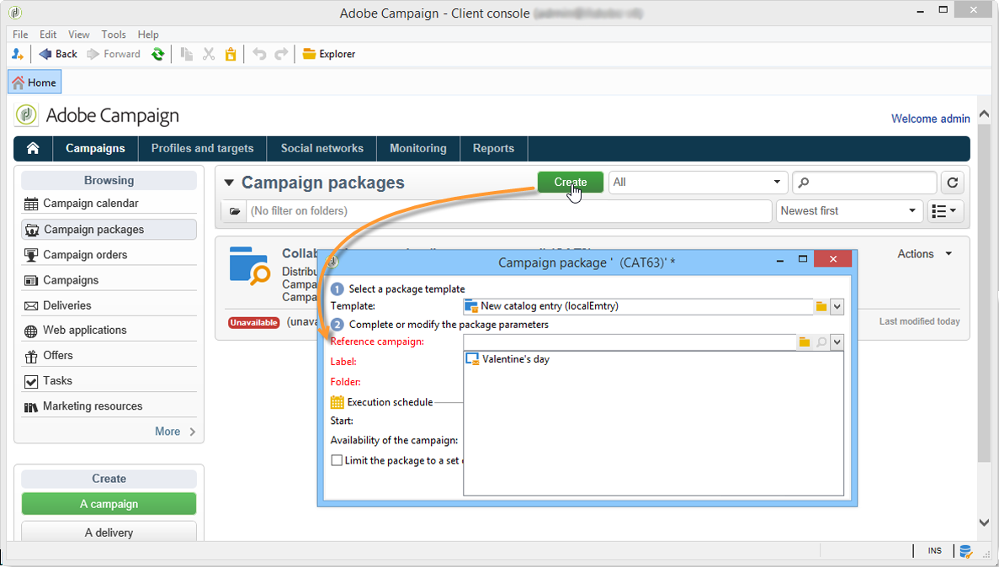
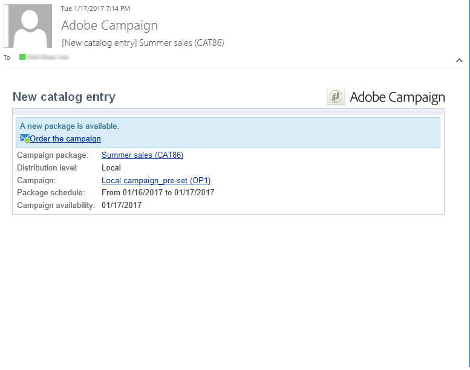

# Creazione di una campagna locale{#creating-a-local-campaign}

Una campagna locale è un&#39;istanza creata da un modello a cui si fa riferimento nell&#39;elenco di **[!UICONTROL campaign packages]** con una pianificazione **di esecuzione** specifica. L&#39;obiettivo è soddisfare le esigenze di comunicazione locale utilizzando un modello di campagna configurato e configurato dall&#39;entità centrale. Le fasi principali per l&#39;attuazione di un&#39;operazione locale sono le seguenti:

**Per l&#39;entità centrale**

1. Creazione di un modello di campagna locale.
1. Creazione di un pacchetto di campagna da un modello.
1. Pubblicazione di un pacchetto di campagna.
1. Approvazione degli ordini.

**Per l&#39;entità locale**

1. Ordinare la campagna.
1. Esecuzione di campagne.

## Creazione di un modello di campagna locale {#creating-a-local-campaign-template}

Per creare un pacchetto di campagna, dovete innanzitutto creare il modello **di** campagna tramite il **[!UICONTROL Resources > Templates]** nodo.

Per creare un nuovo modello locale, duplicate il **[!UICONTROL Local campaign (opLocal)]** modello predefinito.

Denominate il modello di campagna e completate i campi disponibili.

Nella finestra della campagna, fai clic sulla **[!UICONTROL Edit]** scheda, quindi sul **[!UICONTROL Advanced campaign settings...]** collegamento.

### Interfaccia Web {#web-interface}

Nella scheda Marketing **distribuito** è possibile scegliere il tipo di interfaccia Web e specificare i valori e i parametri predefiniti da immettere quando un&#39;entità locale inserisce un ordine.

L&#39;interfaccia Web corrisponde a un modulo che deve essere compilato dall&#39;entità locale al momento dell&#39;ordine della campagna.

Selezionare il tipo di interfaccia Web da applicare alle campagne create dal modello:

Sono disponibili quattro tipi di interfacce Web:

* **[!UICONTROL By brief]** : l&#39;entità locale deve fornire una descrizione con cui descrive le configurazioni della campagna. Una volta approvato l&#39;ordine, l&#39;entità centrale configura ed esegue l&#39;intera campagna.

   

* **[!UICONTROL By form]** : l&#39;entità locale ha accesso a un modulo Web in cui, a seconda del modello utilizzato, può modificare il contenuto, la destinazione, le dimensioni massime, nonché le date di creazione ed estrazione utilizzando i campi di personalizzazione. L&#39;entità locale può valutare il contenuto di destinazione e visualizzare l&#39;anteprima dal modulo Web.

   

   Il modulo offerto è specificato in un&#39;applicazione Web che deve essere selezionata in un elenco a discesa dal **[!UICONTROL Web Interface]** campo nel **[!UICONTROL Advanced campaign settings...]** collegamento del modello. Fare riferimento a [Creazione di una campagna locale (per modulo)](../../campaign/using/examples.md#creating-a-local-campaign--by-form-).

   >[!NOTE]
   >
   >L&#39;applicazione Web utilizzata in questo esempio è un esempio. Per utilizzare un modulo è necessario creare una specifica app Web. Fate riferimento a [API](../../configuration/using/about-web-services.md).

   

* **[!UICONTROL By external form]** : l&#39;entità locale ha accesso ai parametri della campagna nella propria extranet (non in Adobe Campaign). Questi parametri sono identici a quelli di una campagna **locale (per modulo)**.
* **[!UICONTROL Pre-set]** : l&#39;entità locale ordina la campagna utilizzando il modulo predefinito, senza localizzarlo.

   

### Valori predefiniti {#default-values}

Selezionare l&#39;entità **[!UICONTROL Default values]** da completare per le entità locali. Ad esempio:

* date di contatto ed estrazione,
* caratteristiche target (segmento di età, ecc.).

Completare i campi **[!UICONTROL Parent marketing program]** e **[!UICONTROL Charge]** .

### Approvazioni {#approvals}

Dal **[!UICONTROL Advanced parameters for campaign entry]** collegamento, potete specificare il numero massimo di revisori.

I revisori verranno inseriti dall&#39;entità locale al momento dell&#39;ordine della campagna.

Se non desiderate assegnare un nome ai revisori per una campagna, immettete 0.

### Documenti {#documents}

Potete consentire agli operatori di entità locali di collegare i documenti (file di testo, fogli di calcolo, immagini, descrizioni delle campagne, ecc.) alla campagna locale al momento della creazione dell&#39;ordine. Il **[!UICONTROL Advanced parameters for campaign entry...]** collegamento consente di limitare il numero di documenti. A questo scopo, è sufficiente immettere il numero massimo consentito nel **[!UICONTROL Number of documents]** campo.

Quando si ordina un pacchetto campagna, il modulo suggerisce di collegare tutti i documenti indicati nel campo corrispondente nel modello.

Se non desiderate visualizzare un campo di caricamento del documento, immettete **[!UICONTROL 0]** il campo **[!UICONTROL Number of documents]** .

>[!NOTE]
>
>È **[!UICONTROL Advanced parameters for campaign entry]** possibile disattivare l&#39;opzione selezionando **[!UICONTROL Do not display the page used to enter the campaign parameters]**.

### Flusso di lavoro {#workflow}

Nella **[!UICONTROL Targeting and workflows]** scheda, crea il flusso di lavoro della campagna che raccoglie le **[!UICONTROL Default values]** informazioni specificate in **[!UICONTROL Advanced campaign settings...]** e crea le consegne.

Fate doppio clic sull&#39; **[!UICONTROL Query]** attività per configurarla in base a quanto specificato **[!UICONTROL Default values]**.

### Consegna {#delivery}

Nella **[!UICONTROL Audit]** scheda, fai clic sull&#39; **[!UICONTROL Detail...]** icona per visualizzare la consegna **[!UICONTROL Scheduling]** selezionata.

L&#39; **[!UICONTROL Scheduling]** icona consente di configurare la data di contatto e di esecuzione della consegna.

Se necessario, configurate la dimensione massima della consegna:

Individua il codice HTML della consegna. Ad esempio, in **[!UICONTROL Delivery > Current order > Additional fields]**, utilizzate il **[!UICONTROL Age segment]** campo per individuare la consegna in base all&#39;età della destinazione.

Salvate il modello di campagna. Ora puoi utilizzarlo dalla visualizzazione dei pacchetti **** Campaign nell&#39;universo **Campagne** facendo clic sul **[!UICONTROL Create]** pulsante.

>[!NOTE]
>
>I modelli delle campagne e la relativa configurazione generale sono descritti in dettaglio nei modelli [delle](../../campaign/using/marketing-campaign-templates.md#campaign-templates)campagne.

## Creazione del pacchetto della campagna {#creating-the-campaign-package}

Affinché il modello di campagna diventi disponibile per le entità locali, deve essere aggiunto all&#39;elenco. Per fare questo, l&#39;agenzia centrale deve creare un nuovo pacchetto.

Effettuate le seguenti operazioni:

1. Nella **[!UICONTROL Navigation]** sezione della pagina **Campagne** fare clic sul **[!UICONTROL Campaign packages]** collegamento.
1. Fai clic sul pulsante **[!UICONTROL Create]**. 

   

1. La sezione sopra la finestra consente di selezionare il modello di pacchetto della campagna [specificato in precedenza](#creating-a-local-campaign-template) .

   Per impostazione predefinita, il **[!UICONTROL New local campaign package (localEmpty)]** modello viene utilizzato per le campagne locali.

1. Specificate l&#39;etichetta, la cartella e la pianificazione di esecuzione per il pacchetto della campagna.

### Date {#dates}

Le date di inizio e fine definiscono il periodo di visibilità della campagna nell&#39;elenco dei pacchetti della campagna.

La data di disponibilità è la data in cui la campagna diventerà disponibile per le entità locali (per l&#39;ordine).

>[!CAUTION]
>
>Se un&#39;entità locale non riserva la campagna prima della scadenza, non sarà in grado di utilizzarla.

Queste informazioni sono contenute nel messaggio di notifica inviato alle agenzie locali, come mostrato di seguito:

### Pubblico {#audience}

Per una campagna locale, l&#39;entità centrale può specificare le entità locali coinvolte controllando l&#39;evento **[!UICONTROL Limit the package to a set of local entities]**.

### Impostazioni aggiuntive {#additional-settings}

Una volta salvato il pacchetto, l&#39;entità centrale può modificarlo dalla **[!UICONTROL Edit]** scheda.

Dalla **[!UICONTROL General]** scheda, l&#39;entità centrale può:

* configura i revisori dei pacchetti della campagna dal **[!UICONTROL Approval parameters...]** collegamento,
* rivedere il programma di esecuzione,
* aggiungere o eliminare entità locali.

>[!NOTE]
>
>Per impostazione predefinita, ogni entità può ordinare una campagna **** locale una sola volta.
>   
>Selezionate l&#39; **[!UICONTROL Enable multiple creation]** opzione per consentire la creazione di più campagne locali dal pacchetto della campagna.

### Notifications {#notifications}

Quando una campagna diventa disponibile o quando viene raggiunta la scadenza di registrazione, viene inviato un messaggio agli operatori del gruppo di notifiche locale. For more on this, refer to [Organizational entities](../../campaign/using/about-distributed-marketing.md#organizational-entities).

## Ordinamento di una campagna {#ordering-a-campaign}

I pacchetti campagna diventano accessibili alle entità locali dopo che sono stati approvati e il periodo di implementazione è iniziato. Le entità locali ricevono un messaggio e-mail mediante il quale vengono informate che è disponibile un nuovo pacchetto di campagne (non appena viene raggiunta la data di disponibilità).

>[!NOTE]
>
>Se durante la creazione del pacchetto della campagna sono state specificate alcune entità locali, queste saranno le uniche a ricevere una notifica. Se non è stata specificata alcuna entità locale, tutte le entità locali riceveranno una notifica.

Per utilizzare una campagna offerta dall&#39;entità centrale, l&#39;entità locale deve ordinarla.

Per ordinare una campagna:

1. Fai clic **[!UICONTROL Order campaign]** nel messaggio di notifica o sul pulsante corrispondente in Adobe Campaign.

   Immettete il vostro ID e la password per ordinare la campagna. L&#39;interfaccia è composta da un set di pagine definite in un&#39;applicazione Web.

   >[!NOTE]
   >
   >Le applicazioni Web sono dettagliate nella guida alle funzionalità  Web.

1. Immettete le informazioni necessarie nella prima pagina (etichetta dell’ordine e commento) e fate clic **[!UICONTROL Next]**.

   

1. Completare i parametri disponibili e approvare l&#39;ordine.

1. Una notifica viene inviata al manager dell&#39;entità organizzativa alla quale l&#39;entità locale appartiene, per approvare l&#39;ordine.

   

1. Le informazioni vengono restituite alle entità locali e centrali. Mentre le entità locali possono visualizzare solo i propri ordini, l&#39;entità centrale può visualizzare tutti gli ordini da qualsiasi entità locale, come mostrato di seguito:

   

   Gli operatori possono visualizzare i dettagli dell&#39;ordine:

   

   La **[!UICONTROL Edit]** scheda contiene le informazioni immesse dall&#39;entità locale al momento dell&#39;ordine della campagna.

   

1. L&#39;ordine deve essere approvato dall&#39;ente centrale per essere finalizzato.

   

   Per ulteriori informazioni, consulta la sezione relativa al processo [di](#approval-process) approvazione.

1. L&#39;operatore locale riceve una notifica della disponibilità della campagna: la disponibilità delle campagne è disponibile nell&#39;elenco dei pacchetti delle campagne all&#39;interno dell&#39;universo **Campagne** . La campagna può quindi essere utilizzata. For more on this, refer to [Accessing campaigns](../../campaign/using/accessing-campaigns.md).

   L&#39; **[!UICONTROL Start targeting with order approval]** opzione consente all&#39;entità locale di eseguire la campagna non appena l&#39;ordine è stato approvato.

   

## Approvazione di un ordine {#approving-an-order}

Per confermare un ordine di campagna, l&#39;entità centrale deve approvarlo.

La **[!UICONTROL Campaign orders]** panoramica, a cui si accede tramite l&#39;universo **Campagne** , consente di visualizzare lo stato degli ordini delle campagne e di approvarli.

>[!NOTE]
>
>Le entità locali possono apportare modifiche all&#39;ordine finché non viene approvato.

### Processo di approvazione {#approval-process}

#### Notifica e-mail {#email-notification}

Quando una campagna viene ordinata da un&#39;entità locale, i relativi revisori ricevono una notifica via e-mail, come illustrato di seguito:

>[!NOTE]
>
>La selezione dei revisori viene presentata nella sezione [Revisori](#reviewers) . Possono accettare o rifiutare l&#39;ordine.

#### Approvazione tramite la console Adobe Campaign {#approving-via-the-adobe-campaign-console}

L’ordine può essere approvato anche tramite la console, nella panoramica dell’ordine della campagna. Per approvare un ordine, selezionatelo e fate clic su **[!UICONTROL Approve the order]**.

>[!NOTE]
>
>La campagna può essere ancora modificata e riconfigurata fino alla data di disponibilità della campagna. Le entità locali possono inoltre rifiutare la campagna facendo clic sul **[!UICONTROL Cancel]** pulsante .

#### Creazione di una campagna {#creating-a-campaign}

Una volta approvato, l&#39;ordine di campagna può essere configurato ed eseguito dall&#39;entità locale.

For more on this, refer to [Accessing campaigns](../../campaign/using/accessing-campaigns.md).

### Rifiuto di un&#39;approvazione {#rejecting-an-approval}

L&#39;operatore incaricato dell&#39;approvazione può rifiutare un ordine o un pacchetto di campagna.

Se il revisore rifiuta un ordine, la notifica corrispondente viene inviata automaticamente alle entità locali interessate: visualizza il commento immesso dall&#39;operatore che ha rifiutato l&#39;approvazione.

Le informazioni vengono visualizzate nella pagina dell&#39;elenco dei pacchetti della campagna o nella pagina dell&#39;ordine della campagna. Se hanno accesso alla console di Adobe Campaign, le entità locali vengono informate di questo rifiuto.

Possono visualizzare il relativo commento nella **[!UICONTROL Edit]** scheda del pacchetto della campagna.

### Revisori {#reviewers}

Ogni volta che viene richiesta l’approvazione, i revisori ricevono una notifica via e-mail.

Per ogni entità locale, i revisori vengono selezionati per l&#39;approvazione dell&#39;ordine di campagna e per l&#39;approvazione della campagna. Per ulteriori informazioni sulla selezione dei revisori locali, fare riferimento alle entità organizzative.

>[!NOTE]
>
>Affinché questa selezione sia possibile, l&#39;approvazione dell&#39;ordine non deve ancora essere effettiva.

### Annullamento di un ordine {#canceling-an-order}

L&#39;ente centrale può annullare un ordine utilizzando il **[!UICONTROL Delete]** pulsante, situato sul dashboard dell&#39;ordine.

In questo modo la campagna viene annullata nella **[!UICONTROL Campaign orders]** vista.
