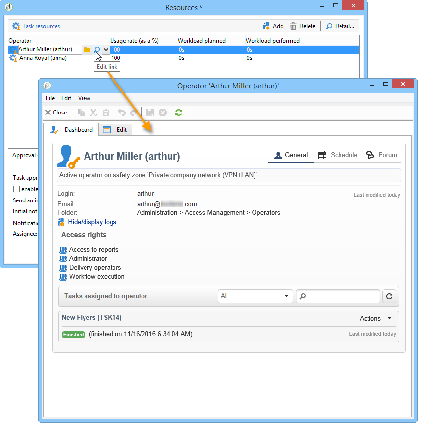
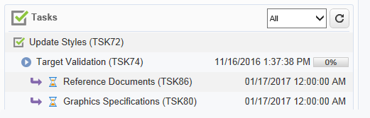

# Creazione e gestione di attività{#creating-and-managing-tasks}

## Informazioni sulle attività {#about-tasks}

 Adobe Campaign consente di creare attività e di gestire il ciclo di vita completo direttamente all’interno dell’applicazione. L&#39;implementazione di programmi e campagne può essere suddivisa in attività assegnate a  operatori Adobe Campaign o a fornitori di servizi esterni. Questa modalità di funzionamento consente di creare un ambiente di collaborazione aperto che includa tutti i partecipanti al programma e i partecipanti esterni.

Le attività possono essere create, visualizzate e monitorate dall’elenco delle attività o dal dashboard della campagna. Possono inoltre essere visualizzati e tracciati nelle pianificazioni del piano di marketing, dei programmi e delle campagne.

Le attività sono associate alla campagna e possono avere dipendenze, ad esempio attività associate. Ogni attività ha uno stato, una priorità, un carico stimato e i relativi costi.

Tutte le attività sono raggruppate in un elenco accessibile tramite l&#39;universo **Campagne** . For more on this, refer to [Accessing tasks](#accessing-tasks).

Possono essere visualizzati nella programmazione del programma a cui appartengono.

## Accesso alle attività {#accessing-tasks}

### Visualizzazione delle attività {#displaying-tasks}

Le attività sono visualizzate nell&#39;elenco delle attività accessibile tramite l&#39; **[!UICONTROL Campaigns]** universo.

È possibile visualizzare tutte le attività dell&#39;operatore connesso.

Per ulteriori informazioni, fare riferimento allo stato [Esecuzione di un&#39;attività](#execution-status-of-a-task) e allo stato [Avanzamento di un&#39;attività](#progress-status-of-a-task).

### Operazioni di filtro {#filtering-tasks}

Quando visualizzate questa visualizzazione, viene filtrata automaticamente per essere visualizzata solo **[!UICONTROL operator tasks]**. È inoltre possibile filtrare le attività utilizzando i campi nella sezione superiore della finestra.

### Modifica delle attività {#editing-tasks}

Fare clic su un&#39;attività per modificarla.

## Creating a new task {#creating-a-new-task}

Per creare un&#39;attività, fare clic sul **[!UICONTROL Tasks]** collegamento nell&#39;universo Campagne e selezionare **[!UICONTROL Create]**.

Immettere almeno il nome dell&#39;attività e selezionare la campagna a cui è collegata. È inoltre necessario specificare le date di inizio e di fine. Queste tre informazioni sono obbligatorie.

Fare clic **[!UICONTROL Save]** per creare l&#39;attività.

Potete anche creare un’attività tramite la dashboard di una campagna: in questo caso, viene automaticamente collegato alla campagna da cui è stato creato.

Una volta creata, l&#39;attività viene aggiunta alla pianificazione della campagna e all&#39;elenco delle attività. Per modificare un&#39;attività, selezionatela dalla pianificazione o fate clic sul suo nome nella panoramica dell&#39;attività, quindi fate clic sul **[!UICONTROL Open]** collegamento.

Per configurarlo, dovete indicare:

* Il manager e i partecipanti: fare riferimento al [manager e ai partecipanti](#manager-and-participants).
* Pianificazione della creazione: fare riferimento al programma [di](#execution-schedule)esecuzione.
* I costi impegnati: fare riferimento a [Spese e ricavi](#expenses-and-revenues).

È inoltre possibile aggiungere revisori (fare riferimento a [Revisori](#reviewers)) e documenti di riferimento (fare riferimento a [Documenti a cui si fa riferimento](#documents-referenced)).

Il ciclo di vita dell&#39;attività è presentato nel ciclo di [vita](#life-cycle).

### Manager e partecipanti {#manager-and-participants}

Solo l&#39;operatore responsabile di un&#39;attività è autorizzato a chiuderla.

Per impostazione predefinita, quando un operatore Adobe Campaign  crea un&#39;attività, questa viene assegnata automaticamente. Per selezionare un operatore diverso, utilizzare il **[!UICONTROL Assigned to]** campo.

>[!NOTE]
>
>La gestione degli operatori è presentata in [questa sezione](../../platform/using/access-management.md).

È possibile specificare gli operatori coinvolti nell&#39;esecuzione dell&#39;attività. Questi operatori non sono autorizzati a chiudere l&#39;attività. Possono approvare solo l&#39;attività loro assegnata.

Le opzioni selezionate vengono visualizzate tramite l’ **[!UICONTROL Resources]** icona nella barra degli strumenti delle attività. Fare clic **[!UICONTROL Add]** e selezionare gli operatori interessati.

Fare clic su **[!UICONTROL Ok]** e quindi inserire il tasso di utilizzo: rappresenta il carico assegnato all&#39;operatore per la durata dell&#39;esecuzione dell&#39;attività. Questo tasso è solo indicativo ed è espresso in percentuale.

Ad esempio, per un&#39;attività la cui pianificazione di esecuzione è impostata su 10 giorni, un operatore il cui tasso di utilizzo è pari al 50% verrà mobilitato su questa attività per la metà del suo orario di lavoro per i 10 giorni.

Per ogni operatore, è possibile inserire un carico di lavoro pianificato e un carico di lavoro effettivo. Queste durate sono anche solo a scopo informativo.

È possibile configurare un promemoria che verrà inviato automaticamente a tutti gli operatori coinvolti nell&#39;attività prima della data di fine.

È possibile visualizzare il profilo dell&#39;operatore Adobe Campaign  tramite l&#39; **[!UICONTROL Edit link]** icona.

Il dashboard dell&#39;operatore consente di controllarne il carico di lavoro (altre attività in corso).

### Revisori {#reviewers}

Oltre ai partecipanti, potete definire gli operatori che controlleranno l&#39;attività una volta chiusa dalla persona responsabile. A questo scopo, fate clic sull’ **[!UICONTROL Enable task approval]** opzione nella parte inferiore sinistra della **[!UICONTROL Resources]** finestra. Può trattarsi di un singolo operatore, di un gruppo di operatori o di un elenco di operatori.

Per specificare un elenco di operatori, fate clic sul **[!UICONTROL Edit...]** collegamento a destra del primo revisore e aggiungete tutti gli operatori necessari, come illustrato di seguito:

È possibile definire un programma di approvazione per l&#39;attività nella sezione inferiore della finestra di configurazione del revisore. Per impostazione predefinita, i revisori hanno tre giorni a partire dalla data di invio per approvare l’attività. È possibile configurare un promemoria che verrà inviato automaticamente agli operatori interessati prima del termine di approvazione.

La persona incaricata del compito può assegnare a se stessa il compito di approvarlo, anche se altri operatori sono già stati assegnati a tale compito. Se non è stato definito alcun revisore, le notifiche vengono inviate alla persona responsabile dell&#39;attività. Anche tutti gli altri operatori Adobe Campaign  con **[!UICONTROL Administrator]** diritti possono approvare l&#39;attività. Tuttavia, non riceveranno notifiche.

### Documenti a cui si fa riferimento {#documents-referenced}

È possibile aggiungere documenti e risorse di marketing a un&#39;attività (per ulteriori informazioni, consulta [Gestione delle risorse](../../campaign/using/managing-marketing-resources.md)di marketing). A tal fine, aprite l&#39;attività e fate clic sull&#39; **[!UICONTROL Documents]** icona nella barra degli strumenti dell&#39;attività.

Fare clic **[!UICONTROL Add]** e selezionare il documento da aggiungere all&#39;attività. Applica lo stesso processo alle risorse di marketing.

I documenti di riferimento verranno visualizzati nelle notifiche inviate agli operatori coinvolti nell&#39;attività, nonché nel dashboard attività.

### Pianificazione esecuzione {#execution-schedule}

Il periodo di validità di un&#39;attività è indicato nei campi **[!UICONTROL Start]** e **[!UICONTROL End]** . Il carico pianificato esprime il carico di lavoro da eseguire durante il periodo. È espresso in giorni o ore.

>[!NOTE]
>
>Il ciclo di vita di un&#39;attività è presentato in [ciclo](#life-cycle)di vita.

Il **[!UICONTROL Workload performed]** campo espresso anche in giorni e ore, consente di aggiornare manualmente l&#39;avanzamento dell&#39;attività rispetto al carico di lavoro pianificato.

La percentuale **[!UICONTROL Progress status]** dell&#39;attività viene aggiornata automaticamente in base ai compiti svolti dagli operatori coinvolti. Può essere immesso manualmente.

Queste informazioni possono essere visualizzate nella dashboard attività.

È visibile anche nella scheda della campagna.

Se la data di fine del programma di esecuzione dell&#39;attività è stata raggiunta ma l&#39;attività non è stata completata, l&#39;attività sarà **[!UICONTROL Late]**. Un messaggio di avviso verrà inoltre visualizzato agli operatori di avvisi.

Per ulteriori informazioni, fare riferimento allo stato di [avanzamento di un&#39;attività](#progress-status-of-a-task).

### Spese e ricavi {#expenses-and-revenues}

È possibile definire le spese correlate e le entrate previste per ogni attività. Questi verranno calcolati e quindi consolidati per la campagna alla quale è associata l&#39;attività.

Per specificare queste informazioni, fare clic sull’ **[!UICONTROL Expenses and revenue]** icona nella barra degli strumenti delle attività.

Per impostazione predefinita, il budget addebitato è il budget della campagna a cui è associato l&#39;attività. Viene visualizzata nei dettagli dell’attività.

>[!NOTE]
>
>Per ulteriori informazioni sulle spese e i budget, vedere Impegno, calcolo e addebito dei [costi](../../campaign/using/controlling-costs.md#cost-commitment--calculation-and-charging).

In questa finestra è inoltre possibile definire gli obiettivi da raggiungere. Gli obiettivi sono espressi in termini di entrate previste per l&#39;attività.

### Fornitori di servizi {#service-providers}

Un provider di servizi esterno può essere coinvolto nella gestione di un&#39;attività.

A questo scopo, modificare le proprietà dell&#39;attività e selezionare il provider di servizi interessato. Le categorie di costi associate al fornitore del servizio vengono automaticamente elencate nella sezione centrale della finestra.

Per ulteriori informazioni, vedere [Creazione di un provider di servizi e le relative categorie](../../campaign/using/providers--stocks-and-budgets.md#creating-a-service-provider-and-its-cost-categories)di costi.

Selezionare le categorie di costi relative all&#39;esecuzione dell&#39;attività. A tal fine, selezionare il tipo di costo e, se necessario, aggiungere un importo a supplemento.

>[!NOTE]
>
>Il metodo di gestione dei bilanci e dei costi è presentato in [Controllo dei costi](../../campaign/using/controlling-costs.md).

Quando un provider di servizi è selezionato, viene visualizzato nel dashboard attività:

### Operazioni ritardate {#late-tasks}

Un&#39;attività è in ritardo se ha raggiunto la data di fine senza che lo stato cambi in **[!UICONTROL Finished]**. Per impostazione predefinita, nessun operatore viene avvertito quando un&#39;attività è in ritardo. Potete configurare la distribuzione di un messaggio e-mail di notifica: tutti gli operatori possono essere informati anche se non sono coinvolti nell&#39;attività.

Passare alla **[!UICONTROL Resources]** casella e aggiungere l&#39;operatore al **[!UICONTROL Assignation]** campo. Per inviare una notifica a più utenti, selezionate un gruppo di operatori.

### Notifiche iniziali {#initial-notifications}

Quando create o modificate un&#39;attività con una data di inizio futura,  Adobe Campaign offre di inviare un&#39;e-mail alla persona responsabile dell&#39;attività per informarla dell&#39;inizio.

Tuttavia, se l&#39;attività che si sta creando è molto lontana, potrebbe essere preferibile pianificare la notifica da inviare prima dell&#39;inizio dell&#39;attività. Ad esempio, se l&#39;attività inizia entro un mese, è possibile avvisare la persona responsabile di essa una settimana prima dell&#39;inizio.

Per pianificare una notifica, andate alla **[!UICONTROL Resources]** casella e utilizzate il **[!UICONTROL Initial notification]** campo.

* Per le attività all&#39;interno delle campagne, selezionare una data e un&#39;ora specifiche.
* Per le attività all&#39;interno dei modelli di campagna, l&#39;ora di notifica è espressa come l&#39;ora rimanente prima dell&#39;inizio dell&#39;attività (ad esempio, se si immette 2 d nel **[!UICONTROL Initial notification]** campo, l&#39;e-mail verrà inviata 2 giorni prima della data di inizio dell&#39;attività).

Se avete pianificato una notifica, quando salvate l&#39;attività,  Adobe Campaign continua a offrire di inviare una notifica immediatamente. Puoi decidere di inviarlo e questo non sostituirà la notifica pianificata.

### Attività collegata a un programma {#task-linked-to-a-program}

Potete creare attività direttamente in un programma per gestire azioni relative alla loro organizzazione globale e non a una campagna specifica (ad esempio, una riunione per discutere il tema delle prossime campagne all&#39;interno del programma). L&#39;attività verrà visualizzata nella pianificazione del programma.

Per creare un&#39;attività collegata direttamente a un programma:

1. Aprire la pianificazione del programma: nella home page, passare a **[!UICONTROL Campaigns > Browse > Other choices > Programs]**. Il programma complessivo si apre nella sezione destra della finestra.
1. Nella pianificazione, fate clic sul programma desiderato: viene visualizzata una finestra con il programma.
1. In questa finestra, fate clic su **[!UICONTROL Open]**. Viene aperta la pianificazione del programma.
1. Fate clic sul **[!UICONTROL Add]** pulsante sopra la pianificazione a destra, quindi fate clic su **[!UICONTROL Add a task]**.

### Disponibilità dell&#39;operatore {#operator-availability}

Nel dashboard attività, un&#39;icona accanto al nome dell&#39;operatore indica che sta già lavorando su un&#39;altra attività o un altro evento durante il periodo coperto dall&#39;attività. (Attività di cui l’operatore è responsabile o partecipa: viene visualizzato nel **[!UICONTROL Assigned to]** campo o nella casella delle attività **[!UICONTROL Resources]** ).

### Attività in un flusso di lavoro {#task-in-a-workflow}

L&#39;utilizzo di un **[!UICONTROL Task]** elemento nel flusso di lavoro di una campagna consente di definire due scenari a seconda che l&#39;attività sia approvata o meno.

Nei flussi di lavoro della campagna, l&#39; **[!UICONTROL Task]** attività si trova nella **[!UICONTROL Flow control]** scheda.

## Tipi di attività {#types-of-task}

Quando create attività tramite una campagna, potete creare attività specifiche. Il tipo di attività è definito nel modello selezionato.

È possibile pianificare le attività seguenti:

* [attività](#control-tasks)di controllo,
* [Attività](#grouping-task)di raggruppamento,
* [Attività](#grouping-task)di raggruppamento,
* [Attività](#notification-task)di notifica.

>[!NOTE]
>
>**[!UICONTROL Control task]** e **[!UICONTROL Grouping]** le attività possono essere create **solo** tramite il dashboard della campagna.\
>Vengono visualizzati nella mappa attività dell&#39;operatore al quale sono assegnati. Vedere [Accesso alle attività](#accessing-tasks).

### Attività di controllo {#control-tasks}

A **[!UICONTROL Control task]** è collegata all&#39;approvazione della consegna: approvazione di targeting, contenuto, file di estrazione, budget o prova.

Una volta creata, l&#39;attività viene aggiunta al dashboard della campagna.

Potete quindi modificarlo e specificarne i parametri.

### Attività di creazione delle risorse di marketing {#marketing-resource-creation-task}

Un&#39;attività di creazione delle risorse di marketing può essere utilizzata per gestire la creazione e la pubblicazione di una risorsa di marketing. Se gestite una risorsa tramite un’attività e non tramite la risorsa stessa, potete:

* Controllare il processo di creazione delle risorse tramite una campagna.
* Visualizzare il processo di creazione delle risorse in una pianificazione.
* Gestire il processo di creazione delle risorse (promemoria, notifiche).
* Calcolare e controllare i costi collegati alla creazione delle risorse.
* Approvare e pubblicare la risorsa tramite l&#39;attività (se è abilitata l&#39;opzione pertinente).

#### Interazione tra l&#39;attività e la risorsa collegata {#interaction-between-the-task-and-its-linked-resource}

L’attività di creazione delle risorse di marketing interagisce con la risorsa collegata. Ciò significa:

* Il programma di creazione delle risorse e i costi ad esso collegati vengono gestiti tramite l&#39;attività.
* Gli operatori possono lavorare sulla risorsa come normale (download o caricamento, blocco e sblocco): questo non influisce sull&#39;attività.
* L&#39;approvazione e la pubblicazione delle risorse possono essere effettuate tramite l&#39;attività: se l’ **[!UICONTROL Publish the marketing resource]** opzione è attivata, la risorsa viene approvata e pubblicata automaticamente al termine dell’attività. Se l&#39;opzione non è abilitata, l&#39;attività e la risorsa non interagiscono: agire su uno non influenzerà l&#39;altro.

   È possibile utilizzare una serie di attività collegate per definire un ciclo di approvazione completo. Selezionare l&#39; **[!UICONTROL Publish the marketing resource]** opzione solo per l&#39;ultima attività: per pubblicare la risorsa, è necessario completare tutte le attività. Inoltre, quando crei un&#39;attività di risorse marketing figlio, la risorsa verrà selezionata automaticamente nell&#39;attività secondaria.

   * **Tramite la risorsa**: se si sottomette la risorsa per l&#39;approvazione o l&#39;approvazione, queste azioni non influiranno sull&#39;attività.
   * **Tramite l&#39;attività**: se l’ **[!UICONTROL Publish the marketing resource]** opzione è selezionata, la risorsa viene approvata e pubblicata automaticamente al termine dell’attività (vedi sopra). Se l&#39;opzione non è selezionata, l&#39;attività e la risorsa non interagiscono: agire su uno non influenzerà l&#39;altro.

#### Configurazione di un’attività di creazione di risorse di marketing {#configuring-a-marketing-resource-creation-task}

La persona che esamina l&#39;attività non è necessariamente la stessa persona che controlla il contenuto definito nella risorsa. Tuttavia, se l&#39; **[!UICONTROL Publish the marketing resource]** opzione è selezionata (vedere di seguito), il revisore delle attività è autorizzato ad approvare il contenuto della risorsa, mentre il completamento dell&#39;attività approva automaticamente la risorsa (o, se non è definito alcun revisore, il manager attività).

Nel **[!UICONTROL Marketing resource]** campo, definire la risorsa da gestire tramite questa attività. Puoi:

* Selezionate una risorsa esistente: l’elenco a discesa offre tutte le risorse con lo stato **[!UICONTROL Being edited]**.
* Creazione di una risorsa: fate clic sull&#39; **[!UICONTROL Select the link]** icona, quindi fate clic sull&#39; **[!UICONTROL Create]** icona.

L&#39; **[!UICONTROL Publish the marketing resource]** opzione consente di automatizzare la pubblicazione delle risorse: una volta eseguita l&#39;attività, **[!UICONTROL Finished]** lo stato della risorsa passa automaticamente a **[!UICONTROL Published]**, anche se non è stata inviata per l&#39;approvazione o approvata, anche se il revisore che ha completato l&#39;attività non è il revisore del contenuto definito nella risorsa.

Il **[!UICONTROL Publish the resource]** pulsante è reso disponibile e il revisore della pubblicazione delle risorse riceve un messaggio e-mail di notifica per informarlo che è pronto per essere pubblicato. Nella **[!UICONTROL Edit > Tracking]** scheda diventano visibili la revisione e la pubblicazione da parte del revisore delle attività. Se è stato definito un flusso di lavoro di post-elaborazione delle risorse, questo viene eseguito ora.

### Attività di raggruppamento {#grouping-task}

L&#39;attività **[!UICONTROL Grouping task]** di tipo consente di raggruppare diverse attività e sincronizzare la gestione dell&#39;avanzamento e la relativa approvazione.

Le attività di raggruppamento non hanno spese o risorse collegate.

Tutte le attività raggruppate in un&#39;attività di raggruppamento possono essere visualizzate sulla propria dashboard. Questo consente di filtrare l&#39;elenco delle attività in modo da visualizzare solo quelle che interessano l&#39;utente.

Le attività di raggruppamento dispongono di un collegamento che consente di creare facilmente un’attività raggruppata.

Per creare un’attività raggruppata basata su un’attività di raggruppamento, andate alla dashboard della campagna e fate clic sul nome dell’attività di raggruppamento per visualizzarne la descrizione, quindi fate clic **[!UICONTROL Add a task]**.

Tuttavia, se è già stata creata un&#39;attività che si desidera collegare a un&#39;attività di raggruppamento, è possibile eseguire questa operazione tramite il **[!UICONTROL Linked to]** campo della **[!UICONTROL Properties]** casella.

### Attività di notifica {#notification-task}

Le attività di notifica consentono di pianificare le consegne tramite e-mail (a un operatore, a un gruppo di operatori, a un fornitore di servizi, ecc.). Questo consente di pianificare promemoria, ad esempio per informare un utente che una campagna è in fase di completamento o per inviare documenti prima dell’inizio di una campagna in modo che gli operatori possano prepararla. Ciò significa che puoi tenere traccia delle comunicazioni all’interno della campagna o del programma e controllare più da vicino le azioni eseguite.

#### Ciclo di vita {#life-cycle}

Le attività di notifica non richiedono l&#39;approvazione. Ciò significa che il loro ciclo di vita è più semplice di quello di un compito standard:

Un&#39;attività di notifica può avere i seguenti stati:

* **[!UICONTROL Scheduled]** fino a quando l’e-mail non è stata inviata
* **[!UICONTROL In progress]** una volta inviato il messaggio e-mail e fino alla data di fine
* **[!UICONTROL Finished]** una volta raggiunta la data di fine.

#### Configurazione {#configuration}

Durante la creazione, nell&#39;attività devono essere inseriti i seguenti elementi:

* **[!UICONTROL Assigned to]** : l’operatore o il gruppo di operatori che riceverà l’e-mail. Se si riassegna l&#39;attività una volta che l&#39;e-mail è stata inviata, l&#39;e-mail non verrà inviata al nuovo operatore (per fare ciò, è necessario reinizializzare l&#39;attività e modificarne la data di inizio).
* **Data** inizio attività: data in cui verrà inviato il messaggio e-mail di notifica. Tale data deve avvenire in futuro al momento della registrazione dell&#39;attività.
* **Data** fine attività: data in cui lo stato dell&#39;attività cambia in **[!UICONTROL Finished]**. Per impostazione predefinita, la data di fine è identica alla data di inizio. Tuttavia, l&#39;assegnazione di una durata all&#39;attività consente di simboleggiare il tempo necessario all&#39;operatore per agire nella pianificazione.
* **[!UICONTROL Description]** : il testo inserito qui verrà visualizzato nel corpo del messaggio e-mail di notifica.

   

È possibile aggiungere un allegato all&#39;attività e all&#39;e-mail di notifica. A tal fine, fate clic sull’ **[!UICONTROL Documents]** icona nella barra degli strumenti, nell’angolo in alto a destra.

## Ciclo di vita {#life-cycle-1}

### Collegamenti tra attività {#links-between-tasks}

Il **[!UICONTROL Properties]** pulsante di ciascuna attività consente di definire i collegamenti tra le attività di una campagna. È possibile suddividere le attività in sottoattività utilizzando un&#39;attività di raggruppamento (vedere Attività collegate) o definire le dipendenze tra le attività (vedere Attività [di](#grouping-tasks)raggruppamento).

#### Attività collegate {#linked-tasks}

Utilizzare il **[!UICONTROL Linked task]** campo per associare le attività a un&#39;attività di raggruppamento. Vedere [Tipi di attività](#types-of-task).

Nell&#39;esempio seguente, l&#39;approvazione del targeting è suddivisa in quattro sottoattività.

Ogni attività secondaria è un&#39;attività standard collegata all&#39;attività principale.

#### Raggruppamento delle attività {#grouping-tasks}

Utilizzare il **[!UICONTROL Grouped to]** campo per fare in modo che l&#39;esecuzione di un&#39;attività dipenda dall&#39;esecuzione di un&#39;altra attività.

La dipendenza tra le attività è rappresentata dalle frecce nel dashboard della campagna.

Nel caso di attività raggruppate,  Adobe Campaign assegna automaticamente la data di fine dell&#39;attività principale all&#39;attività secondaria come data di inizio. Ad esempio, se l’attività **Crea invito** termina il 15 ottobre alle 15:30, l’attività **Invia e-mail** figlio invito inizierà il 15 ottobre alle 15:30.

Inoltre, se posticipate la fine di un&#39;attività padre, alcune delle attività figlio potrebbero essere interessate: si tratta delle attività figlie il cui stato è **[!UICONTROL Scheduled]** e la cui data di inizio è precedente alla nuova data di fine dell&#39;attività padre. La durata dell&#39;attività rimane la stessa. Se la data di inizio di un&#39;attività secondaria è successiva alla nuova data di fine dell&#39;attività principale, l&#39;attività secondaria non viene interessata.

**Esempio**

Un&#39;attività padre pianificata per terminare il 9 ottobre alle ore 17.00 dispone di due attività figlio, l&#39;attività A e l&#39;attività B. L&#39;inizio dell&#39;attività A è previsto per il 10 ottobre alle ore 14 e l&#39;inizio dell&#39;attività B è previsto per il 12 ottobre alle ore 8.

Rimandiamo l&#39;attività principale: ora si conclude l&#39;11 ottobre alle 13. Solo l&#39;attività A è stata rimandata e inizierà l&#39;11 ottobre alle 13.

### Stato di esecuzione di un&#39;attività {#execution-status-of-a-task}

Gli stati delle attività possono essere visualizzati nella mappa delle attività. Lo stato di esecuzione di un&#39;attività viene aggiornato automaticamente in base alle azioni dell&#39;operatore.

Un&#39;attività può essere: **[!UICONTROL Scheduled]**, **[!UICONTROL In progress]**, **[!UICONTROL Finished]**, **[!UICONTROL Canceled]**, **[!UICONTROL Pending approval]** o **[!UICONTROL Rejected]**.

* Quando viene creata un&#39;attività, si verifica **[!UICONTROL Scheduled]** se la data di inizio è futura. Mantiene questo stato fino al raggiungimento della data di inizio.
* Una volta avviata, l&#39;attività è **[!UICONTROL In progress]**. Quando la persona responsabile dell&#39;attività la chiude, cambia in **[!UICONTROL Finished]**.
* Se è stato definito un revisore, l&#39;attività sarà **[!UICONTROL Pending approval]** una volta che il responsabile la chiuderà e finché il revisore non lo approverà. Se il revisore lo rifiuta, l&#39;attività sarà **[!UICONTROL Rejected]**.
* Un&#39;attività può essere annullata dalla persona responsabile tramite il dashboard o il **[!UICONTROL Task map]** pulsante facendo clic sul **[!UICONTROL Cancel]** pulsante.
* Per pianificare un&#39;attività, inserire una data di inizio futura. È quindi possibile inviare una prima notifica agli operatori Adobe Campaign  coinvolti nell&#39;esecuzione dell&#39;attività. Vedere [Ciclo](#complete-task-life-cycle)di vita completo delle attività.

>[!NOTE]
>
>* Lo stato dell&#39;attività viene aggiornato automaticamente.
>* Anche se il periodo di validità è terminato, le attività non chiuse vengono comunque visualizzate nell&#39;elenco delle attività in corso. Un avviso avvisa gli operatori che l&#39;attività è in ritardo.

>

### Stato di avanzamento di un&#39;attività {#progress-status-of-a-task}

Oltre al relativo stato di esecuzione, un&#39;attività può essere associata a uno stato di avanzamento: **[!UICONTROL Late]**, **[!UICONTROL To approve]**, **[!UICONTROL To do today]** o **[!UICONTROL To do this week]**. Queste informazioni vengono inserite automaticamente in base alla programmazione delle attività.

È possibile filtrare l&#39;elenco delle attività in base allo stato di avanzamento o di processo.

For more on this, refer to [Accessing tasks](#accessing-tasks).

### Ciclo di vita completo delle attività {#complete-task-life-cycle}

Di seguito sono riportate le fasi di un ciclo completo di vita dell&#39;attività per le quali la persona responsabile ha definito partecipanti e revisori.

1. La persona incaricata crea l&#39;attività ed entra nei vari campi. Per ulteriori informazioni, vedere [Creazione di una nuova attività](#creating-a-new-task).

   Quando create e modificate un&#39;attività **pianificata in futuro** (fino a quando la data di inizio dell&#39;attività non viene raggiunta), è possibile inviare una notifica ai partecipanti e ai manager per informarli che è stata pianificata una nuova attività.

   

   Per inviare la prima notifica, fate clic su **[!UICONTROL Yes]**. Questa notifica informa l’utente dell’attività successiva e include dettagli sul contenuto e sul numero di giorni rimanenti fino alla scadenza.

   Quando un&#39;attività viene creata e pianificata per il futuro, il suo stato è **[!UICONTROL Scheduled]**.

1. Alla data di inizio dell&#39;attività, la persona responsabile e i partecipanti ricevono una notifica in cui si informa che l&#39;attività è iniziata. Il suo stato cambia in **[!UICONTROL In progress]**.
1. Dopo aver completato la sezione assegnata, i partecipanti possono approvare l&#39;attività:

   * tramite l’e-mail di notifica.
   * tramite la console o l’interfaccia Web, nel quadro comandi.

      

1. Ogni volta che un partecipante approva un processo, lo stato di avanzamento dell’attività viene aggiornato.

   

1. Il revisore riceve un messaggio e-mail di notifica in cui gli viene comunicato che l&#39;operatore ha completato la sezione assegnata.

   Possono seguire i progressi nella dashboard attività.

   

1. Una volta che il responsabile dell&#39;attività ha deciso che è stata completata, può chiuderla, utilizzando il collegamento contenuto nel messaggio e-mail di notifica inviato all&#39;avvio dell&#39;attività, nella console o nell&#39;interfaccia.

   

   >[!NOTE]
   >
   >La persona responsabile di un&#39;attività può chiuderla in qualsiasi momento, anche se mancano le approvazioni. Lo stato di avanzamento cambia automaticamente a 100%.

1. Lo stato dell&#39;attività cambia in **[!UICONTROL To approve]**, e viene inviata una notifica al revisore.

   Approvano l’attività tramite l’e-mail di notifica, la console o l’interfaccia Web.

   Possono agire tramite il dashboard della campagna:

   

   Possono inoltre utilizzare il pulsante di approvazione attività:

   

   >[!NOTE]
   >
   >Lo stato dell&#39;attività cambia solo **[!UICONTROL To approve]** se è stata attivata l&#39; **[!UICONTROL Enable task validation]** opzione nella **[!UICONTROL Resources]** finestra dell&#39;attività.\
   >Se il revisore rifiuta l&#39;attività, il suo stato cambia in **[!UICONTROL Rejected]** e il ciclo di vita dell&#39;attività si riavvia automaticamente.

1. Lo stato dell&#39;attività cambia in **[!UICONTROL Finished]**. Viene inviata una notifica a tutte le persone coinvolte.

   >[!NOTE]
   >
   >Al termine di un&#39;attività, il suo ciclo di vita può essere reinizializzato dalla persona responsabile. A questo scopo, aprite l’attività e fate clic sul **[!UICONTROL Reset task to execute it again...]** collegamento nella parte inferiore del dashboard.

