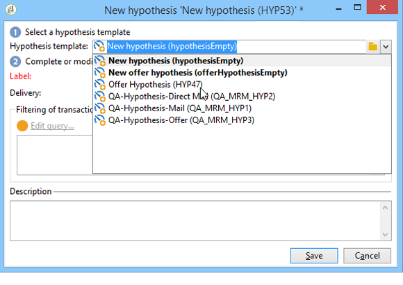
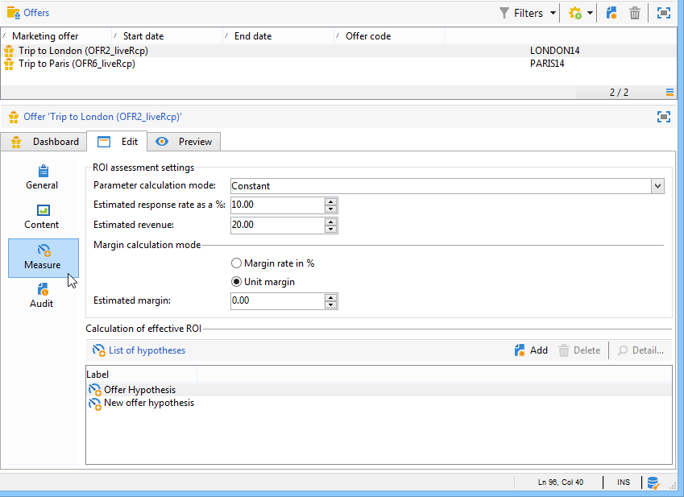

# Creazione di ipotesi{#creating-hypotheses}

Esistono varie possibilità per creare/collegare ipotesi a un&#39;offerta o una consegna di campagna:

* Tramite la cartella **[!UICONTROL Measurement hypotheses]**, potete creare una nuova ipotesi basata su un modello esistente e collegarla a una consegna esistente.
* Tramite la scheda **[!UICONTROL Edit]** > **[!UICONTROL Measurement]** in una campagna.
* Tramite l&#39;opzione **[!UICONTROL Measurement]** di una consegna creata da una campagna.

Le ipotesi possono essere calcolate solo dopo che la campagna di marketing è stata avviata e che i destinatari hanno ricevuto la consegna. Se l&#39;ipotesi si basa su una proposta di offerta, quest&#39;ultima deve essere almeno presentata e deve essere ancora attiva. Le ipotesi di offerta e consegna vengono create tramite la cartella **[!UICONTROL Measurement hypotheses]** e si basano su un modello di ipotesi. Tuttavia, è possibile fare riferimento a un&#39;ipotesi direttamente nella consegna o nella campagna prima dell&#39;inizio della campagna. In questo caso, le ipotesi verranno calcolate automaticamente dopo l&#39;avvio della campagna di marketing, in base alle impostazioni di esecuzione (per ulteriori informazioni, fare riferimento a [Impostazioni di esecuzione dei modelli di ipotesi](../../campaign/using/hypothesis-templates.md#hypothesis-template-execution-settings)).

## Creazione di un&#39;ipotesi al volo su una consegna {#creating-a-hypothesis-on-the-fly-on-a-delivery}

Per creare un&#39;ipotesi su una consegna esistente, eseguite il seguente processo:

>[!NOTE]
>
>Questa operazione è possibile solo per le consegne in sospeso.

1. Nella struttura  Adobe Campaign, passare a **[!UICONTROL Campaign management > Measurement hypotheses]**.
1. Fare clic sul pulsante **[!UICONTROL New]** o fare clic con il pulsante destro del mouse sull&#39;elenco delle ipotesi e selezionare **[!UICONTROL New]** nell&#39;elenco a discesa.

   

1. Nella finestra dell&#39;ipotesi, selezionare un modello creato in precedenza (fare riferimento a [Modelli di ipotesi](../../campaign/using/hypothesis-templates.md)).

   

   Il contesto dell&#39;ipotesi definito nel modello selezionato viene visualizzato nella finestra.

   >[!NOTE]
   >
   >Le impostazioni definite nel modello e non visibili in questo passaggio vengono anche memorizzate e riassegnate all&#39;ipotesi in corso.

   

1. Selezionare la consegna per la quale si desidera creare un&#39;ipotesi.

   

1. Potete personalizzare l&#39;ipotesi modificando le schede **[!UICONTROL General]**, **[!UICONTROL Transactions]** e **[!UICONTROL Scope]**. Per ulteriori informazioni, vedere [Creazione di un modello di ipotesi](../../campaign/using/hypothesis-templates.md#creating-a-hypothesis-model).
1. Iniziare l&#39;ipotesi facendo clic su **[!UICONTROL Start]**.

   Viene creato automaticamente un flusso di lavoro per eseguire la misurazione. Il nome viene definito automaticamente in base alla configurazione dell&#39;ipotesi.

   >[!CAUTION]
   >
   >È possibile accedervi se è stata selezionata la casella **[!UICONTROL Keep execution workflow]**.\
   >Questa opzione deve essere attivata solo a scopo di debug, in caso di errore durante l&#39;esecuzione dell&#39;ipotesi. I flussi di lavoro generati automaticamente vengono salvati nella cartella **[!UICONTROL Administration]** > **[!UICONTROL Production]** > **[!UICONTROL Objects created automatically]** > **[!UICONTROL Campaign workflows]** di  Adobe Campaign Explorer.
   > 
   >Inoltre, i flussi di lavoro generati automaticamente non devono essere modificati. Eventuali modifiche non saranno prese in considerazione altrove per ulteriori calcoli.
   >
   >Se avete selezionato questa opzione, eliminate il flusso di lavoro dopo che è stato eseguito.

   

   Una volta completato il calcolo, gli indicatori di misura vengono aggiornati automaticamente.

   

1. Se necessario, modificate le impostazioni e riavviate l’ipotesi.

## Riferimento a un&#39;ipotesi nella distribuzione di una campagna {#referencing-a-hypothesis-in-a-campaign-delivery}

Potete fare riferimento a un&#39;ipotesi in una campagna di marketing prima di avviarla. In questo caso, l&#39;ipotesi verrà avviata automaticamente dopo l&#39;invio della consegna, in base alle impostazioni di esecuzione definite nel modello di ipotesi. Per creare un&#39;ipotesi in una consegna, eseguite il seguente processo:

1. A seconda delle esigenze, è possibile creare uno o più modelli di tipo **[!UICONTROL Delivery]**, come descritto in [Creazione di un modello di ipotesi](../../campaign/using/hypothesis-templates.md#creating-a-hypothesis-model)
1. Crea una campagna di marketing e flussi di lavoro di targeting.
1. Nella finestra consegna, fate clic sull&#39;icona **[!UICONTROL Delivery measurement]**.
1. Selezionate il modello di ipotesi (la query configurata nel modello viene visualizzata nella finestra di ipotesi).

   L&#39;ipotesi verrà calcolata automaticamente al termine della campagna, in base alle date configurate nel modello (fare riferimento a [Impostazioni di esecuzione dei modelli di ipotesi](../../campaign/using/hypothesis-templates.md#hypothesis-template-execution-settings)).

   

## Aggiunta di un&#39;ipotesi predefinita alle consegne per una campagna {#adding-a-default-hypothesis-to-deliveries-for-a-campaign}

Potete fare riferimento direttamente a un&#39;ipotesi a livello di campagna. In questo caso, l&#39;ipotesi sarà automaticamente collegata a tutte le consegne create nella campagna. Per eseguire questa operazione:

1. Passate alla scheda **[!UICONTROL Edit]** della campagna.
1. Nella sezione relativa alle misurazioni, fare clic sulla scheda **[!UICONTROL Default hypotheses]**.

   

1. Fare clic su **[!UICONTROL Add]** e selezionare un modello di ipotesi.

   

   Per impostazione predefinita, a un&#39;ipotesi basata su questo modello viene fatto riferimento in ogni nuova consegna per la campagna.

   

I risultati dell&#39;ipotesi possono essere visualizzati nelle schede **[!UICONTROL General]** e **[!UICONTROL Reactions]** dell&#39;ipotesi (fare riferimento a [Tracciamento dell&#39;ipotesi](../../campaign/using/hypothesis-tracking.md))

Per ulteriori informazioni, fare riferimento anche a [Esempio: creazione di un&#39;ipotesi collegata a una consegna](#example--creating-a-hypothesis-linked-to-a-delivery).

## Creazione di un&#39;ipotesi su un&#39;offerta {#creating-a-hypothesis-on-an-offer}

Creare un&#39;ipotesi su una proposta di offerta è simile a creare un&#39;ipotesi di consegna al volo. L&#39;ipotesi può essere eseguita finché l&#39;offerta è attiva. Il periodo di calcolo è basato sulla data di proposta dell&#39;offerta. Quando l&#39;ipotesi consente di collegare un destinatario a un acquisto, lo stato dell&#39;offerta che potrebbe essere accettata può essere modificato automaticamente (per ulteriori informazioni, fare riferimento a [Transazioni](../../campaign/using/hypothesis-templates.md#transactions)).

1. Creare uno o più modelli di tipo **[!UICONTROL Offer]** come descritto in [Creazione di un modello di ipotesi](../../campaign/using/hypothesis-templates.md#creating-a-hypothesis-model).
1. Vai al nodo **[!UICONTROL Campaign management > Measurement hypotheses]**.
1. Create un&#39;ipotesi di tipo **[!UICONTROL Offers]** selezionando il modello creato in precedenza.

   

   La query creata nel modello viene visualizzata nella finestra.

   

1. Scegliete l&#39;offerta per la quale desiderate creare un&#39;ipotesi.

   

1. Se necessario, perfezionate la query.
1. Fare clic su **[!UICONTROL Start]** per eseguire l&#39;ipotesi.
1. I risultati dell&#39;ipotesi possono essere visualizzati nelle relative schede **[!UICONTROL General]** e **[!UICONTROL Reactions]** (fare riferimento a [Tracciamento ipotesi](../../campaign/using/hypothesis-tracking.md)).

   Le ipotesi effettuate su un&#39;offerta sono indicate nella scheda **[!UICONTROL Measurement]**.

   

   Se l&#39;opzione **[!UICONTROL Update offer proposition status]** è stata abilitata nel modello di ipotesi, lo stato della proposta di offerta viene modificato automaticamente, fornendo così un feedback sull&#39;impatto della campagna (per ulteriori informazioni, fare riferimento a [Transazioni](../../campaign/using/hypothesis-templates.md#transactions)).

## Esempio: creazione di un&#39;ipotesi collegata a una consegna {#example--creating-a-hypothesis-linked-to-a-delivery}

In questo esempio, vogliamo creare un&#39;ipotesi collegata a una consegna. Questa ipotesi si basa sul modello creato in precedenza (fare riferimento a [Esempio: creazione di un modello di ipotesi su una consegna](../../campaign/using/hypothesis-templates.md#example--creating-a-hypothesis-template-on-a-delivery)). La query ereditata dal modello verrà quindi perfezionata per effettuare un&#39;ipotesi su un articolo specifico della tabella di acquisto.

1. Create una campagna e una consegna (per ulteriori informazioni, consultate [Creazione di una campagna](../../campaign/using/setting-up-marketing-campaigns.md#creating-a-campaign)).

   Nel nostro esempio, utilizzeremo una consegna diretta per tipo di posta.

1. Configurare un indirizzo e-mail: il modello di ipotesi creato in precedenza è stato configurato per tenere conto di un gruppo di controllo nei risultati della reazione.

   

   >[!NOTE]
   >
   >Per ulteriori informazioni, vedere [Definizione di un gruppo di controllo](../../campaign/using/marketing-campaign-deliveries.md#defining-a-control-group).

1. Aprite la **[!UICONTROL Direct mail delivery]** e fate clic sull&#39;icona **[!UICONTROL Delivery measurement]**, quindi fate clic su **[!UICONTROL Add]**.

   

1. Scegliete il modello di ipotesi creato in precedenza dall’elenco a discesa.

   

   Viene visualizzata la query creata nel modello.

   

1. Fare clic su **[!UICONTROL Edit query...]** e affinare la query immettendo il prodotto che l&#39;ipotesi riguarda.

   

   È possibile verificare che l&#39;ipotesi sia collegata alla distribuzione nella scheda **[!UICONTROL Edit]** > **[!UICONTROL Measurement]** della campagna.

   

1. Avviate il flusso di lavoro di targeting ed eseguite i controlli necessari fino al termine della campagna (per ulteriori informazioni, consultate [Avvio di una consegna](../../campaign/using/marketing-campaign-deliveries.md#starting-a-delivery)).

   

1. Nella struttura  di Adobe Campaign, andare al nodo **[!UICONTROL Campaign management > Measurement hypotheses]** per verificare gli indicatori calcolati dall&#39;ipotesi.

   

