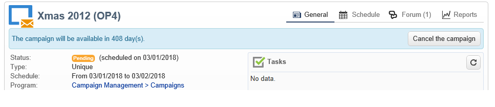

# Forum di discussione{#discussion-forums}

 gli operatori Adobe Campaign possono utilizzare i forum di discussione per condividere le informazioni. I seguenti elementi hanno un proprio forum: piani, programmi, campagne, risorse, simulazioni, scorte. Ogni operatore ha anche un forum personale. Tutte le discussioni sono pubbliche, anche su forum personali.

Gli operatori possono iscriversi a un forum per ricevere un’e-mail di notifica ogni volta che viene pubblicato un messaggio.

## Accesso a un forum {#accessing-a-forum}

Per visitare il forum di una campagna, un operatore ecc., andate al relativo dashboard e fate clic sul **[!UICONTROL Forum]** collegamento nell&#39;angolo in alto a destra. Questo collegamento fornisce anche il numero totale di messaggi nel forum.

## Utilizzo di un forum {#using-a-forum}

I messaggi e le relative risposte sono visualizzati in ordine cronologico (dal più recente al più vecchio).

Per visualizzare il contenuto di un messaggio, fai clic sulla relativa intestazione.

**Avviare una nuova discussione**

Per iniziare una nuova discussione, fate clic sul **[!UICONTROL Add a discussion]** pulsante in alto a destra. La **[!UICONTROL Discussion forum]** scatola viene visualizzata (vedi sotto).

**Pubblicare un messaggio su una discussione esistente**

Per pubblicare un messaggio su una discussione esistente, aprite il messaggio a cui desiderate rispondere, quindi fate clic sul **[!UICONTROL Reply]** collegamento nell&#39;angolo in alto a sinistra. La **[!UICONTROL Discussion forum]** scatola viene visualizzata (vedi sotto).

Quando rispondi a un messaggio, la persona che ha pubblicato il messaggio originale riceverà una notifica.

**Scrittura di un messaggio**

Nella **[!UICONTROL Discussion forum]** casella:

1. Immettete il testo nel **[!UICONTROL Message]** campo e un titolo di discussione nel **[!UICONTROL Subject]** campo.

   

1. Se necessario:

   * Se desiderate che qualcuno prenda parte alla discussione che non è iscritto al forum, utilizzate il **[!UICONTROL Operator to notify]** campo. L’operatore riceve un messaggio e-mail di notifica relativo a questo messaggio specifico (non verrà sottoscritto al forum). Per inviare una notifica a più operatori, selezionare un gruppo di operatori.
   * Per aggiungere un allegato al messaggio, fare clic su **[!UICONTROL Browse]**. L&#39;allegato verrà incluso anche nel messaggio e-mail di notifica. Gli allegati possono essere inviati solo singolarmente: per inviare diversi file, è necessario comprimerli.

1. Fate clic **[!UICONTROL Create the message]** per pubblicarlo nel forum.

>[!NOTE]
>
>Una volta pubblicato nel forum, il messaggio non può più essere modificato o eliminato.

## Registrazione al forum personale di un operatore {#posting-to-the-personal-forum-of-an-operator}

È possibile inviare un messaggio al forum di un operatore se, ad esempio, il messaggio non riguarda una campagna specifica ma si desidera comunque tenere traccia della conversazione in  Adobe Campaign. I forum personali sono pubblici e tutti gli operatori visualizzeranno il messaggio. L&#39;operatore riceve un messaggio ogni volta che un utente inserisce nel proprio forum personale.

Per accedere al forum di un operatore:

* Se disponete dei diritti necessari per accedere al **[!UICONTROL Administration > Access management > Operators]** nodo dell&#39;esploratore, aprite il dashboard dell&#39;operatore desiderato e fate clic sul **[!UICONTROL Forum]** collegamento nell&#39;angolo superiore destro.
* In caso contrario, trovate il nome dell&#39;operatore in  Adobe Campaign (tramite un messaggio inviato al forum da questo operatore, un&#39;attività a lui assegnata) e fate clic su di esso per accedere al dashboard. Potete anche chiedere all’amministratore di creare una visualizzazione della cartella dell’operatore.

## Iscrizione a un forum {#subscribing-to-a-forum}

La sottoscrizione a un forum consente di seguire le discussioni. Riceverete una notifica e-mail ogni volta che un messaggio viene inviato al forum. Il messaggio e-mail conterrà il corpo del messaggio e gli eventuali allegati. Per rispondere a un messaggio, fai clic sul corpo del messaggio e-mail, quindi accedi all&#39;interfaccia Web  Adobe Campaign. Con l’iscrizione a un forum, queste informazioni sono visibili a tutti.

* Per iscriversi a un forum, fate clic sul **[!UICONTROL Follow discussions]** pulsante in alto a destra sopra l’elenco dei messaggi.

   

   La sezione diventa blu e indica che siete iscritti al forum.

* Per annullare l’iscrizione a un forum, fate clic sul **[!UICONTROL Unsubscribe]** pulsante .

   

* Il dashboard personale elenca i forum a cui siete iscritti. Fate clic sul **[!UICONTROL Subscription to discussion forums]** collegamento per visualizzare l’elenco, quindi fate clic sull’elemento che vi interessa per accedere al relativo forum.

   

   Per ulteriori informazioni sulle dashboard personali, consulta [questa sezione](../../platform/using/access-management.md#operators).

* Per vedere chi è iscritto a un forum, fai clic sul **[!UICONTROL List of subscribers to this discussion forum]** collegamento sopra l’elenco dei messaggi.

   

## Verifica della consegna delle notifiche {#checking-notification-delivery}

Se gli operatori sottoscritti a un forum non ricevono le notifiche come previsto:

* Verificate che gli indirizzi e-mail siano inseriti nei profili dell&#39;operatore.
* Andate al **[!UICONTROL Administration > Production > Technical workflows > Campaign processes]** nodo e verificate che il **[!UICONTROL Jobs in discussion forums]** flusso di lavoro sia avviato e privo di errori.
* Visualizza i registri di consegna:

   * Nella home page di  Adobe Campaign, andate a **[!UICONTROL Campaigns > Navigation > Deliveries]**, quindi aprite la **[!UICONTROL Discussion forum notification]** consegna.
   * In Esplora risorse, andate a **[!UICONTROL Administration > Production > Objects created automatically > Technical deliveries > Workflow notifications]**, quindi fate clic su **[!UICONTROL Discussion forum notifications]**.

   Nella **[!UICONTROL Discussion forum notifications]** casella, i registri di consegna si trovano nella **[!UICONTROL Edit > Delivery]** scheda. È inoltre possibile visualizzare le schede **[!UICONTROL Tracking > Log]** e **[!UICONTROL Exclusion causes]** .

