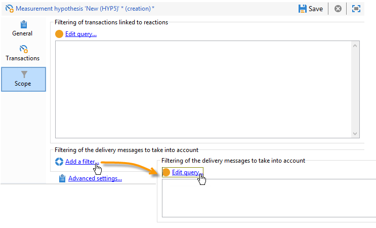
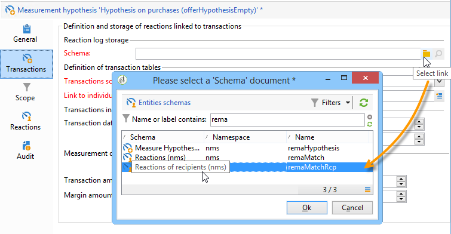
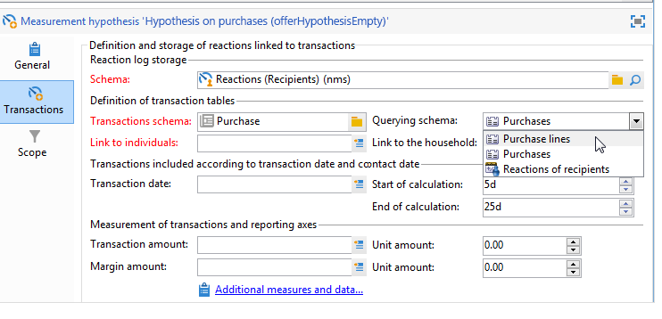

# Modelli di ipotesi{#hypothesis-templates}

## Creazione di un modello di ipotesi {#creating-a-hypothesis-model}

La configurazione del modello di ipotesi consente di definire il contesto per la misurazione delle reazioni, sia per una consegna che per un&#39;offerta. Qui si trovano i riferimenti alle varie tabelle di misurazione, comprese quelle per la definizione delle relazioni tra individui, ipotesi e tabella delle transazioni.

Per creare un modello di ipotesi, effettuate le seguenti operazioni:

1. In  Adobe Campaign Explorer, fate clic su **[!UICONTROL Resources>Templates>Hypothesis templates]**.

   

1. Fare clic su **[!UICONTROL New]** o fare clic con il pulsante destro del mouse nell&#39;elenco dei modelli e scegliere **[!UICONTROL New]** dall&#39;elenco a discesa.
1. Immettete l’etichetta dell’ipotesi.
1. Specificate se il modello è destinato alle ipotesi sulle offerte o sulle consegne mediante il **[!UICONTROL Hypothesis type]**.
1. Per i modelli di tipo **[!UICONTROL Delivery]**, specificare se le misurazioni devono essere eseguite con o senza un gruppo di controllo (per ulteriori informazioni, fare riferimento a [Proprietà di un modello di ipotesi](#properties-of-a-hypothesis-template)).
1. Per i modelli di tipo **[!UICONTROL Delivery]**, è possibile scegliere un canale specifico o decidere di applicare il modello a tutti i canali disponibili in  Adobe Campaign utilizzando l&#39;elenco a discesa **[!UICONTROL Channel]** (per ulteriori informazioni, vedere [Proprietà di un modello di ipotesi](#properties-of-a-hypothesis-template)).
1. Selezionare la **[!UICONTROL Execution folder]** in cui si desidera creare ed eseguire automaticamente le ipotesi che verranno create da questo modello.
1. Scegliere le impostazioni di esecuzione (per ulteriori informazioni, fare riferimento a [Impostazioni di esecuzione dei modelli di ipotesi](#hypothesis-template-execution-settings)).
1. Specificare il periodo di calcolo dell&#39;ipotesi (per ulteriori informazioni, fare riferimento a [Impostazioni di esecuzione dei modelli di ipotesi](#hypothesis-template-execution-settings)).

   >[!CAUTION]
   >
   >Questo periodo è determinato dalla data di contatto.

1. Nella scheda **[!UICONTROL Transactions]**, specificare le tabelle e i campi necessari per il calcolo dell&#39;ipotesi (per ulteriori informazioni, fare riferimento a [Transazioni](#transactions)).
1. Se il modello è configurato per le ipotesi di tipo **[!UICONTROL Offer]**, potete attivare l&#39;opzione **[!UICONTROL Update offer proposition status]**: in questo caso, selezionate lo stato della proposta di offerta da modificare.
1. Specificare l&#39;ambito dell&#39;applicazione di ipotesi (per ulteriori informazioni, fare riferimento a [perimetro di ipotesi](#hypothesis-perimeter)).
1. Se necessario, utilizzare uno script per completare il filtraggio (per ulteriori informazioni, fare riferimento a [perimetro di ipotesi](#hypothesis-perimeter)).

### Proprietà di un modello di ipotesi {#properties-of-a-hypothesis-template}

La scheda **[!UICONTROL General]** del modello consente di specificare le opzioni generali del modello. I campi disponibili sono:

* **[!UICONTROL Hypothesis type]**: consente di determinare se il modello deve essere destinato a ipotesi su consegne o offerte.

   Potete anche scegliere di creare un&#39;ipotesi da applicare sia alle consegne che alle offerte.

   >[!NOTE]
   >
   >Se il modello si applica alle offerte, l&#39;opzione **[!UICONTROL Update offer proposition status]** è disponibile nella scheda **[!UICONTROL Transactions]**.

* **[!UICONTROL Measurement with control group]**: consente di specificare se un gruppo di controllo è stato definito per la distribuzione o la campagna e di includerlo negli indicatori di misura. Il gruppo di controllo, che non riceve le consegne, consente di misurare l&#39;impatto della campagna dopo la consegna confrontandola con la popolazione di destinazione che ha ricevuto la consegna.

   >[!NOTE]
   >
   >Se il modello è configurato per tenere conto di un gruppo di controllo, ma nessun gruppo è definito nella consegna che riguarda le ipotesi, i risultati saranno basati solo su destinatari mirati.

   Per ulteriori informazioni sulla definizione e configurazione di un gruppo di controllo, fare riferimento a [Definizione di un gruppo di controllo](../../campaign/using/marketing-campaign-deliveries.md#defining-a-control-group).

* **[!UICONTROL Channel]**: potete scegliere un canale specifico o rendere disponibile il modello di ipotesi a tutti i canali nella console Adobe Campaign  selezionando  **[!UICONTROL All channels]** nell’elenco a discesa. Se configurate il modello per un canale specifico, questo consente di filtrare automaticamente le consegne per canale al momento della creazione dell&#39;ipotesi (consultate [Creazione di ipotesi](../../campaign/using/creating-hypotheses.md)).

   

* **[!UICONTROL Execution folder]**: consente di specificare la cartella di esecuzione per l&#39;ipotesi.
* **[!UICONTROL Taken into account in campaign ROI calculation]**: prende in considerazione il risultato dell’ipotesi nel calcolo del ROI per la campagna correlata.

### Impostazioni di esecuzione dei modelli di ipotesi {#hypothesis-template-execution-settings}

La scheda **[!UICONTROL General]** del modello consente inoltre di specificare i parametri di esecuzione dell&#39;ipotesi. Le opzioni disponibili sono le seguenti:

* **[!UICONTROL Schedule execution for a time of low activity]**: consente di pianificare il lancio dell&#39;ipotesi per ottimizzare  prestazioni Adobe Campaign. Quando questa opzione è selezionata, il flusso di lavoro di elaborazione delle campagne esegue il calcolo delle ipotesi durante il periodo di inattività.

   

* **[!UICONTROL Priority]**: livello applicato all&#39;ipotesi per distanziare gli ordini di calcolo dell&#39;ipotesi in caso di esecuzione simultanea.

   

* **[!UICONTROL Automatic execution]**: se necessario, consente di pianificare il ricalcolo delle ipotesi (ad esempio, se si desidera aggiornare gli indicatori regolarmente fino alla fine della consegna).

   

   Per specificare una pianificazione, eseguite il seguente processo:

   1. Fare clic sul collegamento **[!UICONTROL Frequency of execution...]**, quindi sul pulsante **[!UICONTROL Change...]**.

      

   1. Configurare la frequenza, gli eventi correlati e il periodo di validità.

      

   1. Fare clic su **[!UICONTROL Finish]** per salvare la pianificazione.

      

* **[!UICONTROL Log SQL queries in journal]**: questa funzione è riservata agli utenti esperti. Consente di aggiungere una scheda al controllo delle ipotesi di misurazione per visualizzare le query SQL. Questo consente di individuare eventuali malfunzionamenti se una simulazione termina con errori.
* **[!UICONTROL Keep execution workflow]**: consente di mantenere il flusso di lavoro generato automaticamente all’inizio del calcolo dell’ipotesi. Nelle ipotesi create da un modello con questa opzione selezionata, il flusso di lavoro generato è disponibile per seguire il processo.

   >[!CAUTION]
   >
   >Questa opzione deve essere attivata solo a scopo di debug, in caso di errore durante l&#39;esecuzione dell&#39;ipotesi.\
   >Inoltre, i flussi di lavoro generati automaticamente non devono essere modificati. Eventuali modifiche non saranno prese in considerazione altrove per ulteriori calcoli.\
   >Se avete selezionato questa opzione, eliminate il flusso di lavoro dopo che è stato eseguito.

### Transazioni {#transactions}

Questa scheda contiene i vari campi e tabelle che consentono di salvare la cronologia delle reazioni dei destinatari in termini di transazioni. Per ulteriori informazioni sulle tabelle dedicate alla gestione delle risposte, fare riferimento alla guida [Configuration](../../configuration/using/about-schema-reference.md).

* **[!UICONTROL Schema (reaction log storage)]**: selezionare la tabella di reazione del destinatario. La tabella standard in  Adobe Campaign è **NmsRemaMatchRcp**.
* **[!UICONTROL Transaction schema]**: scegliere la tabella che le ipotesi riguarderanno, ovvero la transazione o la tabella di acquisto.
* **[!UICONTROL Querying schema]**: scegliete i criteri per filtrare l’ipotesi.
* **[!UICONTROL Link to individuals]**: scegliere il collegamento tra singoli e la tabella utilizzata come schema di transazione.
* **[!UICONTROL Link to the household]**: selezionare il collegamento alla famiglia nello schema delle transazioni se si desidera includere tutti i membri di una famiglia in un&#39;ipotesi. Questo campo è facoltativo.
* **[!UICONTROL Transaction date]**: questo campo è facoltativo ma consigliato in quanto consente di definire un ambito per il calcolo delle ipotesi.
* **[!UICONTROL Measurement period]**: consente di configurare le date di inizio e fine durante le quali vengono eseguite le ipotesi e le linee di acquisto vengono recuperate.

   Quando l&#39;ipotesi è collegata a una consegna, la misurazione viene attivata automaticamente alcuni giorni dopo la data di contatto per le consegne per corrispondenza diretta, o dopo la data di consegna per le consegne via e-mail o SMS.

   

   Se l&#39;ipotesi viene lanciata al volo, può essere forzata se vuole attivarla immediatamente. In caso contrario, viene attivato automaticamente in base alla data di fine del calcolo configurata, che si basa sulla data di creazione dell&#39;ipotesi (fare riferimento a [Creazione di un&#39;ipotesi al volo su una consegna](../../campaign/using/creating-hypotheses.md#creating-a-hypothesis-on-the-fly-on-a-delivery)).

* **[!UICONTROL Transaction/Margin amount]**: questi campi sono facoltativi e consentono di calcolare automaticamente gli indicatori di fatturato (fare riferimento a  [Indicatori](../../campaign/using/hypothesis-tracking.md#indicators)).
* **[!UICONTROL Unit amount]**: consente di impostare un importo per il calcolo delle entrate (fare riferimento a  [Indicatori](../../campaign/using/hypothesis-tracking.md#indicators)).

   

* **[!UICONTROL Additional measures and data]**: consente di specificare ulteriori misure di reporting o assi dai campi nelle diverse tabelle.
* **[!UICONTROL Update offer proposition status]**: consente di modificare lo stato della proposta se un destinatario dell&#39;offerta è identificato dall&#39;ipotesi.

   

### Perimetro di ipotesi {#hypothesis-perimeter}

Una volta definita la tabella delle transazioni e i campi che l&#39;ipotesi riguarderà, è possibile definire l&#39;ambito delle ipotesi specificando le transazioni e le consegne mirate utilizzando i filtri. È inoltre possibile utilizzare uno script JavaScript per puntare esplicitamente a un prodotto a cui si fa riferimento nella tabella delle transazioni.

* **Filtro sulle transazioni**: nella  **[!UICONTROL Scope]** scheda è possibile configurare un filtro per l&#39;ipotesi. Per eseguire questa operazione:

   1. Fare clic sul collegamento **[!UICONTROL Edit query]**.

      

   1. Specificate le condizioni di filtraggio.

      

   1. Selezionare la transazione che l&#39;ipotesi riguarderà.

      

* **Filtra sui destinatari**: nella  **[!UICONTROL Scope]** scheda, puoi limitare l&#39;ipotesi a qualsiasi informazione collegata a un messaggio (consegna, destinatario, indirizzo e-mail, servizio, ecc.):

   1. Fare clic sul collegamento **[!UICONTROL Add a filter]**, quindi **[!UICONTROL Edit query]**.

      

   1. Specificate le condizioni di filtraggio.

      

   1. Fare clic su **[!UICONTROL Finish]** per salvare la query.

      

* **Script**: è possibile utilizzare uno script JavaScript per sovraccaricare dinamicamente le impostazioni di ipotesi durante l&#39;esecuzione.

   A questo scopo, fate clic sul collegamento **[!UICONTROL Advanced settings]**, quindi immettete lo script desiderato.

   >[!NOTE]
   >
   >Questa opzione è destinata agli utenti esperti.

   

## Esempio: creazione di un modello di ipotesi su una consegna {#example--creating-a-hypothesis-template-on-a-delivery}

In questo esempio, stiamo per creare un modello di ipotesi su una consegna diretta per tipo di posta. La tabella delle transazioni (**Acquisti** nel nostro esempio) su cui si baseranno le ipotesi contiene le linee di acquisto collegate agli articoli o ai prodotti. Vogliamo configurare il nostro modello per creare ipotesi su articoli o prodotti nella tabella di acquisto.

1. In  Adobe Campaign Explorer, andate al nodo **[!UICONTROL Resources > Templates > Hypothesis templates]**.
1. Fate clic su **[!UICONTROL New]** per creare un modello.

   

1. Modificate l’etichetta del modello.

   

1. Selezionare **[!UICONTROL Deliveries]** come tipo di ipotesi.
1. Specificare che la consegna può contenere un gruppo di controllo selezionando la casella corrispondente.
1. Scegliere il canale **[!UICONTROL Direct mail]**.

   >[!NOTE]
   >
   >Poiché il modello è specifico per le consegne per corrispondenza diretta, le ipotesi create con questo modello potrebbero non essere collegate ad altri tipi di consegna.

1. Nella scheda **[!UICONTROL Transactions]**, selezionate la tabella delle reazioni dei destinatari.

   

1. Nel campo **[!UICONTROL Transactions schema]**, scegliere la tabella di acquisto.

   

1. Selezionare le righe di acquisto nel campo **[!UICONTROL Querying schema]**.

   

1. Scegliere i destinatari collegati alla tabella di acquisto.

   

1. Selezionare il campo collegato alla data di acquisto.

   Questo consente di definire un intervallo di tempo per le ipotesi. Questa fase non è obbligatoria, ma è consigliata.

   

1. Configurare il periodo di calcolo per 5-25 giorni.

   

1. Nella scheda **[!UICONTROL Scope]**, fare clic su **[!UICONTROL Edit query]** per creare un filtro sulle ipotesi.

   

   Il modello creato consente quindi di eseguire ipotesi sui prodotti o sugli articoli nella tabella di acquisto.

1. Fare clic su **[!UICONTROL Save]** per registrare il modello.

