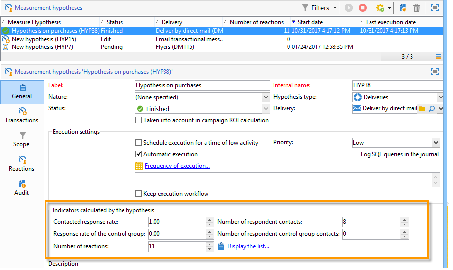

# Tracking delle ipotesi{#hypothesis-tracking}

Il risultato dei calcoli di ipotesi è disponibile a vari livelli della piattaforma Adobe Campaign : gli indicatori calcolati in base alle ipotesi e alle reazioni della popolazione destinataria sono visibili attraverso l&#39;ipotesi effettiva, nonché nelle ipotesi contenute nei rapporti disponibili tramite campagne e consegne.

## Risultati ipotesi {#hypothesis-results}

### Indicatori {#indicators}

Una volta calcolata l&#39;ipotesi, diversi indicatori di misura vengono aggiornati automaticamente. Sono disponibili nella scheda **[!UICONTROL General]** dell&#39;ipotesi.

Questi indicatori sono:

* **Numero di contatti** intervistati: numero di persone contattate che corrispondono all&#39;ipotesi.
* **Tasso** di risposta contattato: numero di contatti intervistati / totale di persone contattate durante la consegna.
* **Numero di contatti** del gruppo di controllo partecipanti: numero di gruppi di controllo che corrispondono all&#39;ipotesi.
* **Tasso di risposta del gruppo** di controllo: numero di gruppi di controllo partecipanti / numero totale di gruppi di controllo della consegna.
* **Numero di reazioni**: numero di record nella tabella che contiene il rapporto tra individui, l&#39;ipotesi e la tabella delle transazioni.

Per l&#39;elenco completo degli indicatori, fare clic sul collegamento **[!UICONTROL Display the list]**:

Gli indicatori forniscono le seguenti informazioni:

* **Entrate totali della popolazione contattata**: importi totali relativi al numero di persone contattate.
* **Entrate totali del gruppo** di controllo: importi totali sul numero di gruppi di controllo.
* **Entrate medie per contatto**: totale importi / contattati.
* **Entrate medie del gruppo** di controllo: totale importi / gruppo di controllo.
* **Margine totale per contatto**: margine totale su contattato.
* **Margine totale del gruppo** di controllo: margine totale sul gruppo di controllo.
* **Margine medio per contatto**: totale / contattato.
* **Margine medio dei gruppi** di controllo: margini totali / gruppo di controllo.
* **Entrate** aggiuntive: (Entrate medie del gruppo di controllo contattato-Ricavi medi)*Numero di contatti
* **Margine** aggiuntivo: (margine medio del gruppo di controllo contattato-margine medio) / numero di contattati
* **Costo medio per contatto**: costo di consegna calcolato / Numero di contatti.
* **ROI**: costo calcolato della consegna / Margine totale per contatto
* **ROI** efficace: costo di consegna calcolato / margine aggiuntivo.
* **Significato**: contiene valori da 0 a 3 a seconda del significato della campagna.

### Reazioni {#reactions}

È possibile visualizzare le reazioni dei destinatari alle ipotesi tramite la scheda **[!UICONTROL Reactions]**.

1. Una volta completato il calcolo dell&#39;ipotesi, passare al nodo **[!UICONTROL Campaign management > Measurement hypotheses]** della struttura  Adobe Campaign.
1. Selezionate l&#39;ipotesi desiderata e fate clic sulla scheda **[!UICONTROL Reactions]** per visualizzare l&#39;elenco dei destinatari che probabilmente acquisteranno qualcosa dopo la campagna di marketing.

   

## Rapporti {#reports}

La sezione **[!UICONTROL Hypothesis report]** consente di visualizzare i risultati delle ipotesi eseguite su campagne e consegne. Questo rapporto contiene gli indicatori calcolati dall&#39;ipotesi (per ulteriori informazioni, fare riferimento a [Indicatori](#indicators)).

* **A livello** di campagna: fate clic sul  **[!UICONTROL Reports]** collegamento della campagna interessata e selezionate la campagna  **[!UICONTROL Hypothesis report]**. Questo rapporto contiene l&#39;elenco delle consegne della campagna e le ipotesi calcolate per ogni consegna.

   

* **A livello** di consegna: per accedere al rapporto, apri il recapito interessato, fai clic sul pulsante  **[!UICONTROL Reports]** nella  **[!UICONTROL Summary]** scheda e seleziona il  **[!UICONTROL Hypothesis report]**. Se per la stessa consegna sono state calcolate diverse ipotesi, la relazione conterrà tutte le ipotesi.

   
