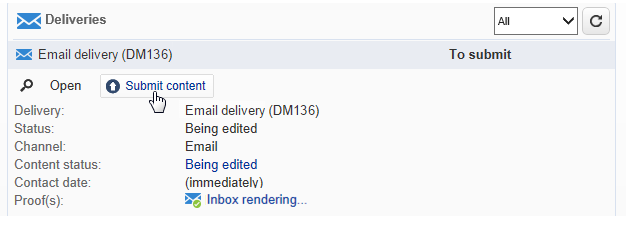
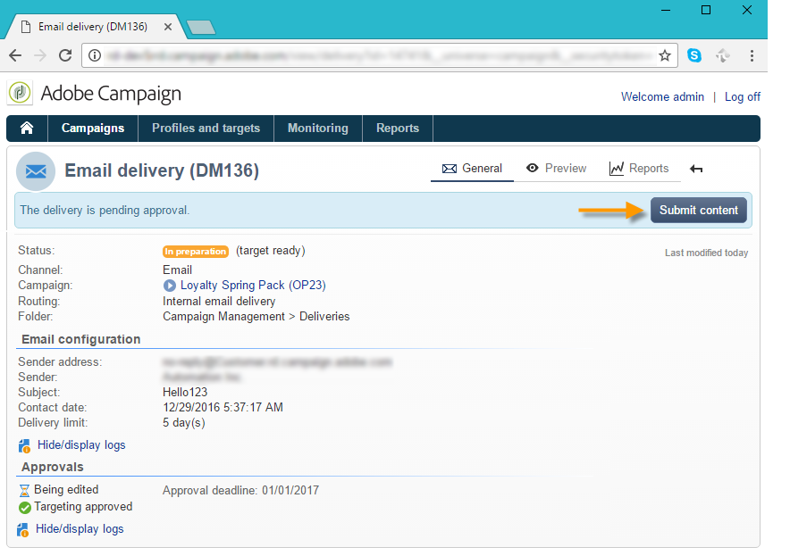

# Impostare e gestire il processo di approvazione {#approving-marketing-campaigns}

Ogni fase di una consegna può essere soggetta ad approvazione per garantire il monitoraggio e il controllo completo dei vari processi della campagna: targeting, contenuto, budget, estrazione e invio di una bozza.

I messaggi di notifica vengono inviati agli operatori di Adobe Campaign che sono revisori designati per informarli di una richiesta di approvazione. Verificare che i revisori dispongano delle **autorizzazioni appropriate** per l&#39;approvazione e che l&#39;area di sicurezza sia definita correttamente. [Ulteriori informazioni](#selecting-reviewers).

La procedura di approvazione è presentata in [questa sezione](#checking-and-approving-deliveries).

>[!NOTE]
>
>Solo il proprietario della consegna può avviare una consegna. Affinché un altro operatore (o gruppo di operatori) possa avviare una consegna, è necessario aggiungerli come revisori nel campo **[!UICONTROL Delivery start:]**.\
>[Ulteriori informazioni](#selecting-reviewers).

## Principio di funzionamento {#operating-principle-}

Ad esempio, il messaggio standard per l&#39;approvazione del budget è il seguente:

Gli operatori revisori possono quindi scegliere se approvare o meno il budget.

Dopo la convalida dell’operatore, l’approvazione o il rifiuto del processo viene inoltrato al dashboard di consegna.

Le informazioni sono disponibili anche nei registri di approvazione della campagna. L&#39;accesso a tali registri avviene tramite la scheda **[!UICONTROL Edit > Tracking > Approvals]**.

Queste notifiche vengono inviate agli operatori interessati a ciascun processo per il quale è stata abilitata l’approvazione.

È possibile abilitare le approvazioni per il modello della campagna, per ogni singola campagna o per una consegna.

Tutti i processi che richiedono l&#39;approvazione sono selezionati nel modello della campagna (scheda **[!UICONTROL Properties]** > **[!UICONTROL Advanced campaign settings...]** > **[!UICONTROL Approvals]**), così come gli operatori responsabili dell&#39;approvazione (riceveranno notifiche, a meno che questa opzione non sia abilitata). Per ulteriori informazioni al riguardo, consulta [questa sezione](#approving-processes).

Queste impostazioni possono essere ignorate per ogni campagna creata utilizzando questo modello e singolarmente per ogni consegna della campagna: fai clic sul pulsante **[!UICONTROL Properties]**, quindi sulla scheda **[!UICONTROL Approvals]**.

Nell’esempio seguente, il contenuto della consegna non richiederà approvazioni:

## Seleziona revisori {#selecting-reviewers}

Per ogni tipo di approvazione, gli operatori o i gruppi di operatori responsabili dell’approvazione vengono selezionati dall’elenco a discesa nella consegna. È possibile aggiungere altri operatori utilizzando il collegamento **[!UICONTROL Edit...]**. Questa finestra consente inoltre di modificare la scadenza dell’approvazione.

Se non viene specificato alcun revisore, il responsabile della campagna sarà responsabile dell’approvazione e riceverà le notifiche. Il manager della campagna è specificato nella scheda **[!UICONTROL Edit > Properties]** della campagna:

>[!NOTE]
>
>Anche tutti gli altri operatori Adobe Campaign con diritti **[!UICONTROL Administrator]** possono approvare i processi, ma non riceveranno notifiche.\
>Per impostazione predefinita, il responsabile della campagna non può eseguire l’approvazione o avviare le consegne se sono stati definiti operatori di approvazione. Puoi modificare questo comportamento e autorizzare il manager della campagna ad approvare/avviare le consegne creando l&#39;opzione **NmsCampaign_Activate_OwnerConfirmation** con **1** come valore.

## Modalità di approvazione {#approval-modes}

### Approvazione tramite il dashboard {#approval-via-the-dashboard}

Per approvare un processo tramite la console o l’interfaccia web, fai clic sul collegamento appropriato nel dashboard della campagna. I processi possono essere approvati anche tramite il tracciamento della consegna o tramite il dashboard di consegna.

Controllare le informazioni da approvare, scegliere se accettare o rifiutare l&#39;approvazione e, se necessario, inserire un commento. Fare clic su **[!UICONTROL Ok]** per salvare.

>[!NOTE]
>
>Se un processo è già stato approvato da un altro operatore, il collegamento di approvazione non è disponibile.

### Approvazione tramite messaggi di notifica {#approval-via-notification-messages}

Fai clic sul collegamento disponibile nel messaggio di notifica (consulta [Notifiche](#notifications)). Devi effettuare l’accesso, come mostrato di seguito:

Selezionare **[!UICONTROL Accept]** o **[!UICONTROL Reject]** e immettere un commento, se necessario.

Fai clic su **[!UICONTROL Validate]**.

>[!NOTE]
>
>Se durante il processo sono stati generati avvisi, nella notifica viene visualizzato un avviso.

### Tracciamento approvazione {#approval-tracking}

Le informazioni sono disponibili in diverse posizioni:

* Nel registro di approvazione della campagna, scheda secondaria **[!UICONTROL Approvals]** della scheda **[!UICONTROL Edit > Tracking]**:

  

* Nel registro di consegna della campagna, scheda secondaria **[!UICONTROL Deliveries]** della scheda **[!UICONTROL Edit > Tracking]**:

  

* È possibile visualizzare lo stato di approvazione per ogni consegna facendo clic sull&#39;opzione **[!UICONTROL Hide/show log]** della scheda **[!UICONTROL Summary]**.

  

* È inoltre possibile accedere a queste informazioni tramite la scheda **[!UICONTROL Tracking > Approvals]** di ciascuna consegna:

  

>[!NOTE]
>
>Una volta che un operatore ha approvato o rifiutato un processo, gli altri operatori di revisione non possono più agire sull&#39;approvazione.

### Approvazione automatica e manuale {#automatic-and-manual-approval}

Durante la creazione di un flusso di lavoro di targeting, se l’approvazione è automatica (modalità predefinita), Adobe Campaign visualizza il collegamento di approvazione o invia una notifica non appena è necessaria un’approvazione.

Per scegliere la modalità di approvazione (manuale o automatica), fare clic sulla scheda **[!UICONTROL Edit > Properties]** della campagna o del modello della campagna, quindi su **[!UICONTROL Advanced campaign settings...]** e infine sulla scheda **[!UICONTROL Approvals]**.

>[!NOTE]
>
>La modalità di approvazione selezionata verrà applicata a tutte le consegne della campagna.

Quando viene generato un flusso di lavoro di targeting, l’approvazione manuale ti consente di evitare la creazione di collegamenti di approvazione o l’invio automatico di notifiche. Il dashboard della campagna offre quindi un collegamento **[!UICONTROL Submit targeting for approval]** per avviare manualmente il processo di approvazione.

Un messaggio di conferma ti consente di autorizzare le approvazioni per i processi selezionati per questa consegna.

I pulsanti di approvazione vengono quindi visualizzati nel dashboard della campagna (per questa consegna), nel dashboard della consegna e nel tracciamento della consegna. Se le notifiche sono abilitate, verranno inviate in parallelo.

Questo metodo di abilitazione delle approvazioni consente di lavorare sul targeting senza inviare notifiche false ai revisori.

## Notifiche {#notifications}

Le notifiche sono messaggi e-mail specifici inviati ai revisori per informarli che un processo è in attesa di approvazione. Quando l’operatore fa clic sul collegamento nel messaggio, viene visualizzata una pagina di autenticazione e, dopo aver effettuato l’accesso, può visualizzare le informazioni e approvare o rifiutare il processo. È inoltre possibile immettere un commento nella finestra di approvazione.

Il contenuto delle e-mail di notifica può essere personalizzato. Vedi [Contenuto notifica](#notification-content).

### Attiva/Disattiva notifica {#enabling-disabling-notification}

Per impostazione predefinita, i messaggi di notifica vengono inviati se l’approvazione del processo correlato è abilitata nel modello della campagna, nella campagna o nella consegna. Le notifiche possono, tuttavia, essere disabilitate per autorizzare le approvazioni solo dalla console.

A questo scopo, modifica la finestra di approvazione della campagna o del modello della campagna ( **[!UICONTROL Edit > Properties]** > **[!UICONTROL Advanced campaign settings...]** > scheda **[!UICONTROL Approvals]**) e seleziona **[!UICONTROL Do not enable notification sending]**.

### Contenuto della notifica {#notification-content}

Il contenuto della notifica è definito in un modello specifico: **[!UICONTROL Notification of validations for the marketing campaign]**. Questo modello viene salvato nella cartella **[!UICONTROL Administration > Campaign management > Technical delivery templates]** della struttura Adobe Campaign.

## Rivedere e approvare le consegne {#checking-and-approving-deliveries}

Adobe Campaign consente di impostare processi di approvazione per le fasi principali della campagna di marketing in modalità collaborativa.

Per le consegne di direct mailing, gli operatori Adobe Campaign possono visualizzare il file di estrazione prima di inviarlo al router, e se necessario possono modificare il formato e riavviare l’estrazione. Vedere [Approvare un file di estrazione](#approving-an-extraction-file).

Per ogni campagna puoi approvare il target di consegna, il contenuto (vedi [Approva contenuto](#approving-content)) e i costi. Gli operatori Adobe Campaign incaricati dell’approvazione possono ricevere una notifica tramite e-mail e accettare o rifiutare l’approvazione dalla console o tramite una connessione web. Consulta [Passaggi per approvare una consegna](#approving-processes).

Al termine di queste fasi di convalida, la consegna può essere avviata. [Ulteriori informazioni](../../campaign/using/marketing-campaign-deliveries.md#starting-a-delivery).

### Passaggi per approvare una consegna {#approving-processes}

Le fasi che richiedono l’approvazione vengono visualizzate nel dashboard della campagna (tramite la console dell’interfaccia web). Vengono inoltre visualizzati nella tabella di tracciamento della consegna e nel dashboard della consegna.

A questo punto, lo stato della campagna è **[!UICONTROL To validate]**.

>[!NOTE]
>
>Per selezionare i processi che richiedono un’approvazione, modifica il modello della campagna. Per ulteriori informazioni, consulta [Modelli di campagna](../../campaign/using/marketing-campaign-templates.md#campaign-templates).
>

>[!NOTE]
>
>In un flusso di lavoro di targeting, se durante la preparazione dei messaggi si verifica un errore collegato a un problema di configurazione, il collegamento **[!UICONTROL Restart message preparation]** viene visualizzato nel dashboard. Correggi l’errore e fai clic su questo collegamento per riavviare la preparazione dei messaggi ignorando la fase di targeting.

Per ogni consegna nella campagna, puoi approvare i seguenti processi:

* **Impostazione destinazione, contenuto e budget**

  Quando le opzioni **[!UICONTROL Enable target approval]**, **[!UICONTROL Enable content approval]** o **[!UICONTROL Enable budget approval]** sono selezionate nella finestra delle impostazioni di approvazione del processo, i collegamenti rilevanti vengono visualizzati nel dashboard della campagna per le consegne interessate.

  >[!NOTE]
  >
  >L&#39;approvazione del budget è disponibile solo se l&#39;approvazione del targeting è abilitata nella finestra delle impostazioni di approvazione. Il collegamento per l&#39;approvazione del budget viene visualizzato solo dopo l&#39;analisi della destinazione. Inoltre, questo collegamento viene visualizzato insieme al collegamento per l’approvazione del target.

  Se le opzioni **[!UICONTROL Assign content editing]** o **[!UICONTROL External content approval]** sono selezionate nella finestra delle impostazioni di approvazione, nel dashboard verranno visualizzati i collegamenti **[!UICONTROL Available content]** e **[!UICONTROL External content approval]**.

  L’approvazione del contenuto ti consente di accedere alle bozze inviate.

* **Approvazione estrazione (consegna direct mailing)**

  Quando si seleziona **[!UICONTROL Enable extraction approval]** nella finestra delle impostazioni di approvazione, il file estratto deve essere approvato prima che il router possa ricevere una notifica.

  Un collegamento **[!UICONTROL Approve content]** è disponibile nel dashboard della campagna come mostrato di seguito:

  

  I file di estrazione possono essere visualizzati in anteprima tramite la casella di approvazione e quindi accettati o rifiutati.

  

  >[!NOTE]
  >
  >L’anteprima del file di estrazione riguarda solo un esempio di dati. L&#39;intero file di output non viene caricato.

* **Approvazione delle consegne associate**

  L&#39;opzione **[!UICONTROL Enable individual approval of each associated delivery]** viene utilizzata per una consegna principale associata alle consegne secondarie. Per impostazione predefinita, questa opzione non è selezionata, pertanto è possibile eseguire un’approvazione complessiva della consegna principale. Se questa opzione è selezionata, ogni consegna deve essere approvata singolarmente.

  

### Seleziona i processi da approvare {#choosing-the-processes-to-be-approved}

Le fasi di approvazione sono definite con il modello associato alla campagna. Seleziona gli elementi da approvare dal modello e specifica gli operatori Adobe Campaign responsabili di queste approvazioni. Per ulteriori informazioni sui modelli di campagna, consulta [questa sezione](../../campaign/using/marketing-campaign-templates.md#campaign-templates).

>[!NOTE]
>
>La configurazione di approvazione per la campagna (o modello di campagna) si applica a tutte le consegne future collegate a questa campagna. Eventuali modifiche alla configurazione non verranno applicate alle consegne precedenti.

Queste informazioni possono essere ignorate per ogni campagna e consegna.

Per una campagna, fai clic sulla scheda **[!UICONTROL Edit > Properties]**, quindi sul collegamento **[!UICONTROL Advanced campaign settings...]** e infine sulla scheda secondaria **[!UICONTROL Approvals]** per accedere alla pagina di configurazione delle approvazioni.

Puoi selezionare e deselezionare i processi per approvare e nominare gli operatori Adobe Campaign responsabili dell’approvazione. Possono essere singoli operatori, un gruppo di operatori o un elenco di operatori.

Per selezionare un elenco di operatori, fare clic sul collegamento **[!UICONTROL Edit...]** a destra del campo che designa il primo revisore e aggiungere tutti gli operatori necessari, come illustrato di seguito:

>[!NOTE]
>
>* Se è definito un elenco di revisori, un processo viene approvato quando un revisore lo ha accettato. Il relativo collegamento di approvazione non viene quindi più offerto nella dashboard. Quando l’invio delle notifiche è abilitato, se un altro revisore fa clic sul collegamento di approvazione nel messaggio di notifica, riceve una notifica che indica che un altro operatore ha già approvato il processo.
>* Puoi definire una pianificazione di approvazione per la campagna nella sezione inferiore della finestra di modifica del revisore. Per impostazione predefinita, i revisori dispongono di tre giorni a partire dalla data di invio per approvare un processo. È possibile configurare un promemoria che viene inviato automaticamente agli operatori interessati prima della scadenza dell’approvazione.
>* Puoi aggiungere promemoria da questa sezione.
>

Per ogni consegna, fai clic sul pulsante **[!UICONTROL Audit]** e sulla scheda **[!UICONTROL Approvals]** per visualizzare e modificare le date di approvazione e i promemoria automatici.

>[!NOTE]
>
>Questa scheda è disponibile dopo l’avvio del processo di approvazione del contenuto.

### Approvare un contenuto {#approving-content}

>[!CAUTION]
>
>Per approvare un contenuto, è obbligatorio un ciclo di bozza. Le bozze ti consentono di approvare la visualizzazione di informazioni, dati di personalizzazione e verificare che i collegamenti funzionino. Scopri come creare una bozza in [questa sezione](../../delivery/using/steps-validating-the-delivery.md#sending-a-proof).
>
>Le funzionalità di approvazione del contenuto descritte di seguito si riferiscono alla consegna della bozza.

È possibile configurare un ciclo di approvazione dei contenuti. A tale scopo, selezionare l&#39;opzione **[!UICONTROL Enable content approval]** nella finestra delle impostazioni di approvazione. I passaggi principali del ciclo di approvazione dei contenuti sono i seguenti:

1. Dopo aver creato una nuova consegna, il manager della campagna fa clic sul collegamento **[!UICONTROL Submit content]** nel dashboard della campagna per avviare il ciclo di approvazione dei contenuti.

   

   >[!NOTE]
   >
   >Se nella finestra delle impostazioni di approvazione sono state selezionate le opzioni **[!UICONTROL Enable the sending of proofs]** (per le consegne e-mail) o **[!UICONTROL Enable the sending and approval of proofs]** (per le consegne di direct mailing), le bozze verranno inviate automaticamente.

1. Viene inviata un’e-mail di notifica alla persona responsabile del contenuto, che può scegliere se approvarla o meno:

   * tramite l’e-mail di notifica:

     

     >[!NOTE]
     >
     >L&#39;e-mail di notifica contiene un collegamento alle bozze già inviate ed eventualmente a un rendering del messaggio per i vari webmail se per questa istanza è abilitata l&#39;opzione **Deliverability**.

   * tramite la console o l’interfaccia web, il tracciamento della consegna, il dashboard di consegna o il dashboard della campagna:

     

     >[!NOTE]
     >
     >Questo dashboard della campagna consente di visualizzare l&#39;elenco delle bozze inviate facendo clic sul collegamento **[!UICONTROL Inbox rendering...]**. Per visualizzarne il contenuto, fare clic sull&#39;icona **[!UICONTROL Detail]** a destra dell&#39;elenco.

     

1. Alla persona responsabile della campagna viene inviata un’e-mail di notifica per informarla se il contenuto è stato approvato o meno.

   >[!NOTE]
   >
   >Il responsabile della campagna può riavviare il ciclo di approvazione dei contenuti in qualsiasi momento. A questo scopo, fai clic sul collegamento nella riga **[!UICONTROL Content status]** del dashboard della campagna (a livello di consegna), quindi fai clic su **[!UICONTROL Reset content approval to submit it again]**.

   

#### Assegna modifica dei contenuti {#assign-content-editing}

Questa opzione consente di definire un utente responsabile della modifica del contenuto, ad esempio un webmaster. Se l&#39;opzione **[!UICONTROL Assign content editing]** è selezionata nella finestra delle impostazioni di approvazione, vengono aggiunti diversi passaggi di approvazione tra la creazione della consegna e la consegna dell&#39;e-mail di notifica alla persona responsabile del contenuto:

1. Dopo aver creato una nuova consegna, il responsabile della campagna fa clic sul collegamento **[!UICONTROL Submit content editing]** nel dashboard della campagna per avviare il ciclo di modifica dei contenuti.

   

1. La persona responsabile della modifica dei contenuti riceverà un’e-mail per informarla che i contenuti sono disponibili.

   

1. Possono quindi accedere alla console, aprire la consegna e modificarla utilizzando una procedura guidata semplificata per modificare l’oggetto, il contenuto HTML e testuale e inviare le bozze.

   

   >[!NOTE]
   >
   >Se nella finestra delle impostazioni di approvazione sono state selezionate le opzioni **[!UICONTROL Enable the sending of proofs]** (per le consegne e-mail) o **[!UICONTROL Enable the sending and approval of proofs]** (per le consegne di direct mailing), le bozze verranno inviate automaticamente.

1. Una volta che la persona responsabile della modifica del contenuto ha terminato di apportare modifiche al contenuto della consegna, può rendere disponibile il contenuto.

   A questo scopo, è possibile:

   * fare clic sul collegamento **[!UICONTROL Available content]** tramite la console Adobe Campaign.

     

   * fai clic sul collegamento nel messaggio di notifica, quindi approva disponibilità contenuto.

     

     L’operatore può aggiungere un commento prima di inviare il contenuto alla persona responsabile della campagna.

     

     Il messaggio di notifica consente al revisore di approvare o rifiutare il contenuto.

     

#### Approvazione contenuti esterna {#external-content-approval}

Questa opzione consente di definire un operatore esterno incaricato di approvare il rendering della consegna, ad esempio coerenza della comunicazione del brand, tassi e così via. Quando l&#39;opzione **[!UICONTROL External content approval]** è selezionata nella finestra delle impostazioni di approvazione, vengono aggiunti diversi passaggi di approvazione tra l&#39;approvazione del contenuto e la consegna della notifica alla persona responsabile della campagna:

1. Il gestore di contenuti esterno riceve un’e-mail di notifica che informa che il contenuto è stato approvato e richiede l’approvazione esterna.
1. L’e-mail di notifica contiene collegamenti alle bozze inviate, che consentono di visualizzare il rendering della consegna, e un pulsante per approvare o rifiutare il contenuto della consegna.

   >[!NOTE]
   >
   >Questi collegamenti sono disponibili solo se sono state inviate una o più bozze. In caso contrario, il rendering della consegna è disponibile solo tramite la console o l’interfaccia web.

   

### Approvare un file di estrazione {#approving-an-extraction-file}

Per le consegne offline, Adobe Campaign genera un file di estrazione che, a seconda di come è configurato, viene inviato al router. Il contenuto dipende dal modello di esportazione utilizzato.

Dopo l&#39;approvazione del contenuto, del targeting e del budget, la consegna diventa **[!UICONTROL Extraction pending]** fino all&#39;avvio del flusso di lavoro di estrazione per le campagne.

Alla data della richiesta di estrazione, il file di estrazione viene creato e lo stato di consegna cambia in **[!UICONTROL File to approve]**.

Puoi visualizzare il contenuto del file estratto (facendo clic sul nome), approvarlo o, se necessario, modificare il formato e riavviare l’estrazione utilizzando i collegamenti nel dashboard.

Una volta approvato il file, è possibile inviare l&#39;e-mail di notifica al router. Per ulteriori informazioni, consulta [Avviare una consegna offline](../../campaign/using/marketing-campaign-deliveries.md#starting-an-offline-delivery).
