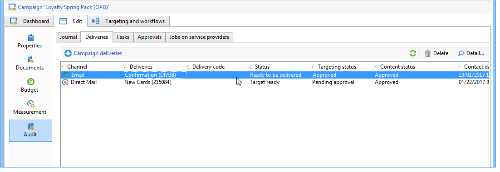

# Approvazione di campagne di marketing {#approving-marketing-campaigns}

## Processo di approvazione {#approval-process}

Ogni fase della consegna può essere sottoposta ad approvazione per garantire il pieno monitoraggio e controllo dei vari processi della campagna: targeting, contenuto, budget, estrazione e invio di una prova.

>[!NOTE]
>
>È necessario verificare che i revisori dispongano dei diritti appropriati per l&#39;approvazione. Verificate inoltre che la relativa area di protezione sia definita correttamente.

Le e-mail di notifica vengono inviate agli operatori Adobe Campaign  designati per essere informati di una richiesta di approvazione.

La procedura di approvazione è presentata in [Controllo e approvazione delle consegne](#checking-and-approving-deliveries).

>[!NOTE]
>
>Solo il proprietario della consegna può avviare una consegna. Affinché un altro operatore (o gruppo di operatori) possa avviare una consegna, è necessario aggiungerlo come revisori nel campo **[!UICONTROL Delivery start:]**.\
>Consultare anche [Selezione di revisori](#selecting-reviewers).

### Principio di funzionamento {#operating-principle-}

Ad esempio, l&#39;e-mail standard per l&#39;approvazione del budget sarà la seguente:

Gli operatori del revisore possono quindi scegliere se approvare o meno il passaggio in questione.

Una volta che l&#39;operatore approva la scelta, l&#39;approvazione o il rifiuto del processo viene inoltrato al dashboard di distribuzione.

Le informazioni sono disponibili anche nei registri di approvazione della campagna (accessibile tramite la scheda **[!UICONTROL Edit > Tracking > Approvals]**):

Tali notifiche vengono inviate agli operatori interessati a ogni processo per il quale è stata abilitata l&#39;approvazione.

Le approvazioni possono essere abilitate per il modello di campagna, per ogni campagna singolarmente o per una consegna.

Tutti i processi che richiedono l&#39;approvazione sono selezionati nel modello di campagna ( **[!UICONTROL Properties]** > **[!UICONTROL Advanced campaign settings...]** > **[!UICONTROL Approvals]** scheda), così come gli operatori che hanno il compito di approvare (riceveranno le notifiche, a meno che questa opzione non sia attivata). Per ulteriori informazioni, fare riferimento a [Processi di approvazione](#approving-processes).

Queste impostazioni possono essere sostituite per ogni campagna creata utilizzando questo modello e singolarmente per ogni distribuzione della campagna: fare clic sul pulsante **[!UICONTROL Properties]**, quindi sulla scheda **[!UICONTROL Approvals]**.

Nell&#39;esempio seguente, il contenuto di distribuzione non richiederà approvazioni:

### Selezione di revisori {#selecting-reviewers}

Per ciascun tipo di omologazione, gli operatori o i gruppi di operatori incaricati dell&#39;omologazione sono selezionati dall&#39;elenco a discesa nella consegna. È possibile aggiungere altri operatori utilizzando il collegamento **[!UICONTROL Edit...]**. Questa finestra consente inoltre di modificare la scadenza dell’approvazione.

Se non viene specificato alcun revisore, il manager della campagna sarà responsabile dell&#39;approvazione e riceverà le notifiche. Il manager della campagna è specificato nella scheda **[!UICONTROL Edit > Properties]** della campagna:

>[!NOTE]
>
>Anche tutti gli altri operatori Adobe Campaign  con diritti **[!UICONTROL Administrator]** possono approvare i processi, ma non riceveranno notifiche.\
>Per impostazione predefinita, il manager campagna non può eseguire l&#39;approvazione o avviare le consegne se gli operatori di approvazione sono stati definiti. Potete modificare questo comportamento e autorizzare il manager campagna ad approvare/avviare le consegne creando l&#39;opzione **NmsCampaign_Activate_OwnerConfirm** con **1** come valore.

### Modalità di approvazione {#approval-modes}

#### Approvazione tramite il dashboard {#approval-via-the-dashboard}

Per approvare un processo tramite la console o l’interfaccia Web, fate clic sul collegamento appropriato nel dashboard della campagna. I processi possono essere approvati anche tramite il tracciamento della distribuzione o tramite il dashboard di distribuzione.

Verificate le informazioni da approvare, scegliete se accettare o rifiutare l’approvazione e, se necessario, immettete un commento. Fare clic su **[!UICONTROL Ok]** per salvare.

>[!NOTE]
>
>Se un processo è già stato approvato da un altro operatore, il collegamento di approvazione non è disponibile.

#### Approvazione tramite messaggi di notifica {#approval-via-notification-messages}

Fate clic sul collegamento disponibile nel messaggio di notifica (consultate [Notifiche](#notifications)). Ti verrà chiesto di identificarti, come mostrato di seguito:

Selezionare **[!UICONTROL Accept]** o **[!UICONTROL Reject]** e inserire un commento, se necessario.

Fai clic su **[!UICONTROL Validate]**.

>[!NOTE]
>
>Se durante il processo sono stati generati avvisi, nella notifica viene visualizzato un avviso.

#### Tracciamento approvazione {#approval-tracking}

Le informazioni sono disponibili in diversi punti:

* Nel registro di approvazione della campagna, **[!UICONTROL Approvals]** sottoscheda della scheda **[!UICONTROL Edit > Tracking]**:

   

* Nel registro di distribuzione della campagna, **[!UICONTROL Deliveries]** scheda secondaria della scheda **[!UICONTROL Edit > Tracking]**:

   

* Lo stato di approvazione di ogni consegna può essere visualizzato facendo clic sull&#39;opzione **[!UICONTROL Hide/show log]** della scheda **[!UICONTROL Summary]**.

   

* Queste informazioni sono accessibili anche tramite la scheda **[!UICONTROL Tracking > Approvals]** di ogni consegna:

   

>[!NOTE]
>
>Una volta che un operatore ha approvato o rifiutato un lavoro, gli altri operatori di revisione non possono più agire in seguito all&#39;approvazione.

#### Approvazione automatica e manuale {#automatic-and-manual-approval}

Quando create un flusso di lavoro di targeting, se l&#39;approvazione è automatica (modalità predefinita),  Adobe Campaign visualizza il collegamento di approvazione o invia una notifica non appena è richiesta l&#39;approvazione.

Per scegliere la modalità di approvazione (manuale o automatica), fate clic sulla scheda **[!UICONTROL Edit > Properties]** del modello di campagna o campagna, quindi su **[!UICONTROL Advanced campaign settings...]** e infine sulla scheda **[!UICONTROL Approvals]**.

>[!NOTE]
>
>La modalità di approvazione selezionata verrà applicata a tutte le consegne della campagna.

Quando viene creato un flusso di lavoro di targeting, l&#39;approvazione manuale consente di evitare la creazione di collegamenti di approvazione o l&#39;invio automatico di notifiche. Il dashboard della campagna offre quindi un collegamento **[!UICONTROL Submit targeting for approval]** per avviare manualmente il processo di approvazione.

Un messaggio di conferma consente di autorizzare le approvazioni per i processi selezionati per la consegna.

I pulsanti di approvazione vengono quindi visualizzati nel dashboard della campagna (per questa consegna), nel dashboard di distribuzione e nel tracciamento della consegna. Se le notifiche sono abilitate, saranno inviate in parallelo.

Questo metodo di abilitazione delle approvazioni consente di utilizzare il targeting senza inviare notifiche push ai revisori.

### Notifiche {#notifications}

Le notifiche sono messaggi e-mail specifici inviati ai revisori per informarli che un processo è in attesa di approvazione. Quando l&#39;operatore fa clic sul collegamento nel messaggio, viene visualizzata una pagina di autenticazione e, dopo l&#39;accesso, l&#39;operatore può visualizzare le informazioni e approvare o rifiutare il processo. È inoltre possibile inserire un commento nella finestra di approvazione.

Il contenuto delle e-mail di notifica può essere personalizzato. Vedere [Contenuto notifica](#notification-content).

#### Abilitazione/disabilitazione della notifica {#enabling-disabling-notification}

Per impostazione predefinita, i messaggi di notifica vengono inviati se l’approvazione del processo correlato è abilitata nel modello di campagna, nella campagna o nella consegna. Le notifiche possono tuttavia essere disattivate per autorizzare solo le approvazioni dalla console.

A questo scopo, modificate la finestra di approvazione del modello campagna o campagna ( **[!UICONTROL Edit > Properties]** > **[!UICONTROL Advanced campaign settings...]** > **[!UICONTROL Approvals]** scheda) e selezionate **[!UICONTROL Do not enable notification sending]**.

#### Contenuto notifica {#notification-content}

Il contenuto delle notifiche è definito in un modello specifico: **[!UICONTROL Notification of validations for the marketing campaign]**. Questo modello viene salvato nella cartella **[!UICONTROL Administration > Campaign management > Technical delivery templates]** della struttura di Adobe Campaign .

## Verifica e approvazione delle consegne {#checking-and-approving-deliveries}

 Adobe Campaign consente di impostare i processi di approvazione per le fasi principali della campagna di marketing in modalità collaborativa.

Per le consegne di posta diretta,  gli operatori Adobe Campaign possono visualizzare il file di estrazione prima dell&#39;invio al router, e se necessario possono modificare il formato e riavviare l&#39;estrazione. Vedere [Approvazione di un file di estrazione](#approving-an-extraction-file).

Per ogni campagna puoi approvare la destinazione di consegna, il contenuto (vedere [Approvazione del contenuto](#approving-content)) e i costi.  operatori Adobe Campaign incaricati dell&#39;approvazione possono ricevere notifiche via e-mail e accettare o rifiutare l&#39;approvazione dalla console o tramite una connessione Web. Vedere [Processo di approvazione](#approving-processes).

Una volta completate queste fasi di convalida, la consegna può essere avviata. Vedere [Avvio di una consegna](../../campaign/using/marketing-campaign-deliveries.md#starting-a-delivery).

>[!NOTE]
>
>Per ulteriori informazioni sulle modalità di approvazione e il tracciamento, vedere [Processo di approvazione](#approval-process).

### Approvazione dei processi {#approving-processes}

Le fasi che richiedono l’approvazione vengono visualizzate nel dashboard della campagna (tramite la console dell’interfaccia Web). Vengono inoltre visualizzati nella tabella di tracciamento della consegna e nel dashboard di consegna.

A questo punto, lo stato della campagna è **[!UICONTROL To validate]**.

>[!NOTE]
>
>* Per selezionare i processi che saranno soggetti all&#39;approvazione, modificate il modello della campagna. Per ulteriori informazioni, consultare [Modelli campagna](../../campaign/using/marketing-campaign-templates.md#campaign-templates).
   >
   >
* Consultare anche la sezione relativa al [processo di approvazione](#approval-process).

>[!NOTE]
>
>In un flusso di lavoro di targeting, se si verifica un errore collegato a un problema di configurazione durante la preparazione dei messaggi, nel dashboard viene visualizzato il collegamento **[!UICONTROL Restart message preparation]**. Correggete l&#39;errore e fate clic su questo collegamento per riavviare la preparazione dei messaggi evitando la fase di targeting.

Per ogni consegna nella campagna, potete approvare i seguenti processi:

* **Targeting, contenuti e budget**

   Quando le opzioni **[!UICONTROL Enable target approval]**, **[!UICONTROL Enable content approval]** o **[!UICONTROL Enable budget approval]** sono selezionate nella finestra delle impostazioni di approvazione del processo, i collegamenti pertinenti sono visualizzati nel dashboard della campagna per le consegne interessate.

   >[!NOTE]
   >
   >L&#39;approvazione del budget è disponibile solo se l&#39;approvazione del targeting è abilitata nella finestra delle impostazioni di approvazione. Il collegamento per l&#39;approvazione del budget viene visualizzato solo dopo che la destinazione è stata analizzata. Inoltre, questo collegamento viene visualizzato insieme al collegamento per l&#39;approvazione della destinazione.

   Se nella finestra delle impostazioni di approvazione sono selezionate le opzioni **[!UICONTROL Assign content editing]** o **[!UICONTROL External content approval]**, nel dashboard vengono visualizzati i collegamenti **[!UICONTROL Available content]** e **[!UICONTROL External content approval]**.

   L&#39;approvazione del contenuto consente di accedere alle prove di stampa inviate.

* **Approvazione estrazione (consegna diretta per posta)**

   Se **[!UICONTROL Enable extraction approval]** è selezionato nella finestra delle impostazioni di approvazione, il file estratto deve essere approvato prima che il router possa essere informato.

   Un collegamento **[!UICONTROL Approve content]** è disponibile nel dashboard della campagna come mostrato di seguito:

   

   I file di estrazione possono essere visualizzati in anteprima tramite la casella di approvazione, quindi accettati o rifiutati.

   

   >[!NOTE]
   >
   >L’anteprima del file di estrazione riguarda solo un esempio di dati. L&#39;intero file di output non viene caricato.

* **Approvazione delle consegne associate**

   L&#39;opzione **[!UICONTROL Enable individual approval of each associated delivery]** viene utilizzata per una consegna principale associata alle consegne secondarie. Per impostazione predefinita, questa opzione non è selezionata in modo che sia possibile eseguire un&#39;approvazione globale della consegna principale. Se questa opzione è selezionata, ogni consegna deve essere approvata singolarmente.

   

#### Selezione dei processi da approvare {#choosing-the-processes-to-be-approved}

Le fasi di approvazione sono definite con il modello associato alla campagna. È necessario selezionare gli elementi da approvare dal modello e specificare gli operatori Adobe Campaign  che saranno responsabili di queste approvazioni. Per ulteriori informazioni, consultare [Modelli campagna](../../campaign/using/marketing-campaign-templates.md#campaign-templates).

>[!NOTE]
>
>La configurazione di approvazione per il modello di campagna o campagna verrà applicata a tutte le consegne future collegate a questa campagna. Eventuali modifiche alla configurazione non verranno applicate alle consegne precedenti.

Queste informazioni possono essere sostituite per ogni campagna e consegna.

Per una campagna, fare clic sulla scheda **[!UICONTROL Edit > Properties]**, quindi sul collegamento **[!UICONTROL Advanced campaign settings...]** e infine sulla sottoscheda **[!UICONTROL Approvals]** per accedere alla pagina di configurazione delle approvazioni.

È possibile selezionare e deselezionare i processi per approvare e nominare  operatori Adobe Campaign responsabili dell&#39;approvazione. Può trattarsi di singoli operatori, di un gruppo di operatori o di un elenco di operatori.

Per selezionare un elenco di operatori, fate clic sul collegamento **[!UICONTROL Edit...]** a destra del campo che identifica il primo revisore e aggiungete tutti gli operatori necessari, come illustrato di seguito:

>[!NOTE]
>
>* Se viene definito un elenco di revisori, un processo viene approvato non appena un revisore lo accetta. Il collegamento di approvazione non viene più visualizzato nel dashboard. Quando l&#39;invio di notifiche è abilitato, se un altro revisore fa clic sul collegamento di approvazione nel messaggio di notifica, viene loro notificato che un altro operatore ha già approvato il processo.
>* Potete definire una pianificazione di approvazione per la campagna nella sezione inferiore della finestra di modifica del revisore. Per impostazione predefinita, i revisori dispongono di tre giorni a partire dalla data di invio per approvare un processo. È possibile configurare un promemoria che viene inviato automaticamente agli operatori interessati prima del termine di approvazione.
>* Potete aggiungere promemoria da questa sezione.

>

Per ogni consegna, fate clic sul pulsante **[!UICONTROL Audit]** e sulla scheda **[!UICONTROL Approvals]** per visualizzare e modificare le date di approvazione e i promemoria automatici.

>[!NOTE]
>
>Questa scheda è disponibile dopo l’avvio del processo di approvazione del contenuto.

### Approvazione contenuto {#approving-content}

>[!CAUTION]
>
>Per approvare un contenuto, è obbligatorio eseguire un ciclo di prova. Le prove consentono di approvare la visualizzazione di informazioni, i dati di personalizzazione e verificare che i collegamenti funzionino. Per ulteriori informazioni sulla creazione di una prova e il relativo ciclo di vita, consultare la sezione [Invio di messaggi](../../delivery/using/steps-validating-the-delivery.md#sending-a-proof).
>
>Le funzionalità di approvazione dei contenuti descritte di seguito sono progettate per essere aggiunte alla consegna della prova.

È possibile configurare un ciclo di approvazione dei contenuti. A questo scopo, selezionate l&#39;opzione **[!UICONTROL Enable content approval]** nella finestra delle impostazioni di approvazione. Le fasi principali del ciclo di approvazione dei contenuti sono:

1. Dopo aver creato una nuova distribuzione, il manager campagna fa clic sul collegamento **[!UICONTROL Submit content]** nel dashboard della campagna per avviare il ciclo di approvazione dei contenuti.

   

   >[!NOTE]
   >
   >Se l&#39;opzione **[!UICONTROL Enable the sending of proofs]** (per le consegne tramite e-mail) o l&#39;opzione **[!UICONTROL Enable the sending and approval of proofs]** (per le consegne per corrispondenza diretta) sono state selezionate nella finestra delle impostazioni di approvazione, le prove verranno inviate automaticamente.

1. Un messaggio e-mail di notifica viene inviato alla persona responsabile del contenuto, che può scegliere se approvarlo o meno:

   * tramite il messaggio e-mail di notifica:

      

      >[!NOTE]
      >
      >L&#39;e-mail di notifica contiene un collegamento alle prove di validità già inviate ed eventualmente un rendering del messaggio per le varie e-mail Web se l&#39;opzione **Condizione** è abilitata per questa istanza.

   * tramite la console o l’interfaccia Web, il tracciamento della distribuzione, il dashboard di distribuzione o il dashboard della campagna:

      

      >[!NOTE]
      >
      >Questa dashboard della campagna consente di visualizzare l&#39;elenco delle prove che sono state inviate, facendo clic sul collegamento **[!UICONTROL Inbox rendering...]**. Per visualizzarne il contenuto, fate clic sull&#39;icona **[!UICONTROL Detail]** a destra dell&#39;elenco.

      

1. Viene inviato un messaggio e-mail di notifica alla persona responsabile della campagna in cui viene indicato se il contenuto è stato approvato o meno.

   >[!NOTE]
   >
   >Il responsabile della campagna può riavviare il ciclo di approvazione dei contenuti in qualsiasi momento. A questo scopo, fate clic sul collegamento sulla riga **[!UICONTROL Content status]** del dashboard della campagna (a livello di consegna), quindi fate clic su **[!UICONTROL Reset content approval to submit it again]**.

   

#### Assegnare la modifica del contenuto {#assign-content-editing}

Questa opzione consente di definire un utente responsabile della modifica del contenuto, ad esempio un webmaster. Se l&#39;opzione **[!UICONTROL Assign content editing]** è selezionata nella finestra delle impostazioni di approvazione, vengono aggiunti diversi passaggi di approvazione tra la creazione della consegna e la consegna dell&#39;e-mail di notifica alla persona responsabile del contenuto:

1. Dopo aver creato una nuova consegna, la persona responsabile della campagna fa clic sul collegamento **[!UICONTROL Submit content editing]** nel dashboard della campagna per avviare il ciclo di modifica dei contenuti.

   

1. Il responsabile della modifica dei contenuti riceverà un messaggio e-mail in cui informa che il contenuto è disponibile.

   

1. Possono quindi accedere alla console, aprire la distribuzione e modificarla utilizzando una procedura guidata semplificata per modificare l’oggetto, il contenuto HTML e di testo e inviare le prove di stampa.

   

   >[!NOTE]
   >
   >Se l&#39;opzione **[!UICONTROL Enable the sending of proofs]** (per le consegne tramite e-mail) o l&#39;opzione **[!UICONTROL Enable the sending and approval of proofs]** (per le consegne per corrispondenza diretta) sono state selezionate nella finestra delle impostazioni di approvazione, le prove verranno inviate automaticamente.

1. Una volta che il responsabile della modifica dei contenuti ha terminato di apportare modifiche ai contenuti da distribuire, può rendere disponibili i contenuti.

   A tal fine, possono:

   * fate clic sul collegamento **[!UICONTROL Available content]** tramite la console Adobe Campaign .

      

   * fai clic sul collegamento nel messaggio di notifica, quindi approva la disponibilità del contenuto.

      

      L&#39;operatore può aggiungere un commento prima di inviare il contenuto alla persona responsabile della campagna.

      

      Il messaggio di notifica consente al revisore di approvare o rifiutare il contenuto.

      

#### Approvazione contenuto esterno {#external-content-approval}

Questa opzione consente di definire un operatore esterno incaricato di approvare il rendering della distribuzione, ad esempio la coerenza della comunicazione del marchio, le tariffe, ecc. Quando l&#39;opzione **[!UICONTROL External content approval]** è selezionata nella finestra delle impostazioni di approvazione, tra l&#39;approvazione del contenuto e la consegna della notifica alla persona responsabile della campagna vengono aggiunti diversi passaggi di approvazione:

1. Il manager del contenuto esterno riceve un messaggio e-mail di notifica in cui informa che il contenuto è stato approvato e richiede l’approvazione esterna.
1. Il messaggio e-mail di notifica contiene collegamenti alle prove di stampa inviate, che consentono di visualizzare il rendering della consegna, e un pulsante per approvare o rifiutare il contenuto della consegna.

   >[!NOTE]
   >
   >Questi collegamenti sono disponibili solo se sono state inviate una o più prove di stampa. In caso contrario, il rendering della distribuzione è disponibile solo tramite la console o l&#39;interfaccia Web.

   

### Approvazione di un file di estrazione {#approving-an-extraction-file}

Per le consegne offline,  Adobe Campaign genera un file di estrazione che, a seconda della configurazione, viene inviato al router. Il relativo contenuto dipende dal modello di esportazione utilizzato.

Quando il contenuto, il targeting e il budget sono stati approvati, la distribuzione viene modificata in **[!UICONTROL Extraction pending]** fino all&#39;avvio del flusso di lavoro di estrazione per le campagne.

Alla data della richiesta di estrazione, il file di estrazione viene creato e lo stato di consegna cambia in **[!UICONTROL File to approve]**.

Potete visualizzare il contenuto del file estratto (facendo clic sul suo nome), approvarlo o, se necessario, modificarne il formato e riavviare l&#39;estrazione utilizzando i collegamenti nel dashboard.

Una volta che il file è stato approvato, è possibile inviare l&#39;e-mail di notifica al router. Per ulteriori informazioni, vedere [Avvio di una distribuzione offline](../../campaign/using/marketing-campaign-deliveries.md#starting-an-offline-delivery).
