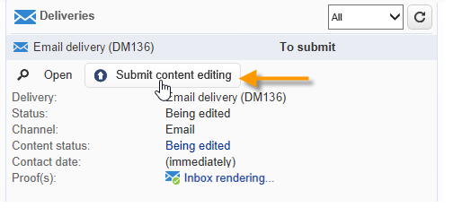
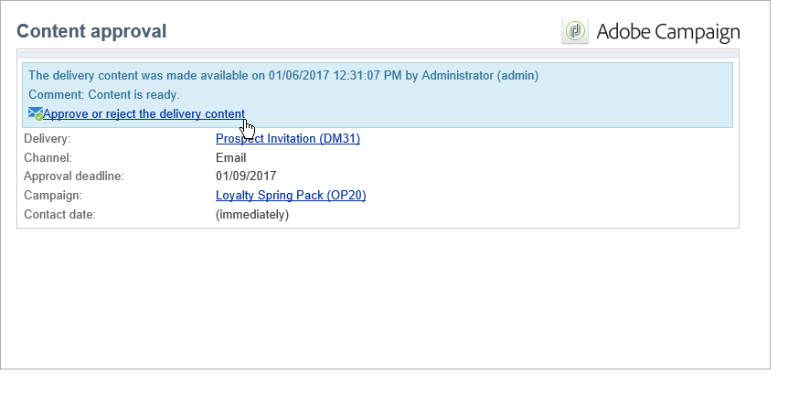

# Impostare e gestire il processo di approvazione {#approving-marketing-campaigns}

Ogni fase della consegna può essere soggetta ad approvazione per garantire il pieno monitoraggio e controllo dei vari processi della campagna: targeting, contenuto, budget, estrazione e invio di una bozza.

I messaggi di notifica vengono inviati agli operatori Adobe Campaign che sono revisori designati per informarli di una richiesta di approvazione. Controlla che i revisori abbiano **autorizzazioni appropriate** per l’approvazione e che la relativa zona di sicurezza sia definita correttamente. [Ulteriori informazioni](#selecting-reviewers).

La procedura di approvazione è presentata in [questa sezione](#checking-and-approving-deliveries).

>[!NOTE]
>
>Solo il proprietario della consegna può avviare una consegna. Affinché un altro operatore (o gruppo di operatori) sia in grado di avviare una consegna, devi aggiungerli come revisori nel **[!UICONTROL Delivery start:]** campo .\
>[Ulteriori informazioni](#selecting-reviewers).

## Principio di funzionamento {#operating-principle-}

Ad esempio, il messaggio standard per l&#39;approvazione del budget è il seguente:

Gli operatori del revisore possono quindi scegliere se approvare o meno il budget.

Una volta convalidata l’operatore, l’approvazione o il rifiuto del processo viene inoltrato al dashboard di consegna.

Le informazioni sono disponibili anche nei registri di approvazione della campagna.Tali registri sono accessibili tramite il **[!UICONTROL Edit > Tracking > Approvals]** scheda .

Tali notifiche vengono inviate agli operatori interessati a ciascun processo per il quale è stata abilitata l’approvazione.

Le approvazioni possono essere abilitate per il modello di campagna, per ogni campagna singolarmente o per una consegna.

Tutti i processi che richiedono l’approvazione vengono selezionati nel modello della campagna ( **[!UICONTROL Properties]** > **[!UICONTROL Advanced campaign settings...]** > **[!UICONTROL Approvals]** , così come gli operatori incaricati dell’approvazione (riceveranno notifiche, a meno che questa opzione non sia abilitata). Per ulteriori informazioni al riguardo, consulta [questa sezione](#approving-processes).

Queste impostazioni possono essere sostituite per ogni campagna creata utilizzando questo modello e singolarmente per ogni consegna della campagna: fai clic su **[!UICONTROL Properties]** quindi il pulsante **[!UICONTROL Approvals]** scheda .

Nell’esempio seguente, il contenuto di consegna non richiederà approvazioni:

## Seleziona revisori {#selecting-reviewers}

Per ciascun tipo di omologazione, gli operatori o i gruppi di operatori incaricati dell’omologazione sono selezionati dall’elenco a discesa nella consegna. È possibile aggiungere altri operatori utilizzando **[!UICONTROL Edit...]** link. Questa finestra consente inoltre di modificare la scadenza dell&#39;approvazione.

Se non viene specificato alcun revisore, il responsabile della campagna sarà responsabile dell’approvazione e riceverà le notifiche. Il manager della campagna è specificato nel **[!UICONTROL Edit > Properties]** scheda della campagna:

>[!NOTE]
>
>Tutti gli altri operatori Adobe Campaign con **[!UICONTROL Administrator]** I diritti possono anche approvare i lavori, ma non riceveranno notifiche.\
>Per impostazione predefinita, il gestore della campagna non può eseguire l’approvazione o avviare le consegne se sono stati definiti operatori di approvazione. Puoi modificare questo comportamento e autorizzare campaign manager ad approvare/avviare le consegne creando la variabile **NmsCampaign_Activate_OwnerConfirmation** opzione con **1** come valore.

## Modalità di approvazione {#approval-modes}

### Approvazione tramite dashboard {#approval-via-the-dashboard}

Per approvare un processo tramite la console o l’interfaccia Web, fai clic sul collegamento appropriato nel dashboard della campagna. I processi possono essere approvati anche tramite il tracciamento della consegna o tramite il dashboard di consegna.

Controllare le informazioni da approvare, scegliere se accettare o rifiutare l&#39;approvazione e, se necessario, inserire un commento. Fai clic su **[!UICONTROL Ok]** da salvare.

>[!NOTE]
>
>Se un processo è già stato approvato da un altro operatore, il collegamento di approvazione non è disponibile.

### Approvazione tramite messaggi di notifica {#approval-via-notification-messages}

Fai clic sul collegamento disponibile nel messaggio di notifica (vedi [Notifiche](#notifications)). Devi effettuare l’accesso, come illustrato di seguito:

Seleziona **[!UICONTROL Accept]** o **[!UICONTROL Reject]** e, se necessario, inserisci un commento.

Fai clic su **[!UICONTROL Validate]**.

>[!NOTE]
>
>Se durante il processo sono stati generati avvisi, nella notifica viene visualizzato un avviso.

### Tracking di approvazione {#approval-tracking}

Le informazioni sono disponibili in diversi punti:

* Nel registro di approvazione della campagna, **[!UICONTROL Approvals]** sottoscheda della **[!UICONTROL Edit > Tracking]** scheda:

   

* Nel registro di consegna della campagna, **[!UICONTROL Deliveries]** sottoscheda della **[!UICONTROL Edit > Tracking]** scheda:

   

* Lo stato di approvazione per ogni consegna può essere visualizzato facendo clic sul pulsante **[!UICONTROL Hide/show log]** opzione **[!UICONTROL Summary]** scheda .

   

* Queste informazioni sono accessibili anche tramite il **[!UICONTROL Tracking > Approvals]** scheda di ogni consegna:

   

>[!NOTE]
>
>Una volta che un operatore ha approvato o rifiutato un lavoro, gli altri operatori di revisione non possono più agire in base all&#39;approvazione.

### Approvazione automatica e manuale {#automatic-and-manual-approval}

Quando crei un flusso di lavoro di targeting, se l’approvazione è automatica (modalità predefinita), Adobe Campaign visualizza il collegamento di approvazione o invia una notifica non appena è richiesta un’approvazione.

Per scegliere la modalità di approvazione (manuale o automatica), fare clic sul pulsante **[!UICONTROL Edit > Properties]** scheda del modello di campagna o campagna, quindi fai clic su **[!UICONTROL Advanced campaign settings...]** e infine **[!UICONTROL Approvals]** scheda .

>[!NOTE]
>
>La modalità di approvazione selezionata verrà applicata a tutte le consegne della campagna.

Quando viene generato un flusso di lavoro di targeting, l’approvazione manuale consente di evitare la creazione di collegamenti di approvazione o l’invio automatico di notifiche. Il dashboard della campagna offre quindi un **[!UICONTROL Submit targeting for approval]** per avviare manualmente il processo di approvazione.

Un messaggio di conferma ti consente di autorizzare le approvazioni sui processi selezionati per questa consegna.

I pulsanti di approvazione vengono quindi visualizzati sul dashboard della campagna (per questa consegna), sul dashboard di consegna e nel tracciamento della consegna. Se le notifiche sono abilitate, verranno inviate in parallelo.

Questo metodo di abilitazione delle approvazioni consente di utilizzare il targeting senza inviare notifiche spurie ai revisori.

## Notifiche {#notifications}

Le notifiche sono messaggi e-mail specifici inviati ai revisori per informarli che un processo è in attesa di approvazione. Quando l’operatore fa clic sul collegamento nel messaggio, viene visualizzata una pagina di autenticazione e, dopo l’accesso, l’operatore può visualizzare le informazioni e approvare o rifiutare il processo. È inoltre possibile inserire un commento nella finestra di approvazione.

Il contenuto delle e-mail di notifica può essere personalizzato. Vedi [Contenuto della notifica](#notification-content).

### Attiva/Disattiva notifica {#enabling-disabling-notification}

Per impostazione predefinita, i messaggi di notifica vengono inviati se l’approvazione del processo correlato è abilitata nel modello di campagna, nella campagna o nella consegna. Tuttavia, le notifiche possono essere disattivate per autorizzare solo le approvazioni dalla console.

A questo scopo, modifica la finestra di approvazione della campagna o del modello di campagna ( **[!UICONTROL Edit > Properties]** > **[!UICONTROL Advanced campaign settings...]** > **[!UICONTROL Approvals]** e seleziona **[!UICONTROL Do not enable notification sending]**.

### Contenuto della notifica {#notification-content}

Il contenuto delle notifiche è definito in un modello specifico: **[!UICONTROL Notification of validations for the marketing campaign]**. Questo modello viene salvato nella **[!UICONTROL Administration > Campaign management > Technical delivery templates]** della struttura Adobe Campaign.

## Revisione e approvazione delle consegne {#checking-and-approving-deliveries}

Adobe Campaign consente di impostare processi di approvazione per le fasi principali della campagna di marketing in modalità collaborativa.

Per le consegne di direct mailing, gli operatori Adobe Campaign possono visualizzare il file di estrazione prima che venga inviato al router e, se necessario, possono modificare il formato e riavviare l’estrazione. Vedi [Approvare un file di estrazione](#approving-an-extraction-file).

Per ogni campagna puoi approvare il target di consegna, il contenuto (vedi [Approvare il contenuto](#approving-content)) e i costi. Gli operatori di Adobe Campaign incaricati dell’approvazione possono ricevere una notifica tramite e-mail e accettare o rifiutare l’approvazione dalla console o tramite una connessione web. Vedi [Passaggi per approvare una consegna](#approving-processes).

Una volta completate queste fasi di convalida, è possibile avviare la consegna. [Ulteriori informazioni](../../campaign/using/marketing-campaign-deliveries.md#starting-a-delivery).

### Passaggi per approvare una consegna {#approving-processes}

Le fasi che richiedono l’approvazione vengono visualizzate nel dashboard della campagna (tramite la console dell’interfaccia web). Vengono inoltre visualizzati nella tabella di tracciamento della consegna e nel dashboard di consegna.

A questo punto, lo stato della campagna è **[!UICONTROL To validate]**.

>[!NOTE]
>
>Per selezionare i processi che richiedono un’approvazione, modifica il modello della campagna. Per ulteriori informazioni, consulta [Modelli di campagna](../../campaign/using/marketing-campaign-templates.md#campaign-templates).

>[!NOTE]
>
>In un flusso di lavoro di targeting, se si verifica un errore collegato a un problema di configurazione durante la preparazione dei messaggi, il **[!UICONTROL Restart message preparation]** il collegamento viene visualizzato sul dashboard. Correggi l’errore e fai clic su questo collegamento per riavviare la preparazione dei messaggi ignorando la fase di targeting.

Per ogni consegna nella campagna, puoi approvare i seguenti processi:

* **Targeting, contenuto e budget**

   Quando il **[!UICONTROL Enable target approval]**, **[!UICONTROL Enable content approval]** o **[!UICONTROL Enable budget approval]** le opzioni vengono selezionate nella finestra delle impostazioni di approvazione dei processi. I collegamenti rilevanti vengono visualizzati nel dashboard della campagna per le consegne interessate.

   >[!NOTE]
   >
   >L&#39;approvazione del budget è disponibile solo se l&#39;approvazione del targeting è abilitata nella finestra delle impostazioni di approvazione. Il collegamento per l&#39;approvazione del budget viene visualizzato solo dopo l&#39;analisi del target. Inoltre, questo collegamento viene visualizzato insieme al collegamento per l’approvazione di destinazione.

   Se la **[!UICONTROL Assign content editing]** o **[!UICONTROL External content approval]** le opzioni sono selezionate nella finestra delle impostazioni di approvazione, il dashboard mostrerà **[!UICONTROL Available content]** e **[!UICONTROL External content approval]** link.

   L’approvazione del contenuto ti consente di accedere alle bozze inviate.

* **Approvazione estrazione (consegna direct mailing)**

   Quando **[!UICONTROL Enable extraction approval]** è selezionato nella finestra delle impostazioni di approvazione, il file estratto deve essere approvato prima che il router possa essere notificato.

   Un **[!UICONTROL Approve content]** Il collegamento è disponibile nel dashboard della campagna come mostrato di seguito:

   

   I file di estrazione possono essere visualizzati in anteprima tramite la casella di approvazione e quindi accettati o rifiutati.

   

   >[!NOTE]
   >
   >L’anteprima del file di estrazione riguarda solo un campione di dati. L&#39;intero file di output non viene caricato.

* **Approvazione delle consegne associate**

   La **[!UICONTROL Enable individual approval of each associated delivery]** viene utilizzata per una consegna principale associata alle consegne secondarie. Per impostazione predefinita, questa opzione non è selezionata in modo da poter eseguire un&#39;approvazione globale della consegna principale. Se questa opzione è selezionata, ogni consegna deve essere approvata singolarmente.

   

### Seleziona processi approvati {#choosing-the-processes-to-be-approved}

Le fasi di approvazione sono definite con il modello associato alla campagna. Devi selezionare gli elementi da approvare dal modello e specificare gli operatori Adobe Campaign responsabili di queste approvazioni. Per ulteriori informazioni sui modelli di campagna, consulta [questa sezione](../../campaign/using/marketing-campaign-templates.md#campaign-templates).

>[!NOTE]
>
>La configurazione di approvazione per la campagna (o modello di campagna) si applica a tutte le consegne future collegate a questa campagna. Eventuali modifiche di configurazione non verranno applicate alle consegne precedenti.

Queste informazioni possono essere ignorate per ogni campagna e consegna.

Per una campagna, fai clic sul pulsante **[!UICONTROL Edit > Properties]** , quindi la **[!UICONTROL Advanced campaign settings...]** e infine il **[!UICONTROL Approvals]** scheda secondaria per accedere alla pagina di configurazione delle approvazioni.

Puoi selezionare e deselezionare i processi per approvare e nominare gli operatori Adobe Campaign responsabili dell’approvazione. Possono essere singoli operatori, un gruppo di operatori o un elenco di operatori.

Per selezionare un elenco di operatori, fai clic sul pulsante **[!UICONTROL Edit...]** link a destra del campo che designa il primo revisore e aggiungi tutti gli operatori necessari, come mostrato di seguito:

>[!NOTE]
>
>* Se viene definito un elenco di revisori, un processo viene approvato quando un revisore lo accetta. Il collegamento di approvazione pertinente non viene quindi più offerto nel dashboard. Quando l’invio di notifiche è abilitato, se un altro revisore fa clic sul collegamento di approvazione nel messaggio di notifica, viene informato che un altro operatore ha già approvato il processo.
>* È possibile definire una pianificazione di approvazione per la campagna nella sezione inferiore della finestra di modifica del revisore. Per impostazione predefinita, i revisori dispongono di tre giorni a partire dalla data di invio per approvare un processo. È possibile configurare un promemoria che viene inviato automaticamente agli operatori interessati prima del termine di approvazione.
>* Puoi aggiungere promemoria da questa sezione.
>

Per ogni consegna, fai clic sul pulsante **[!UICONTROL Audit]** e **[!UICONTROL Approvals]** per visualizzare e modificare le date di approvazione e i promemoria automatici.

>[!NOTE]
>
>Questa scheda è disponibile dopo l’avvio del processo di approvazione del contenuto.

### Approvare un contenuto {#approving-content}

>[!CAUTION]
>
>Per approvare un contenuto, è obbligatorio un ciclo di prova. Le bozze consentono di approvare la visualizzazione di informazioni, dati di personalizzazione e verificare che i collegamenti funzionino. Scopri come creare una bozza in [questa sezione](../../delivery/using/steps-validating-the-delivery.md#sending-a-proof).
>
>Le funzionalità di approvazione dei contenuti descritte di seguito si riferiscono alla consegna delle prove.

È possibile configurare un ciclo di approvazione dei contenuti. A questo scopo, seleziona la **[!UICONTROL Enable content approval]** nella finestra delle impostazioni di approvazione. Le fasi principali del ciclo di approvazione dei contenuti sono:

1. Dopo aver creato una nuova consegna, il gestore della campagna fa clic su **[!UICONTROL Submit content]** link nel dashboard della campagna per avviare il ciclo di approvazione dei contenuti.

   

   >[!NOTE]
   >
   >Se la **[!UICONTROL Enable the sending of proofs]** (per le consegne e-mail) o **[!UICONTROL Enable the sending and approval of proofs]** (per le consegne di direct mailing) le opzioni selezionate nella finestra delle impostazioni di approvazione vengono inviate automaticamente le bozze.

1. Viene inviata un’e-mail di notifica alla persona responsabile del contenuto, che può scegliere se approvarla o meno:

   * tramite e-mail di notifica:

      

      >[!NOTE]
      >
      >L’e-mail di notifica contiene un collegamento alle bozze già inviate e, possibilmente, a un rendering del messaggio per le varie e-mail web se la **Consegna** è abilitata per questa istanza.

   * tramite la console o l’interfaccia web, il tracciamento della consegna, il dashboard di consegna o il dashboard della campagna:

      

      >[!NOTE]
      >
      >Questo dashboard della campagna consente di visualizzare l’elenco delle bozze inviate, facendo clic sul pulsante **[!UICONTROL Inbox rendering...]** link. Per visualizzarne il contenuto, fai clic sul pulsante **[!UICONTROL Detail]** a destra dell’elenco.

      

1. Viene inviata un’e-mail di notifica alla persona responsabile della campagna per informarla dell’approvazione o meno del contenuto.

   >[!NOTE]
   >
   >Il responsabile della campagna può riavviare il ciclo di approvazione dei contenuti in qualsiasi momento. A questo scopo, fai clic sul collegamento nel **[!UICONTROL Content status]** linea del dashboard della campagna (a livello di consegna), quindi fai clic su **[!UICONTROL Reset content approval to submit it again]**.

   

#### Assegnare la modifica del contenuto {#assign-content-editing}

Questa opzione ti consente di definire un utente responsabile della modifica dei contenuti, ad esempio un webmaster. Se la **[!UICONTROL Assign content editing]** nella finestra delle impostazioni di approvazione viene selezionata l’opzione , vengono aggiunti diversi passaggi di approvazione tra la creazione della consegna e la consegna dell’e-mail di notifica alla persona responsabile del contenuto:

1. Dopo aver creato una nuova consegna, la persona responsabile della campagna fa clic sul pulsante **[!UICONTROL Submit content editing]** nel dashboard della campagna per avviare il ciclo di modifica dei contenuti.

   

1. Il responsabile della modifica dei contenuti riceverà un’e-mail in cui informa che il contenuto è disponibile.

   

1. Possono quindi accedere alla console, aprire la consegna e modificarla utilizzando una procedura guidata semplificata per modificare l’oggetto, HTML e il contenuto del testo e inviare bozze.

   

   >[!NOTE]
   >
   >Se la **[!UICONTROL Enable the sending of proofs]** (per le consegne e-mail) o **[!UICONTROL Enable the sending and approval of proofs]** (per le consegne di direct mailing) le opzioni selezionate nella finestra delle impostazioni di approvazione vengono inviate automaticamente le bozze.

1. Una volta che il responsabile della modifica dei contenuti ha terminato di apportare modifiche al contenuto della consegna, può rendere disponibile il contenuto.

   A questo scopo, possono:

   * fai clic su **[!UICONTROL Available content]** tramite la console Adobe Campaign.

      

   * fai clic sul collegamento nel messaggio di notifica, quindi approva la disponibilità del contenuto.

      

      L’operatore può aggiungere un commento prima di inviare il contenuto alla persona responsabile della campagna.

      

      Il messaggio di notifica consente al revisore di approvare o rifiutare il contenuto.

      

#### Approvazione dei contenuti esterni {#external-content-approval}

Questa opzione ti consente di definire un operatore esterno incaricato di approvare il rendering della consegna, ad esempio la coerenza della comunicazione del brand, i tassi, ecc. Quando il **[!UICONTROL External content approval]** nella finestra delle impostazioni di approvazione viene selezionata l’opzione , vengono aggiunti diversi passaggi di approvazione tra l’approvazione del contenuto e la consegna della notifica alla persona responsabile della campagna:

1. Il gestore dei contenuti esterni riceve un messaggio e-mail di notifica in cui viene indicato che il contenuto è stato approvato e richiede l’approvazione esterna.
1. L’e-mail di notifica contiene collegamenti alle bozze inviate, che consentono di visualizzare il rendering della consegna, e un pulsante per approvare o rifiutare il contenuto della consegna.

   >[!NOTE]
   >
   >Questi collegamenti sono disponibili solo se sono state inviate una o più bozze. In caso contrario, il rendering della consegna è disponibile solo tramite la console o l’interfaccia web.

   

### Approvare un file di estrazione {#approving-an-extraction-file}

Per le consegne offline, Adobe Campaign genera un file di estrazione che, a seconda della configurazione, viene inviato al router. Il relativo contenuto dipende dal modello di esportazione utilizzato.

Quando il contenuto, il targeting e il budget sono stati approvati, la consegna cambia in **[!UICONTROL Extraction pending]** fino all’avvio del flusso di lavoro di estrazione per le campagne.

Alla data della richiesta di estrazione, il file di estrazione viene creato e lo stato di consegna cambia in **[!UICONTROL File to approve]**.

Puoi visualizzare il contenuto del file estratto (facendo clic sul suo nome), approvarlo o, se necessario, modificarne il formato e riavviare l’estrazione utilizzando i collegamenti presenti nel dashboard.

Una volta approvato il file, è possibile inviare l&#39;e-mail di notifica al router. Per ulteriori informazioni, consulta [Avviare una consegna offline](../../campaign/using/marketing-campaign-deliveries.md#starting-an-offline-delivery).
