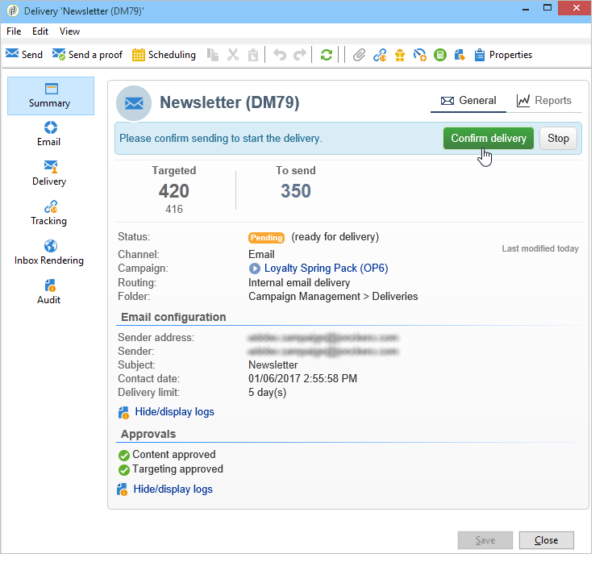

# Consegne di campagne di marketing {#marketing-campaign-deliveries}

Le consegne possono essere create tramite il dashboard della campagna, un flusso di lavoro della campagna o direttamente tramite la panoramica delle consegne.

Quando vengono create da una campagna, le consegne verranno collegate a questa campagna e consolidate a livello di campagna.

 [Scopri questa funzione nel video](#create-email-video)

## Creare consegne {#creating-deliveries}

Per creare una consegna collegata a una campagna, fai clic sul collegamento **[!UICONTROL Add a delivery]** nel dashboard della campagna.

Le configurazioni suggerite sono adatte ai diversi tipi di consegna: direct mailing, e-mail, canali mobili. Ulteriori informazioni sono disponibili nella [documentazione di Campaign v8](https://experienceleague.adobe.com/docs/campaign/campaign-v8/send/create-message.html){target="_blank"}.

## Avviare una consegna {#starting-a-delivery}

Una volta concesse tutte le approvazioni, la consegna è pronta per essere avviata. La procedura di consegna dipende quindi dal tipo di consegna. Per le consegne tramite e-mail o canale mobile, vedi [Avvio di una consegna online](#starting-an-online-delivery), mentre per le consegne tramite direct mailing vedi [Avvio di una consegna offline](#starting-an-offline-delivery).

### Avviare una consegna online {#starting-an-online-delivery}

Dopo aver concesso tutte le richieste di approvazione, lo stato di consegna cambia in **[!UICONTROL Pending confirmation]** e può essere avviato da un operatore. Se del caso, l’operatore Adobe Campaign (o il gruppo di operatori) designato come revisore per avviare la consegna riceve una notifica che la consegna è pronta per essere avviata.

>[!NOTE]
>
>Se un operatore o un gruppo di operatori specifico è designato per avviare una consegna nelle proprietà della consegna, puoi anche consentire all’operatore responsabile della consegna di confermare l’invio. Per eseguire questa operazione, attivare l&#39;opzione **NMS_ActivateOwnerConfirmation** immettendo **1** come valore. Le opzioni sono gestite dal nodo **[!UICONTROL Administration]** > **[!UICONTROL Platform]** > **[!UICONTROL Options]** in Adobe Campaign Explorer.
>  
>Per disattivare questa opzione, immettere **0** come valore. Il processo di conferma dell’invio funzionerà quindi come predefinito: solo l’operatore o il gruppo di operatori designati per l’invio nelle proprietà di consegna (o un amministratore) sarà in grado di confermare ed eseguire l’invio.

Le informazioni vengono visualizzate anche nel dashboard della campagna. Il collegamento **[!UICONTROL Confirm delivery]** ti consente di avviare la consegna.

Un messaggio di conferma ti consente di proteggere questa azione.

### Avviare una consegna offline {#starting-an-offline-delivery}

Dopo aver concesso tutte le approvazioni, lo stato di consegna cambia in **[!UICONTROL Pending extraction]**. I file di estrazione vengono creati tramite un flusso di lavoro speciale che, in una configurazione predefinita, viene avviato automaticamente quando una consegna direct mailing è in attesa di estrazione. Quando un processo è in corso, viene visualizzato nel dashboard e può essere modificato tramite il relativo collegamento.

>[!NOTE]
>
>I flussi di lavoro tecnici relativi al pacchetto Campaign sono presentati in [Elenco dei flussi di lavoro tecnici](../../workflow/using/about-technical-workflows.md).

**Passaggio 1 - Approvazione file**

Una volta eseguito correttamente il flusso di lavoro di estrazione, il file di estrazione deve essere approvato (a condizione che l’approvazione del file di estrazione sia stata selezionata nelle impostazioni di consegna).

Per ulteriori informazioni, consulta [Approvare un file di estrazione](../../campaign/using/marketing-campaign-approval.md#approving-an-extraction-file).

**Passaggio 2 - Approvazione del messaggio per il provider di servizi**

* Una volta approvato il file di estrazione, puoi generare la bozza dell’e-mail di notifica del router. Questo messaggio e-mail è costruito in base a un modello di consegna. Deve essere approvato.

  >[!NOTE]
  >
  >Questo passaggio è disponibile solo se l’invio e l’approvazione delle bozze sono stati abilitati nella finestra approvazioni.

* Fare clic sul pulsante **[!UICONTROL Send a proof]** per creare le bozze.

  Il target della bozza deve essere definito in anticipo.

  Puoi creare tutte le bozze necessarie. Sono accessibili tramite il collegamento **[!UICONTROL Direct mail...]** dei dettagli di consegna.

  

* Lo stato della consegna cambia in **[!UICONTROL To submit]**. Fare clic sul pulsante **[!UICONTROL Submit proofs]** per avviare il processo di approvazione.

  

* Lo stato della consegna cambia in **[!UICONTROL Proof to validate]** e un pulsante consente di accettare o rifiutare l&#39;approvazione.

  

  Puoi accettare o rifiutare questa approvazione oppure tornare al passaggio di estrazione.

  

* Il file di estrazione viene inviato al router e la consegna è terminata.

### Calcolo dei costi e delle scorte {#calculation-of-costs-and-stocks}

L&#39;estrazione del file avvia due operazioni: il calcolo del budget e il calcolo delle scorte. Le voci di budget vengono aggiornate.

* La scheda **[!UICONTROL Budget]** consente di gestire i budget per la campagna. Il totale delle voci di costo è visualizzato nel campo **[!UICONTROL Calculates cost]** della scheda principale della campagna e nel programma a cui appartiene. Gli importi sono riportati anche nel bilancio della campagna.

  Il costo reale verrà calcolato in base alle informazioni fornite dal router. Solo i messaggi effettivamente inviati vengono fatturati.

* Le scorte sono definite nel nodo **[!UICONTROL Administration > Campaign management > Stocks]** della struttura e le strutture dei costi nel nodo **[!UICONTROL Administration > Campaign management > Service providers]**.

  Le linee del grezzo sono visibili nella sezione del grezzo. Per definire il materiale iniziale, aprire una linea del materiale. Le scorte vengono diminuite ogni volta che si verifica una consegna. Puoi definire un livello di avviso e le notifiche.

>[!NOTE]
>
>Per ulteriori informazioni sui calcoli dei costi e sulla gestione delle scorte, vedere [Provider, scorte e budget](../../campaign/using/providers-stocks-and-budgets.md).

## Gestire i documenti associati {#managing-associated-documents}

È possibile associare vari documenti a una campagna: rapporti, foto, pagina web, diagramma, ecc. Questi documenti possono essere in qualsiasi formato (Microsoft Word, PowerPoint, PNG, JPG, Acrobat PDF, ecc.). Scopri come collegare i documenti a una campagna [in questa sezione](../../campaign/using/marketing-campaign-assets.md).

>[!IMPORTANT]
>
>Questa modalità è riservata ai documenti di piccole dimensioni.

In una campagna puoi anche fare riferimento ad altri articoli, come coupon promozionali, offerte speciali relative a una filiale o a un negozio specifico, ecc. Quando questi elementi sono inclusi in una struttura, possono essere associati a una consegna direct mailing. [Ulteriori informazioni](#associating-and-structuring-resources-linked-via-a-delivery-outline).

>[!NOTE]
>
>Se utilizzi MRM, puoi anche gestire una libreria di risorse di marketing disponibili per diversi partecipanti per il lavoro di collaborazione. Consulta [Gestire le risorse di marketing](../../mrm/using/managing-marketing-resources.md).

### Aggiungi documenti {#adding-documents}

I documenti possono essere associati a livello di campagna (documenti contestuali) o di programma (documenti generali).

La scheda **[!UICONTROL Documents]** contiene:

* L’elenco di tutti i documenti necessari per il contenuto (modello, immagini ecc.) che possono essere scaricati localmente dagli operatori Adobe Campaign con i diritti appropriati,
* Documenti contenenti informazioni per il router, se presenti.

I documenti sono collegati al programma o alla campagna tramite la scheda **[!UICONTROL Edit > Documents]**.

Puoi anche aggiungere un documento a una campagna tramite il collegamento offerto nella dashboard.

Fare clic sull&#39;icona **[!UICONTROL Details]** per visualizzare il contenuto di un file e aggiungere informazioni:

Nel dashboard, i documenti associati alla campagna sono raggruppati nella sezione **[!UICONTROL Document(s)]**, come nell&#39;esempio seguente:

Da questa vista è possibile modificarli.

### Associa e struttura le risorse collegate tramite una struttura di consegna {#associating-and-structuring-resources-linked-via-a-delivery-outline}

>[!NOTE]
>
>I profili di consegna vengono utilizzati esclusivamente nel contesto delle campagne di direct mailing.

Una struttura di consegna indica un set strutturato di elementi (documenti, filiali/negozi, coupon promozionali, ecc.) creati nell’azienda e per una particolare campagna.

Questi elementi sono raggruppati nei profili di consegna e una particolare struttura di consegna verrà associata a una consegna; vi verrà fatto riferimento nel file di estrazione inviato al **service provider** per essere allegato alla consegna. Ad esempio, puoi creare una struttura di consegna che faccia riferimento a un ramo e alle brochure di marketing che utilizza.

Per una campagna, i profili di consegna ti consentono di strutturare elementi esterni da associare alla consegna in base a determinati criteri: ramo correlato, offerta promozionale concessa, invito a un evento locale, ecc.

#### Creare una struttura {#creating-an-outline}

Per creare una struttura, fare clic sulla scheda secondaria **[!UICONTROL Delivery outlines]** nella scheda **[!UICONTROL Edit > Documents]** della campagna interessata.

>[!NOTE]
>
>Se questa scheda non è presente, questa funzione non è disponibile per questa campagna. Consulta la configurazione del modello della campagna.
>   
>Per ulteriori informazioni, consulta [Modelli di campagna](../../campaign/using/marketing-campaign-templates.md#campaign-templates).

Fare quindi clic su **[!UICONTROL Add a delivery outline]** e creare la gerarchia di strutture per la campagna:

1. Fare clic con il pulsante destro del mouse sulla radice della struttura e selezionare **[!UICONTROL New > Delivery outlines]**.
1. Fare clic con il pulsante destro del mouse sulla struttura appena creata e selezionare **[!UICONTROL New > Item]** o **[!UICONTROL New > Personalization fields]**.

Una struttura può contenere elementi e campi di personalizzazione, risorse e offerte:

* Gli elementi possono essere, ad esempio, documenti fisici a cui viene fatto riferimento e che vengono descritti qui e che verranno allegati alla consegna.
* I campi di personalizzazione ti consentono di creare elementi di personalizzazione relativi alle consegne anziché ai destinatari. È quindi possibile creare valori da utilizzare nelle consegne per un target specifico (offerta di benvenuto, uno sconto, ecc.) Vengono creati in Adobe Campaign e importati nella struttura tramite il collegamento **[!UICONTROL Import personalization fields...]**.

  

  È inoltre possibile crearli direttamente nella struttura facendo clic sull&#39;icona **[!UICONTROL Add]** a destra dell&#39;area elenco.

  

* Le risorse sono risorse di marketing generate nel dashboard delle risorse di marketing a cui si accede tramite il collegamento **[!UICONTROL Resources]** della scheda **[!UICONTROL Campaigns]**.

  

  >[!NOTE]
  >
  >Per ulteriori informazioni sulle risorse marketing, consulta [Gestione delle risorse marketing](../../mrm/using/managing-marketing-resources.md).

#### Seleziona una struttura {#selecting-an-outline}

Per ogni consegna, puoi selezionare la struttura da associare dalla sezione riservata alla struttura di estrazione, come nell’esempio seguente:

La struttura selezionata viene quindi visualizzata nella sezione inferiore della finestra. Può essere modificata utilizzando l’icona a destra del campo o modificata utilizzando l’elenco a discesa:

Nella scheda **[!UICONTROL Summary]** della consegna vengono visualizzate anche queste informazioni:

#### Risultato estrazione {#extraction-result}

Nel file estratto e inviato al fornitore di servizi, il nome della struttura e, se del caso, le sue caratteristiche (costo, descrizione, ecc.) sono aggiunti al contenuto in base alle informazioni contenute nel modello di esportazione associato al fornitore di servizi.

Nell’esempio seguente, l’etichetta, il costo stimato e la descrizione della struttura associata alla consegna verranno aggiunti al file di estrazione.

Il modello di esportazione deve essere associato al fornitore di servizi selezionato per la consegna interessata. Vedere [Creazione di provider di servizi e relative strutture di costo](../../campaign/using/providers-stocks-and-budgets.md#creating-service-providers-and-their-cost-structures).

>[!NOTE]
>
>Per ulteriori informazioni sulle esportazioni, consulta la sezione [Guida introduttiva](../../platform/using/get-started-data-import-export.md).

#### Video tutorial {#create-email-video}

Questo video spiega come creare una campagna e un messaggio e-mail in Adobe Campaign.

>[!VIDEO](https://video.tv.adobe.com/v/25604?quality=12)

Ulteriori video dimostrativi di Campaign sono disponibili [qui](https://experienceleague.adobe.com/docs/campaign-classic-learn/tutorials/overview.html?lang=it).
