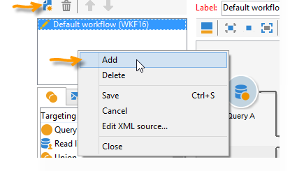

# Distribuzione di campagne di marketing {#marketing-campaign-deliveries}

Le consegne possono essere create tramite il dashboard della campagna, un flusso di lavoro della campagna o direttamente tramite la panoramica delle consegne.

## Creazione di consegne {#creating-deliveries}

Per creare una consegna collegata a una campagna, fate clic sul **[!UICONTROL Add a delivery]** collegamento nel dashboard della campagna.

Le configurazioni consigliate sono adatte ai diversi tipi di distribuzione: posta diretta, e-mail, canali mobili.

>[!NOTE]
>
>Per ulteriori informazioni sulla creazione e la configurazione delle consegne, consulta la sezione [Invio di messaggi](../../delivery/using/communication-channels.md) .

## Selezione della popolazione di destinazione {#selecting-the-target-population}

Per ogni consegna, il manager della campagna definirà:

* L&#39;obiettivo principale. Per ulteriori informazioni, vedere [Creazione della destinazione principale in un flusso di lavoro](#building-the-main-target-in-a-workflow) e [Selezione della popolazione](#selecting-the-target-population)di destinazione.
* Gruppo di controllo. Per ulteriori informazioni, vedere [Definizione di un gruppo](#defining-a-control-group)di controllo.
* Gli indirizzi seed. Per ulteriori informazioni al riguardo, consulta [questa sezione](../../delivery/using/about-seed-addresses.md).

Alcune di queste informazioni vengono ereditate dal modello.

>[!NOTE]
>
>I modelli delle campagne sono presentati nei modelli [delle](../../campaign/using/marketing-campaign-templates.md#campaign-templates)campagne.

Per generare la destinazione di consegna, potete definire criteri di filtraggio per i destinatari nel database. Questa modalità di selezione del destinatario viene presentata nella sezione [Invio di messaggi](../../delivery/using/steps-defining-the-target-population.md) .

### Esempio: consegna a un gruppo di destinatari {#example--delivering-to-a-group-of-recipients}

È possibile importare una popolazione in un elenco, quindi eseguire il targeting di tale elenco nelle consegne.

1. A tal fine, modificate il recapito interessato e fate clic sul **[!UICONTROL To]** collegamento per cambiare la popolazione di destinazione.

1. Nella **[!UICONTROL Main target]** scheda, selezionare l&#39; **[!UICONTROL Defined via the database]** opzione e fare clic **[!UICONTROL Add]** per selezionare i destinatari.

1. Scegliete **[!UICONTROL A list of recipients]** e fate clic **[!UICONTROL Next]** per selezionarlo.

### Creazione della destinazione principale in un flusso di lavoro {#building-the-main-target-in-a-workflow}

La destinazione principale di una consegna può essere definita anche nel flusso di lavoro di targeting: questo ambiente grafico consente di creare una destinazione utilizzando query, test e operatori: unione, deduplicazione, condivisione, ecc.

La guida [Automazione con i flussi di lavoro](../../workflow/using/architecture.md) include una descrizione dettagliata del funzionamento del modulo del flusso di lavoro.

>[!IMPORTANT]
>
>Nella stessa campagna, non potete impostare più di 28 flussi di lavoro. Oltre questo limite, i flussi di lavoro aggiuntivi non sono visibili nell&#39;interfaccia e possono generare errori.

#### Creazione di un flusso di lavoro di targeting {#creating-a-targeting-workflow}

Il targeting può essere creato tramite una combinazione di condizioni di filtraggio in una sequenza grafica in un flusso di lavoro. Potete creare popolazioni e sottopopolazioni che verranno indirizzate in base alle vostre esigenze. Per visualizzare l’editor del flusso di lavoro, fate clic sulla **[!UICONTROL Targeting and workflows]** scheda nel dashboard della campagna.

La popolazione di destinazione viene estratta dal database di Adobe Campaign tramite una o più query inserite in un flusso di lavoro. Per informazioni su come creare una query, consultare [questa sezione](../../workflow/using/query.md).

Potete avviare query e condividere le popolazioni tramite caselle quali Unione, Intersezione, Condivisione, Esclusione, ecc.

Selezionare gli oggetti dagli elenchi a sinistra dell&#39;area di lavoro e collegarli per creare la destinazione.

Nel diagramma, collegate le query di targeting e pianificazione necessarie per la costruzione della destinazione nel diagramma. È possibile eseguire il targeting mentre la costruzione è in corso, al fine di controllare la popolazione estratta dal database.

>[!NOTE]
>
>Esempi e procedure per la definizione delle query sono presentati in [questa sezione](../../workflow/using/query.md).

La sezione a sinistra dell&#39;editor contiene una libreria di oggetti grafici che rappresentano le attività. La prima scheda contiene le attività di targeting e la seconda scheda contiene le attività di controllo del flusso, che vengono utilizzate occasionalmente per coordinare le attività di targeting.

Le funzioni di esecuzione e formattazione del flusso di lavoro di targeting sono accessibili tramite la barra degli strumenti dell&#39;editor del diagramma.

>[!NOTE]
>
>Le attività disponibili per creare il diagramma, nonché tutte le funzioni di visualizzazione e layout sono descritte in dettaglio nella guida [Automazione con flussi di lavoro](../../workflow/using/architecture.md) .

Potete creare diversi flussi di lavoro di targeting per una singola campagna. Per aggiungere un flusso di lavoro:

1. Passate alla sezione in alto a sinistra della zona di creazione del flusso di lavoro, fate clic con il pulsante destro del mouse e selezionate **[!UICONTROL Add]**. È inoltre possibile utilizzare il **[!UICONTROL New]** pulsante situato sopra questa zona.

   

1. Selezionate il **[!UICONTROL New workflow]** modello e denominate il flusso di lavoro.
1. Fate clic **[!UICONTROL OK]** per confermare la creazione del flusso di lavoro, quindi create il diagramma per il flusso di lavoro.

#### Esecuzione di un flusso di lavoro {#executing-a-workflow}

I flussi di lavoro di targeting possono essere avviati manualmente tramite il **[!UICONTROL Start]** pulsante nella barra degli strumenti, a condizione che disponiate dei diritti appropriati.

Il targeting può essere programmato per l&#39;esecuzione automatica in base a una pianificazione (pianificatore) o a un evento (segnale esterno, importazione di file, ecc.).

Le azioni relative all&#39;esecuzione del flusso di lavoro di targeting (avvio, arresto, pausa, ecc.) sono processi **asincroni** : il comando viene salvato e avrà effetto non appena il server sarà disponibile ad applicarlo.

Le icone della barra degli strumenti consentono di intervenire sull&#39;esecuzione del flusso di lavoro di targeting.

* Avvio o riavvio

   * L&#39; **[!UICONTROL Start]** icona consente di avviare il flusso di lavoro di targeting. Quando fate clic su questa icona, vengono attivate tutte le attività senza una transizione di input (tranne i ponti di fine).

      

      Il server prende in considerazione la richiesta, come mostrato dal suo stato:

      

      Lo stato del processo diventa **[!UICONTROL Started]**.

   * Potete riavviare il flusso di lavoro di targeting tramite l&#39;icona appropriata della barra degli strumenti. Questo comando può essere utile se l&#39; **[!UICONTROL Start]** icona non è disponibile, ad esempio quando è in corso l&#39;arresto del flusso di lavoro di targeting. In questo caso, fate clic sull&#39; **[!UICONTROL Restart]** icona per anticipare il riavvio. Il server prende in considerazione la richiesta, come mostra il suo stato:

      

      Il processo quindi immette **[!UICONTROL Started]** lo stato.

* Interrompi o interrompi

   * Le icone della barra degli strumenti consentono di interrompere o mettere in pausa un flusso di lavoro di targeting in corso.

      Quando si fa clic **[!UICONTROL Pause]**, le operazioni in corso vengono **[!UICONTROL are not]** messe in pausa, ma nessun&#39;altra attività viene avviata fino al successivo riavvio.

      

      Il server prende in considerazione il comando, come mostra il suo stato:

      

      Potete anche mettere in pausa automaticamente un flusso di lavoro di targeting quando la sua esecuzione raggiunge una particolare attività. A tal fine, fate clic con il pulsante destro del mouse sull&#39;attività da cui il flusso di lavoro di targeting deve essere messo in pausa, quindi selezionate **[!UICONTROL Enable but do not execute]**.

      

      Questa configurazione viene visualizzata da un’icona speciale.

      

      >[!NOTE]
      >
      >Questa opzione è utile durante la progettazione avanzata della campagna di targeting e le fasi di test.

      Fare clic **[!UICONTROL Start]** per riprendere l&#39;esecuzione.

   * Fate clic sull&#39; **[!UICONTROL Stop]** icona per arrestare l&#39;esecuzione in corso.

      

      Il server prende in considerazione il comando, come mostra il suo stato:

      
   Potete inoltre interrompere automaticamente un flusso di lavoro di targeting quando l&#39;esecuzione raggiunge un&#39;attività. A tal fine, fate clic con il pulsante destro del mouse sull&#39;attività da cui verrà interrotto il flusso di lavoro di targeting e selezionate **[!UICONTROL Do not activate]**.

   

   

   Questa configurazione viene visualizzata da un’icona speciale.

   >[!NOTE]
   >
   >Questa opzione è utile durante la progettazione avanzata della campagna di targeting e le fasi di test.

* Interruzione incondizionata

   In Esplora risorse, selezionate **[!UICONTROL Administration > Production > Object created automatically > Campaign workflows]** per accedere e intervenire su ogni flusso di lavoro delle campagne.

   Per interrompere il flusso di lavoro in modo incondizionato, fai clic sull’ **[!UICONTROL Actions]** icona e seleziona **[!UICONTROL Unconditional]** Interrompi. Questa azione termina il flusso di lavoro della campagna.

   

### Definizione di un gruppo di controllo {#defining-a-control-group}

Un gruppo di controllo è una popolazione che non riceve la consegna; viene utilizzato per monitorare il comportamento dei post-consegna e l&#39;impatto della campagna effettuando un confronto con il comportamento della popolazione target, che ha ricevuto la consegna.

Il gruppo di controllo può essere estratto dalla destinazione principale e/o provenire da un gruppo o query specifico.

#### Attivazione del gruppo di controllo per una campagna {#activating-the-control-group-for-a-campaign}

È possibile definire un gruppo di controllo a livello di campagna, nel qual caso il gruppo di controllo verrà applicato a ogni distribuzione della campagna interessata.

1. Modificate la campagna in questione e fate clic sulla **[!UICONTROL Edit]** scheda.
1. Clic **[!UICONTROL Advanced campaign settings]**.

   

1. Selezionate l’ **[!UICONTROL Enable and edit control group configuration]** opzione.
1. Fare clic **[!UICONTROL Edit...]** per configurare il gruppo di controllo.

   

La procedura di configurazione viene presentata in [Estrazione del gruppo di controllo dalla destinazione](#extracting-the-control-group-from-the-main-target) principale e [Aggiunta di una popolazione](#adding-a-population).

#### Attivazione del gruppo di controllo per una consegna {#activating-the-control-group-for-a-delivery}

È possibile definire un gruppo di controllo a livello di consegna, nel qual caso il gruppo di controllo verrà applicato a ogni distribuzione della campagna interessata.

Per impostazione predefinita, la configurazione del gruppo di controllo definita a livello di campagna viene applicata a ogni distribuzione della campagna. È tuttavia possibile adattare il gruppo di controllo per una singola consegna.

>[!NOTE]
>
>Se avete definito un gruppo di controllo per una campagna e lo configurate anche per una consegna collegata a questa campagna, verrà applicato solo il gruppo di controllo definito per la consegna.

1. Modificate la consegna desiderata e fate clic sul **[!UICONTROL To]** collegamento nella **[!UICONTROL Email parameters]** sezione.

   

1. Fare clic sulla **[!UICONTROL Control group]** scheda, quindi selezionare **[!UICONTROL Enable and edit control group configuration]**.
1. Fare clic **[!UICONTROL Edit...]** per configurare il gruppo di controllo.

La procedura di configurazione viene presentata in [Estrazione del gruppo di controllo dalla destinazione](#extracting-the-control-group-from-the-main-target) principale e [Aggiunta di una popolazione](#adding-a-population).

#### Estrazione del gruppo di controllo dalla destinazione principale {#extracting-the-control-group-from-the-main-target}

Potete estrarre i destinatari dalla destinazione principale della consegna. In questo caso, i destinatari verranno presi dalla destinazione delle azioni di consegna interessate da questa configurazione. Questa estrazione può essere casuale o essere il risultato dell&#39;ordinamento dei destinatari.

Per estrarre un gruppo di controllo, abilitare il gruppo di controllo per la campagna o la distribuzione e selezionare una delle opzioni seguenti: **[!UICONTROL Activate random sampling]** o **[!UICONTROL Keep only the first records after sorting]**.

* **[!UICONTROL Activate random sampling]** : questa opzione applica il campionamento casuale ai destinatari nella popolazione di destinazione. Se poi impostate la soglia su 100, il gruppo di controllo sarà composto da 100 destinatari selezionati in modo casuale dalla popolazione di destinazione. Il campionamento casuale dipende dal motore del database.
* **[!UICONTROL Keep only the first records after sorting]** : questa opzione consente di definire un limite basato su uno o più ordini di ordinamento. Se si seleziona il **[!UICONTROL Age]** campo come criterio di ordinamento e quindi si definisce 100 come soglia, il gruppo di controllo sarà composto dai 100 destinatari più giovani. Ad esempio, potrebbe essere interessante definire un gruppo di controllo che includa destinatari che effettuano pochi acquisti, o destinatari che effettuano acquisti frequenti, e confrontare il loro comportamento con quello dei destinatari contattati.

Fare clic **[!UICONTROL Next]** per definire l&#39;ordine di ordinamento (se necessario) e selezionare la modalità di limitazione del destinatario.

Questa configurazione è equivalente a un&#39;attività di condivisione nel flusso di lavoro, che consente di suddividere la destinazione in sottoinsiemi. Il gruppo di controllo è uno di questi sottoinsiemi. Per ulteriori informazioni, consulta [questa sezione](../../workflow/using/architecture.md) .

### Aggiunta di una popolazione {#adding-a-population}

È possibile definire una nuova popolazione da utilizzare come gruppo di controllo. Questa popolazione può provenire da un gruppo di destinatari o è possibile crearla tramite una query specifica.

>[!NOTE]
>
>L&#39;editor di query di Adobe Campaign è presentato in [questa sezione](../../workflow/using/query.md).

## Avvio di una consegna {#starting-a-delivery}

Una volta concesse tutte le approvazioni, la consegna è pronta per essere avviata. La procedura di consegna dipende quindi dal tipo di consegna. Per le consegne tramite e-mail o canali mobili, consultate [Avvio di una consegna](#starting-an-online-delivery)online e per le consegne tramite posta diretta, consultate [Avvio di una consegna](#starting-an-offline-delivery)offline.

### Avvio di una consegna online {#starting-an-online-delivery}

Una volta concesse tutte le richieste di approvazione, lo stato di consegna cambia in **[!UICONTROL Pending confirmation]** e può essere avviato da un operatore. Se appropriato, all&#39;operatore Adobe Campaign (o al gruppo di operatori) nominato revisore per avviare la consegna viene notificato che la consegna è pronta per essere avviata.

>[!NOTE]
>
>Se un operatore o un gruppo specifico di operatori è designato per avviare una consegna nelle proprietà della consegna, è anche possibile consentire all&#39;operatore responsabile della consegna di confermare l&#39;invio. A questo scopo, attivate l&#39;opzione **NMS_ActivateOwnerConfirm** immettendo **1** come valore. Le opzioni sono gestite dal nodo **[!UICONTROL Administration]** > **[!UICONTROL Platform]** > **[!UICONTROL Options]** in Adobe Campaign Explorer.
>  
>Per disattivare questa opzione, immettere **0** come valore. Il processo di conferma dell&#39;invio funzionerà come impostazione predefinita: solo l&#39;operatore o il gruppo di operatori designati per l&#39;invio nelle proprietà di consegna (o un amministratore) sarà in grado di confermare ed eseguire l&#39;invio.

Le informazioni vengono visualizzate anche nel dashboard della campagna. Il **[!UICONTROL Confirm delivery]** collegamento consente di avviare la consegna.

Un messaggio di conferma consente di proteggere l’azione.

### Avvio di una distribuzione offline {#starting-an-offline-delivery}

Una volta concesse tutte le approvazioni, lo stato di consegna cambia in **[!UICONTROL Pending extraction]**. I file di estrazione vengono creati tramite un flusso di lavoro speciale che, in una configurazione predefinita, viene avviato automaticamente quando una consegna diretta per posta è in attesa di estrazione. Quando un processo è in corso, viene visualizzato nel dashboard e può essere modificato tramite il relativo collegamento.

>[!NOTE]
>
>I flussi di lavoro tecnici relativi ai processi delle campagne vengono presentati in [Elenco dei flussi di lavoro](../../workflow/using/campaign.md)dei processi delle campagne.

**Passaggio 1 - Approvazione file**

Una volta eseguito correttamente il flusso di lavoro di estrazione, il file di estrazione deve essere approvato (a condizione che l&#39;approvazione del file di estrazione sia stata selezionata nelle impostazioni di consegna).

Per ulteriori informazioni, vedere [Approvazione di un file](../../campaign/using/marketing-campaign-approval.md#approving-an-extraction-file)di estrazione.

**Passaggio 2 - Approvazione del messaggio al provider di servizi**

* Una volta approvato il file di estrazione, potete generare la prova del messaggio e-mail di notifica del router. Questo messaggio e-mail è costruito in base a un modello di consegna. Deve essere approvato.

   >[!NOTE]
   >
   >Questo passaggio è disponibile solo se l&#39;invio e l&#39;approvazione delle prove sono stati attivati nella finestra di approvazione.

* Click the **[!UICONTROL Send a proof]** button to create the proofs.

   Il bersaglio della prova deve essere definito in anticipo.

   Potete creare tutte le prove necessarie. Questi sono accessibili tramite il **[!UICONTROL Direct mail...]** collegamento dei dettagli di consegna.

   

* Lo stato di consegna cambia in **[!UICONTROL To submit]**. Fare clic sul **[!UICONTROL Submit proofs]** pulsante per avviare il processo di approvazione.

   

* Lo stato di consegna cambia in **[!UICONTROL Proof to validate]** e un pulsante consente di accettare o rifiutare l’approvazione.

   

   È possibile accettare o rifiutare questa approvazione o tornare alla fase di estrazione.

   

* Il file di estrazione viene inviato al router e la consegna è terminata.

### Calcolo dei costi e delle scorte {#calculation-of-costs-and-stocks}

L&#39;estrazione del file avvia due operazioni: calcolo del budget e delle scorte. Le voci di budget vengono aggiornate.

* La **[!UICONTROL Budget]** scheda consente di gestire i budget per la campagna. Il totale delle voci di costo viene visualizzato nel **[!UICONTROL Calculates cost]** campo della scheda principale della campagna e nel programma a cui appartiene. Gli importi si riflettono anche nel bilancio della campagna.

   Il costo reale verrà calcolato in base alle informazioni fornite dal router. Vengono fatturati solo i messaggi effettivamente inviati.

* Le scorte sono definite nel **[!UICONTROL Administration > Campaign management > Stocks]** nodo della struttura ad albero e nelle strutture dei costi nel **[!UICONTROL Administration > Campaign management > Service providers]** nodo.

   Le linee di magazzino sono visibili nella sezione di magazzino. Per definire il magazzino iniziale, aprire una linea di magazzino. Lo stock viene decrementato ogni volta che viene effettuata una consegna. Puoi definire un livello di avviso e le notifiche.

>[!NOTE]
>
>Per ulteriori informazioni sul calcolo dei costi e sulla gestione delle scorte, vedere [Fornitori, scorte e budget](../../campaign/using/providers--stocks-and-budgets.md).

## Gestione dei documenti associati {#managing-associated-documents}

Potete associare vari documenti a una campagna: report, foto, pagina Web, diagramma, ecc. Questi documenti possono essere in qualsiasi formato (Microsoft Word, PowerPoint, PNG, JPG, Acrobat PDF, ecc.). Per collegare i documenti a una campagna, consultate [Aggiunta di documenti](#adding-documents).

>[!IMPORTANT]
>
>Questa modalità è riservata ai documenti di piccole dimensioni.

In una campagna puoi fare riferimento anche ad altri elementi, come buoni promozionali, offerte speciali relative a una filiale o a un negozio specifici, ecc. Quando questi elementi sono inclusi in una struttura, possono essere associati a una consegna diretta per posta. Vedere [Associazione e strutturazione delle risorse collegate tramite un profilo](#associating-and-structuring-resources-linked-via-a-delivery-outline)di consegna.

>[!NOTE]
>
>Se utilizzi MRM, puoi anche gestire una libreria di risorse di marketing disponibili per diversi partecipanti per i lavori di collaborazione. Consulta [Gestione delle risorse](../../campaign/using/managing-marketing-resources.md)di marketing.

### Aggiunta di documenti {#adding-documents}

I documenti possono essere associati a livello di campagna (documenti contestuali) o a livello di programma (documenti generali).

La **[!UICONTROL Documents]** scheda contiene:

* Elenco di tutti i documenti richiesti per il contenuto (modello, immagini, ecc.) che possono essere scaricati localmente dagli operatori Adobe Campaign con diritti appropriati,
* Eventuali documenti contenenti informazioni per il router.

I documenti sono collegati al programma o alla campagna tramite la **[!UICONTROL Edit > Documents]** scheda.

È inoltre possibile aggiungere un documento a una campagna tramite il collegamento offerto nel dashboard.

Fate clic sull’ **[!UICONTROL Details]** icona per visualizzare il contenuto di un file e aggiungere informazioni:

Nel dashboard, i documenti associati alla campagna sono raggruppati nella **[!UICONTROL Document(s)]** sezione, come nell&#39;esempio seguente:

È inoltre possibile modificarli e modificarli da questa visualizzazione.

### Associazione e strutturazione delle risorse collegate tramite un profilo di consegna {#associating-and-structuring-resources-linked-via-a-delivery-outline}

>[!NOTE]
>
>I contorni di consegna sono utilizzati esclusivamente nel contesto delle campagne di posta diretta.

Un profilo di consegna indica un insieme strutturato di elementi (documenti, filiali/negozi, promozioni, ecc.) creati nella società e per una campagna particolare.

Questi elementi sono raggruppati in linee di consegna, e un particolare profilo di consegna sarà associato a una consegna; verrà fatto riferimento nel file di estrazione inviato al provider **di** servizi per essere collegato alla consegna. Ad esempio, puoi creare un profilo di consegna che faccia riferimento a un ramo e alle brochure di marketing utilizzate.

Per una campagna, i contorni di consegna consentono di strutturare gli elementi esterni da associare alla consegna in base a determinati criteri: filiale correlata, offerta promozionale concessa, invito a un evento locale, ecc.

#### Creazione di un profilo {#creating-an-outline}

Per creare una struttura, fate clic sulla **[!UICONTROL Delivery outlines]** sottoscheda nella **[!UICONTROL Edit > Documents]** scheda della campagna interessata.

>[!NOTE]
>
>Se questa scheda non è presente, questa funzione non è disponibile per la campagna. Fate riferimento alla configurazione del modello di campagna.
>   
>For more on this, refer to [Campaign templates](../../campaign/using/marketing-campaign-templates.md#campaign-templates).

Quindi, fate clic su **[!UICONTROL Add a delivery outline]** e create la gerarchia dei contorni per la campagna:

1. Fare clic con il pulsante destro del mouse sulla radice della struttura ad albero e selezionare **[!UICONTROL New > Delivery outlines]**.
1. Fare clic con il pulsante destro del mouse sulla struttura appena creata e selezionare **[!UICONTROL New > Item]** o **[!UICONTROL New > Personalization fields]**.

Una struttura può contenere elementi e campi di personalizzazione, risorse e offerte:

* Gli elementi possono essere documenti fisici, ad esempio, a cui si fa riferimento e che sono descritti qui e che verranno allegati alla consegna.
* I campi di personalizzazione consentono di creare elementi di personalizzazione relativi alle consegne anziché ai destinatari. È quindi possibile creare valori da utilizzare nelle consegne per un target specifico (offerta di benvenuto, uno sconto, ecc.) Vengono creati in Adobe Campaign e importati nella struttura tramite il **[!UICONTROL Import personalization fields...]** collegamento.

   

   È inoltre possibile crearli direttamente nel contorno facendo clic sull’ **[!UICONTROL Add]** icona a destra della zona dell’elenco.

   

* Le risorse sono risorse di marketing generate nel dashboard delle risorse di marketing a cui si accede tramite il **[!UICONTROL Resources]** collegamento dell&#39; **[!UICONTROL Campaigns]** universo.

   

   >[!NOTE]
   >
   >Per ulteriori informazioni sulle risorse di marketing, consulta [Gestione delle risorse](../../campaign/using/managing-marketing-resources.md)di marketing.

#### Selezione di un contorno {#selecting-an-outline}

Per ogni consegna, è possibile selezionare il contorno da associare dalla sezione riservata al contorno di estrazione, come nell&#39;esempio seguente:

Il contorno selezionato viene quindi visualizzato nella sezione inferiore della finestra. Può essere modificato utilizzando l’icona a destra del campo o mediante l’elenco a discesa:

Nella **[!UICONTROL Summary]** scheda della consegna sono inoltre visualizzate le informazioni seguenti:

#### Risultato estrazione {#extraction-result}

Nel file estratto e inviato al provider di servizi, il nome del profilo e, se del caso, le sue caratteristiche (costo, descrizione, ecc.) vengono aggiunti al contenuto in base alle informazioni nel modello di esportazione associato al provider di servizi.

Nell&#39;esempio seguente, l&#39;etichetta, il costo stimato e la descrizione del profilo associato alla consegna saranno aggiunti al file di estrazione.

Il modello di esportazione deve essere associato al fornitore di servizi selezionato per la consegna in questione. Consultate [Creazione di provider di servizi e relative strutture](../../campaign/using/providers--stocks-and-budgets.md#creating-service-providers-and-their-cost-structures)di costi.

>[!NOTE]
>
>Per ulteriori informazioni sulle esportazioni, consultare la sezione [Guida introduttiva](../../platform/using/generic-imports-and-exports.md) .
