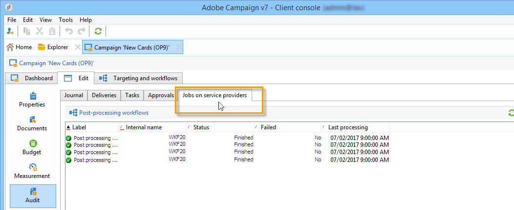

# Monitorare le campagne di marketing {#monitoring-marketing-campaigns}

## Tracciare una campagna {#tracking-a-campaign}

Per ogni campagna, la scheda **[!UICONTROL Tracking]** ti consente di visualizzare tutti i processi e i relativi stati. Le seguenti informazioni sono accessibili tramite questa scheda secondaria:

* Il giornale di registrazione attività mostra i processi eseguiti sulla campagna in generale: creazione o avvio del flusso di lavoro, approvazione, estrazione, ecc.

  

* La scheda secondaria **[!UICONTROL Deliveries]** contiene tutte le consegne della campagna che possono essere modificate da questa visualizzazione. A tale scopo, selezionare la consegna e fare clic sull&#39;icona **[!UICONTROL Detail]**.

  

* La scheda secondaria **[!UICONTROL Tasks]** raggruppa tutte le attività collegate alla campagna. Questa visualizzazione consente di modificarli o eliminarli. Le attività sono disponibili con l&#39;applicazione MRM. Sono descritti in [questa sezione](../../mrm/using/creating-and-managing-tasks.md).

  

* I flussi di lavoro creati per generare messaggi per i provider di servizi vengono visualizzati nella scheda secondaria **[!UICONTROL Jobs on service providers]**. Fare clic sull&#39;icona **[!UICONTROL Detail]** per visualizzare il flusso di lavoro selezionato.

  

## Tracciamento della consegna {#delivery-tracking}

L’elenco delle consegne è disponibile tramite il collegamento **[!UICONTROL Deliveries]** del nodo Campaign.

Per ogni consegna, questo elenco ti consente di accedere agli indicatori chiave: stato, numero di destinatari target, campagne collegate, ecc.

Per controllare lo stato di una consegna, modificala e visualizzarne il dashboard e le schede.

>[!NOTE]
>
>Le informazioni relative ai dettagli di consegna sono disponibili nella sezione [questa sezione](../../delivery/using/about-message-tracking.md).

## Tracciamento dell’esecuzione {#execution-tracking}

Per cercare lo stato delle consegne, fai clic su **[!UICONTROL Deliveries]**, accessibile tramite la home page di Adobe Campaign. Vedi [Tracciamento consegna](#delivery-tracking).

Le informazioni relative ai processi eseguiti in una campagna vengono raccolte nella scheda **[!UICONTROL Edit > Audit]** della campagna. Da qui puoi visualizzare l’elenco delle consegne nella campagna. [Ulteriori informazioni](#tracking-a-campaign).
