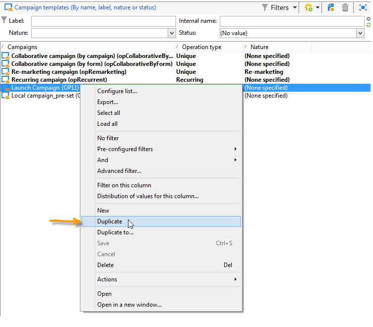
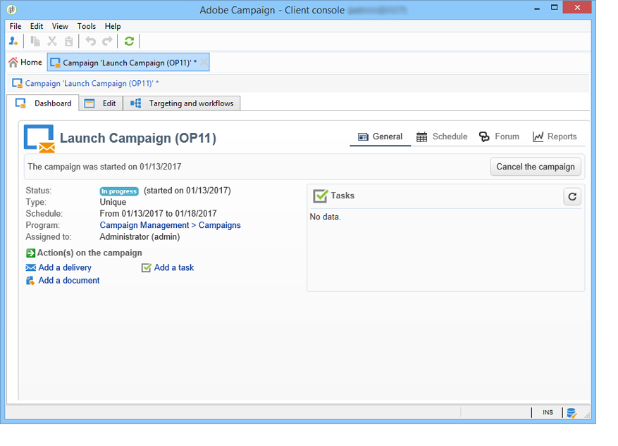
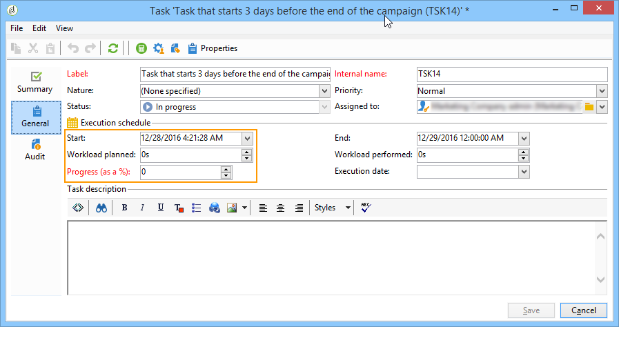

# Creare e configurare modelli di campagna {#campaign-templates}

Tutte le campagne di marketing si basano su un modello, che memorizza le caratteristiche e le funzionalità principali. I modelli di campagna sono centralizzati nel nodo **[!UICONTROL Resources > Templates > Campaign templates]**. Viene fornito un modello predefinito come standard. Consente di creare una nuova campagna utilizzando tutti i moduli disponibili (documenti, attività, indirizzi seed, ecc.), ma i moduli offerti dipendono dai diritti e dalla configurazione della piattaforma Adobe Campaign.

>[!NOTE]
>
>La struttura viene visualizzata quando si fa clic sull&#39;icona **[!UICONTROL Explorer]** nella home page.

Viene fornito un modello incorporato al fine di creare una campagna per la quale non è stata definita alcuna configurazione specifica. Puoi creare e configurare i modelli della campagna e quindi creare campagne a partire da questi modelli.

 Per ulteriori informazioni sulla creazione della campagna, consulta [questo video](../../campaign/using/marketing-campaign-deliveries.md#create-email-video).

## Creare un modello di campagna {#creating-or-duplicating-a-campaign-template}

Per creare un modello per campagne, segui la procedura seguente:

1. Apri Campaign **Explorer**.
1. In **Risorse > Modelli > Modelli campagna**, fai clic su **Nuovo** nella barra degli strumenti sopra l&#39;elenco dei modelli.

   

1. Immetti l’etichetta del nuovo modello di campagna.
1. Fai clic su **Salva** e riapri il modello.
1. Nella scheda **Modifica**, immetti **Nome interno** e altri valori, se necessario.
1. Seleziona **Impostazioni avanzate campagna** per aggiungere un flusso di lavoro al modello della campagna.

   

1. Modifica il valore **Targeting e flussi di lavoro** in **Sì**.

   

1. Nella scheda **Impostazione destinazione e flussi di lavoro**, fare clic su **Aggiungi flusso di lavoro...**.

   

1. Completare il campo **Etichetta** e fare clic su **Ok**.
1. Crea il flusso di lavoro in base alle tue esigenze.
1. Fai clic su **Salva**. Il modello è ora pronto per essere utilizzato in una campagna.

Puoi anche **duplicare** il modello predefinito per riutilizzarne e adattarne la configurazione.

Le varie schede e schede secondarie del modello della campagna consentono di accedere alle relative impostazioni, come descritto in [Configurazione generale](#general-configuration).

## Seleziona moduli {#select-modules}

Il collegamento **[!UICONTROL Advanced campaign settings...]** consente di abilitare e disabilitare i processi per le campagne basate su questo modello. Seleziona le funzionalità che desideri abilitare nelle campagne create in base a questo modello.

Se non è selezionata una funzionalità, gli elementi relativi al processo (menu, icone, opzioni, schede, schede secondarie e così via) non verranno visualizzati nell’interfaccia del modello o nelle campagne basate su questo modello. Le schede a sinistra dei dettagli della campagna solitamente coincidono con i processi selezionati nel modello. Ad esempio, se **Spese e obiettivi** non è selezionato, la scheda **[!UICONTROL Budget]** corrispondente non verrà visualizzata nelle campagne basate su questo modello.

Inoltre, al dashboard della campagna vengono aggiunte scelte rapide per le finestre di configurazione. Quando una funzionalità è abilitata, un collegamento diretto consente di accedervi dal dashboard della campagna.

Ad esempio, con la configurazione seguente:

Nel dashboard della campagna sono visualizzati i seguenti collegamenti (manca il collegamento **[!UICONTROL Add a task]**):

Vengono visualizzate solo le seguenti schede:

Tuttavia, con questo tipo di configurazione:

Verranno visualizzati i collegamenti e le schede seguenti:

## Tipologia dei moduli {#typology-of-enabled-modules}

* **Gruppo di controllo**

  Quando questo modulo è selezionato, viene aggiunta una scheda aggiuntiva alle impostazioni avanzate del modello e delle campagne basate su questo modello. La configurazione può essere definita tramite il modello o singolarmente per ogni campagna. Ulteriori informazioni sui gruppi di controllo in [questa sezione](../../campaign/using/marketing-campaign-deliveries.md#defining-a-control-group).

  

* **Indirizzi di seed**

  Quando questo modulo è selezionato, viene aggiunta una scheda aggiuntiva alle impostazioni avanzate del modello e delle campagne basate su questo modello. La configurazione può essere definita tramite il modello o singolarmente per ogni campagna. Ulteriori informazioni sugli indirizzi di seed in [questa sezione](../../delivery/using/about-seed-addresses.md).

  

* **Documenti**

  Quando questo modulo è selezionato, viene aggiunta una scheda aggiuntiva alla scheda **[!UICONTROL Edition]** del modello e delle campagne basate su questo modello. I documenti allegati possono essere aggiunti dal modello o singolarmente per ciascuna campagna. Ulteriori informazioni sui documenti in [questa sezione](../../campaign/using/marketing-campaign-deliveries.md#managing-associated-documents).

  

* **Struttura**

  Quando questo modulo è selezionato, alla scheda **[!UICONTROL Delivery outlines]** viene aggiunta una scheda secondaria **[!UICONTROL Documents]** per definire i profili di consegna per la campagna. Ulteriori informazioni sui profili di consegna in [questa sezione](../../campaign/using/marketing-campaign-deliveries.md#associating-and-structuring-resources-linked-via-a-delivery-outline).

  

* **Impostazione destinazione e flussi di lavoro**

  Quando selezioni il modulo **[!UICONTROL Targeting and workflows]**, viene aggiunta una scheda che consente di creare uno o più flussi di lavoro per le campagne basate su questo modello. I flussi di lavoro possono essere configurati singolarmente per ogni campagna basata su questo modello.Ulteriori informazioni sui flussi di lavoro delle campagne in [questa sezione](../../campaign/using/marketing-campaign-deliveries.md#building-the-main-target-in-a-workflow).

  

  Quando questo modulo è abilitato, viene aggiunta una scheda alle impostazioni avanzate della campagna per definire la sequenza di esecuzione del processo.

  

* **Approvazione**

  Se si seleziona **[!UICONTROL Approval]**, è possibile selezionare i processi da approvare e gli operatori responsabili delle approvazioni. Ulteriori informazioni sulle approvazioni in [questa sezione](../../campaign/using/marketing-campaign-approval.md#selecting-reviewers).

  

  È possibile scegliere se abilitare o meno l&#39;approvazione del processo tramite la scheda **[!UICONTROL Approvals]** della sezione delle impostazioni avanzate dei modelli. Per poter autorizzare la consegna dei messaggi, i processi per i quali è selezionata l’approvazione devono essere approvati.

  È necessario associare un operatore revisore o un gruppo di operatori a ogni approvazione abilitata.

* **Spese e obiettivi**

  Quando questo modulo è selezionato, viene aggiunta una scheda **[!UICONTROL Budget]** ai dettagli del modello e delle campagne basate su questo modello, in modo che sia possibile selezionare il budget associato.

  

## Proprietà ed esecuzione {#general-configuration}

### Proprietà modello {#template-properties}

Quando crei un modello di campagna, devi immettere le seguenti informazioni:

* Immetti la **etichetta** del modello: questa etichetta verrà assegnata per impostazione predefinita a tutte le campagne create tramite questo modello.
* Seleziona la campagna **natura** dall&#39;elenco a discesa. I valori disponibili in questo elenco sono quelli salvati nell&#39;enumerazione **[!UICONTROL natureOp]**.

  >[!NOTE]
  >
  >Scopri come **utilizzare le enumerazioni** nella [documentazione di Adobe Campaign v8 (console)](https://experienceleague.adobe.com/en/docs/campaign/campaign-v8/config/settings/enumerations){target=_blank}.

* Selezionare il tipo **di campagna**: univoco, ricorrente o periodico. Per impostazione predefinita, i modelli di campagna si applicano a campagne univoche. Le campagne ricorrenti e periodiche sono descritte in dettaglio in [questa sezione](../../campaign/using/setting-up-marketing-campaigns.md#recurring-and-periodic-campaigns).
* Specifica la durata della campagna, ovvero il numero di giorni durante i quali la campagna avrà luogo. Quando crei una campagna basata su questo modello, le date di inizio e di fine della campagna verranno compilate automaticamente.

  Se la campagna è ricorrente, devi specificare le date di inizio e di fine della campagna direttamente nel modello.

* Specifica il **programma correlato** del modello: le campagne basate su questo modello verranno collegate al programma selezionato.

### Parametri di esecuzione del modello {#template-execution-parameters}

Il collegamento **[!UICONTROL Advanced campaign settings...]** consente di configurare le opzioni avanzate del modello per l&#39;elaborazione del target di consegna (gruppo di controllo, indirizzi seed, ecc.) e la configurazione della misurazione della campagna e dell&#39;esecuzione del flusso di lavoro.

## Tracciare l’esecuzione della campagna{#campaign-reverse-scheduling}

Puoi creare una pianificazione per una campagna e tenere traccia dei risultati ottenuti, ad esempio per preparare una pianificazione dell’evento per una data specifica. I modelli di campagna ora consentono di calcolare la data di inizio di un’attività in base alla data di fine di una campagna.

Nella casella di configurazione dell&#39;attività passare all&#39;area **[!UICONTROL Implementation schedule]** e selezionare la casella **[!UICONTROL The start date is calculated based on the campaign end date]**. In questo caso, &quot;data di inizio&quot; è la data di inizio dell&#39;attività. Vai al campo **[!UICONTROL Start]** e immetti un intervallo: l&#39;attività inizierà molto prima della data di fine della campagna. Se si immette un periodo più lungo di quello impostato per la durata della campagna, l&#39;attività inizierà prima della campagna.

Quando crei una campagna utilizzando questo modello, la data di inizio dell’attività viene calcolata automaticamente. Tuttavia, è sempre possibile modificarlo in un secondo momento.
