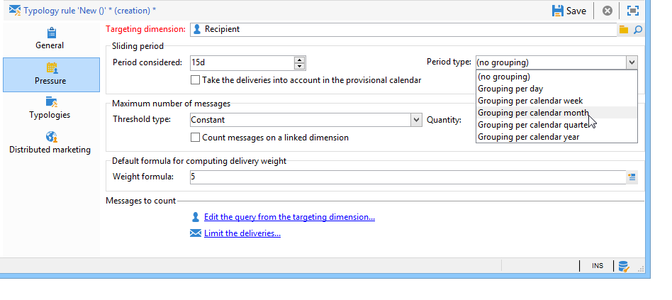
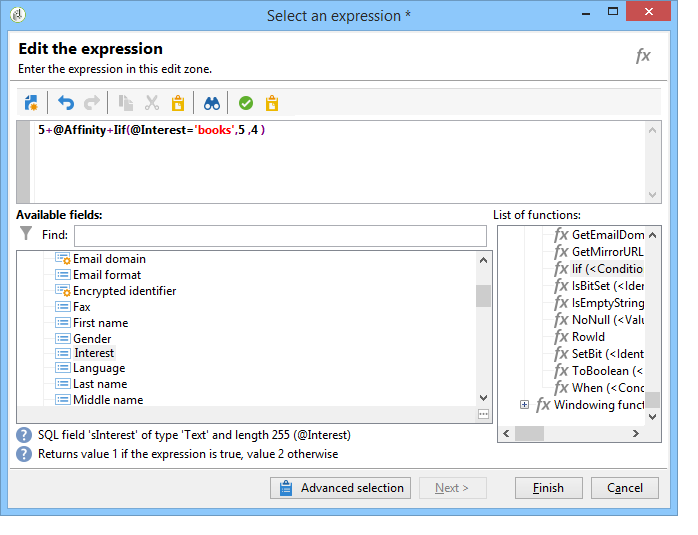

# Regole di pressione{#pressure-rules}

## Informazioni sulla fatica di marketing {#about-marketing-fatigue}

L&#39;implementazione della gestione della pressione di vendita consente di evitare l&#39;eccesso di sollecitazione della popolazione nel database, noto anche come affaticamento del marketing. A tal fine, puoi definire un numero massimo di messaggi per destinatario. Consente inoltre di implementare regole di arbitrato tra campagne, per inviare il messaggio migliore al pubblico di destinazione.

**** Pressione, per gestire la stanchezza di marketing, ad esempio, per limitare il numero di lettere da inviare a una popolazione a due, per selezionare la comunicazione che meglio corrisponde agli interessi di un gruppo di abbonati, per evitare di inviare un SMS a un cliente insoddisfatto, ecc.

Le campagne vengono selezionate in base a soglie definite e allo spessore del messaggio.

* Una soglia è il numero massimo di consegne autorizzate per un dato destinatario in un dato periodo. Può essere impostata o variabile. Viene impostato o calcolato nelle impostazioni delle regole di tipologia. Fare riferimento a [Numero massimo di messaggi](#maximum-number-of-messages).
* I pesi di distribuzione consentono di identificare le consegne prioritarie nel quadro della gestione della pressione. I messaggi con lo spessore maggiore hanno la priorità. Fare riferimento a [Spessore messaggio](#message-weight).

L&#39;arbitrato consiste nel fare in modo che le campagne pianificate il cui peso sia maggiore della campagna in corso non portino a un&#39;eccessiva richiesta di profilo: in questo caso, il profilo viene escluso dalla consegna.

I criteri di arbitraggio (spessore e/o soglia del messaggio) possono variare in base a due tipi di informazioni:

* preferenza del destinatario, che è informazione dichiarativa: abbonamenti a newsletter, stato del destinatario (cliente o potenziale),
* comportamento del destinatario: acquisti, collegamenti visitati, ecc.

La regola di arbitrato per la definizione dei messaggi idonei viene applicata durante la fase di analisi. Per ciascun destinatario e per il periodo in questione, il messaggio verrà inviato se la formula seguente è vera: **(numero di messaggi inviati) + (numero di messaggi con maggior peso) &lt; threshold**.

In caso contrario, il destinatario sarà **[!UICONTROL Excluded by arbitration]**. Per ulteriori informazioni, fare riferimento a [Esclusione dopo l&#39;arbitrato](#exclusion-after-arbitration).

## Creazione di una regola di pressione {#creating-a-pressure-rule}

Per impostare l&#39;arbitrato tra le campagne utilizzando  Adobe Campaign, iniziare creando tipologie di campagne e definendo regole di tipologia collegate (**Pressure** regole).

Per creare e configurare una regola di tipologia **[!UICONTROL Pressure]**, attieniti alla seguente procedura:

1. Nell&#39;elenco delle regole di tipologia della campagna, fai clic sull&#39;icona **[!UICONTROL New]** sopra l&#39;elenco.

   

1. Nella scheda **[!UICONTROL General]** della nuova regola, selezionare una regola di tipo **Pressione** e immettere un nome e una descrizione per tale regola.

   

1. Se necessario, modificate l&#39;ordine di esecuzione. Quando più regole di tipologia vengono applicate come set **[!UICONTROL Typology]**, le regole ordinate più basse vengono applicate per prime. Per ulteriori informazioni, fare riferimento a [Ordine di esecuzione](../../campaign/using/applying-rules.md#execution-order).
1. Nella sezione **[!UICONTROL Calculation parameters]**, definire una frequenza per salvare il targeting oltre la successiva esecuzione di ri-arbitraggio giornaliera. Per ulteriori informazioni, vedere [Regolazione della frequenza di calcolo](../../campaign/using/applying-rules.md#adjusting-calculation-frequency).
1. Fare clic sulla scheda **[!UICONTROL Pressure]** e scegliere il periodo di calendario durante il quale si applica la regola di tipologia.

   

   La regola sarà applicata alle consegne la cui data di contatto è inclusa nel periodo in questione.

   >[!NOTE]
   >
   >Le consegne programmate vengono prese in considerazione solo se è selezionata l&#39;opzione **[!UICONTROL Take the deliveries into account in the provisional calendar]**. Per ulteriori informazioni, vedere [Impostazione del punto](#setting-the-period).

1. Definire il metodo per il calcolo del numero massimo di messaggi.

   La soglia rappresenta il numero più alto di messaggi che possono essere inviati a un destinatario durante il periodo in questione.

   Per impostazione predefinita, la soglia è costante e devi indicare un numero massimo di messaggi autorizzati dalla regola.

   

   Per definire una soglia di variabile, selezionate il valore **[!UICONTROL Depends on the recipient]** nel campo **[!UICONTROL Type of threshold]** e utilizzate l&#39;icona a destra per aprire l&#39;editor di espressioni.

   

   Per ulteriori informazioni, vedere [Numero massimo di messaggi](#maximum-number-of-messages).

1. Specificare il metodo per il calcolo del peso della consegna.

   Ogni consegna ha un peso, ovvero un valore che rappresenta il suo livello di priorità: questo consente l&#39;arbitrato tra le campagne. I pesi vengono calcolati utilizzando la formula definita nella regola di tipologia e/o nelle relative proprietà. Per ulteriori informazioni, fare riferimento a [Spessore messaggio](#message-weight).

1. Per impostazione predefinita, tutti i messaggi vengono presi in considerazione per il calcolo della soglia. La scheda **[!UICONTROL Restriction]** consente di filtrare i messaggi interessati dalla regola di tipologia:

   * La sezione superiore di questa scheda consente di limitare i destinatari interessati.
   * La sezione inferiore di questa scheda consente di filtrare i messaggi da conteggiare.

      Nell&#39;esempio seguente, vengono presi in considerazione solo i destinatari salvati nella cartella **NewContatti** e vengono fornite le consegne a partire da **Newsletter**.
   

1. La scheda **[!UICONTROL Typologies]** consente di visualizzare i tipi di campagne che applicano questa regola o di collegare la regola a uno o più tipi di campagne esistenti. Per ulteriori informazioni, vedere [Applicazione delle tipologie](../../campaign/using/about-campaign-typologies.md#applying-typologies).

## Definizione di soglie e pesi {#defining-thresholds-and-weights}

### Numero massimo di messaggi {#maximum-number-of-messages}

Ogni regola di pressione definisce una soglia, ovvero il numero massimo di messaggi che possono essere inviati a un destinatario in un dato periodo di tempo. Una volta raggiunta tale soglia, non potranno più essere effettuate ulteriori consegne fino alla fine del periodo considerato. Questa procedura consente di escludere automaticamente un destinatario da una consegna se un messaggio supera la soglia impostata, evitando in tal modo un eccesso di richieste.

I valori di soglia possono essere costanti o calcolati da una formula con variabili. Ciò significa che per un determinato periodo, le soglie possono variare da un destinatario all&#39;altro, o persino per lo stesso destinatario.

>[!CAUTION]
>
>Immettendo **0** come soglia si evita che tutte le consegne alla popolazione destinataria avvengano durante il periodo in esame.

**Esempio:**

Puoi indicizzare il numero di messaggi autorizzati in base al segmento a cui appartiene il destinatario. Ciò significa che un destinatario appartenente al segmento Web può ricevere più messaggi di altri destinatari. Una formula di tipo **[!UICONTROL Iif (@origin='Web', 5, 3)]** autorizza la consegna di 5 messaggi ai destinatari e 3 per altri segmenti. La configurazione sarà la seguente:

Per definire la soglia, potete utilizzare una dimensione collegata alla dimensione di targeting: ad esempio, per includere i messaggi inviati ai profili dei destinatari memorizzati nella tabella dei visitatori (per ulteriori informazioni sulla tabella dei visitatori, fare riferimento a [questa sezione](../../web/using/use-case--creating-a-refer-a-friend-form.md)) o per evitare di inviare più messaggi alla settimana alla stessa famiglia (che possono fare riferimento a più indirizzi e-mail) identificati in una dimensione collegata a quella dei destinatari.

A tal fine, selezionate l&#39;opzione **[!UICONTROL Count messages on a linked dimension]**, quindi selezionate il visitatore o la tabella dei contatti.

### Spessore messaggio {#message-weight}

Ogni consegna ha un peso che rappresenta il suo livello di priorità. Per impostazione predefinita, il peso di una consegna è impostato su 5. Le regole di pressione consentono di definire il peso delle consegne a cui verranno applicate.

I pesi possono essere impostati o calcolati utilizzando una formula in base alle esigenze dei destinatari. Ad esempio, puoi definire il peso di una consegna in base agli interessi dei destinatari.

>[!CAUTION]
>
>Lo spessore definito in una regola di tipologia può essere sovraccaricato singolarmente per ogni consegna, nella scheda **[!UICONTROL Properties]**. Fare clic sulla scheda **[!UICONTROL Typology]** per selezionare la tipologia della campagna e, se necessario, specificare lo spessore da applicare.\
>Tuttavia, il peso dichiarato in una regola di tipologia A non sarà utilizzato per calcolare una regola di tipologia B: questo peso riguarda solo le consegne che utilizzano la regola A.

**Esempio:**

Nell&#39;esempio seguente, vogliamo collegare il peso delle newsletter sulla musica al punteggio di propensione dei destinatari. Per eseguire questa operazione:

1. Crea un nuovo campo per memorizzare i punteggi di propensione dei destinatari. Il campo, **@Music** in questo caso, sarà arricchito di risposte a sondaggi e sondaggi online, dati di tracciamento raccolti, ecc.
1. Crea una regola di tipologia per calcolare lo spessore del messaggio in base a questo campo.

   

1. Applica questa regola ai messaggi con il seguente argomento: newsletter, offerte speciali, ecc. Il peso di queste consegne, e quindi il loro livello di priorità, dipenderà dal punteggio di propensione di ciascun destinatario.

## Impostazione del periodo {#setting-the-period}

Le regole di pressione sono definite in **n** periodi di scorrimento giornalieri.

Il punto è configurato nella scheda **[!UICONTROL Pressure]** della regola. Potete specificare il numero di giorni e, se necessario, selezionare il tipo di raggruppamento da applicare (giorno, settimana, mese, trimestre ecc.).

Il tipo di raggruppamento consente di estendere il campo **[!UICONTROL Period considered]** all&#39;intero giorno, settimana, mese di calendario o anno di calendario per le date del periodo.

Ad esempio, una regola di pressione che definisce una soglia di 2 messaggi alla settimana, con un raggruppamento per ogni mese di calendario, impedirà la consegna di più di 2 messaggi entro la stessa settimana e nello stesso mese di calendario. Avvertenza: se il periodo si sovrappone a due mesi, la soglia di calcolo terrà conto delle consegne di questi due mesi di calendario e potrebbe pertanto impedire tutte le nuove consegne nel corso del secondo mese.

>[!NOTE]
>
>Per impostazione predefinita, nel calcolo della soglia vengono prese in considerazione solo le consegne già inviate. Selezionare l&#39;opzione **[!UICONTROL Take the deliveries into account in the provisional calendar]** se si desidera tenere conto anche delle consegne programmate per il periodo in questione. In questo caso, il periodo considerato è raddoppiato per consentire l&#39;integrazione delle consegne future e di quelle precedenti.\
>Per limitare le consegne prese in considerazione a un periodo di 2 settimane, potete:
>
>* Immettere **15d** nel campo **[!UICONTROL Concerned period]**: le consegne inviate fino a due settimane prima della data di consegna cui si applica la regola saranno prese in considerazione nel calcolo,
>
>  
o
>
>* Immettere **7d** nel campo **[!UICONTROL Period considered]** E controllare il **[!UICONTROL Take the deliveries into account in the provisional calendar]**\
   >opzione: le consegne inviate fino a 7 giorni prima della data di consegna e programmate fino a 7 giorni dopo la data di consegna alla quale si applica la regola saranno prese in considerazione nel calcolo.
>
>
La data di inizio del periodo dipende dalla configurazione del database.

Ad esempio, se si applica una regola di pressione di 15 giorni senza raggruppamento a una consegna datata 12/11, le consegne saranno prese in considerazione tra 11/27 e 12/12. Se la regola della pressione tiene conto delle consegne nel calendario provvisorio, si terrà conto di tutte le consegne previste tra l&#39;11/27 e il 12/27. Infine, se configurate un raggruppamento per mese di calendario nella regola, tutte le consegne in novembre e dicembre saranno prese in considerazione per il calcolo della soglia (da 11/1 a 12/31).

>[!CAUTION]
>
>**Casi frequenti**
>Per garantire che le consegne per la settimana di calendario corrente non siano prese in considerazione, e per non rischiare anche tenendo conto di quelle della settimana precedente per la soglia di calcolo, specificare il **[!UICONTROL Period considered]** in &#39;0&#39; e selezionare &#39;Raggruppamento per settimana di calendario&#39; come il **[!UICONTROL Period type]**.
> 
>Quando un periodo è superiore a 0 (ad esempio 1), la soglia di calcolo può tenere conto delle consegne del giorno precedente. Pertanto, se il giorno precedente corrisponde alla settimana di calendario precedente e il tipo di periodo selezionato è &quot;Raggruppamento per settimana di calendario&quot;, per la soglia di calcolo verrà presa in considerazione tutta la settimana precedente.

**Esempio:**

Vogliamo creare una regola di pressione che limiti l&#39;offerta a 3 messaggi per ogni periodo di 2 settimane, con un raggruppamento per il mese di calendario.

Prendiamo 6 newsletter con lo stesso peso, in programma per il 30/05, 06/3, 06/8, 06/12, 06/22 e 06/30.

Le consegne previste per il 12 e il 30 giugno non saranno inviate: la consegna 06/12 supererebbe la soglia di 3 messaggi per periodo di 2 settimane e la 30° consegna supererebbe la soglia delle comunicazioni autorizzate per mese civile.

Tutti i destinatari di queste consegne sono esclusi dall&#39;arbitrato durante la fase di analisi:

Per la stessa regola, se raggruppate le consegne per trimestre, verranno esclusi anche i destinatari della **newsletter n. 5** e non verranno inviati.

Infine, se non è selezionato alcun raggruppamento, non verrà inviata solo la **newsletter n. 4**, in quanto era stata pianificata per lo stesso periodo di due settimane delle prime tre newsletter.

>[!NOTE]
>
>Quando si modifica la definizione di una regola di tipologia, è possibile creare una **Simulazione** per controllarne l&#39;impatto sulle consegne alle quali viene applicata e monitorare l&#39;impatto che le consegne hanno l&#39;una sull&#39;altra. Per ulteriori informazioni, consultare [Simulazioni di campagne](../../campaign/using/campaign-simulations.md).

## Esclusione dopo l&#39;arbitrato {#exclusion-after-arbitration}

L&#39;arbitraggio viene riapplicato ogni notte tramite il **[!UICONTROL Forecasting]** flusso di lavoro tecnico e **[!UICONTROL Campaign jobs]**.

Il flusso di lavoro **[!UICONTROL Forecasting]** precalcola i dati per il periodo in corso (dalla data di inizio alla data corrente), consentendo di applicare le regole di tipologia durante l&#39;analisi. Inoltre ricalcola i contatori di esclusione per l&#39;arbitrato ogni notte.

Pertanto, per ciascun destinatario,  Adobe Campaign controlla che il numero di messaggi da inviare non superi la soglia, tenendo conto del numero di messaggi già inviati per il periodo in questione. Queste informazioni sono un **indicatore**, poiché tutti i calcoli vengono aggiornati al momento della consegna.

Se questo numero supera la soglia, vengono applicate le regole di arbitrato definite nella tipologia della campagna e i destinatari vengono esclusi dalle campagne con peso inferiore.

>[!NOTE]
>
>Se più consegne dispongono di punteggi uguali, verrà inviata la campagna pianificata per la prima data.

## Casi di utilizzo delle regole di pressione {#use-cases-on-pressure-rules}

### Adeguamento della soglia in base al criterio {#adapting-the-threshold-based-on-criterion}

Vogliamo creare una regola di tipologia per impedire la consegna di più di 4 messaggi alla settimana ai clienti e di 2 messaggi alla settimana ai potenziali clienti.

Per identificare clienti e potenziali clienti, utilizzate il campo **[!UICONTROL Status]**, che contiene 0 per i potenziali clienti e 1 per i clienti.

Per creare la regola, esegui i seguenti passaggi:

1. Create una nuova regola di tipologia **Pressione**.
1. Modificare la scheda **[!UICONTROL Pressure]**: nella sezione **[!UICONTROL Maximum number of messages]**, si desidera creare una formula per calcolare la soglia in base a ciascun destinatario. Selezionare il valore **[!UICONTROL Depends on the recipient]** nel campo **[!UICONTROL Threshold type]**, quindi fare clic su **[!UICONTROL Edit expression]** a destra del campo **[!UICONTROL Formula]**.

   Fare clic sul pulsante **[!UICONTROL Advanced parameters]** per definire la formula di calcolo.

   

1. Selezionare l&#39;opzione **[!UICONTROL Edit the formula using an expression]** e fare clic su **[!UICONTROL Next]**.

   

1. Nell&#39;elenco delle funzioni, fare doppio clic sulla funzione **Iif** nel nodo **[!UICONTROL Others]**.

   Selezionare quindi il **Stato** del destinatario nella sezione **[!UICONTROL Available fields]**.

   

   Immettere la formula seguente: **Iif(@status=0,2,4)**

   

   Questa formula ti consente di assegnare il valore 2 se lo stato è uguale a 0 e il valore 4 per tutti gli altri stati.

   Fai clic su **[!UICONTROL Finish]** per approvare la formula.

1. Indicare il periodo durante il quale si applicherà la regola: 7 giorni in questo caso, per conteggiare il numero di messaggi alla settimana.

   

1. Salva la regola per approvare la creazione.

Collegate ora la regola appena creata a una tipologia per applicarla alle consegne. Per eseguire questa operazione:

1. Creare una tipologia di campagna.
1. Passate alla scheda **[!UICONTROL Rules]**, fate clic sul pulsante **[!UICONTROL Add]** e selezionate la regola appena creata.

   

1. Salva la tipologia: viene aggiunto all&#39;elenco delle tipologie esistenti.

Per utilizzare questa tipologia nelle consegne, selezionatela nelle proprietà di consegna, nella scheda **[!UICONTROL Typology]** come illustrato di seguito:

>[!NOTE]
>
>La tipologia può essere definita nel modello di consegna, da applicare automaticamente a tutte le consegne create utilizzando questo modello.

Durante l&#39;analisi della consegna, i destinatari della consegna sono esclusi dalla consegna, se applicabile, a seconda del numero di consegne già inviate. Per visualizzare queste informazioni, potete:

* Visualizzare il risultato dell&#39;analisi:

   

* Modificate la consegna e fate clic sulla scheda **[!UICONTROL Delivery]** e sulla sottoscheda **[!UICONTROL Exclusions]**:

   

* Fare clic sulla scheda **[!UICONTROL Audit]**, quindi sulla sottoscheda **[!UICONTROL Causes of exclusions]** per visualizzare il numero di esclusioni e le regole di tipologia applicate:

   

### Calcolo del peso della consegna in base al comportamento {#calculating-the-delivery-weight-based-on-behavior}

Puoi definire regole di pressione in base al comportamento del destinatario: pertanto, il peso di una consegna può adattarsi a criteri che variano da un destinatario all&#39;altro. Ad esempio, puoi decidere di inviare un messaggio a seconda che un destinatario abbia visitato o meno il tuo sito Internet, che abbia fatto clic in una sezione specifica dell’ultima newsletter, che abbia effettuato l’iscrizione a un servizio di informazione o che si basasse anche sulle risposte a un sondaggio, a un gioco online, ecc.

Nell&#39;esempio seguente, vogliamo creare una consegna con un peso pari a 5. Questo peso è arricchito con punteggi di propensione in base al comportamento del destinatario: i clienti che hanno già ordinato da questo sito avranno un punteggio di 5, mentre i clienti che non hanno mai ordinato online avranno un punteggio di 4.

Per eseguire questo tipo di configurazione, è necessario utilizzare una formula per definire lo spessore del messaggio. Le informazioni sui punteggi di propensione e le risposte ai sondaggi devono essere accessibili nel modello dati. Nel nostro esempio, è stato aggiunto il campo **Propensity**.

Effettuate le seguenti operazioni di configurazione:

1. Create una nuova regola di tipologia **Pressione**.
1. Modificare la scheda **[!UICONTROL Pressure]**. Vogliamo creare una formula di soglia basata su ciascun singolo destinatario: fare clic sull&#39;icona **[!UICONTROL Edit expression]** a destra del campo **[!UICONTROL Weight formula]**.

   

1. Per impostazione predefinita, il valore **5** è visualizzato nella sezione superiore dell&#39;editor di espressioni. Vogliamo aggiungere il punteggio di propensione di ogni destinatario a questo peso: posizionate il cursore a destra del punto 5, immettete il carattere **+** e selezionate il campo **Propensity**.

   

1. Quindi aggiungete un valore più alto per i destinatari che hanno già effettuato un acquisto. Per loro, il peso della consegna deve essere aumentato di 5, mentre per altri aumenta di solo 4.

   

1. Fare clic su **[!UICONTROL Finish]** per salvare la regola.
1. Collegate la regola a una tipologia di campagna e fate riferimento a questa tipologia in una consegna per approvarla.

### Invio solo dei messaggi con la ponderazione più elevata {#sending-only-the-highest-weighted-messages}

Desiderate inviare a ciascuno dei vostri destinatari non più di 2 messaggi entro la stessa settimana, con un limite di 2 messaggi al giorno, e desiderate inviare solo i messaggi con pesi più elevati.

A tal fine, è necessario pianificare diverse consegne con diversi pesi per lo stesso destinatario e applicare una regola di pressione per escludere le consegne con pesi inferiori.

Innanzitutto, configurate la regola di pressione.

1. Creare una regola di pressione. Per ulteriori informazioni, vedere [Creazione di una regola di pressione](#creating-a-pressure-rule).
1. Nella scheda **[!UICONTROL General]**, selezionare l&#39;opzione **[!UICONTROL Re-apply the rule at the start of personalization]**.

   

   Questa opzione sovrascrive il valore definito nel campo **[!UICONTROL Frequency]** e applica automaticamente la regola durante la fase di personalizzazione. Per ulteriori informazioni, vedere [Regolazione della frequenza di calcolo](../../campaign/using/applying-rules.md#adjusting-calculation-frequency).

1. Nella scheda **[!UICONTROL Pressure]**, selezionare **[!UICONTROL 7d]** come **[!UICONTROL Period considered]** e **[!UICONTROL Grouping per day]** come **[!UICONTROL Period type]**.
1. Selezionare l&#39;opzione **[!UICONTROL Take the deliveries into account in the provisional calendar]** per includere le consegne programmate.

   

   Le consegne inviate fino a 7 giorni prima della data di consegna e programmate fino a 7 giorni dopo la data di consegna saranno prese in considerazione nel calcolo. Per ulteriori informazioni, vedere [Impostazione del punto](#setting-the-period).

1. Nella scheda **[!UICONTROL Typologies]**, collegate la regola a una tipologia di campagna.
1. Salva le modifiche.

Ora create e configurate un flusso di lavoro per ogni consegna a cui desiderate applicare la regola di pressione.

1. Creare una campagna. Per ulteriori informazioni al riguardo, consulta [questa sezione](../../campaign/using/setting-up-marketing-campaigns.md#creating-a-campaign).
1. Nella scheda **[!UICONTROL Targeting and workflows]** della campagna, aggiungi un&#39;attività **Query** al flusso di lavoro. Per ulteriori informazioni sull&#39;utilizzo di questa attività, consultare [questa sezione](../../workflow/using/query.md).
1. Aggiungete un&#39;attività **[!UICONTROL Email delivery]** al flusso di lavoro e apritela. Per ulteriori informazioni sull&#39;utilizzo di questa attività, consultare [questa sezione](../../workflow/using/delivery.md).
1. Passate alla scheda **[!UICONTROL Approvals]** del **[!UICONTROL Delivery properties]** e disattivate tutte le approvazioni.

   

1. Nella scheda **[!UICONTROL Typology]** di **[!UICONTROL Delivery properties]**, fare riferimento alla tipologia della campagna in cui applicare la regola. Definire un peso per la consegna.

   

1. Nella consegna, fare clic su **[!UICONTROL Scheduling]** e selezionare **[!UICONTROL Schedule delivery (automatic execution when the scheduled date is reached)]**. In questo esempio, selezionare l&#39;opzione **[!UICONTROL Use a calculation formula]**.
1. Impostare la data di estrazione su 10 minuti (data corrente + 10 minuti).
1. Imposta la data del contatto sul giorno successivo (data corrente + 1 giorno).

   

   Affinché le esclusioni delle regole di pressione vengano implementate correttamente, accertatevi di impostare la data e l&#39;ora di estrazione prima della data e dell&#39;ora di contatto, nonché prima che l&#39;arbitrato notturno venga nuovamente applicato. Per ulteriori informazioni, fare riferimento a [Esclusione dopo l&#39;arbitrato](#exclusion-after-arbitration).

1. Deselezionare l&#39;opzione **[!UICONTROL Confirm the delivery before sending]** e salvare le modifiche.
1. Procedere in modo simile per ogni consegna che si desidera inviare. Accertatevi di impostare il peso desiderato per ogni consegna.
1. Esegui i flussi di lavoro pertinenti per preparare e inviare le consegne.

Quando viene applicato l&#39;arbitrato notturno, le consegne con i pesi più bassi per lo stesso destinatario saranno escluse. Solo le consegne con il peso più alto saranno prese in considerazione per l&#39;invio. Per ulteriori informazioni, fare riferimento a [Spessore messaggio](#message-weight).

Considerando che un&#39;e-mail è già stata inviata ai destinatari interessati all&#39;inizio della settimana, la tabella seguente mostra un esempio delle configurazioni che possono essere applicate per altre due consegne.

<table> 
 <thead> 
  <tr> 
   <th> Consegna  </th> 
   <th> Approvazioni  </th> 
   <th> Weight  </th> 
   <th> Data/ora estrazione  </th> 
   <th> Data contatto  </th> 
   <th> Data/ora di inizio consegna  </th> 
   <th> Data/ora di esecuzione del flusso di lavoro arbitrario  </th> 
   <th> Stato consegna  </th> 
   <th> Consegna inviata (data/ora)  </th> 
  </tr> 
 </thead> 
 <tbody> 
  <tr> 
   <td> Consegna 1  </td> 
   <td> Disattivato  </td> 
   <td> 5  </td> 
   <td> 3pm  </td> 
   <td> 8 del mattino (giorno successivo)  </td> 
   <td> 2 pm  </td> 
   <td> Nightly  </td> 
   <td> Excluded  </td> 
   <td> Excluded  </td> 
  </tr> 
  <tr> 
   <td> Consegna 2  </td> 
   <td> Disattivato  </td> 
   <td> 10  </td> 
   <td> 4pm  </td> 
   <td> 9am (giorno successivo)  </td> 
   <td> 2 pm  </td> 
   <td> Nightly  </td> 
   <td> Inviato  </td> 
   <td> 9am (giorno successivo)  </td> 
  </tr> 
 </tbody> 
</table>

Dopo che la data di estrazione è scaduta per le due consegne, l&#39;arbitrato notturno viene riapplicato prima delle date di contatto di entrambe le consegne. Questo consente di trovare tutte le consegne già inviate (destinatari per i quali viene elaborata una consegna, registrati attraverso i registri generali) o pianificate per l&#39;invio (destinatari idonei a ricevere una consegna, registrati attraverso i registri delle previsioni).

Una volta che tutte le consegne inviate e potenziali sono state elencate per il periodo definito nella regola di pressione,  Adobe Campaign le ordina in base al peso, con la ponderazione più alta prima. Quando viene raggiunta la soglia impostata nella regola di pressione (qui non più di 2 e-mail nella stessa settimana), i destinatari sono esclusi dalla consegna.
