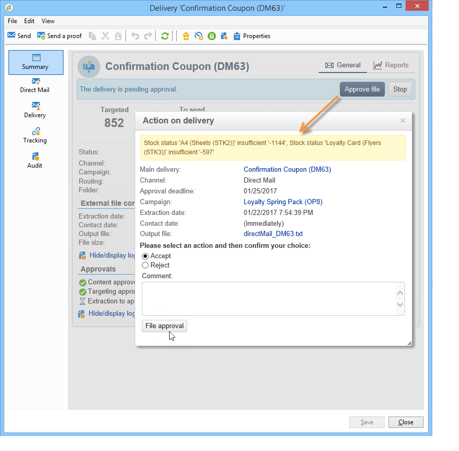

# Fornitori, scorte e budget{#providers-stocks-and-budgets}

 Adobe Campaign consente di definire i provider di servizi che saranno coinvolti nei processi svolti all&#39;interno delle campagne. Le informazioni relative ai fornitori di servizi e alle relative strutture di costi sono definite dall&#39;amministratore di Adobe Campaign  dalla vista principale. Il fornitore di servizi è indicato dalla fornitura e le sue strutture di costo consentono il calcolo dei costi associati a tale consegna nonché la gestione delle scorte in questione.

## Creazione di provider di servizi e relative strutture di costo {#creating-service-providers-and-their-cost-structures}

Ogni provider di servizi viene salvato in un file con i dati di contatto, i modelli di servizio e i processi correlati.

I provider di servizi sono configurati nel nodo **[!UICONTROL Administration > Campaign management]** della struttura.

I lavori svolti durante le consegne sono eseguiti dai prestatori di servizi, in particolare per la posta diretta e i canali mobili. Questi fornitori di servizi possono, ad esempio, essere coinvolti nella stampa o nella distribuzione di messaggi. Tali processi comportano configurazioni e costi specifici per ciascun fornitore di servizi. La configurazione dei fornitori di servizi comporta quattro fasi:

1. Creazione di un provider di servizi in  Adobe Campaign

   Vedere [Aggiunta di un provider di servizi](#adding-a-service-provider).

1. Definizione delle categorie di costi e delle strutture dei modelli di servizio associati

   Vedere [Definizione delle categorie di costi](#defining-cost-categories) e [Definizione della struttura dei costi](#defining-the-cost-structure).

1. Configurazione dei processi

   Vedere [Configurazione dei processi associati a un servizio](#configuring-processes-associated-with-a-service).

1. Riferimento al provider di servizi a livello di campagna

   Vedere [Associazione di un servizio a una campagna](#associating-a-service-with-a-campaign).

### Creazione di un provider di servizi e relative categorie di costi {#creating-a-service-provider-and-its-cost-categories}

#### Aggiunta di un provider di servizi {#adding-a-service-provider}

Puoi creare tutti i provider di servizi necessari per le consegne. La procedura per aggiungere un fornitore di servizi è la seguente:

1. Fare clic con il pulsante destro del mouse sull&#39;elenco dei provider di servizi e selezionare **[!UICONTROL New]** oppure fare clic sul pulsante **[!UICONTROL New]** sopra l&#39;elenco dei provider di servizi.
1. Nella sezione inferiore della finestra, specificate il nome e i recapiti del fornitore del servizio.

   

1. Fare clic sul pulsante **[!UICONTROL Save]** per aggiungere il provider di servizi all&#39;elenco.

#### Definizione delle categorie di costi {#defining-cost-categories}

È necessario associare i modelli di servizio a ciascun provider di servizi. In questi modelli è innanzitutto necessario identificare le categorie di costi e, se necessario, le scorte interessate. È quindi necessario creare le regole di calcolo dei costi per ciascuna categoria, tramite le strutture dei costi.

>[!NOTE]
>
>Per ulteriori informazioni, vedere [Definizione della struttura dei costi](#defining-the-cost-structure).

Una categoria di costi è un&#39;entità contenente un insieme di costi ammissibili per un tipo di consegna (e-mail, posta diretta, ecc.) o per un’attività. Le categorie di costi sono raggruppate nei modelli di servizi associati ai fornitori di servizi. Ogni provider di servizi può fare riferimento a uno o più modelli di servizio.

Per creare un modello di servizio e definirne il contenuto, effettuate le seguenti operazioni:

1. Nella scheda **[!UICONTROL Services]** del provider di servizi, fare clic sul pulsante **[!UICONTROL Add]** e assegnare un nome al modello di servizio.

   

1. Creare le categorie di costi per ciascun tipo di processo (consegna per posta diretta/e-mail/ecc. o attività). A questo scopo, fare clic sulla scheda **[!UICONTROL Cost categories]**, quindi sul pulsante **[!UICONTROL Add]**, quindi inserire i parametri di ciascuna categoria di costo.

   

   * Inserire un&#39;etichetta per questa categoria di costi e selezionare il tipo di processo interessato: Consegna da **[!UICONTROL Direct mail]**, **[!UICONTROL E-mail]**, **[!UICONTROL Mobile]**, **[!UICONTROL Telephone]** o **[!UICONTROL Task]**.
   * Fare clic sul pulsante **[!UICONTROL Add]** per definire i tipi di costo associati a questa categoria.
   * Se necessario, ha associato una linea di magazzino a ciascun tipo di costo in modo che i quantitativi utilizzati siano automaticamente correlati alle scorte esistenti.

      >[!NOTE]
      >
      >Le linee di magazzino sono definite nel nodo **[!UICONTROL Stock management]**.\
      >Per ulteriori informazioni, fare riferimento a [Gestione scorte e ordini](#stock-and-order-management).

1. È possibile pre-selezionare un valore per questa categoria di costi, che verrà offerta per impostazione predefinita nelle categorie di costi del provider di servizi (invece di un valore vuoto). A tal fine, selezionate l&#39;opzione nella colonna **[!UICONTROL Selected]** per il tipo di categoria in questione:

   

   A livello di consegna, il valore verrà selezionato per impostazione predefinita:

   

### Definizione della struttura dei costi {#defining-the-cost-structure}

Per ciascun tipo di costo, una struttura di costi specifica le regole di calcolo da applicare.

Fare clic sulla scheda **[!UICONTROL Cost structure]** per configurare il calcolo dei costi per ogni categoria e tipo di costo. Fare clic su **[!UICONTROL Add]** e inserire la struttura dei costi.

* Per creare la struttura dei costi, selezionare il tipo di messaggio e la categoria di costi interessati dagli elenchi a discesa, nonché il tipo di costo a cui si applicherà la regola di calcolo. Il contenuto di questi elenchi a discesa deriva dalle informazioni immesse tramite la scheda **[!UICONTROL Cost categories]**.

   È necessario assegnare un&#39;etichetta alla struttura dei costi. Per impostazione predefinita, il modello di consegna è il seguente: **Categoria di costo - Tipo di costo**.

   È tuttavia possibile rinominarlo: immettere il valore desiderato direttamente nel campo **[!UICONTROL Label]**.

* La formula di calcolo del costo è definita nella sezione inferiore della finestra.

   Questa formula può essere fissa (per qualsiasi numero di messaggi) o calcolata in base al numero di messaggi.

   Quando dipende dal numero di messaggi, la struttura di calcolo dei costi può essere **[!UICONTROL Linear]**, **[!UICONTROL Linear by threshold]** o **[!UICONTROL Constant by threshold]**.

#### Struttura lineare {#linear-structure}

Se l&#39;importo è sempre lo stesso per un messaggio (o un batch di messaggi) indipendentemente dal numero totale di messaggi, selezionare **[!UICONTROL Linear]** e immettere il costo di ciascun messaggio.

Se questo importo si applica a un batch di messaggi, specifica il numero di messaggi interessati nel campo **[!UICONTROL for]**.

#### Struttura lineare per soglia {#linear-structure-by-threshold}

Se l&#39;importo viene applicato per soglia per ciascun messaggio, è necessario definire una struttura di calcolo **[!UICONTROL Linear by threshold]**. In questo tipo di struttura dei costi, ogni messaggio costerà 0,13, ad esempio, se il numero totale di messaggi è compreso tra 1 e 100 e costerà 0,12 da 100 a 1000 messaggi inviati, o 0,11 oltre 1000 messaggi.

La configurazione sarà la seguente:

Per aggiungere una soglia, fate clic sul pulsante **[!UICONTROL Add]** a destra dell&#39;elenco.

#### Struttura costante per soglia {#constant-structure-by-threshold}

Infine, puoi configurare un calcolo dei costi in base al numero totale di messaggi. A tal fine, selezionare una struttura di calcolo **[!UICONTROL Constant by threshold]**. Ad esempio, il costo verrà fissato a un importo fisso di 12,00 per 1 a 100 messaggi e a 100,00 per una consegna di 101 a 1000 messaggi e a 500,00 per ogni consegna su 1000 messaggi, indipendentemente dal numero totale.

### Configurazione dei processi associati a un servizio {#configuring-processes-associated-with-a-service}

È possibile associare informazioni sui processi associati al servizio tramite la scheda **[!UICONTROL Processes]**.

A questo scopo, fare clic sulla scheda **[!UICONTROL Processes]** per configurare l&#39;invio di informazioni al router.

* La sezione **[!UICONTROL File extraction]** indica il modello di esportazione utilizzato per la consegna quando il servizio è selezionato. È possibile indicare il nome del file di output nel campo **[!UICONTROL Extraction file]**. Il pulsante a destra del campo consente di inserire le variabili.

   

* La sezione **[!UICONTROL Notification e-mail]** consente di specificare il modello da inviare ai provider di servizi dopo l&#39;invio dei file. Selezionate il modello utilizzato per creare il messaggio di avviso e il gruppo di destinatari.

   Per impostazione predefinita, i modelli di consegna per i messaggi di notifica vengono salvati nel nodo **[!UICONTROL Administration > Campaign management > Technical delivery templates]**, accessibile dalla vista generale.

* La sezione **[!UICONTROL Post-processing]** consente di selezionare il flusso di lavoro da avviare dopo che la consegna è stata approvata. Se viene immesso un modello di workflow, verrà automaticamente creata un&#39;istanza del flusso di lavoro e quindi avviata non appena l&#39;approvazione avrà effetto. Questo flusso di lavoro può inviare il file di estrazione a un provider di servizi esterno per l&#39;elaborazione, ad esempio.

### Associazione di un servizio a una campagna {#associating-a-service-with-a-campaign}

I servizi sono associati alle campagne tramite consegne o attività. I fornitori di servizi sono collegati ai modelli di consegna per offrire i propri servizi nelle consegne create tramite questo modello.

Quando un servizio è selezionato, le categorie di costi corrispondenti al tipo di consegna (posta diretta, e-mail, ecc.) sono indicate automaticamente nella tabella centrale insieme alle opzioni di elaborazione definite.

>[!NOTE]
>
>Se non viene visualizzata alcuna categoria di costi quando un servizio è selezionato, significa che non è stata definita alcuna categoria di costi per questo tipo di processo. Ad esempio, per una consegna tramite e-mail, se non è stata definita alcuna categoria di costi di tipo **[!UICONTROL E-mail]**, non verrà visualizzata alcuna categoria e la selezione del servizio non avrà alcun effetto.

* Per la consegna diretta, potete selezionare il servizio dalla finestra di configurazione.

   

* Per la distribuzione su canali mobili o telefonici, si applica la stessa modalità di selezione.
* Per una consegna tramite e-mail, il servizio viene selezionato dalla scheda **[!UICONTROL Advanced]** nelle proprietà di consegna, come nell&#39;esempio seguente:

   

La colonna **[!UICONTROL Amount to surcharge]** consente di aggiungere un costo per questa categoria nel contesto della consegna o dell&#39;attività in questione.

È possibile imporre la selezione obbligatoria di un tipo di costo durante la definizione delle categorie di costi per una consegna. A questo scopo, selezionare **[!UICONTROL A cost type must be selected]**.

## Gestione di scorte e ordini {#stock-and-order-management}

I tipi di costo possono essere associati alle linee di magazzino per gestire avvisi, tenere traccia delle forniture e degli ordini di avvio.

La procedura per la costituzione della gestione delle scorte e degli ordini in  Adobe Campaign e gli operatori avvisatori in caso di scorte insufficienti per la consegna è la seguente:

1. Creazione di scorte e riferimento a fornitori di servizi associati

   Vedere [Creazione di una risorsa](#creating-a-stock).

1. Aggiunta di linee di azione

   Vedere [Aggiunta di linee di magazzino](#adding-stock-lines).

1. Notifica agli operatori in caso di segnalazione

   Vedere [Operatori di avvisi](#alerting-operators).

1. Ordini e forniture.

   Fare riferimento a [Ordini](#orders).

### Gestione delle scorte {#stock-management}

 Adobe Campaign può avvisare un gruppo di operatori se le scorte sono esaurite o hanno raggiunto una soglia minima. I livelli delle scorte sono accessibili tramite il collegamento **[!UICONTROL Stocks]** dell&#39;universo **[!UICONTROL Campaigns]** attraverso il collegamento **[!UICONTROL Other choices]** dell&#39;area di navigazione.

#### Creazione di una risorsa {#creating-a-stock}

Per creare un nuovo stock, effettuate le seguenti operazioni:

1. Fare clic sul pulsante **[!UICONTROL Create]** sopra l&#39;elenco delle scorte.
1. Immettete l&#39;etichetta del magazzino e selezionate il provider di servizi a cui è associato dall&#39;elenco a discesa.

   

   >[!NOTE]
   >
   >Per ulteriori informazioni, vedere [Creazione di provider di servizi e relative strutture di costo](#creating-service-providers-and-their-cost-structures).

#### Aggiunta di righe di magazzino {#adding-stock-lines}

Una scorta comprende varie linee di magazzino. Una linea di magazzino contiene una quantità iniziale di risorse che verranno consumate dalle consegne. Ogni linea di magazzino indica la quantità consumata, la quantità in magazzino e la quantità ordinata.

Quando create una risorsa, fate clic sulla scheda **[!UICONTROL Stock lines]** per aggiungere nuove righe.

Una volta creata la risorsa, fate clic su di essa per modificarla e utilizzate il dashboard per creare e visualizzare le linee della risorsa.

Fate clic sul pulsante **[!UICONTROL Create]** per definire i parametri di magazzino.

* Indicare la quantità inizialmente in magazzino nel campo **[!UICONTROL Initial stock]**. I campi **[!UICONTROL Consumed]** e **[!UICONTROL In stock]** vengono calcolati automaticamente e aggiornati all&#39;avanzamento delle campagne.

   

* Indicare la soglia a partire dalla quale gli operatori devono essere avvisati per ordinare le scorte nel campo **[!UICONTROL Alert level]**. Quando viene raggiunto il livello di avviso, nella finestra di approvazione delle consegne che utilizzano questo stock viene visualizzato un messaggio di avviso.

#### Associazione di un&#39;azione a categorie di costi {#associating-a-stock-with-cost-categories}

Per un determinato fornitore di servizi, in un servizio, una delle categorie di costi può fare riferimento a una linea di azioni, come segue:

### Tracciamento scorte {#stock-tracking}

#### Avvisi operatori {#alerting-operators}

Viene visualizzato un avviso quando una scorta cui viene fatto riferimento in una consegna è insufficiente. Ad esempio, quando viene approvato un file di estrazione, viene visualizzato il seguente avviso:

#### Ordini {#orders}

La scheda secondaria **[!UICONTROL Orders]** consente di visualizzare gli ordini correnti e salvare i nuovi ordini.

Per salvare un ordine, modificare la linea di magazzino di destinazione, fare clic sul pulsante **[!UICONTROL Add]** e specificare la data di consegna e la quantità ordinata.

>[!NOTE]
>
>Una volta raggiunta la data di consegna, la linea ordinata scompare automaticamente e la quantità immessa nel campo **[!UICONTROL Volume on order]** viene aggiunta alla scheda **[!UICONTROL Tracking]**. Questa quantità viene aggiunta automaticamente al volume delle scorte.

La scheda **[!UICONTROL Consumptions]** contiene il volume consumato per campagna. Le informazioni di questa scheda vengono immesse automaticamente in base alle consegne eseguite. Fate clic sul pulsante **[!UICONTROL Edit]** per aprire la campagna in questione.

## Calcolo budget {#calculating-budgets}

### Principio {#principle}

I costi vengono gestiti per consegne e campagne. In base ai progressi compiuti, tali costi sono assegnati ai bilanci.

I costi di consegna per una campagna sono consolidati a livello di campagna e i costi di tutte le campagne di un programma sono trasferiti al programma a cui sono associati. I report dedicati consentono di tenere traccia dei budget per l&#39;intera piattaforma o per ciascun piano e ciascun programma.

### Implementazione {#implementation}

In una campagna, quando si seleziona il budget è necessario inserire l&#39;importo iniziale. I costi calcolati saranno aggiornati automaticamente in base al livello di impegno degli importi inseriti (spese sostenute, attese, riservate, impegnate). Vedere [Calcolo degli importi](../../campaign/using/controlling-costs.md#calculating-amounts).

>[!NOTE]
>
>La procedura per la creazione dei budget è presentata in [Creazione di un budget](../../campaign/using/controlling-costs.md#creating-a-budget).

