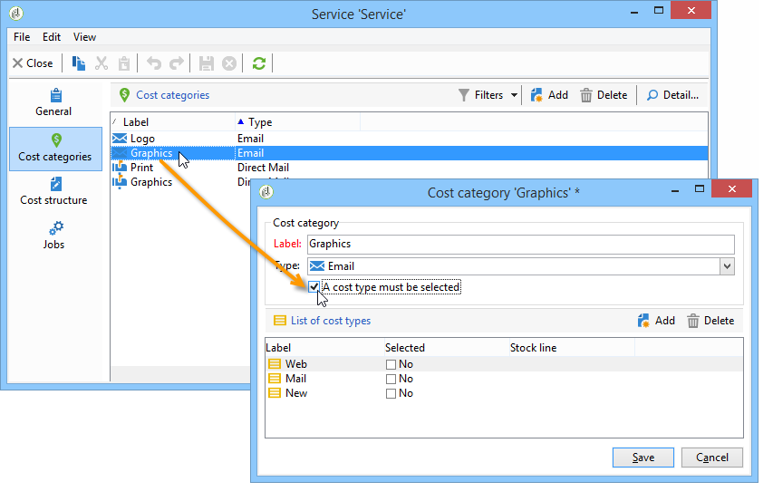

# Fornitori, scorte e budget{#providers-stocks-and-budgets}

Adobe Campaign consente di definire i provider di servizi che saranno coinvolti nei processi eseguiti all’interno delle campagne. Le informazioni relative ai fornitori di servizi e alle relative strutture di costo sono definite dall’amministratore di Adobe Campaign a partire dalla visualizzazione principale. Il fornitore di servizi è indicato dalla consegna e la sua struttura dei costi consente il calcolo dei costi associati a tale consegna e la gestione delle scorte in questione.

## Creazione di fornitori di servizi e delle relative strutture dei costi {#creating-service-providers-and-their-cost-structures}

Ogni provider di servizi viene salvato in un file con i dettagli dei contatti, i modelli di servizio e i processi correlati.

I provider di servizi sono configurati in **[!UICONTROL Administration > Campaign management]** dell&#39;albero.

I lavori svolti durante le consegne sono svolti da fornitori di servizi, in particolare per la direct mailing e i canali mobili. Questi fornitori di servizi possono, ad esempio, essere coinvolti nella stampa o nella distribuzione di messaggi. Questi lavori comportano configurazioni e costi specifici per ciascun fornitore di servizi. La configurazione dei prestatori di servizi prevede quattro fasi:

1. Creazione di un provider di servizi in Adobe Campaign

   Consulta [Aggiunta di un provider di servizi](#adding-a-service-provider).

1. Definizione delle categorie di costo e delle strutture dei modelli di servizio associati

   Consulta [Definizione delle categorie di costo](#defining-cost-categories) e [Definizione della struttura dei costi](#defining-the-cost-structure).

1. Configurazione dei processi

   Consulta [Configurazione dei processi associati a un servizio](#configuring-processes-associated-with-a-service).

1. Riferimento al fornitore di servizi a livello di campagna

   Consulta [Associazione di un servizio a una campagna](#associating-a-service-with-a-campaign).

### Creazione di un fornitore di servizi e delle relative categorie di costo {#creating-a-service-provider-and-its-cost-categories}

#### Aggiunta di un provider di servizi {#adding-a-service-provider}

Puoi creare tutti i provider di servizi necessari per le consegne. La procedura per aggiungere un fornitore di servizi è la seguente:

1. Fare clic con il pulsante destro del mouse sull&#39;elenco dei provider di servizi e selezionare **[!UICONTROL New]**, oppure fai clic su **[!UICONTROL New]** sopra l&#39;elenco dei fornitori di servizi.
1. Nella sezione inferiore della finestra specificare il nome e i recapiti del provider di servizi.

   

1. Fai clic su **[!UICONTROL Save]** per aggiungere il provider di servizi all&#39;elenco.

#### Definizione delle categorie di costo {#defining-cost-categories}

È necessario associare i modelli di servizio a ciascun provider di servizi. In questi modelli, è necessario innanzitutto identificare le categorie di costo e, se necessario, lo stock interessato. È quindi necessario creare le regole di calcolo dei costi per ogni categoria tramite le strutture dei costi.

>[!NOTE]
>
>Per ulteriori informazioni, consulta [Definizione della struttura dei costi](#defining-the-cost-structure).

Una categoria di costi è un’entità contenente una serie di costi ammissibili per un tipo di consegna (e-mail, direct mailing, ecc.) o per un&#39;attività. Le categorie di costo sono raggruppate nei modelli dei servizi associati ai fornitori di servizi. Ogni provider di servizi può fare riferimento a uno o più modelli di servizio.

Per creare un modello di servizio e definirne il contenuto, attenersi alla procedura descritta di seguito.

1. In **[!UICONTROL Services]** del provider di servizi, fare clic sul pulsante **[!UICONTROL Add]** e denominare il modello di servizio.

   

1. Crea le categorie di costo per ogni tipo di processo (consegna tramite direct mailing/e-mail/ecc.). o attività). A questo scopo, fai clic su **[!UICONTROL Cost categories]** e quindi la scheda **[!UICONTROL Add]** e inserire i parametri di ciascuna categoria di costo.

   

   * Immettere un&#39;etichetta per questa categoria di costi e selezionare il tipo di processo interessato: Consegna per **[!UICONTROL Direct mail]**, **[!UICONTROL Email]**, **[!UICONTROL Mobile]**, **[!UICONTROL Telephone]** o **[!UICONTROL Task]**.
   * Fai clic su **[!UICONTROL Add]** per definire i tipi di costo associati a questa categoria.
   * Se necessario, associare una linea di magazzino a ciascun tipo di costo in modo che le quantità utilizzate vengano automaticamente correlate alle scorte esistenti.

     >[!NOTE]
     >
     >Le linee delle scorte sono definite nella **[!UICONTROL Stock management]** nodo.\
     >Per ulteriori informazioni, consulta [Gestione di scorte e ordini](#stock-and-order-management).

1. È possibile preselezionare un valore per questa categoria di costo, che verrà offerta per impostazione predefinita nelle categorie di costo fornitore di servizi (anziché una vuota). A questo scopo, seleziona l’opzione nella sezione **[!UICONTROL Selected]** colonna relativa al tipo di categoria interessata:

   

   A livello di consegna, il valore viene selezionato per impostazione predefinita:

   

### Definizione della struttura dei costi {#defining-the-cost-structure}

Per ogni tipo di costo, una struttura di costo specifica le regole di calcolo da applicare.

Fai clic su **[!UICONTROL Cost structure]** per configurare il calcolo del costo per ogni categoria e tipo di costo. Clic **[!UICONTROL Add]** e inserire la struttura dei costi.

* Per creare la struttura dei costi, selezionare il tipo di messaggio e la categoria di costo interessati dagli elenchi a discesa, nonché il tipo di costo a cui verrà applicata la regola di calcolo. Il contenuto di questi elenchi a discesa proviene dalle informazioni immesse tramite **[!UICONTROL Cost categories]** scheda.

  È necessario assegnare un&#39;etichetta alla struttura dei costi. Per impostazione predefinita, presenta la seguente struttura di consegna: **Categoria di costo - Tipo di costo**.

  Tuttavia, puoi rinominarlo: inserisci il valore desiderato direttamente in **[!UICONTROL Label]** campo.

* La formula di calcolo dei costi è definita nella sezione inferiore della finestra.

  Questa formula può essere corretta (per qualsiasi numero di messaggi) o calcolata in base al numero di messaggi.

  Quando dipende dal numero di messaggi, la struttura di calcolo dei costi può essere **[!UICONTROL Linear]**, **[!UICONTROL Linear by threshold]**, o **[!UICONTROL Constant by threshold]**.

#### Struttura lineare {#linear-structure}

Se la quantità di messaggi è sempre la stessa per un messaggio (o un batch di messaggi) indipendentemente dal numero totale di messaggi, seleziona **[!UICONTROL Linear]** e inserisci il costo di ciascun messaggio.

Se questo importo si applica a un batch di messaggi, specificare il numero di messaggi interessati nel campo **[!UICONTROL for]** campo.

#### Struttura lineare per soglia {#linear-structure-by-threshold}

Se l’importo si applica per soglia per ogni messaggio, devi definire un **[!UICONTROL Linear by threshold]** struttura di calcolo. In questo tipo di struttura di costo, ogni messaggio costerà 0,13, ad esempio, se il numero totale di messaggi è compreso tra 1 e 100, e costerà 0,12 da 100 a 1000 messaggi inviati, oppure 0,11 da 1000 messaggi.

La configurazione sarà la seguente:

Per aggiungere una soglia, fare clic su **[!UICONTROL Add]** a destra dell&#39;elenco.

#### Struttura costante per soglia {#constant-structure-by-threshold}

Infine, puoi configurare un calcolo dei costi in base al numero totale di messaggi. A questo scopo, seleziona una **[!UICONTROL Constant by threshold]** struttura di calcolo. Ad esempio, il costo verrà impostato su un importo fisso di 12.00 per 1-100 messaggi e su 100.00 per una consegna di 101-1000 messaggi e su 500.00 per una consegna superiore a 1000 messaggi, indipendentemente dal numero totale.

### Configurazione dei processi associati a un servizio {#configuring-processes-associated-with-a-service}

È possibile associare informazioni sui processi associati al servizio tramite **[!UICONTROL Processes]** scheda.

A questo scopo, fai clic su **[!UICONTROL Processes]** per configurare l&#39;invio di informazioni al router.

* Il **[!UICONTROL File extraction]** indica il modello di esportazione utilizzato per la consegna quando viene selezionato questo servizio. È possibile indicare il nome del file di output nel **[!UICONTROL Extraction file]** campo. Il pulsante a destra del campo consente di inserire le variabili.

  

* Il **[!UICONTROL Notification email]** sezione consente di specificare il modello per la notifica ai provider di servizi dopo l&#39;invio dei file. Selezionare il modello utilizzato per creare il messaggio di avviso e il gruppo di destinatari.

  Per impostazione predefinita, i modelli di consegna per i messaggi di notifica vengono salvati in **[!UICONTROL Administration > Campaign management > Technical delivery templates]** , accessibile dalla vista generale.

* Il **[!UICONTROL Post-processing]** consente di selezionare il flusso di lavoro da avviare dopo l’approvazione della consegna. Se viene immesso un modello di flusso di lavoro, viene creata automaticamente un’istanza di flusso di lavoro e quindi viene avviata non appena l’approvazione diventa effettiva. Questo flusso di lavoro può inviare il file di estrazione a un provider di servizi esterno, ad esempio per l’elaborazione.

### Associazione di un servizio a una campagna {#associating-a-service-with-a-campaign}

I servizi sono associati alle campagne tramite consegne o attività. I provider di servizi sono collegati a modelli di consegna per offrire i propri servizi nelle consegne create tramite questo modello.

Quando viene selezionato un servizio, le categorie di costo corrispondenti al tipo di consegna (direct mailing, e-mail, ecc.) vengono indicate automaticamente nella tabella centrale insieme alle opzioni di elaborazione definite.

>[!NOTE]
>
>Se quando si seleziona un servizio non viene visualizzata alcuna categoria di costo, significa che per questo tipo di processo non è stata definita alcuna categoria di costo. Ad esempio, per una consegna e-mail, se no **[!UICONTROL Email]** tipo di categoria di costo definita, non verrà visualizzata alcuna categoria e la selezione del servizio non avrà alcun effetto.

* Per una consegna direct mailing, puoi selezionare il servizio dalla finestra di configurazione.

  

* Per le consegne su canali mobili o telefono, si applica la stessa modalità di selezione.
* Per una consegna e-mail, il servizio viene selezionato da **[!UICONTROL Advanced]** nelle proprietà di consegna, come nell’esempio seguente:

  

Il **[!UICONTROL Amount to surcharge]** consente di aggiungere un costo per questa categoria nel contesto della consegna o dell’attività interessata.

È possibile imporre la selezione obbligatoria di un tipo di costo durante la definizione delle categorie di costo per una consegna. A questo scopo, seleziona **[!UICONTROL A cost type must be selected]**.

## Gestione di scorte e ordini {#stock-and-order-management}

I tipi di costo possono essere associati alle linee delle scorte per gestire gli avvisi, tenere traccia delle forniture e avviare gli ordini.

La procedura per impostare la gestione delle scorte e degli ordini in Adobe Campaign e avvisare gli operatori in caso di forniture insufficienti per una consegna è la seguente:

1. Creazione di scorte e riferimento di prestatori di servizi associati

   Consulta [Creazione di un grezzo](#creating-a-stock).

1. Aggiunta di linee di magazzino

   Consulta [Aggiunta di linee di magazzino](#adding-stock-lines).

1. Notifica agli operatori in caso di avviso

   Consulta [Avvisi degli operatori](#alerting-operators).

1. Ordini e forniture.

   Fai riferimento a [Ordini](#orders).

### Gestione delle scorte {#stock-management}

Adobe Campaign può avvisare un gruppo di operatori se le scorte sono esaurite o hanno raggiunto una soglia minima. I livelli delle scorte sono accessibili tramite **[!UICONTROL Stocks]** collegamento del **[!UICONTROL Campaigns]** tramite la scheda **[!UICONTROL Other choices]** collegamento dell’area di navigazione.

#### Creazione di un grezzo {#creating-a-stock}

Per creare un nuovo materiale grezzo, applicate le seguenti operazioni:

1. Fai clic su **[!UICONTROL Create]** sopra l’elenco delle scorte.
1. Immettere l&#39;etichetta del titolo e selezionare dall&#39;elenco a discesa il fornitore di servizi a cui è associato.

   

   >[!NOTE]
   >
   >Per ulteriori informazioni, consulta [Creazione di fornitori di servizi e delle relative strutture dei costi](#creating-service-providers-and-their-cost-structures).

#### Aggiunta di linee di magazzino {#adding-stock-lines}

Un magazzino comprende varie linee di magazzino. Una linea magazzino contiene una quantità iniziale di risorse che verranno consumate dalle consegne. Ogni linea magazzino indica la quantità consumata, la quantità in magazzino e la quantità ordinata.

Quando create un grezzo, fate clic su **[!UICONTROL Stock lines]** per aggiungere nuove righe.

Una volta creato il grezzo, fate clic su di esso per modificarlo e utilizzate il relativo quadro comandi per creare e visualizzare le linee del grezzo.

Fai clic su **[!UICONTROL Create]** per definire i parametri del grezzo.

* Indicare la quantità inizialmente in giacenza nel **[!UICONTROL Initial stock]** campo. Il **[!UICONTROL Consumed]** e **[!UICONTROL In stock]** I campi vengono calcolati automaticamente e aggiornati in base all’avanzamento delle campagne.

  

* Indicare la soglia a partire dalla quale gli operatori devono essere avvisati di ordinare le scorte nella **[!UICONTROL Alert level]** campo. Quando viene raggiunto il livello di avviso, nella finestra di approvazione delle consegne che utilizzano questo stock viene visualizzato un messaggio di avviso.

#### Associazione di un magazzino a categorie di costo {#associating-a-stock-with-cost-categories}

Per un determinato fornitore di servizi, in un servizio, una linea di magazzino può essere referenziata da una delle categorie di costo, come segue:

### Tracciamento magazzino {#stock-tracking}

#### Avvisi degli operatori {#alerting-operators}

Viene visualizzato un avviso quando una scorta a cui si fa riferimento in una consegna è insufficiente. Ad esempio, quando viene approvato un file di estrazione, viene visualizzato il seguente avviso:

#### Ordini {#orders}

Il **[!UICONTROL Orders]** scheda secondaria consente di visualizzare gli ordini correnti e salvare i nuovi ordini.

Per salvare un ordine, modificare la linea del magazzino di destinazione, fare clic su **[!UICONTROL Add]** e specificare la data di consegna e la quantità ordinata.

>[!NOTE]
>
>Una volta raggiunta la data di consegna, la linea delle scorte ordinate scompare automaticamente e la quantità inserita nella **[!UICONTROL Volume on order]** è stato aggiunto al **[!UICONTROL Tracking]** scheda. Questa quantità viene aggiunta automaticamente al volume delle scorte.

Il **[!UICONTROL Consumptions]** contiene il volume utilizzato per campagna. Le informazioni di questa scheda vengono immesse automaticamente in base alle consegne eseguite. Fai clic su **[!UICONTROL Edit]** per aprire la campagna in questione.

## Calcolo dei budget {#calculating-budgets}

### Principio {#principle}

I costi vengono gestiti per consegne e campagne. In funzione dei progressi compiuti, tali costi sono imputati ai bilanci.

I costi di consegna di una campagna sono consolidati a livello di campagna e i costi di tutte le campagne di un programma vengono trasferiti al programma a cui sono associati. I rapporti dedicati consentono di tenere traccia dei budget per l’intera piattaforma o per ciascun piano e programma.

### Implementazione {#implementation}

In una campagna, quando selezioni il budget devi inserire l&#39;importo iniziale. I costi calcolati vengono aggiornati automaticamente in base al livello di impegno degli importi inseriti (spese effettuate, previste, impegnate, impegnate). Consulta [Calcolo degli importi](../../mrm/using/controlling-costs.md#calculating-amounts).

>[!NOTE]
>
>La procedura per la creazione dei budget è descritta in [Creazione di un budget](../../mrm/using/controlling-costs.md#creating-a-budget).
