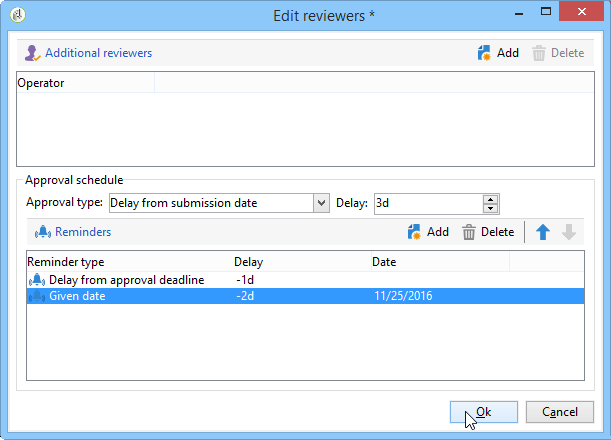

# Pubblicazione del pacchetto della campagna{#publishing-the-campaign-package}

Gli operatori di entità centrali pubblicano le campagne che desiderano offrire alle entità locali in **[!UICONTROL list of campaign packages]**.

Prima di poter essere pubblicati nell&#39;elenco dei pacchetti della campagna, i pacchetti della campagna devono essere approvati dall&#39;entità centrale. A questo scopo, potete specificare un revisore o un gruppo di revisori tramite il collegamento **[!UICONTROL Approval parameters]** nel pacchetto della campagna.

## Assegnazione di un revisore {#assigning-a-reviewer}

Per selezionare il revisore, fate clic sul collegamento **[!UICONTROL Approval parameters]** nel pacchetto della campagna e scegliete il revisore appropriato dall&#39;elenco a discesa.

È quindi possibile avviare il processo di approvazione facendo clic su **[!UICONTROL Submit for approval]**.

Viene quindi inviato un messaggio di notifica al revisore per confermare la disponibilità del pacchetto della campagna. Il messaggio contiene un collegamento per accettare o rifiutare l&#39;approvazione tramite accesso Web.

>[!NOTE]
>
>A livello di entità organizzativa, potete anche specificare i revisori per approvare gli ordini. Per ulteriori informazioni, fare riferimento a [Entità organizzative](../../campaign/using/about-distributed-marketing.md#organizational-entities).

## Aggiunta di altri revisori {#adding-other-reviewers}

Potete aggiungere altri revisori dal collegamento **[!UICONTROL Edit...]**, disponibile nella scheda **[!UICONTROL Approval parameters...]** del pacchetto della campagna.

## Periodi di approvazione {#approval-periods}

Per impostazione predefinita, ai revisori vengono assegnati tre giorni dalla data di invio per elaborare l’approvazione.

Nella finestra dei revisori delle modifiche, potete anche impostare i promemoria per inviare uno o più messaggi se un pacchetto di campagna non è stato approvato. A tal fine, fare clic sul collegamento **[!UICONTROL Add reminder]**, quindi sul pulsante **[!UICONTROL Add]**.

I promemoria possono essere inviati in una data specificata e/o **x** giorni successivi alla data di invio. Il tipo di promemoria può essere configurato nella prima colonna della tabella dei promemoria. Nell&#39;esempio riportato di seguito, i revisori riceveranno un messaggio di promemoria sulla data del 29/01/2014, ossia due giorni prima della data selezionata nella colonna **[!UICONTROL Date]**, e un secondo promemoria un giorno prima della fine del periodo di approvazione, ossia due giorni dopo la data di invio per l&#39;approvazione.

Una volta definito e inviato il pacchetto per l&#39;approvazione, il programma di esecuzione viene visualizzato nella scheda **[!UICONTROL Audit]**. Mostra la scadenza di elaborazione calcolata in base alla configurazione precedente, nonché le date di tutti i promemoria configurati.

## Approvazione tramite la console Adobe Campaign  {#approving-via-the-adobe-campaign-console}

Se non è stato specificato alcun revisore o se nessuno degli operatori notificati ha approvato il pacchetto, il pulsante **[!UICONTROL Approve the package]** consente di passare direttamente all&#39;approvazione dal pacchetto della campagna **[!UICONTROL Dashboard]** o dalla panoramica dei pacchetti.

Dopo l&#39;approvazione, la campagna viene pubblicata, aggiunta all&#39;elenco e, non appena viene raggiunta la data di disponibilità, le entità locali possono utilizzarla. Se durante la creazione della campagna sono state specificate delle entità locali, agli operatori del gruppo di notifiche viene inviato un messaggio per informarli che la campagna è disponibile. Se non è stata specificata alcuna entità in anticipo, per impostazione predefinita la campagna è disponibile per tutte le entità locali. Per ulteriori informazioni, fare riferimento a [Entità organizzative](../../campaign/using/about-distributed-marketing.md#organizational-entities).
