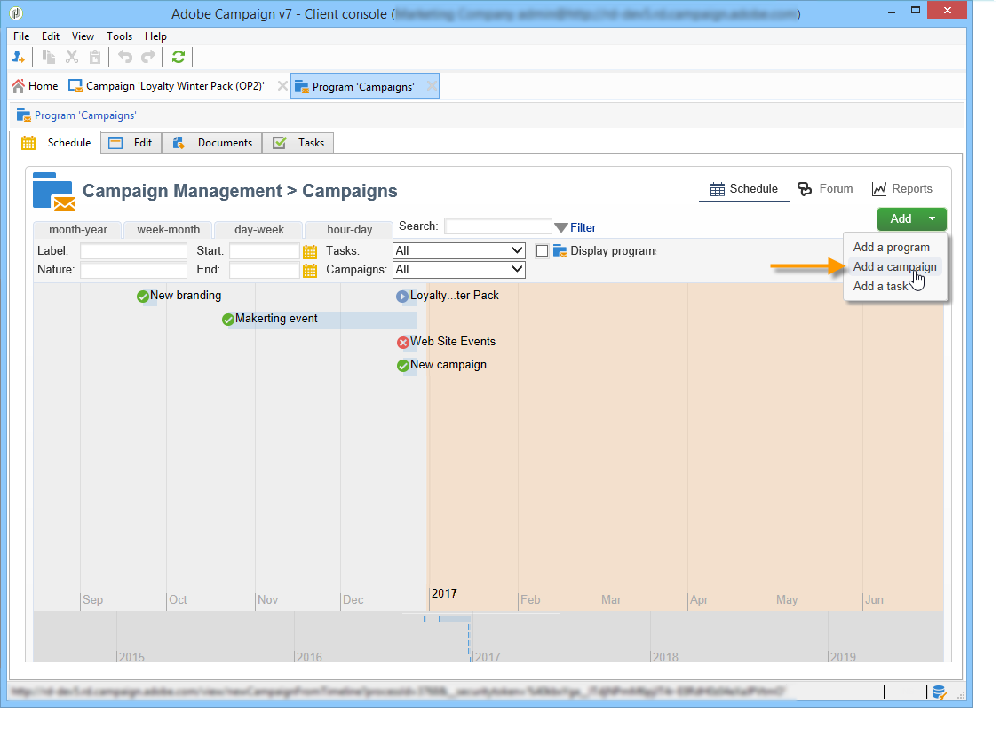
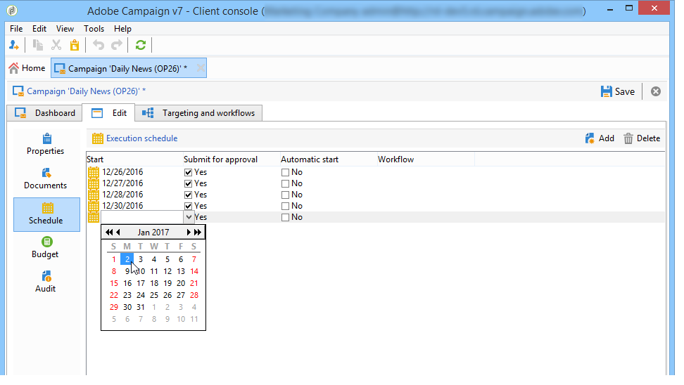
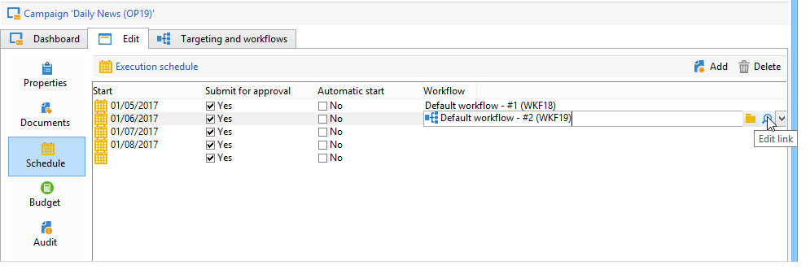

# Introduzione alle campagne di marketing{#setting-up-marketing-campaigns}

Le campagne includono azioni (consegne), processi (importazione o estrazione file) e risorse (documenti di marketing, descrizioni della consegna). Vengono utilizzati nelle campagne di marketing. Le campagne fanno parte di un programma e i programmi sono inclusi in un piano di campagna.

 Scopri come creare un piano marketing, programmi e campagne [nel video](#video)

Per creare una campagna di marketing:

1. Creare una campagna: scopri le campagne e le loro caratteristiche: etichetta, tipo, date di inizio e fine, budget, risorse associate, manager e partecipanti. [Ulteriori informazioni](#creating-a-campaign).

1. Definire le popolazioni target: crea un flusso di lavoro con le query di targeting. [Ulteriori informazioni](../../campaign/using/marketing-campaign-deliveries.md#selecting-the-target-population).

1. Creare le consegne: seleziona i canali e definisci il contenuto da inviare. [Ulteriori informazioni](../../campaign/using/marketing-campaign-deliveries.md#creating-deliveries).

1. Approvare le consegne. [Ulteriori informazioni](../../campaign/using/marketing-campaign-approval.md).

1. Monitorare le consegne. [Ulteriori informazioni](../../campaign/using/marketing-campaign-monitoring.md).

1. Pianificare campagne e costi associati. [Ulteriori informazioni](../../campaign/using/providers-stocks-and-budgets.md#creating-service-providers-and-their-cost-structures).

Una volta completati questi passaggi, puoi avviare le consegne (consulta [questa sezione](../../campaign/using/marketing-campaign-deliveries.md#starting-a-delivery)), controllare i dati, i processi e le informazioni relativi alle consegne e, se necessario, gestire i documenti associati (consulta [questa sezione](../../campaign/using/marketing-campaign-deliveries.md#managing-associated-documents)). Puoi anche tenere traccia dell&#39;esecuzione delle fasi di elaborazione di campagne e consegne (consulta [questa sezione](../../campaign/using/marketing-campaign-monitoring.md)).

## Creare una gerarchia di piani e programmi {#creating-plan-and-program-hierarchy}

Per configurare la gerarchia di cartelle per i piani e i programmi di marketing:

1. Fai clic sull&#39;icona **Explorer** nella home page.
1. Fare clic con il pulsante destro del mouse sulla cartella in cui si desidera creare il piano.
1. Selezionare **Aggiungi nuova cartella > Gestione campagne > Piano**.

   

1. Rinominare il piano.
1. Fare clic con il pulsante destro del mouse sul piano appena creato e selezionare **Proprietà...**.

   

1. Nella scheda **Generale**, modifica **Nome interno** per evitare duplicati durante le esportazioni del pacchetto.
1. Fai clic su **Salva**.
1. Fare clic con il pulsante destro del mouse sul piano appena creato e selezionare **Crea una nuova cartella &#39;Programma&#39;**.
1. Ripetere i passaggi precedenti per rinominare la nuova cartella del programma e il relativo nome interno.

## Creare una campagna {#creating-a-campaign}

### Aggiungere una campagna {#adding-a-campaign}

Puoi creare una campagna tramite l’elenco delle campagne. Per visualizzare questa visualizzazione, selezionare il menu **[!UICONTROL Campaigns]** nel dashboard **[!UICONTROL Campaigns]**.

Il campo **[!UICONTROL Program]** consente di selezionare il programma a cui allegare la campagna. Queste informazioni sono obbligatorie.

Le campagne possono essere create anche tramite un programma. A tale scopo, fare clic sul pulsante **[!UICONTROL Add]** nella scheda **[!UICONTROL Schedule]** del programma interessato.

Quando si crea una campagna tramite la scheda **[!UICONTROL Schedule]** di un programma, la campagna viene automaticamente collegata al programma interessato. In questo caso, il campo **[!UICONTROL Program]** è nascosto.

Nella finestra di creazione della campagna, seleziona il modello della campagna e aggiungi un nome e una descrizione della campagna. Puoi anche specificare le date di inizio e di fine della campagna.

Fare clic su **[!UICONTROL OK]** per creare la campagna. Viene aggiunto alla pianificazione del programma.

>[!NOTE]
>
>Per filtrare le campagne da visualizzare, fare clic sul collegamento **[!UICONTROL Filter]** e selezionare lo stato delle campagne da visualizzare.

### Modificare e configurare una campagna {#editing-and-configuring-a-campaign}

Puoi quindi modificare la campagna appena creata e definirne i parametri.

Per aprire e configurare una campagna, selezionarla dalla pianificazione e fare clic su **[!UICONTROL Open]**.

Viene visualizzato il dashboard della campagna.

## Campagne ricorrenti e periodiche {#recurring-and-periodic-campaigns}

Una campagna ricorrente è una campagna basata su un modello specifico, i cui flussi di lavoro sono configurati per essere eseguiti in base a una pianificazione associata. I flussi di lavoro saranno pertanto ricorrenti all’interno di una campagna. Il targeting viene duplicato su ogni esecuzione e vengono tracciati i vari processi e le popolazioni di destinazione. È inoltre possibile eseguire in anticipo i target futuri, tramite il periodo di copertura durante la creazione automatica del flusso di lavoro, al fine di avviare simulazioni con le stime di target.

Una campagna periodica è una campagna creata automaticamente in base alla pianificazione di esecuzione del relativo modello.

### Creare una campagna ricorrente {#creating-a-recurring-campaign}

Le campagne ricorrenti vengono create da un modello specifico che definisce il modello di flusso di lavoro da eseguire e la pianificazione di esecuzione.

#### Creare un modello per le campagne ricorrenti {#creating-the-campaign-template}

1. Crea un modello di campagna **[!UICONTROL Recurring]**.

   >[!NOTE]
   >
   >Si consiglia di duplicare il modello predefinito invece di creare un modello vuoto.

   

1. Inserisci il nome del modello e la durata della campagna.

   

1. Per questo tipo di campagna, viene aggiunta una scheda **[!UICONTROL Schedule]** per creare la pianificazione di esecuzione del modello.

In questa scheda, specifica le date di esecuzione pianificate delle campagne basate su questo modello.

La modalità di configurazione della pianificazione di esecuzione coincide con l&#39;oggetto **[!UICONTROL Scheduler]** del flusso di lavoro. Per ulteriori informazioni al riguardo, consulta [questa sezione](../../workflow/using/architecture.md).

>[!IMPORTANT]
>
>La configurazione della pianificazione di esecuzione deve essere eseguita con attenzione per evitare un sovraccarico del database. Le campagne ricorrenti duplicano i flussi di lavoro del relativo modello a seconda della pianificazione specificata. L&#39;attuazione di una creazione di flussi di lavoro eccessivamente frequente può ostacolare il funzionamento della banca dati.

1. Specificare un valore nel campo **[!UICONTROL Create in advance for]** per creare i flussi di lavoro corrispondenti per il periodo indicato.
1. Crea il modello di flusso di lavoro da utilizzare nelle campagne basate su questo modello, con i parametri di targeting e una o più consegne generiche.

   >[!NOTE]
   >
   >Questo flusso di lavoro deve essere salvato come modello di flusso di lavoro ricorrente. A tale scopo, modificare le proprietà del flusso di lavoro e selezionare l&#39;opzione **[!UICONTROL Recurring workflow template]** nella scheda **[!UICONTROL Execution]**.

   

#### Creare la campagna ricorrente {#create-the-recurring-campaign}

Per creare la campagna ricorrente ed eseguire i relativi flussi di lavoro in base alla pianificazione definita nel modello, attieniti alla seguente procedura:

1. Crea una nuova campagna basata su un modello ricorrente.
1. Compila la pianificazione di esecuzione del flusso di lavoro.

   

1. La pianificazione della campagna consente di inserire una data di inizio per la creazione o l’esecuzione automatica del flusso di lavoro per ogni linea.

   Per ogni riga, puoi aggiungere le seguenti opzioni aggiuntive:

   * **[!UICONTROL To be approved]** : consente di forzare le richieste di approvazione della consegna nel flusso di lavoro.
   * **[!UICONTROL To be started]** : consente di avviare il flusso di lavoro quando viene raggiunta la data di inizio.

   Il campo **[!UICONTROL Create in advance for]** ti consente di creare tutti i flussi di lavoro che coprono il periodo inserito.

   All&#39;esecuzione del flusso di lavoro **[!UICONTROL Jobs on campaigns]**, i flussi di lavoro dedicati vengono creati in base alle occorrenze definite nella pianificazione della campagna. Viene quindi creato un flusso di lavoro per ogni data di esecuzione.

1. I flussi di lavoro ricorrenti vengono creati automaticamente dal modello di flusso di lavoro presente nella campagna. Sono visibili dalla scheda **[!UICONTROL Targeting and workflows]** della campagna.

   

   L’etichetta di un’istanza di flusso di lavoro ricorrente è costituita dall’etichetta del modello e dal numero del flusso di lavoro, con il carattere # tra i due.

   I flussi di lavoro creati dalla pianificazione vengono associati automaticamente alla pianificazione nella colonna **[!UICONTROL Workflow]** della scheda **[!UICONTROL Schedule]**.

   

   Ogni flusso di lavoro può essere modificato da questa scheda.

   

   >[!NOTE]
   >
   >La data di inizio della riga di pianificazione associata al flusso di lavoro è disponibile da una variabile del flusso di lavoro con la seguente sintassi:\
   >`$date(instance/vars/@startPlanningDate)`

### Creare una campagna periodica {#creating-a-periodic-campaign}

Una campagna periodica è una campagna basata su un modello specifico che consente di creare istanze della campagna in base a una pianificazione di esecuzione. Le istanze di Campaign vengono create automaticamente in base a un modello di campagna periodica, a seconda della frequenza definita nella pianificazione del modello.

#### Creare il modello della campagna {#creating-the-campaign-template-1}

1. Creare un modello di campagna **[!UICONTROL Periodic]**, preferibilmente duplicando un modello di campagna esistente.

   

1. Immetti le proprietà del modello.

   >[!NOTE]
   >
   >L’operatore a cui è assegnato il modello deve disporre dei diritti appropriati per creare campagne nel programma selezionato.

1. Crea il flusso di lavoro associato a questo modello. Verrà duplicato in ogni campagna periodica creata dal modello.

   

   >[!NOTE]
   >
   >Questo flusso di lavoro è un modello di workflow. Non può essere eseguito dal modello della campagna.

1. Completare la pianificazione dell&#39;esecuzione come per un modello di campagna ricorrente: fare clic sul pulsante **[!UICONTROL Add]** e definire le date di inizio e di fine oppure compilare la pianificazione dell&#39;esecuzione tramite il collegamento.

   

   >[!IMPORTANT]
   >
   >I modelli di campagna periodica creano nuove campagne in base alla pianificazione definita in precedenza. Deve quindi essere completata con attenzione, per evitare di sovraccaricare il database di Adobe Campaign.

1. Una volta raggiunta la data di inizio dell’esecuzione, la campagna corrispondente viene creata automaticamente. Assume tutte le caratteristiche del proprio modello.

   Ogni campagna può essere modificata tramite la pianificazione del modello.

   

Ogni campagna periodica contiene gli stessi elementi. Una volta creata, viene gestita come una campagna standard.

## Video tutorial {#video}

Questo video mostra come creare un piano di marketing, programmi e campagne.

>[!VIDEO](https://video.tv.adobe.com/v/326562?quality=12&captions=ita)

Ulteriori video dimostrativi di Campaign sono disponibili [qui](https://experienceleague.adobe.com/docs/campaign-classic-learn/tutorials/overview.html?lang=it).
