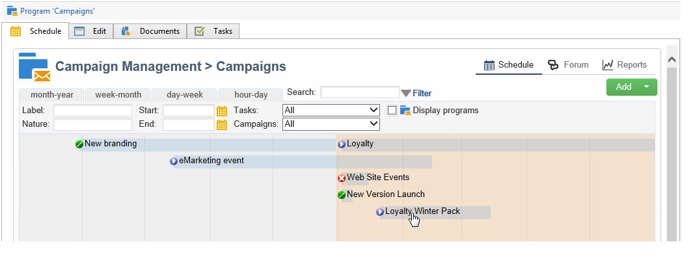

# Impostazione di campagne di marketing{#setting-up-marketing-campaigns}

Le campagne includono azioni (consegne) e processi (importazione o estrazione di file), nonché risorse (documenti di marketing, linee di consegna). Vengono utilizzati nelle campagne di marketing. Le campagne fanno parte di un programma e i programmi sono inclusi in un piano di campagna.

Per creare una campagna di marketing:

1. Creare una campagna: scopri le campagne e le loro caratteristiche: etichetta, tipo, date di inizio e fine, budget, risorse associate, manager e partecipanti.

   Consultate [Creazione di una campagna](#creating-a-campaign).

1. Definire le popolazioni target: creare un flusso di lavoro con query di targeting.

   Consultate [Selezione della popolazione](../../campaign/using/marketing-campaign-deliveries.md#selecting-the-target-population)di destinazione.

1. Crea consegne: selezionare i canali e definire il contenuto da inviare.

   Consultate [Creazione di consegne](../../campaign/using/marketing-campaign-deliveries.md#creating-deliveries).

1. Approvare le consegne.

   Fare riferimento alla procedura di [approvazione](../../campaign/using/marketing-campaign-approval.md#approval-process).

1. Monitorare le consegne.

   Fare riferimento a [Monitoraggio](../../campaign/using/marketing-campaign-monitoring.md).

1. Pianificare campagne e costi associati.

   Consultate [Creazione di provider di servizi e relative strutture](../../campaign/using/providers--stocks-and-budgets.md#creating-service-providers-and-their-cost-structures)di costi.

Una volta completati questi passaggi, è possibile avviare le consegne (vedere [Avvio di una consegna](../../campaign/using/marketing-campaign-deliveries.md#starting-a-delivery)), controllare i dati, i processi e le informazioni relativi alle consegne e, se necessario, gestire i documenti associati (vedere [Gestione dei documenti](../../campaign/using/marketing-campaign-deliveries.md#managing-associated-documents)associati). Puoi anche tenere traccia dell’esecuzione delle fasi di elaborazione di campagne e consegne (vedi [Tracciamento](../../campaign/using/marketing-campaign-monitoring.md)).

## Creazione di una gerarchia di piani e programmi {#creating-plan-and-program-hierarchy}

Per configurare la gerarchia di cartelle per i piani e i programmi di marketing:

1. Fate clic sull&#39;icona **Esplora risorse** nella home page.
1. Fare clic con il pulsante destro del mouse sulla cartella in cui si desidera creare il piano.
1. Selezionate **Aggiungi nuova cartella > Gestione campagna > Pianifica**.

   

1. Rinominare il piano.
1. Fare clic con il pulsante destro del mouse sul piano appena creato e selezionare **Proprietà.**.

   

1. Nella scheda **Generale** , modificate il nome **** interno per evitare duplicati durante le esportazioni del pacchetto.
1. Fai clic su **Salva**.
1. Fare clic con il pulsante destro del mouse sul piano appena creato e selezionare **Crea una nuova cartella**&quot;Programma&quot;.
1. Ripetere i passaggi indicati per rinominare la nuova cartella del programma e il nome interno.

## Creazione di una campagna {#creating-a-campaign}

### Aggiunta di una campagna {#adding-a-campaign}

Potete creare una campagna tramite l&#39;elenco delle campagne. Per visualizzare questa visualizzazione, selezionate il **[!UICONTROL Campaigns]** menu nel **[!UICONTROL Campaigns]** dashboard.

Il **[!UICONTROL Program]** campo consente di selezionare il programma al quale verrà associata la campagna. Queste informazioni sono obbligatorie.

Le campagne possono essere create anche tramite un programma. A tal fine, fare clic sul **[!UICONTROL Add]** pulsante nella **[!UICONTROL Schedule]** scheda del programma interessato.

Quando create una campagna tramite la **[!UICONTROL Schedule]** scheda di un programma, la campagna viene automaticamente collegata al programma interessato. Il **[!UICONTROL Program]** campo è nascosto in questo caso.

Nella finestra di creazione della campagna, selezionate il modello della campagna e aggiungete un nome e una descrizione della campagna. Potete anche specificare le date di inizio e fine della campagna.

Fate clic **[!UICONTROL OK]** per creare la campagna. Viene aggiunto al programma.

>[!NOTE]
>
>Per filtrare le campagne da visualizzare, fate clic sul **[!UICONTROL Filter]** collegamento e selezionate lo stato delle campagne da visualizzare.

### Modifica e configurazione di una campagna {#editing-and-configuring-a-campaign}

Potete quindi modificare la campagna appena creata e definirne i parametri.

Per aprire e configurare una campagna, selezionatela dalla pianificazione e fate clic su **[!UICONTROL Open]**.

Viene visualizzata la dashboard della campagna.

## Campagne ricorrenti e periodiche {#recurring-and-periodic-campaigns}

Una campagna ricorrente è una campagna basata su un modello specifico, i cui flussi di lavoro sono configurati per essere eseguiti in base a una pianificazione associata. I flussi di lavoro saranno pertanto ricorrenti all&#39;interno di una campagna. Il targeting viene duplicato su ogni esecuzione e vengono tracciati i vari processi e popolazioni target. È inoltre possibile eseguire in anticipo gli obiettivi futuri, tramite il periodo di copertura durante la creazione automatica del flusso di lavoro, per avviare simulazioni con stime obiettivo.

Una campagna periodica è una campagna creata automaticamente in base alla pianificazione di esecuzione del modello.

### Creazione di una campagna ricorrente {#creating-a-recurring-campaign}

Le campagne ricorrenti vengono create da un modello specifico che definisce il modello di flusso di lavoro da eseguire e il programma di esecuzione.

#### Creazione di un modello per campagne ricorrenti {#creating-the-campaign-template}

1. Create un modello di **[!UICONTROL Recurring]** campagna.

   >[!NOTE]
   >
   >Si consiglia di duplicare il modello predefinito invece di creare un modello vuoto.

   

1. Inserite il nome del modello e la durata della campagna.

   

1. Per questo tipo di campagna, viene aggiunta una **[!UICONTROL Schedule]** scheda per creare la pianificazione di esecuzione del modello.

In questa scheda, specificate le date di esecuzione pianificate delle campagne in base a questo modello.

È possibile utilizzare la procedura guidata per la creazione della pianificazione per compilare automaticamente tutte le date di esecuzione. A tale scopo, fare clic sul **[!UICONTROL Complete the execution schedule...]** collegamento situato sopra la tabella.

La modalità di configurazione del programma di esecuzione coincide con l&#39; **[!UICONTROL Scheduler]** oggetto Workflow. For more on this, refer to [this section](../../workflow/using/architecture.md).

>[!IMPORTANT]
>
>La configurazione del programma di esecuzione deve essere eseguita con attenzione per evitare il sovraccarico del database. Le campagne ricorrenti duplicano i flussi di lavoro del modello a seconda della pianificazione specificata. L&#39;attuazione di un flusso di lavoro eccessivamente frequente può ostacolare il funzionamento della banca dati.

1. Specificate un valore nel **[!UICONTROL Create in advance for]** campo per creare i flussi di lavoro corrispondenti per il periodo indicato.
1. Create il modello di workflow da utilizzare nelle campagne basate su questo modello, con i parametri di targeting e uno o più invii generici.

   >[!NOTE]
   >
   >Questo flusso di lavoro deve essere salvato come modello di flusso di lavoro periodico. A questo scopo, modificate le proprietà del flusso di lavoro e selezionate l&#39; **[!UICONTROL Recurring workflow template]** opzione nella **[!UICONTROL Execution]** scheda.

   

#### Creare una campagna ricorrente {#create-the-recurring-campaign}

Per creare la campagna ricorrente ed eseguirne i flussi di lavoro in base alla pianificazione definita nel modello, attenersi alla procedura descritta di seguito.

1. Create una nuova campagna basata su un modello di campagna ricorrente.
1. Compilate la pianificazione di esecuzione del flusso di lavoro.

   

1. La pianificazione della campagna consente di inserire una data di inizio di creazione o esecuzione automatica del flusso di lavoro per ogni riga.

   Per ogni linea, puoi aggiungere le seguenti opzioni aggiuntive:

   * **[!UICONTROL To be approved]** : consente di forzare le richieste di approvazione della consegna nel flusso di lavoro.
   * **[!UICONTROL To be started]** : consente di avviare il flusso di lavoro una volta raggiunta la data di inizio.
   Il **[!UICONTROL Create in advance for]** campo consente di creare tutti i flussi di lavoro che coprono il periodo immesso.

   Dopo l&#39;esecuzione del **[!UICONTROL Jobs on campaigns]** flusso di lavoro, i flussi di lavoro dedicati vengono creati in base alle occorrenze definite nella pianificazione della campagna. Viene quindi creato un flusso di lavoro per ogni data di esecuzione.

1. I flussi di lavoro periodici vengono creati automaticamente dal modello di flusso di lavoro presente nella campagna. Sono visibili dalla **[!UICONTROL Targeting and workflows]** scheda della campagna.

   

   L&#39;etichetta di un&#39;istanza di flusso di lavoro ricorrente è costituita dall&#39;etichetta del modello e dal numero del flusso di lavoro, con il carattere # compreso tra due.

   I flussi di lavoro creati dalla pianificazione vengono associati automaticamente alla programmazione nella **[!UICONTROL Workflow]** colonna della **[!UICONTROL Schedule]** scheda.

   

   Ogni flusso di lavoro può essere modificato da questa scheda.

   

   >[!NOTE]
   >
   >La data di inizio della riga di pianificazione associata al flusso di lavoro è disponibile da una variabile del flusso di lavoro con la sintassi seguente:\
   >`$date(instance/vars/@startPlanningDate)`

### Creazione di una campagna periodica {#creating-a-periodic-campaign}

Una campagna periodica è una campagna basata su un modello specifico che consente di creare istanze di campagna basate su una pianificazione di esecuzione. Le istanze delle campagne vengono create automaticamente in base a un modello di campagna periodico, a seconda della frequenza definita nella pianificazione del modello.

#### Creazione di un modello di campagna {#creating-the-campaign-template-1}

1. Create un modello di **[!UICONTROL Periodic]** campagna, preferibilmente duplicando un modello di campagna esistente.

   

1. Immettete le proprietà del modello.

   >[!NOTE]
   >
   >L&#39;operatore a cui è assegnato il modello deve disporre dei diritti appropriati per creare campagne nel programma selezionato.

1. Crea il flusso di lavoro associato a questo modello. Sarà duplicato in ogni campagna periodica creata dal modello.

   

   >[!NOTE]
   >
   >Questo flusso di lavoro è un modello di flusso di lavoro. Non può essere eseguito dal modello della campagna.

1. Completare il programma di esecuzione come per un modello di campagna ricorrente: fare clic sul **[!UICONTROL Add]** pulsante e definire le date di inizio e di fine, oppure compilare il programma di esecuzione tramite il collegamento.

   

   >[!IMPORTANT]
   >
   >I modelli delle campagne periodiche creano nuove campagne in base alla pianificazione precedentemente definita. Deve pertanto essere completato con attenzione, per evitare di sovraccaricare il database di Adobe Campaign.

1. Una volta raggiunta la data di inizio dell&#39;esecuzione, la campagna corrispondente viene creata automaticamente. Prende in considerazione tutte le caratteristiche del modello.

   Ogni campagna può essere modificata tramite la pianificazione dei modelli.

   

Ogni campagna periodica contiene gli stessi elementi. Una volta creata, viene gestita come una campagna standard.
