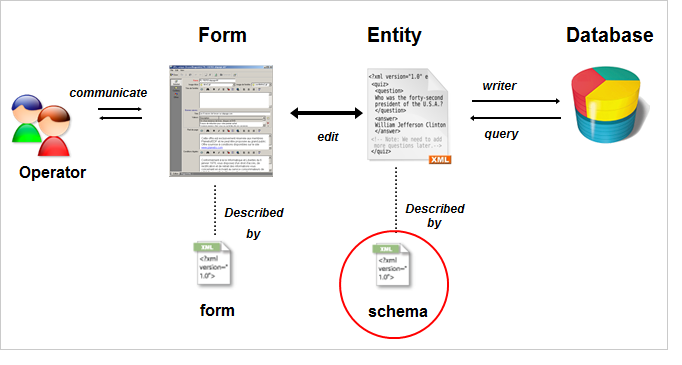
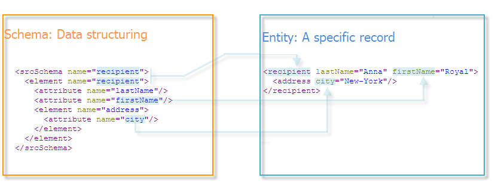

# Introduzione agli schemi {#about-schema-reference}

## Che cos’è uno schema {#what-is-a-schema}

Questo capitolo descrive come configurare gli schemi di estensione per estendere il modello dati concettuale del database di Adobe Campaign.

Per una migliore comprensione delle tabelle integrate di Campaign e della loro interazione, consulta il [modello dati Campaign Classic](about-data-model.md).

In Adobe Campaign, la struttura fisica e logica dei dati trasferiti nell’applicazione è descritta in XML. Uno **schema** è un documento XML associato a una tabella di database. Definisce la struttura dati e descrive la definizione SQL della tabella:

* Nome della tabella
* Campi
* Indici
* Collegamenti con altre tabelle

Descrive inoltre la struttura XML utilizzata per memorizzare i dati:

* Elementi e attributi
* Gerarchia di elementi
* Tipi di elementi e attributi
* Valori predefiniti
* Etichette, descrizioni e altre proprietà

Gli schemi consentono di definire un’entità nel database. Esiste uno schema per ogni entità.

L’illustrazione seguente mostra la posizione degli schemi nel sistema dati di Adobe Campaign:



## Sintassi degli schemi {#syntax-of-schemas}

L&#39;elemento radice dello schema è **`<srcschema>`**. Contiene i sottoelementi **`<element>`** e **`<attribute>`**.

Il primo sottoelemento **`<element>`** coincide con la radice dell&#39;entità.

```
<srcSchema name="recipient" namespace="cus">
  <element name="recipient">  
    <attribute name="lastName"/>
    <attribute name="email"/>
    <element name="location">
      <attribute name="city"/>
   </element>
  </element>
</srcSchema>
```

>[!NOTE]
>
>L’elemento principale dell’entità ha lo stesso nome dello schema.



I tag **`<element>`** definiscono i nomi degli elementi di entità. **`<attribute>`** tag dello schema definiscono i nomi degli attributi nei tag **`<element>`** a cui sono stati collegati.

## Identificazione di uno schema {#identification-of-a-schema}

Uno schema di dati è identificato dal nome e dallo spazio dei nomi.

Uno spazio dei nomi consente di raggruppare un set di schemi per area di interesse. Ad esempio, lo spazio dei nomi **cus** viene utilizzato per la configurazione specifica del cliente (**clienti**).

La chiave di identificazione di uno schema è una stringa creata utilizzando lo spazio dei nomi e il nome separati da due punti, ad esempio: **cus:recipient**.

>[!IMPORTANT]
>
>* Il nome dello spazio dei nomi deve essere conciso e deve contenere solo caratteri autorizzati in conformità alle regole di denominazione XML.
>
>* Gli identificatori non devono iniziare con caratteri numerici.
>
>* I seguenti spazi dei nomi sono riservati per le descrizioni delle entità di sistema necessarie per il funzionamento dell&#39;applicazione Adobe Campaign e non devono essere utilizzati: **xtk**, **nl**, **nms**, **ncm**, **temp**, **ncl**, **crm**, **xxl**.
>
