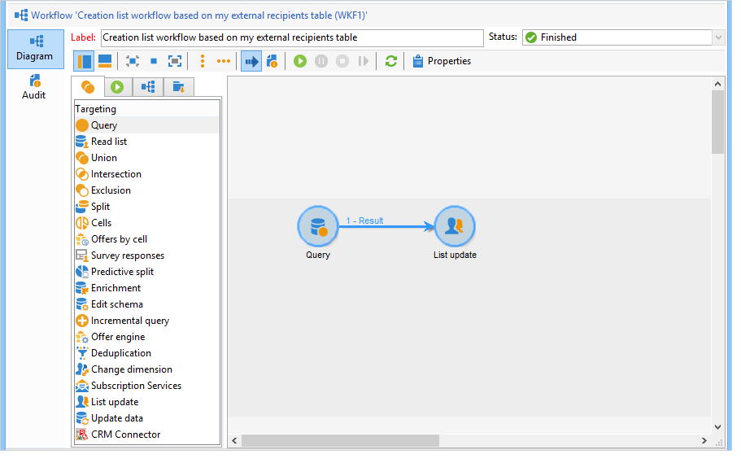
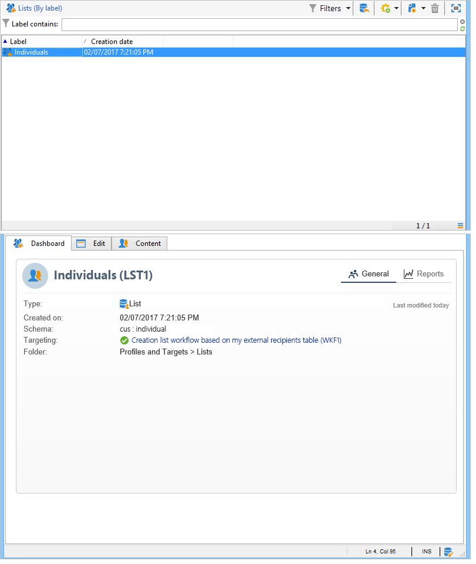

# Creazione di un elenco di profili con un flusso di lavoro{#creating-a-profile-list-with-a-workflow}

Per creare un elenco di tipi **[!UICONTROL List]** basato sulla nuova tabella dei destinatari, è necessario creare un flusso di lavoro di targeting che genererà l&#39;elenco.

Per ulteriori informazioni sugli elenchi in Campaign, consulta [questa sezione](../../platform/using/creating-and-managing-lists.md#about-lists-in-adobe-campaign).

 [Guarda un video su questa funzione](../../platform/using/creating-and-managing-lists.md#create-list-in-a-wf-video)

Per creare un flusso di lavoro di targeting e aggiornare i destinatari in una tabella dei destinatari personalizzata, effettua le seguenti operazioni:

1. Vai al nodo **[!UICONTROL Profiles and Targets > Jobs > Targeting workflows]** dell&#39;Explorer.
1. Crea un nuovo flusso di lavoro di targeting.
1. Inserisci un&#39;attività **Query** seguita da un&#39;attività **List update**.

   

1. Fai doppio clic sull&#39;attività **Query**, quindi fai clic su **[!UICONTROL Edit the query]** per scegliere una dimensione di targeting basata sullo schema della nuova tabella dei destinatari (nel nostro esempio: **Individual**). Fai clic su **[!UICONTROL Finish]** per confermare.

   

1. Fare doppio clic sull&#39;attività **Aggiornamento elenco**, quindi selezionare il pulsante di opzione **[!UICONTROL Create the list if necessary (Computed name)]**.

   

1. Selezionare la cartella di creazione per il nuovo elenco.
1. Esegui il flusso di lavoro per creare l’elenco.
1. Visualizzare il risultato nel nodo della struttura selezionata durante l&#39;attività **[!UICONTROL List update]**.

   Il dashboard specifica lo schema su cui si basa l’elenco, come illustrato di seguito:

   
