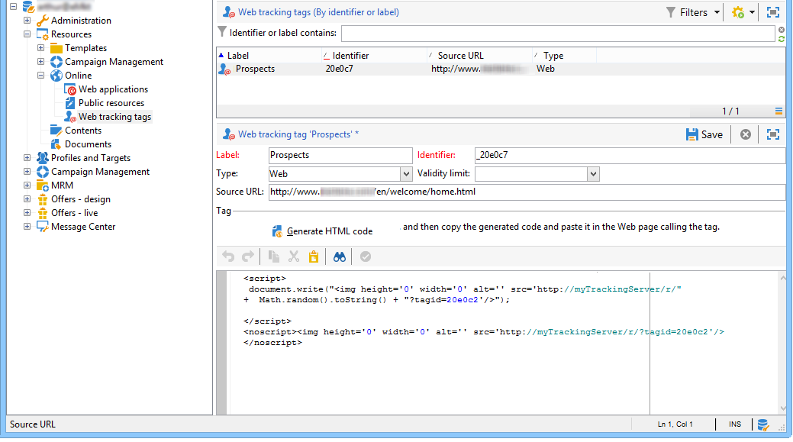

# Creare tag di tracciamento web{#creating-web-tracking-tags}

Ogni pagina del sito che desideri monitorare deve essere referenziata nella piattaforma Adobe Campaign. Questo riferimento può essere eseguito in due modi:

1. Definizione manuale degli URL da monitorare,
1. Creazione immediata di URL da tracciare.

## Definizione degli URL da tracciare nell’applicazione {#defining-the-urls-to-be-tracked-in-the-application}

Questo metodo ti consente di definire manualmente le pagine da tracciare e quindi di generare un esempio del tag di tracciamento web associato. Questa operazione è definita nel nodo **[!UICONTROL Campaign execution>Resources>Web tracking tags]** della console client.



Per generare il codice HTML da inserire nella pagina:

* Inserisci l’etichetta del tag: verrà visualizzata nei registri di tracciamento,
* Indicare l’URL di origine: questo campo è a scopo informativo e consente di indicare la pagina tracciata (facoltativo),
* Se necessario, inserire un periodo di validità.
* Fare clic su **[!UICONTROL Generate]** codice HTML.

Quindi copia il codice generato e incollalo nella pagina da tracciare.

## Creazione immediata di URL da tracciare {#on-the-fly-creation-of-urls-to-be-tracked}

Puoi creare al volo gli URL di tracciamento web aggiungendo informazioni al valore del parametro **tagid**:

* Tipo di pagina tracciata: &quot;w&quot; per WEB o &quot;t&quot; per TRANSACTION,
* Il nome interno della cartella in cui deve essere creato l’URL.

Queste due informazioni devono essere concatenate con l&#39;identificatore della pagina tracciata aggiungendo il carattere &quot;|&quot;:

```
tagid=<identifier>|<type>|<foldername>
```

>[!IMPORTANT]
>
>Ricordarsi di codificare il valore del parametro **tagid** quando viene utilizzato come parametro URL.

**Esempio**: creazione di un URL di tracciamento web di tipo transazione.

**http://myserver.adobe.com/r/a?tagid=home%7Ct%7CMyFolder**
