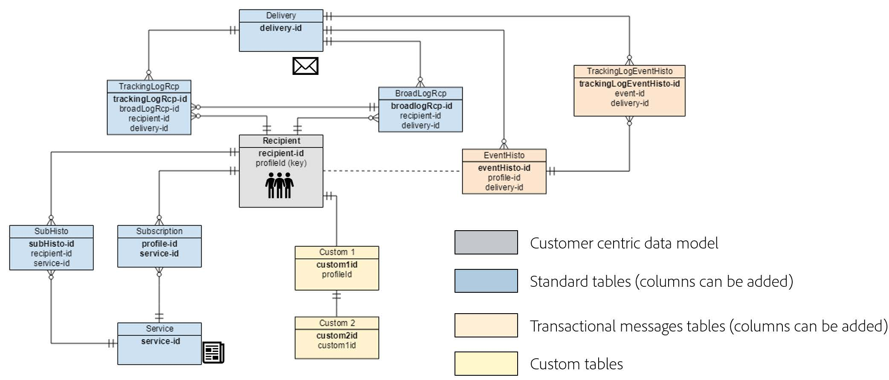

# Best practice per i modelli di dati{#data-model-best-practices}

Questo documento illustra i consigli chiave durante la progettazione del modello dati di Adobe Campaign.

Per informazioni sulle tabelle integrate di Campaign e sulla loro interazione, consulta [questa sezione](../../configuration/using/about-data-model.md).

Consulta [questa documentazione](../../configuration/using/about-schema-reference.md) per iniziare a utilizzare gli schemi di Campaign. Scopri come configurare gli schemi di estensione per estendere il modello dati concettuale del database di Adobe Campaign in [questo documento](../../configuration/using/about-schema-edition.md).

## Panoramica {#overview}

Il sistema Adobe Campaign è estremamente flessibile e può essere esteso oltre l’implementazione iniziale. Tuttavia, anche se le possibilità sono infinite, è fondamentale prendere decisioni sagge e creare solide basi per iniziare a progettare il modello di dati.

Questo documento fornisce casi d’uso comuni e best practice per scoprire come progettare correttamente lo strumento Adobe Campaign.

## Architettura del modello dati {#data-model-architecture}

Adobe Campaign è un potente sistema di gestione delle campagne cross-channel che consente di allineare le strategie online e offline per creare esperienze cliente personalizzate.

### Approccio incentrato sul cliente {#customer-centric-approach}

Mentre la maggior parte dei provider di servizi e-mail comunica con i clienti tramite un approccio incentrato sugli elenchi, Adobe Campaign si basa su un database relazionale per sfruttare una visione più ampia dei clienti e dei loro attributi.

Questo approccio incentrato sul cliente è illustrato nel grafico seguente. La tabella **Destinatario** in grigio rappresenta la tabella principale del cliente intorno alla quale viene creato tutto:

Per accedere alla descrizione di ogni tabella, passare a **[!UICONTROL Admin > Configuration > Data schemas]**, selezionare una risorsa dall&#39;elenco e fare clic sulla scheda **[!UICONTROL Documentation]**.

Il modello dati predefinito di Adobe Campaign è presentato in [questo documento](../../configuration/using/data-model-description.md).

>[!NOTE]
>
>Adobe Campaign Classic consente di creare una tabella cliente personalizzata. Tuttavia, nella maggior parte dei casi, si consiglia di sfruttare la [tabella dei destinatari](../../configuration/using/about-data-model.md#default-recipient-table) standard che dispone già di tabelle e funzionalità aggiuntive predefinite.

### Dati per Adobe Campaign {#data-for-campaign}

Quali dati devono essere inviati ad Adobe Campaign? È fondamentale determinare i dati necessari per le attività di marketing.

>[!NOTE]
>
>Adobe Campaign non è né un data warehouse né uno strumento di reporting. Pertanto, non cercare di importare in Adobe Campaign tutti i possibili clienti e le relative informazioni associate, né importare dati che verranno utilizzati solo per creare rapporti.

Per decidere se un attributo sia necessario o meno in Adobe Campaign, chiediti se rientra in una di queste categorie:

* Attributo utilizzato per **segmentazione**
* Attributo utilizzato per **processi di gestione dati** (ad esempio, calcolo aggregato)
* Attributo utilizzato per **personalization**

Se non rientra in nessuno di questi, molto probabilmente non avrai bisogno di questo attributo in Adobe Campaign.

### Scelta dei tipi di dati {#data-types}

Per garantire una buona architettura e prestazioni del sistema, segui le best practice riportate di seguito per configurare i dati in Adobe Campaign.

* Una tabella di grandi dimensioni deve avere per lo più campi numerici e contenere collegamenti a tabelle di riferimento (quando si lavora con un elenco di valori).
* L&#39;attributo **expr** consente di definire un attributo di schema come campo calcolato anziché come valore fisico impostato in una tabella. Questo può consentire di accedere alle informazioni in un formato diverso (ad esempio per età e data di nascita) senza la necessità di memorizzare entrambi i valori. Questo è un buon modo per evitare la duplicazione dei campi. Ad esempio, la tabella Destinatario utilizza un’espressione per il dominio, che è già presente nel campo e-mail.
* Tuttavia, quando il calcolo dell&#39;espressione è complesso, si sconsiglia di utilizzare l&#39;attributo **expr** in quanto il calcolo immediato potrebbe influire sulle prestazioni delle query.
* Il tipo **XML** è adatto per evitare la creazione di troppi campi. ma occupa anche spazio su disco in quanto utilizza una colonna CLOB nel database. Può inoltre causare query SQL complesse e influire sulle prestazioni.
* La lunghezza di un campo **stringa** deve sempre essere definita con la colonna. Per impostazione predefinita, la lunghezza massima in Adobe Campaign è 255, ma l’Adobe consiglia di mantenere il campo più corto se sai già che la dimensione non supererà una lunghezza più breve.
* È accettabile avere un campo più breve in Adobe Campaign rispetto a quello presente nel sistema di origine se si è certi che la dimensione nel sistema di origine è stata sovrastimata e non sarebbe raggiunta. Questo potrebbe significare una stringa più breve o un numero intero più piccolo in Adobe Campaign.

### Scelta dei campi {#choice-of-fields}

Un campo deve essere memorizzato in una tabella se ha uno scopo di targeting o personalizzazione. In altre parole, se un campo non viene utilizzato per inviare un’e-mail personalizzata o come criterio in una query, occupa spazio su disco mentre è inutile.

Per le istanze ibride e on-premise, FDA (Federated Data Access, una funzione opzionale che consente di accedere ai dati esterni) soddisfa la necessità di aggiungere un campo &quot;al volo&quot; durante un processo di campagna. Non è necessario importare tutto se si dispone di FDA. Per ulteriori informazioni, consulta [Informazioni su Federated Data Access](../../installation/using/about-fda.md).

### Scelta delle chiavi {#choice-of-keys}

Oltre a **autopk** definito per impostazione predefinita nella maggior parte delle tabelle, è consigliabile aggiungere alcune chiavi logiche o aziendali (numero account, numero client e così via). Può essere utilizzato successivamente per importazioni/riconciliazione o pacchetti di dati. Per ulteriori informazioni, consulta [Identificatori](#identifiers).

Chiavi efficienti sono essenziali per le prestazioni. I tipi di dati numerici devono sempre essere preferiti come chiavi per le tabelle.

Per il database SQLServer, è consigliabile utilizzare &quot;indice cluster&quot; se sono necessarie le prestazioni. Poiché Adobe non gestisce questo elemento, è necessario crearlo in SQL.

### Tablespace dedicate {#dedicated-tablespaces}

L&#39;attributo tablespace nello schema consente di specificare una tablespace dedicata per una tabella.

L&#39;assistente all&#39;installazione consente di memorizzare gli oggetti per tipo (dati, temporaneo e indice).

Le tablespace dedicate sono migliori per il partizionamento, le regole di sicurezza e consentono un&#39;amministrazione fluida e flessibile, una migliore ottimizzazione e prestazioni.

## Identificatori {#identifiers}

Le risorse Adobe Campaign hanno tre identificatori ed è possibile aggiungere un identificatore aggiuntivo.

La tabella seguente descrive tali identificatori e il loro scopo.

| Identificatore | Descrizione | Best practice |
|--- |--- |--- |
| Id | <ul><li>L’ID è la chiave primaria fisica di una tabella Adobe Campaign. Per le tabelle predefinite, si tratta di un numero generato a 32 bit da una sequenza</li><li>Questo identificatore è in genere univoco per una specifica istanza di Adobe Campaign. </li><li>Un ID generato automaticamente può essere visibile in una definizione di schema. Cerca nell&#39;attributo *autopk=&quot;true&quot;*.</li></ul> | <ul><li>Gli identificatori generati automaticamente non devono essere utilizzati come riferimento in un flusso di lavoro o in una definizione di pacchetto.</li><li>Non si deve supporre che l&#39;ID sarà sempre un numero crescente.</li><li>L’ID in una tabella predefinita è un numero a 32 bit e questo tipo non deve essere modificato. Questo numero è preso da una &quot;sequenza&quot; coperta nella sezione con lo stesso nome.</li></ul> |
| Nome (o nome interno) | <ul><li>Queste informazioni sono un identificatore univoco di un record in una tabella. Questo valore può essere aggiornato manualmente, in genere con un nome generato.</li><li>Questo identificatore mantiene il suo valore quando distribuito in un’istanza diversa di Adobe Campaign e non deve essere vuoto.</li></ul> | <ul><li>Rinomina il nome del record generato da Adobe Campaign se l’oggetto deve essere distribuito da un ambiente a un altro.</li><li>Quando un oggetto ha un attributo di spazio dei nomi (*schema*, ad esempio), questo spazio dei nomi comune verrà utilizzato in tutti gli oggetti personalizzati creati. Non utilizzare alcuni spazi dei nomi riservati: *nms*, *xtk*, *nl*, *ncl*, *crm*, *xxl*.</li><li>Se un oggetto non dispone di alcuno spazio dei nomi (*flusso di lavoro* o *consegna*, ad esempio), questa nozione di spazio dei nomi viene aggiunta come prefisso di un oggetto nome interno: *namespaceMyObjectName*.</li><li>Non utilizzare caratteri speciali come lo spazio &quot;&quot;, il punto e virgola &quot;:&quot; o il trattino &quot;-&quot;. Tutti questi caratteri verrebbero sostituiti da un carattere di sottolineatura &quot;_&quot; (carattere consentito). Ad esempio, &quot;abc-def&quot; e &quot;abc:def&quot; verrebbero memorizzati come &quot;abc_def&quot; e si sovrascriverebbero a vicenda.</li></ul> |
| Etichetta | <ul><li>L’etichetta è l’identificatore aziendale di un oggetto o di un record in Adobe Campaign.</li><li>Questo oggetto consente spazi e caratteri speciali.</li><li>Non garantisce l&#39;univocità di un record.</li></ul> | <ul><li>Si consiglia di determinare una struttura per le etichette degli oggetti.</li><li>Questa è la soluzione più semplice da usare per identificare un record o un oggetto per un utente di Adobe Campaign.</li></ul> |

## Chiavi interne personalizzate {#custom-internal-keys}

Le chiavi primarie sono necessarie per ogni tabella creata in Adobe Campaign.

La maggior parte delle organizzazioni importa record da sistemi esterni. Anche se la chiave fisica della tabella dei destinatari è l’attributo &quot;id&quot;, è possibile determinare una chiave personalizzata in aggiunta.

Questa chiave personalizzata è la chiave primaria del record effettivo nel sistema esterno che alimenta Adobe Campaign.

Quando una tabella preconfigurata dispone sia di un blocco automatico che di una chiave interna, la chiave interna viene impostata come indice univoco nella tabella del database fisico.

Durante la creazione di una tabella personalizzata, sono disponibili due opzioni:
* Una combinazione di chiave (id) generata automaticamente e chiave interna (personalizzata). Questa opzione è interessante se la chiave di sistema è una chiave composita o non un numero intero. Gli interi forniranno prestazioni più elevate nelle tabelle di grandi dimensioni e uniranno le tabelle ad altre.
* Utilizzo della chiave primaria come chiave primaria del sistema esterno. Questa soluzione è in genere preferita in quanto semplifica l’approccio all’importazione e all’esportazione dei dati, con una chiave coerente tra i diversi sistemi. L’Opk automatico deve essere disabilitato se la chiave è denominata &quot;id&quot; e deve essere riempita con valori esterni (non generati automaticamente).

>[!IMPORTANT]
>
>Non utilizzare l’autopk come riferimento nei flussi di lavoro.

## Sequenze {#sequences}

La chiave primaria di Adobe Campaign è un id generato automaticamente per tutte le tabelle pronte all’uso e può essere lo stesso per le tabelle personalizzate. Per ulteriori informazioni, consulta [questa sezione](#identifiers).

Questo valore viene preso da ciò che viene chiamato **sequenza**, che è un oggetto di database utilizzato per generare una sequenza numerica.

Esistono due tipi di sequenze:
* **Condiviso**: più tabelle selezionerebbero il proprio ID dalla stessa sequenza. Ciò significa che se un ID &quot;X&quot; viene utilizzato da una tabella, nessun’altra tabella che condivide la stessa sequenza avrebbe un record con quell’ID &quot;X&quot;. **XtkNewId** è la sequenza condivisa predefinita disponibile in Adobe Campaign.
* **Dedicato**: solo una tabella sta scegliendo gli ID dalla sequenza. Il nome della sequenza in genere contiene il nome della tabella.

>[!IMPORTANT]
>
>La sequenza è un valore intero a 32 bit, con un numero massimo finito di valori disponibili: 2,14 miliardi. Una volta raggiunto il valore massimo, la sequenza torna allo 0 per riciclare gli ID.
>
>Se i vecchi dati non sono stati eliminati, si verifica una violazione di chiave univoca, che diventa un bloccante per l’integrità e l’utilizzo della piattaforma. Adobe Campaign non sarebbe in grado di inviare comunicazioni (quando influisce sulla tabella dei registri di consegna) e le prestazioni sarebbero fortemente influenzate.

Pertanto, un cliente che invia 6 miliardi di e-mail all’anno con un periodo di conservazione di 180 giorni per i propri registri terminerebbe gli ID in 4 mesi. Per evitare questo problema, assicurati di disporre delle impostazioni di eliminazione in base ai volumi. Per ulteriori informazioni, consulta [questa sezione](#data-retention).

Quando si crea una tabella personalizzata in Adobe Campaign con una chiave primaria come autoPK, a tale tabella deve essere associata sistematicamente una sequenza dedicata personalizzata.

Per impostazione predefinita, una sequenza personalizzata avrà valori compresi tra +1.000 e +2,1BB. Tecnicamente, è possibile ottenere una gamma completa di 4BB abilitando gli ID negativi. Questo deve essere utilizzato con cautela e un ID andrà perso quando si passa da numeri negativi a numeri positivi: il record 0 viene in genere ignorato da Adobe Campaign nelle query SQL generate.

Per ulteriori informazioni sull&#39;esaurimento delle sequenze, guarda [questo video](https://helpx.adobe.com/customer-care-office-hours/campaign/sequences-exhaustion-campaign-classic.html).

## Indici {#indexes}

Gli indici sono essenziali per le prestazioni. Quando dichiari una chiave nello schema, Adobe creerà automaticamente un indice sui campi della chiave. È inoltre possibile dichiarare più indici per le query che non utilizzano la chiave.

L’Adobe consiglia di definire indici aggiuntivi in quanto possono migliorare le prestazioni.

Tuttavia, tieni presente quanto segue:

* L’utilizzo dell’indice è associato al pattern di accesso. L’ottimizzazione dell’indicizzazione è spesso un elemento chiave nella progettazione del database e deve essere gestita da esperti. L’aggiunta di indici è spesso un flusso di lavoro iterativo associato alla manutenzione del database. Viene eseguita nel tempo, passo dopo passo, per risolvere i problemi di prestazioni quando si verificano.
* Gli indici aumentano la dimensione complessiva della tabella (per memorizzare l’indice stesso).
* L&#39;aggiunta dell&#39;indice alle colonne può migliorare le prestazioni di accesso in lettura ai dati (SELECT), ma può diminuire le prestazioni di accesso in scrittura ai dati (UPDATE).
* Poiché questo influisce sulle prestazioni durante l’inserimento dei dati, le dimensioni e il numero degli indici devono essere limitati.
* Non aggiungere indici quando non necessario. Assicurati che sia necessario e aumenti le prestazioni complessive delle query (test e apprendimento).
* In generale, un indice è efficiente se si sa che le query non restituiranno più del 10% dei record.
* Seleziona con attenzione gli indici da definire.
* Non rimuovere gli indici nativi dalle tabelle predefinite.

<!--When you are performing an initial import with very high volumes of data insert in Adobe Campaign database, it is recommended to run that import without custom indexes at first. It will allow to accelerate the insertion process. Once you’ve completed this important import, it is possible to enable the index(es).-->

### Esempio

La gestione degli indici può diventare molto complessa, pertanto è importante comprenderne il funzionamento. Per illustrare questa complessità, prendiamo un esempio di base, ad esempio la ricerca dei destinatari filtrando il nome e il cognome. Per eseguire questa operazione:
1. Passare alla cartella in cui sono elencati tutti i destinatari del database. Per ulteriori informazioni, consulta [Gestione dei profili](../../platform/using/managing-profiles.md).
1. Fare clic con il pulsante destro del mouse sul campo **[!UICONTROL First name]**.
1. Seleziona **[!UICONTROL Filter on this field]**.

   

1. Ripetere l&#39;operazione per il campo **[!UICONTROL Last name]**.

I due filtri corrispondenti vengono aggiunti nella parte superiore dello schermo.

È ora possibile eseguire il filtro di ricerca nei campi **[!UICONTROL First name]** e **[!UICONTROL Last name]** in base alle varie condizioni del filtro.

Ora per velocizzare la ricerca su questi filtri, puoi aggiungere indici. Ma quali indici dovrebbero essere utilizzati?

>[!NOTE]
>
>Questo esempio si applica ai clienti in hosting che utilizzano un database PostgreSQL.

La tabella seguente mostra in quali casi i tre indici descritti di seguito vengono utilizzati o meno in base al pattern di accesso visualizzato nella prima colonna.

| Criteri di ricerca | Indice 1 (nome + cognome) | Indice 2 (solo nome) | Indice 3 (solo cognome) | Commenti |
|--- |--- |--- |--- |--- |
| Il nome è uguale a &quot;Johnny&quot; | Utilizzato | Utilizzato | Non utilizzato | Poiché il nome si trova in prima posizione nell’indice 1, verrà utilizzato comunque: non è necessario aggiungere un criterio al cognome. |
| Il nome è uguale a &quot;Johnny&quot; E il cognome è uguale a &quot;Smith&quot; | Utilizzato | Non utilizzato | Non utilizzato | Poiché nella stessa query vengono cercati entrambi gli attributi, verrà utilizzato solo l’indice che combina entrambi gli attributi. |
| Cognome è uguale a &quot;Smith&quot; | Non utilizzato | Non utilizzato | Utilizzato | Viene preso in considerazione l’ordine degli attributi nell’indice. Se non si corrisponde a questo ordine, l’indice potrebbe non essere utilizzato. |
| Il nome inizia con &quot;Joh&quot; | Utilizzato | Utilizzato | Non utilizzato | &quot;Ricerca a sinistra&quot; abiliterà gli indici. |
| Il nome termina con &quot;ny&quot; | Non utilizzato | Non utilizzato | Non utilizzato | Con la funzione &quot;Right search&quot; (Ricerca a destra) gli indici vengono disattivati e viene eseguita un&#39;analisi completa. Alcuni tipi di indice specifici possono gestire questo caso d’uso, ma non sono disponibili per impostazione predefinita in Adobe Campaign. |
| Il nome contiene &quot;John&quot; | Non utilizzato | Non utilizzato | Non utilizzato | Si tratta di una combinazione di ricerche &quot;sinistra&quot; e &quot;destra&quot;. A causa di quest’ultimo, disabiliterà gli indici e verrà eseguita un’analisi completa. |
| Il nome è uguale a &quot;John&quot; | Non utilizzato | Non utilizzato | Non utilizzato | Gli indici fanno distinzione tra maiuscole e minuscole. Per evitare la distinzione tra maiuscole e minuscole, è necessario creare un indice specifico che includa una funzione SQL come &quot;upper(firstname)&quot;. Fai lo stesso con altre trasformazioni di dati, ad esempio &quot;unaccent(first name)&quot;. |

## Collegamenti e cardinalità {#links-and-cardinality}

### Collegamenti {#links}

Presta attenzione alla &quot;propria&quot; integrità sulle tabelle di grandi dimensioni. L’eliminazione di record con tabelle di grandi dimensioni e integrità &quot;propria&quot; può arrestare l’istanza. La tabella è bloccata e le eliminazioni vengono eseguite una alla volta. Quindi è meglio usare l&#39;integrità &quot;neutra&quot; su tavoli di bambini che hanno grandi volumi.

Dichiarare un collegamento come join esterno non è un vantaggio in termini di prestazioni. Il record con ID zero emula la funzionalità di join esterno. Non è necessario dichiarare join esterni se il collegamento utilizza l&#39;autopk.

Anche se è possibile unire qualsiasi tabella in un flusso di lavoro, l’Adobe consiglia di definire collegamenti comuni tra le risorse direttamente nella definizione della struttura dati.

Il collegamento deve essere definito in allineamento con i dati effettivi nelle tabelle. Una definizione errata potrebbe influire sui dati recuperati tramite collegamenti, ad esempio duplicando in modo imprevisto i record.

Assegna al collegamento un nome coerente con il nome della tabella: il nome del collegamento dovrebbe aiutare a comprendere cosa è la tabella lontana.

Non denominare un collegamento con &quot;id&quot; come suffisso. Ad esempio, denominalo &quot;transaction&quot; invece di &quot;transactionId&quot;.

Per impostazione predefinita, Adobe Campaign crea un collegamento utilizzando la chiave primaria della tabella esterna. Per maggiore chiarezza, è preferibile definire esplicitamente il join nella definizione del collegamento.

Un indice verrà aggiunto agli attributi utilizzati in un collegamento.

Il   i collegamenti creato da e modificato da ultimo sono presenti in molte tabelle. È possibile disattivare l’indice utilizzando l’attributo noDbIndex sul collegamento, se queste informazioni non sono utilizzate dall’azienda.

### Cardinalità {#cardinality}

Quando progetti un collegamento, accertati che il record di destinazione sia univoco quando è stata dichiarata una relazione 1-1. In caso contrario, il join può restituire più record quando ne è previsto solo uno. Ciò genera errori durante la preparazione della consegna quando &quot;la query restituisce più righe del previsto&quot;. Imposta il nome del collegamento sullo stesso nome dello schema di destinazione.

Definisci un collegamento con una cardinalità (1-N) nello schema sul lato (1). Ad esempio, la relazione Destinatario (1) - (N) Transazione deve essere definita nello schema della transazione.

Per impostazione predefinita, la cardinalità inversa di un collegamento è (N). È possibile definire un collegamento (1-1) aggiungendo l’attributo revCardinality=&#39;single&#39; alla definizione del collegamento.

Se il collegamento inverso non deve essere visibile all&#39;utente, è possibile nasconderlo con la definizione di collegamento revLink=&#39;_NONE_&#39;. Un buon caso d’uso consiste nel definire, ad esempio, un collegamento tra il destinatario e l’ultima transazione completata. È sufficiente visualizzare il collegamento tra il destinatario e l&#39;ultima transazione e non è necessario che dalla tabella delle transazioni sia visibile alcun collegamento inverso.

I collegamenti che eseguono un join esterno (1-0..1) devono essere utilizzati con cautela in quanto influiscono sulle prestazioni del sistema.

## Conservazione dei dati: pulizia ed eliminazione {#data-retention}

Adobe Campaign non è né un data warehouse né uno strumento di reporting. Pertanto, per garantire buone prestazioni della soluzione Adobe Campaign, la crescita del database deve rimanere sotto controllo. Per ottenere questo risultato, segui alcune delle best practice riportate di seguito.

Per impostazione predefinita, i registri di consegna e tracciamento di Adobe Campaign hanno una durata di conservazione di 180 giorni. Viene eseguito un processo di pulizia per rimuovere tutti i registri più vecchi di quello.

* Se desideri conservare i registri più a lungo, questa decisione deve essere presa con attenzione a seconda delle dimensioni del database e del volume di messaggi inviati. Come promemoria, la sequenza Adobe Campaign è un numero intero a 32 bit.
* Si consiglia di non avere più di 1 miliardo di record alla volta in queste tabelle (circa il 50% dei 2,14 miliardi di ID disponibili) per limitare i rischi di consumo di tutti gli ID disponibili. Alcuni clienti dovranno quindi ridurre la durata della conservazione al di sotto di 180 giorni.

Ulteriori informazioni sulla conservazione dei dati in [Linee guida per la privacy e la sicurezza di Campaign](../../platform/using/privacy-and-recommendations.md).

Ulteriori informazioni sul flusso di lavoro di pulizia del database di Campaign [ in questa sezione](../../production/using/database-cleanup-workflow.md).

>[!IMPORTANT]
>
>Le tabelle personalizzate non vengono eliminate con il processo di pulizia standard. Anche se questo potrebbe non essere necessario il primo giorno, non dimenticare di creare un processo di eliminazione per le tabelle personalizzate, in quanto ciò potrebbe comportare problemi di prestazioni.

Esistono alcune soluzioni per ridurre al minimo la necessità di record in Adobe Campaign:
* Esporta i dati in un data warehouse esterno a Adobe Campaign.
* Genera valori aggregati che utilizzeranno meno spazio pur essendo sufficienti per le tue pratiche di marketing. Ad esempio, non è necessario disporre della cronologia completa delle transazioni dei clienti in Adobe Campaign per tenere traccia degli ultimi acquisti.

È possibile dichiarare l’attributo &quot;deleteStatus&quot; in uno schema. È più efficiente contrassegnare il record come eliminato, quindi posticipare l’eliminazione nell’attività di pulizia.

## Prestazioni {#performance}

Per garantire prestazioni migliori in qualsiasi momento, segui le best practice riportate di seguito.

### Raccomandazioni generali {#general-recommendations}

* Evita di utilizzare operazioni come &quot;CONTAINS&quot; nelle query. Se sai cosa è previsto e desideri filtrare, applica la stessa condizione con un &quot;UGUALE A&quot; o altri operatori di filtro specifici.
* Evita l’unione di con campi non indicizzati durante la creazione di dati nei flussi di lavoro.
* Prova ad assicurarti che i processi come l’importazione e l’esportazione avvengano al di fuori dell’orario di lavoro.
* Assicurati che sia presente una pianificazione per tutte le attività giornaliere e attieniti alla pianificazione.
* Se uno o più processi giornalieri non riescono e se è obbligatorio eseguirli nello stesso giorno, assicurarsi che non vi siano processi in conflitto in esecuzione quando il processo manuale viene avviato, in quanto ciò potrebbe influire sulle prestazioni del sistema.
* Assicurati che nessuna della campagna giornaliera venga eseguita durante il processo di importazione o quando viene eseguito un processo manuale.
* Utilizzare una o più tabelle di riferimento anziché duplicare un campo in ogni riga. Quando si utilizzano coppie chiave/valore, è preferibile scegliere una chiave numerica.
* Una stringa breve rimane accettabile. Se in un sistema esterno sono già presenti tabelle di riferimento, il riutilizzo delle stesse faciliterà l’integrazione dei dati con Adobe Campaign.

### Relazioni uno-a-molti {#one-to-many-relationships}

* La progettazione dei dati influisce su usabilità e funzionalità. Se progetti il modello dati con numerose relazioni uno-a-molti, per gli utenti diventa più difficile creare una logica significativa nell’applicazione. La logica del filtro &quot;uno-a-molti&quot; può essere difficile da costruire e comprendere correttamente per gli esperti di marketing non tecnici.
* È utile disporre di tutti i campi essenziali in una tabella, in quanto consente agli utenti di creare query in modo più semplice. A volte è utile anche per le prestazioni duplicare alcuni campi tra le tabelle, se si può evitare un join.
* Alcune funzionalità integrate non potranno fare riferimento a relazioni uno-a-molti, ad esempio Formula di ponderazione delle offerte e Consegne.

## Tabelle grandi {#large-tables}

Adobe Campaign si basa su motori di database di terze parti. A seconda del provider, l&#39;ottimizzazione delle prestazioni per tabelle di grandi dimensioni può richiedere una progettazione specifica.

Di seguito sono riportate alcune best practice comuni da seguire durante la progettazione del modello dati utilizzando tabelle di grandi dimensioni e join complessi.

* Quando utilizzi tabelle dei destinatari personalizzate aggiuntive, assicurati di disporre di una tabella di registro dedicata per ogni mappatura di consegna.
* Riduci il numero di colonne, in particolare identificando quelle non utilizzate.
* Ottimizza le relazioni del modello dati evitando join complessi, ad esempio join su più condizioni e/o colonne.
* Per le chiavi di join, utilizzare sempre dati numerici anziché stringhe di caratteri.
* Riduci il più possibile la profondità di conservazione dei registri. Se hai bisogno di una cronologia più approfondita, puoi aggregare il calcolo e/o gestire tabelle di registro personalizzate per memorizzare una cronologia più ampia.

### Dimensioni delle tabelle {#size-of-tables}

La dimensione della tabella è una combinazione del numero di record e del numero di colonne per record. Entrambi possono influire sulle prestazioni delle query.

* Una tabella **di piccole dimensioni** è simile alla tabella Delivery.
* Una tabella di **dimensioni medie** ha le stesse dimensioni della tabella Destinatario. Ha un record per cliente.
* Una tabella **di grandi dimensioni** è simile alla tabella di registro Broad. Dispone di molti record per cliente.
Ad esempio, se il database contiene 10 milioni di destinatari, la tabella di registro Broad contiene circa 100-200 milioni di messaggi e la tabella Delivery contiene alcune migliaia di record.

In PostgreSQL, una riga non deve superare gli 8 KB per evitare il meccanismo [TOAST](https://wiki.postgresql.org/wiki/TOAST). Pertanto, prova a ridurre il più possibile il numero di colonne e le dimensioni di ogni riga per mantenere prestazioni ottimali del sistema (memoria e CPU).

Il numero di righe influisce anche sulle prestazioni. Il database di Adobe Campaign non è progettato per memorizzare dati storici che non vengono utilizzati attivamente a scopo di targeting o personalizzazione; si tratta di un database operativo.

Per evitare problemi di prestazioni relativi al numero elevato di righe, conserva nel database solo i record necessari. Qualsiasi altro record deve essere esportato in un data warehouse di terze parti e rimosso dal database operativo di Adobe Campaign.

Di seguito sono riportate alcune best practice relative alle dimensioni delle tabelle:

* Progettare tabelle di grandi dimensioni con meno campi e più dati numerici.
* Non utilizzare un tipo di colonna con numero elevato (ad es. Int64) per memorizzare numeri piccoli come i valori booleani.
* Rimuovi le colonne non utilizzate dalla definizione della tabella.
* Non conservare dati storici o inattivi nel database di Adobe Campaign (esportazione e pulizia).

Ecco un esempio:

In questo esempio:
* Le tabelle *Transaction* e *Transaction Item* sono grandi: più di 10 milioni.
* Le tabelle *Product* e *Store* sono più piccole: meno di 10.000.
* L&#39;etichetta del prodotto e il riferimento sono stati inseriti nella tabella *Product*.
* La tabella *Elemento transazione* contiene solo un collegamento alla tabella *Prodotto*, che è numerica.
