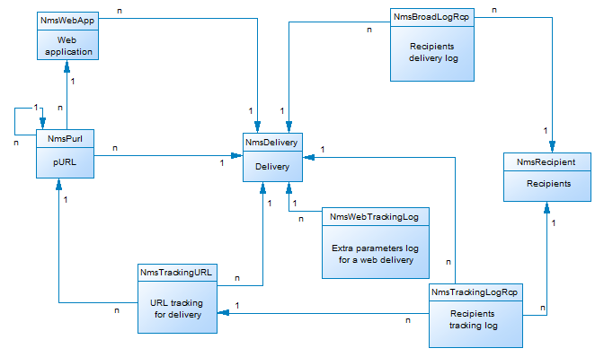

# Descrizione del modello dati della campagna{#data-model-description}

Adobe Campaign viene fornito con un modello dati predefinito. Questa sezione fornisce alcuni dettagli sulle tabelle integrate del modello dati di Adobe Campaign e sulla loro interazione.

Per accedere alla descrizione di ogni tabella, passare a **[!UICONTROL Admin > Configuration > Data schemas]**, selezionare una risorsa dall&#39;elenco e fare clic sulla scheda **[!UICONTROL Documentation]**.

>[!NOTE]
>
>La struttura fisica e logica dei dati trasferiti nell’applicazione è descritta in XML. Essa obbedisce a una grammatica specifica ad Adobe Campaign, denominata schema. Per ulteriori informazioni sugli schemi di Adobe Campaign, consulta [questa sezione](../../configuration/using/about-schema-reference.md).

## Descrizione delle tabelle principali {#description-main-tables}

Adobe Campaign si basa su un database relazionale contenente tabelle collegate tra loro.

Il diagramma seguente mostra i join tra le tabelle aziendali principali del modello dati di Adobe Campaign e i campi principali per ciascuno di essi.

<!---->

Il modello dati predefinito di Adobe Campaign include le tabelle principali elencate di seguito.

### NmsRecipient {#NmsRecipient}

Questa tabella corrisponde allo schema **nms:recipient**.

È la tabella predefinita utilizzata per i **destinatari delle consegne**. Di conseguenza, contiene le informazioni necessarie per le consegne attraverso i vari canali:

* sEmail: email address.
* iEmailFormat: formato preferito per le e-mail (1 per Testo, 2 per HTML e 0 se non definito).
* sAddress1, sAddress2, sAddress3, sAddress4, sZipCode, sCity vengono utilizzati per creare l&#39;indirizzo postale (in conformità con lo standard XPZ 10-011 AFNOR del maggio 1997).
* sPhone, sMobilePhone, sFax contengono rispettivamente i numeri di telefono, telefono cellulare e fax.
* iBlackList è il flag di rinuncia predefinito utilizzato per i profili (1 significa &quot;disiscrizione&quot;, 0 altrimenti).

Il campo iFolderId è la chiave esterna che collega il destinatario alla cartella di esecuzione. Per ulteriori informazioni, vedere [XtkFolder](#XtkFolder).

Il campo sCountryCode è il codice Alpha 2 ISO 3166-1 (2 caratteri) del paese associato al destinatario. Questo campo è in realtà una chiave esterna nella tabella di riferimento del paese (NmsCountry), che contiene le etichette del paese e altri dati relativi al codice del paese. Se il paese non è popolato, viene memorizzato il valore &#39;XX&#39; (e viene utilizzato al posto di un record ID pari a zero).

Per ulteriori informazioni sulla tabella Destinatari, vedere [questa sezione](../../configuration/using/about-data-model.md#default-recipient-table).

### NmsGroup {#NmsGroup}

Questa tabella corrisponde allo schema **nms:group**.

Consente di creare **gruppi statici di destinatari**. Esiste una relazione molti-a-molti tra destinatari e gruppi. Ad esempio, un destinatario può appartenere a più gruppi e un gruppo può contenere più destinatari. I gruppi possono essere creati manualmente, tramite un’importazione o tramite il targeting della consegna. I gruppi vengono spesso utilizzati come target di consegna. Nel campo è presente un indice univoco che rappresenta il nome interno del gruppo sName. Il gruppo è collegato a una cartella (la chiave è iFolderId. Per ulteriori informazioni, vedere [XtkFolder](#XtkFolder)).

### NmsRcpGrpRel {#NmsRcpGrpRel}

La tabella delle relazioni NmsRcpGrpRel contiene solo i due campi corrispondenti agli identificatori delle tabelle collegate iRecipientId e iGroupId.

### NmsService {#NmsService}

Questa tabella corrisponde allo schema **nms:service**.

In Adobe Campaign puoi creare e gestire gli abbonamenti ai servizi di informazione (argomenti). Nella tabella NmsService viene memorizzata la definizione dei servizi di informazioni (argomenti) a cui i destinatari possono iscriversi (ad esempio, una newsletter).

I servizi sono entità simili ai gruppi (raggruppamenti di destinatari statici), con la differenza che distribuiscono più informazioni e consentono di gestire facilmente gli abbonamenti e il loro annullamento tramite i moduli.

Nel campo è presente un indice univoco che rappresenta il nome interno del servizio sName. Il servizio è collegato a una cartella (la chiave è iFolderId. Per ulteriori informazioni, vedere [XtkFolder](#XtkFolder)). Infine, il campo iType specifica il canale di consegna del servizio (0 per e-mail, 1 per SMS, 2 per telefono, 3 per direct mail e 4 per fax).

### NmsSubscription {#NmsSubscription}

Questa tabella corrisponde allo schema **nms:subscription**.

Consente di gestire gli abbonamenti dei destinatari ai servizi di informazione.

### NmsSubHisto {#NmsSubHisto}

Questa tabella corrisponde allo schema **nms:subHisto**.

Se le sottoscrizioni vengono gestite tramite moduli web o l’interfaccia dell’applicazione, tutte le sottoscrizioni e le annullazioni vengono storicamente registrate nella tabella NmsSubHisto. Il campo iAction specifica l&#39;azione (0 per l&#39;annullamento dell&#39;abbonamento e 1 per l&#39;abbonamento) eseguita alla data memorizzata nel campo tsDate.

### NmsDelivery {#NmsDelivery}

Questa tabella corrisponde allo schema **nms:delivery**.

Ogni record di questa tabella rappresenta una **azione di consegna** o un **modello di consegna**. Contiene tutti i parametri necessari per eseguire le consegne (il target, il contenuto, ecc.). I registri di consegna (broadcast) (NmsBroadLog) e gli URL di tracciamento associati (NmsTrackingUrl) vengono creati durante la fase di analisi (vedi di seguito per ulteriori dettagli su entrambe queste tabelle).

Nel campo è presente un indice univoco che rappresenta il nome interno della consegna o dello scenario sInternalName. La consegna è collegata a una cartella di esecuzione (la chiave esterna è iFolderProcessId). Per ulteriori informazioni, vedere [XtkFolder](#XtkFolder)).

### XtkFolder {#XtkFolder}

Contiene **tutte le cartelle nella struttura** visibili nella scheda **Navigazione** della console.

Le cartelle sono tipizzate: il valore del campo sModel specifica il tipo di dati che possono essere contenuti nella cartella. Questo campo consente inoltre alla console client di visualizzare correttamente i dati con i moduli corrispondenti. I valori possibili per questo campo sono definiti in navTree.

La struttura è gestita dai campi iParentId e iChildCount. Il campo sFullName indica il percorso completo della cartella nella struttura. Infine, nel campo è presente un indice univoco che rappresenta il nome interno della cartella sName.

## Consegna e tracciamento {#delivery-and-tracking}

Questo set di tabelle è collegato al modulo **Delivery**, che consente di monitorare le consegne e gli eventuali problemi rilevati durante l&#39;invio dei messaggi. Per ulteriori informazioni, consulta [Monitoraggio delle consegne](../../delivery/using/about-delivery-monitoring.md). Per ulteriori informazioni sul tracciamento, consulta [Messaggi di tracciamento](../../delivery/using/about-message-tracking.md).

**NmsBroadLogMsg**: questa tabella corrisponde allo schema **nms:broadLogMsg**. Si tratta di un’estensione della tabella del registro di consegna.

## Gestione delle campagne {#campaign-management}

Questo set di tabelle è collegato al modulo **Campagne di marketing**, che consente di definire, ottimizzare, eseguire e analizzare le campagne di comunicazione e marketing. Per ulteriori informazioni, fai riferimento alla [documentazione di Campaign v8](https://experienceleague.adobe.com/docs/campaign/campaign-v8/campaigns/campaigns.html?lang=it){target=_blank}.

* **NmsOperation**: questa tabella corrisponde allo schema **nms:operation**. Contiene i dati delle campagne di marketing.
* **NmsDeliveryOutline**: questa tabella corrisponde allo schema **nms:deliveryOutline**. Contiene le proprietà estese della consegna (struttura della consegna).
* **NmsDlvOutlineItem**: questa tabella corrisponde allo schema **nms:dlvOutlineItem**. Contiene gli articoli di una struttura di consegna.
* **NmsDeliveryCustomization**: questa tabella corrisponde allo schema **nms:deliveryCustomization**. Contiene i campi di personalizzazione di una consegna.
* **NmsBudget**: questa tabella corrisponde allo schema **nms:budget**. Contiene i dati di un budget per una campagna, un piano, un programma, un&#39;attività e/o consegne.
* **NmsDocument**: questa tabella corrisponde allo schema **nms:document**. Contiene i documenti di marketing della campagna sotto forma di file (immagini, file Excel o Word, ecc.)
* **XtkWorkflow**: questa tabella corrisponde allo schema **xtk:workflow**. Contiene il targeting delle campagne.
* **NmsTask**: questa tabella corrisponde allo schema **nms:task**. Contiene la definizione di un’attività di marketing.
* **NmsAsset**: questa tabella corrisponde allo schema **nms:asset**. Contiene la definizione di una risorsa di marketing.

## Coerenza delle comunicazioni {#communication-consistency}

Questo set di tabelle è collegato al modulo **Ottimizzazione campagna**, che consente di controllare, filtrare e monitorare l&#39;invio delle consegne. Consulta la [documentazione di Campaign v8](https://experienceleague.adobe.com/docs/campaign/automation/campaign-optimization/campaign-typologies.html?lang=it){target="_blank"}.

* **NmsTypologyRule**: questa tabella corrisponde allo schema **nms:typologyRule**. Contiene le regole che si applicano alle consegne a seconda delle tipologie.
* **NmsTypology**: questa tabella corrisponde allo schema **nms:typology**. Contiene l’insieme di regole da applicare alle consegne che corrispondono alla tipologia.
* **NmsTypologyRuleRel**: questa tabella corrisponde allo schema **nms:typologyRuleRel**. Contiene le relazioni tra le tipologie e le relative regole.
* **NmsVolumeLine**: questa tabella corrisponde allo schema **nms:volumeLine**. Contiene l&#39;insieme di righe di disponibilità delle regole di capacità.
* **NmsVolumeConsumed**: questa tabella corrisponde allo schema **nms:volumeConsumed**. Contiene tutte le righe di consumo delle regole di capacità.

## Gestione risposte {#response-management}

Questo set di tabelle è collegato al modulo **Gestione risposte**, che consente di misurare il successo e la redditività delle campagne di marketing o delle proposte di offerte per tutti i canali di comunicazione. Per ulteriori informazioni, consulta [Informazioni su Gestione risposte](../../response/using/about-response-manager.md).

### NmsRemaHypothesis {#NmsRemaHypothesis}

Questa tabella coincide con lo schema **nms:remaHypothesis**. Contiene la definizione dell&#39;ipotesi di misurazione.

Questa tabella contiene informazioni importanti memorizzate in XML, tra cui:

**Contesto di esecuzione (informazioni archiviate in XML)**

Il contesto di esecuzione popola le tabelle e i campi da considerare per il calcolo della misurazione, ovvero:
* Schema di archiviazione del log delle reazioni nms:remaMatchRcp.
* Lo schema della tabella delle transazioni (ad esempio acquisti).
* Lo schema di query, che consente di definire la tabella iniziale delle condizioni dell’ipotesi.
* Collegamenti a singoli utenti, che consentono di identificare l&#39;utente in base allo schema di query.
* La data della transazione. Questo campo non è obbligatorio, ma è consigliabile utilizzarlo per limitare il perimetro di calcolo.
* Importo della transazione: è un campo facoltativo per il calcolo automatico degli indicatori di ricavi.

**Perimetro ipotesi (informazioni archiviate in XML)**

Il perimetro dell’ipotesi consiste nel filtraggio dell’ipotesi in base alla tabella dello schema di query.

**Script di overload ipotesi (informazioni archiviate in XML)**

Lo script di sovraccarico dell’ipotesi è un codice JavaScript che consente di sovraccaricare il contenuto dell’ipotesi durante l’esecuzione.

**Indicatori di misurazione**

I seguenti indicatori vengono aggiornati automaticamente durante l’esecuzione dell’ipotesi:

* Numero di reazioni: **iTransaction**. Numero di righe nella tabella dei registri di reazione.
* Numero di contatti: **iContactReacted**. Numero distinto di contatti target nell’ipotesi.
* Conteggio gruppi di controllo: **iProofReacted**. Numero distinto di contatti del gruppo di controllo target nell’ipotesi.
* Frequenza risposte contattate: **dContactReactedRate**. Tasso di risposta dei contatti target nell’ipotesi.
* Tasso di risposta del gruppo di controllo: **dProofReactedRate**. Tasso di risposta del gruppo di controllo dell’ipotesi.
* Ricavi totali della popolazione contattata: **dContactReactedTotalAmount**. Ricavi totali dei contatti target nell’ipotesi.
* Ricavi medi del gruppo di controllo: **dContactReactedAvgAmount**. Ricavi medi dei contatti del gruppo di controllo target nell’ipotesi.
* Ricavi totali del gruppo di controllo: **dProofReactedTotalAmount**. Ricavi totali del gruppo di controllo dell’ipotesi.
* Ricavi medi del gruppo di controllo: **dProofReactedAvgAmount**. Ricavi medi del gruppo di controllo dell’ipotesi.
* Margine totale per contatto: **dContactReactedTotalMargin**. Margine totale per contatto target dell’ipotesi.
* Margine medio per contatto: **dContactReactedAvgMargin**. Margine medio per contatto target dell’ipotesi.
* Margine totale del gruppo di controllo: **dProofReactedTotalMargin**. Margine totale del gruppo di controllo target dell’ipotesi.
* Margine medio del gruppo di controllo: **dProofReactedAvgMargin**. Margine medio del gruppo di controllo target dell’ipotesi.
* Ricavi aggiuntivi: **dAdditionalAmount**. (Ricavi medi dei contatti - Ricavi medi del gruppo di controllo) * Numero di contatti.
* Margine aggiuntivo: **dAdditionalMargin**. (Margine medio di contattato - Margine medio del gruppo di controllo) / Numero di contattati.
* Costo medio per contatto (espressione SQL). Costo calcolato della consegna / Numero di contatti.
* ROI (espressione SQL). Costo calcolato della consegna / Margine totale del contatto.
* ROI effettivo (espressione SQL). Costo calcolato della consegna / Margine aggiuntivo.
* Significatività: **iSignificativy** (espressione SQL). Contiene valori compresi tra 0 e 3 a seconda del significato della campagna.

### NmsRemaMatchRcp {#NmsRemaMatchRcp}

Questa tabella corrisponde allo schema **nms:remaMatchRcp**.

Contiene un record che rappresenta la reazione di un individuo a una determinata ipotesi. Questi record sono stati creati durante l’esecuzione dell’ipotesi.

## Simulazione e consegna {#simulation-and-delivery}

Questo set di tabelle è collegato al modulo **Simulazione**, che consente di verificare la distribuzione delle offerte appartenenti a una categoria o a un ambiente prima di inviare la proposta ai destinatari. Per ulteriori informazioni, consulta [Informazioni sulla simulazione delle offerte](../../interaction/using/about-offers-simulation.md).

* **NmsSimulation**: questa tabella corrisponde allo schema **nms:simulation**. Rappresenta una simulazione per un set di consegne o offerte su una determinata popolazione.
* **NmsDlvSimulationRel**: questa tabella corrisponde allo schema **nms:dlvSimulationRel**. Contiene l’elenco delle consegne prese in considerazione nella simulazione. L&#39;ambito della simulazione viene memorizzato in XML.
* **NmsOfferSimulationRel**: questa tabella corrisponde allo schema **nms:offerSimulationRel**. Consente di collegare una simulazione a un’offerta.

## Modulo interazione {#interaction-module}

Questo set di tabelle è collegato al modulo **Interaction**, che consente di rispondere in tempo reale durante un&#39;interazione con un determinato contatto rendendolo una o più offerte adattate. Per ulteriori informazioni, consulta [Gestione delle interazioni e delle offerte](../../interaction/using/interaction-and-offer-management.md).

* **NmsOffer**: questa tabella corrisponde allo schema **nms:offer**. Contiene la definizione di ogni offerta di marketing.
* **NmsPropositionRcp**: questa tabella corrisponde allo schema **nms:propositionRcp**. Contiene il registro cross-channel delle proposte di marketing inviate a ogni singolo utente. Il record viene creato quando una proposta viene preparata o resa effettiva a un singolo utente.
* **NmsOfferSpace**: questa tabella corrisponde allo schema **nms:offerSpace**. Contiene la definizione delle posizioni in cui vengono effettuate le proposte.
* **NmsOfferContext**: questa tabella corrisponde allo schema **nms:offerContext**. Esso contiene criteri aggiuntivi sull&#39;applicabilità della proposta e la definizione della formula di calcolo del peso.
* **NmsOfferView**: questa tabella corrisponde a **nms:offerView**. Contiene le rappresentazioni dell’offerta.
* **NmsOfferCategory**: questa tabella corrisponde a **nms:offerCategory**. Contiene le categorie di offerta.
* **NmsOfferEnv**: questa tabella corrisponde a **nms:offerEnv**. Contiene gli ambienti di offerta.

## Modulo Centro messaggi {#message-center-module}

Il seguente set di tabelle è collegato al modulo **Messaggistica transazionale** (Centro messaggi), che consente di gestire comunicazioni singole e univoche inviate a un utente e generate da eventi attivati dai sistemi informativi. Per ulteriori informazioni, consulta [Informazioni sui messaggi transazionali](../../message-center/using/about-transactional-messaging.md).

### NmsRtEvent {#NmsRtEvent}

Questa tabella corrisponde allo schema **nms:rtEvent**. Contiene una definizione di eventi in tempo reale.

### NmsBatchEvent {#NmsBatchEvent}

Questa tabella corrisponde allo schema **nms:batchEvent**. Contiene la definizione degli eventi per batch.

<!--## Microsites Module {#microsites-module}

This set of tables is linked to the **Web applications** functionality, which allows to create and publish dynamic and interactive web applications with data from the database and content adapted to the rights of the connected user. For more on this, see [About web applications](../../web/using/about-web-applications.md).

* **NmsTrackingUrl**: This table matches the **nms:trackingUrl** schema.

* **NmsPurl**: This table matches the **nms:purl** schema.-->

## Modulo NMAC {#nmac-module}

Questo set di tabelle è collegato al **canale app mobile**, che consente di inviare notifiche personalizzate ai terminali di iOS e Android tramite app. Per ulteriori informazioni, consulta [Informazioni sul canale app mobile](../../delivery/using/about-mobile-app-channel.md).

* **NmsMobileApp**: questa tabella corrisponde allo schema **nms:mobileApp**. Contiene le applicazioni mobili definite in Adobe Campaign.
* **NmsAppSubscription**: questa tabella corrisponde allo schema **nms:appSubscription**. Contiene le informazioni per gli abbonati relative a una o più applicazioni.
* **NmsAppSubscriptionRcp**: questa tabella corrisponde allo schema **nms:appSubscriptionRcp**. Consente di collegare alla tabella dei destinatari i visitatori che hanno effettuato l’abbonamento a un’applicazione.
* **NmsExcludeLogAppSubRcp**: questa tabella corrisponde allo schema **nms:excludeLogAppSubRcp**.
* **NmsTrackingLogAppSubRcp**: questa tabella corrisponde allo schema **nms:trackingLogAppSubRcp**.
* **NmsBroadLogAppSubRcp**: questa tabella corrisponde allo schema **nms:broadLogAppSubRcp**.

## Modulo di social marketing {#social-marketing-module}

Questo set di tabelle è collegato al modulo **Gestione dei social network**, che consente di interagire con clienti acquisiti e potenziali tramite Facebook e X (precedentemente noto come Twitter). Per ulteriori informazioni, consulta [Informazioni sul social marketing](../../social/using/about-social-marketing.md).

* **NmsVisitor**: questa tabella corrisponde allo schema **nms:visitor**. Contiene informazioni sui visitatori.
* **NmsVisitorSub**: questa tabella corrisponde allo schema **nms:visitorSub**. Ti consente di collegare un visitatore ai servizi a cui si è abbonato (X o Facebook).
* **NmsFriendShipRel**: questa tabella corrisponde allo schema **nms:friendshipRel**. Consente di collegare i visitatori con i loro amici nel contesto del servizio Facebook.
* **NmsVisitorInterestRel**: questa tabella corrisponde allo schema **nms:visitorInterestRel**. Consente di collegare i visitatori e i loro interessi.
* **NmsInterest**: questa tabella corrisponde allo schema **nms:interest**. Contiene l’elenco degli interessi di ogni visitatore.
