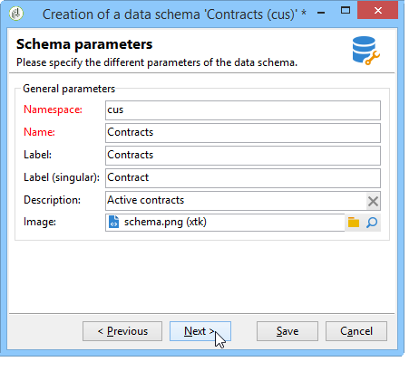

# Schemi di dati{#data-schemas}

## Principi {#principles}

Per modificare, creare e configurare gli schemi, fare clic sul nodo **[!UICONTROL Administration > Configuration > Data schemas]** della console client di Adobe Campaign.

>[!NOTE]
>
>Gli schemi di dati incorporati possono essere eliminati solo da un amministratore della console Adobe Campaign Classic.


Il campo di modifica mostra il contenuto XML dello schema di origine:


>[!NOTE]
>
>Il controllo di modifica &quot;Nome&quot; consente di immettere la chiave dello schema composta dal nome e dallo spazio dei nomi. Gli attributi &quot;name&quot; e &quot;namespace&quot; dell&#39;elemento principale dello schema vengono aggiornati automaticamente nell&#39;area di modifica XML dello schema.

L’anteprima genera automaticamente lo schema esteso:


>[!NOTE]
>
>Quando lo schema di origine viene salvato, viene avviata automaticamente la generazione dello schema esteso.

Se devi controllare la struttura completa di uno schema, puoi utilizzare la scheda anteprima. Se lo schema è stato esteso, potrai visualizzarne tutte le estensioni. In aggiunta, nella scheda Documentazione vengono visualizzati tutti gli attributi e gli elementi dello schema e le relative proprietà (Campo SQL, tipo/lunghezza, etichetta, descrizione). La scheda Documentazione si applica solo agli schemi generati. Per ulteriori informazioni, consulta la sezione [Rigenerazione degli schemi](../../configuration/using/regenerating-schemas.md).

## Esempio: creazione di una tabella dei contratti {#example--creating-a-contract-table}

Nell&#39;esempio seguente si desidera creare una nuova tabella per **contratti** nel modello di database del database Adobe Campaign. Questa tabella consente di memorizzare i nomi e i cognomi e gli indirizzi e-mail dei titolari e dei co-titolari per ogni contratto.

A questo scopo, devi creare lo schema della tabella e aggiornare la struttura del database per generare la tabella corrispondente. Applica le seguenti fasi:

1. Modificare il nodo **[!UICONTROL Administration > Configuration > Data schemas]** della struttura Adobe Campaign e fare clic su **[!UICONTROL New]**.
1. Scegliere l&#39;opzione **[!UICONTROL Create a new table in the data model]** e fare clic su **[!UICONTROL Next]**.

   

1. Specificare un nome per la tabella e uno spazio dei nomi.

   

   >[!NOTE]
   >
   >Per impostazione predefinita, gli schemi creati dagli utenti vengono memorizzati nello spazio dei nomi &quot;cus&quot;. Per ulteriori informazioni, consulta [Identificazione di uno schema](../../configuration/using/about-schema-reference.md#identification-of-a-schema).

1. Crea il contenuto della tabella. È consigliabile utilizzare l&#39;assistente di immissione per verificare che non manchino impostazioni. A tale scopo, fare clic sul pulsante **[!UICONTROL Insert]** e scegliere il tipo di impostazione da aggiungere.

   

1. Definire le impostazioni per la tabella dei contratti:

   ```
   <srcSchema desc="Active contracts" img="ncm:channels.png" label="Contracts" labelSingular="Contract" mappingType="sql" name="Contracts" namespace="cus" xtkschema="xtk:srcSchema">
     <element desc="Active contracts" img="ncm:channels.png" label="Contracts" labelSingular="Contract"
              name="Contracts" autopk="true">
              <attribute name="holderName" label="Holder last name" type="string"/>
              <attribute name="holderFirstName" label="Holder first name" type="string"/>
              <attribute name="holderEmail" label="Holder email" type="string"/>
              <attribute name="co-holderName" label="Co-holder last name" type="string"/>           
              <attribute name="co-holderFirstName" label="Co-holder first name" type="string"/>           
              <attribute name="co-holderEmail" label="Co-holder email" type="string"/>    
              <attribute name="date" label="Subscription date" type="date"/>     
              <attribute name="noContract" label="Contract number" type="long"/>  
     </element>
   </srcSchema>
   ```

   Aggiungere il tipo di contratto e inserire un indice nel numero di contratto.

   ```
   <srcSchema _cs="Contracts (cus)" desc="Active contracts" entitySchema="xtk:srcSchema" img="ncm:channels.png"
              label="Contracts" labelSingular="Contract" name="Contracts" namespace="cus" xtkschema="xtk:srcSchema">
     <enumeration basetype="byte" name="typeContract">
       <value label="Home" name="home" value="0"/>
       <value label="Car" name="car" value="1"/>
       <value label="Health" name="health" value="2"/>
       <value label="Pension fund" name="pension fund" value="2"/>
     </enumeration>
     <element autopk="true" desc="Active contracts" img="ncm:channels.png" label="Contracts"
              labelSingular="Contract" name="Contracts">
       <attribute label="Holder last name" name="holderName" type="string"/>
       <attribute label="Holder first name" name="holderFirstName" type="string"/>
       <attribute label="Holder email" name="holderEmail" type="string"/>
       <attribute label="Co-holder last name" name="co-holderName" type="string"/>
       <attribute label="Co-holder first name" name="co-holderFirstName" type="string"/>
       <attribute label="Co-holder email" name="co-holderEmail" type="string"/>
       <attribute label="Subscription date" name="date" type="date"/>
      <attribute desc="Type of contract" enum="cus:Contracts:typeContract" label="Type of contract"
                  name="type" type="byte"/>
       <attribute label="Contract number" name="noContract" type="long"/>
       <dbindex name="noContract" unique="true">
         <keyfield xpath="@noContract"/>
       </dbindex>
     </element>
   </srcSchema>
   ```

1. Salva lo schema per generare la struttura:

   

1. Aggiorna la struttura del database per creare la tabella a cui verrà collegato lo schema. Per ulteriori informazioni, consulta [Aggiornamento della struttura del database](../../configuration/using/updating-the-database-structure.md).
