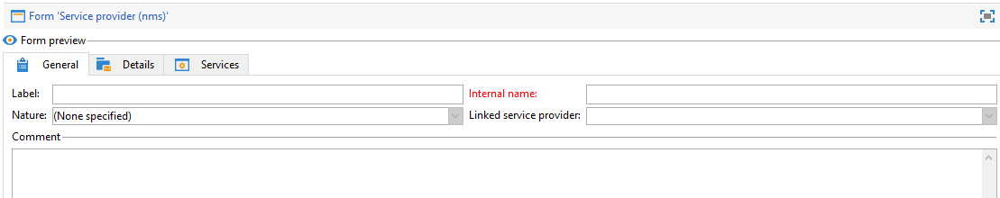

# Modificare i moduli{#editing-forms}

## Panoramica

Gli addetti al marketing e gli operatori utilizzano i moduli di input per creare, modificare e visualizzare in anteprima i record. Forms mostra una rappresentazione visiva delle informazioni.

È possibile creare e modificare i moduli di input:

* È possibile modificare i moduli di input forniti per impostazione predefinita. I moduli di input di fabbrica si basano sugli schemi di dati di fabbrica.
* Puoi creare moduli di input personalizzati, in base agli schemi di dati definiti.

Forms sono entità di tipo `xtk:form`. È possibile visualizzare la struttura del modulo di input nello schema `xtk:form`. Per visualizzare questo schema, scegli **[!UICONTROL Administration]** > **[!UICONTROL Configuration]** > **[!UICONTROL Data schemas]** dal menu. Ulteriori informazioni sulla [struttura modulo](form-structure.md).

Per accedere ai moduli di input, scegliere **[!UICONTROL Administration]> [!UICONTROL Configuration] >[!UICONTROL Input forms]** dal menu:


Per progettare moduli, modificare il contenuto XML nell&#39;editor XML:


[Ulteriori informazioni](form-structure.md#formatting).

Per visualizzare l&#39;anteprima di un modulo, fare clic sulla scheda **[!UICONTROL Preview]**:


## Tipi di modulo

È possibile creare diversi tipi di moduli di input. Il tipo di modulo determina il modo in cui gli utenti si spostano nel modulo:

* Schermata console

  Questo è il tipo di modulo predefinito. Il modulo comprende una singola pagina.

  

* Gestione dei contenuti

  Utilizza questo tipo di modulo per la gestione dei contenuti. Vedi questo [caso d&#39;uso](../../delivery/using/use-case-creating-content-management.md).

  

* Assistente

  Questo modulo comprende più schermi mobili ordinati in una sequenza specifica. Gli utenti possono passare da una schermata all’altra. [Ulteriori informazioni](form-structure.md#wizards).

* Iconbox

  Questo modulo comprende più pagine. Per spostarsi nel modulo, gli utenti selezionano le icone a sinistra del modulo.

  

* Notebook

  Questo modulo comprende più pagine. Per spostarsi nel modulo, gli utenti selezionano le schede nella parte superiore del modulo.

  

* Riquadro verticale

  In questo modulo viene visualizzata una struttura di spostamento.

* Riquadro orizzontale

  Questo modulo mostra un elenco di elementi.

## Contenitori

Nei moduli è possibile utilizzare i contenitori per vari scopi:

* Organizzare i contenuti nei moduli
* Definire l’accesso ai campi di input
* Nidificare i moduli in altri moduli

[Ulteriori informazioni](form-structure.md#containers).

### Organizzare i contenuti

Utilizzare i contenitori per organizzare il contenuto nei moduli:

* Puoi raggruppare i campi in sezioni.
* È possibile aggiungere pagine a moduli multipagina.

Per inserire un contenitore, utilizzare l&#39;elemento `<container>`. [Ulteriori informazioni](form-structure.md#containers).

#### Raggruppa campi

Utilizza i contenitori per raggruppare i campi di input in sezioni organizzate.

Per inserire una sezione in un modulo, utilizzare questo elemento: `<container type="frame">`. Per aggiungere un titolo di sezione, utilizzare l&#39;attributo `label`.

Sintassi: `<container type="frame" label="`*section_title*`"> […] </container>`

In questo esempio, un contenitore definisce la sezione **Creazione**, che comprende i campi di input **[!UICONTROL Created by]** e **[!UICONTROL Name]**:

```xml
<form _cs="Coupons (nms)" entitySchema="xtk:form" img="xtk:form.png" label="Coupons"
      name="coupon" namespace="nms" type="default" xtkschema="xtk:form">
  <input xpath="@code"/>
  <input xpath="@type"/>
  <container label="Creation" type="frame">
    <input xpath="createdBy"/>
    <input xpath="createdBy/@name"/>
  </container>
</form>
```


#### Aggiungere pagine a moduli multipagina

Per i moduli multipagina, utilizza un contenitore per creare una pagina modulo.

In questo esempio vengono visualizzati i contenitori per le pagine **Generale** e **Dettagli** di un modulo:

```xml
<container img="ncm:book.png" label="General">
[…]
</container>
<container img="ncm:detail.png" label="Details">
[…]
</container>
```

### Definire l’accesso ai campi

Utilizza i contenitori per definire ciò che è visibile e per definire l’accesso ai campi. È possibile attivare o disattivare gruppi di campi.

### Nidificare i moduli

Utilizzare i contenitori per nidificare i moduli all&#39;interno di altri moduli. [Ulteriori informazioni](#add-pages-to-multipage-forms).

## Riferimenti a immagini

Per trovare le immagini, scegliere **[!UICONTROL Administration]** > **[!UICONTROL Configuration]** > **[!UICONTROL Images]** dal menu.

Per associare un&#39;immagine a un elemento del modulo, ad esempio un&#39;icona, è possibile aggiungere un riferimento a un&#39;immagine. Utilizzare l&#39;attributo `img`, ad esempio, nell&#39;elemento `<container>`.

Sintassi: `img="`*`namespace`*`:`*`filename`*`.`*`extension`*`"`

Questo esempio mostra i riferimenti alle immagini `book.png` e `detail.png` dallo spazio dei nomi `ncm`:

```xml
<container img="ncm:book.png" label="General">
[…]
</container>
<container img="ncm:detail.png" label="Details">
[…]
</container>
```

Queste immagini sono utilizzate per le icone su cui gli utenti fanno clic per spostarsi in un modulo multipagina:


## Creare un modulo semplice {#create-simple-form}

Per creare un modulo, eseguire la procedura seguente:

1. Scegliere **[!UICONTROL Administration]** > **[!UICONTROL Configuration]** > **[!UICONTROL Input forms]** dal menu.
1. Fare clic sul pulsante **[!UICONTROL New]** in alto a destra nell&#39;elenco.

   

1. Specificare le proprietà del modulo:

   * Specifica il nome del modulo e lo spazio dei nomi.

     Il nome del modulo e lo spazio dei nomi possono corrispondere allo schema di dati correlato.  Questo esempio mostra un modulo per lo schema dati `cus:order`:

     ```xml
     <form entitySchema="xtk:form" img="xtk:form.png" label="Order" name="order" namespace="cus" type="iconbox" xtkschema="xtk:form">
       […]
     </form>
     ```

     In alternativa, è possibile specificare esplicitamente lo schema dati nell&#39;attributo `entity-schema`.

     ```xml
     <form entity-schema="cus:stockLine" entitySchema="xtk:form" img="xtk:form.png" label="Stock order" name="stockOrder" namespace="cus" xtkschema="xtk:form">
       […]
     </form>
     ```

   * Specificare l&#39;etichetta da visualizzare nel modulo.
   * Facoltativamente, specificare il tipo di modulo. Se non si specifica un tipo di modulo, per impostazione predefinita viene utilizzato il tipo di schermata della console.

     

     Se si progetta un modulo multipagina, è possibile omettere il tipo di modulo nell&#39;elemento `<form>` e specificare il tipo in un contenitore.

1. Fai clic su **[!UICONTROL Save]**.

1. Inserire gli elementi del modulo.

   Ad esempio, per inserire un campo di input, utilizzare l&#39;elemento `<input>`. Impostare l&#39;attributo `xpath` sul riferimento di campo come espressione XPath. [Ulteriori informazioni](schema-structure.md#referencing-with-xpath).

   Questo esempio mostra i campi di input basati sullo schema `nms:recipient`.

   ```xml
   <input xpath="@firstName"/>
   <input xpath="@lastName"/>
   ```

1. Se il modulo è basato su un tipo di schema specifico, è possibile cercare i campi per questo schema:

   1. Fare clic su **[!UICONTROL Insert]** > **[!UICONTROL Document fields]**.

      

   1. Selezionare il campo e fare clic su **[!UICONTROL OK]**.

      

1. Facoltativamente, specifica l’editor di campi.

   A ciascun tipo di dati è associato un editor di campi predefinito:
   * Per un campo di tipo data, nel modulo viene visualizzato un calendario di input.
   * Per un campo di tipo enumerazione, il modulo mostra un elenco di selezione.

   Puoi utilizzare i seguenti tipi di editor di campi:

   | Editor campo | Attributo modulo |
   | --- | --- |
   | Pulsante di opzione | `type="radiobutton"` |
   | Casella di controllo | `type="checkbox"` |
   | Modifica struttura | `type="tree"` |

   Ulteriori informazioni sui [controlli elenco memoria](form-structure.md#memory-list-controls).

1. Facoltativamente, definisci l’accesso ai campi:

   | Elemento “element” | Attributo | Descrizione |
   | --- | --- | --- |
   | `<input>` | `read-only="true"` | Fornisce accesso in sola lettura a un campo |
   | `<container>` | `type="visibleGroup" visibleIf="`*modifica-espr*`"` | Visualizza un gruppo di campi in modo condizionale |
   | `<container>` | `type="enabledGroup" enabledIf="`*modifica-espr*`"` | Abilita un gruppo di campi in modo condizionale |

   Esempio:

   ```xml
   <container type="enabledGroup" enabledIf="@gender=1">
     […]
   </container>
   <container type="enabledGroup" enabledIf="@gender=2">
     […]
   </container>
   ```

1. Facoltativamente, utilizza i contenitori per raggruppare i campi in sezioni.

   ```xml
   <container type="frame" label="Name">
      <input xpath="@firstName"/>
      <input xpath="@lastName"/>
   </container>
   <container type="frame" label="Contact details">
      <input xpath="@email"/>
      <input xpath="@phone"/>
   </container>
   ```

   

## Creare un modulo multipagina {#create-multipage-form}

Puoi creare moduli multipagina. È inoltre possibile nidificare i moduli all&#39;interno di altri moduli.

### Crea un modulo `iconbox`

Utilizzare il tipo di modulo `iconbox` per visualizzare le icone a sinistra del modulo, che portano gli utenti a pagine diverse del modulo.


Per modificare il tipo di un modulo esistente in `iconbox`, eseguire la procedura seguente:

1. Modificare l&#39;attributo `type` dell&#39;elemento `<form>` in `iconbox`:

   ```xml
   <form […] type="iconbox">
   ```

1. Impostare un contenitore per ogni pagina del modulo:

   1. Aggiungere un elemento `<container>` come elemento figlio dell&#39;elemento `<form>`.
   1. Per definire un&#39;etichetta e un&#39;immagine per l&#39;icona, utilizzare gli attributi `label` e `img`.

      ```xml
      <form entitySchema="xtk:form" name="Service provider" namespace="nms" type="iconbox" xtkschema="xtk:form">
          <container img="xtk:properties.png" label="General">
              <input xpath="@label"/>
              <input xpath="@name"/>
              […]
          </container>
          <container img="nms:msgfolder.png" label="Details">
              <input xpath="@address"/>
              […]
          </container>
          <container img="nms:supplier.png" label="Services">
              […]
          </container>
      </form>
      ```

   In alternativa, rimuovere l&#39;attributo `type="frame"` dagli elementi `<container>` esistenti.

### Creare un modulo per blocchi appunti

Utilizza il tipo di modulo `notebook` per visualizzare le schede nella parte superiore del modulo, che portano gli utenti a pagine diverse.


Per modificare il tipo di un modulo esistente in `notebook`, eseguire la procedura seguente:

1. Modificare l&#39;attributo `type` dell&#39;elemento `<form>` in `notebook`:

   ```xml
   <form […] type="notebook">
   ```

1. Aggiungi un contenitore per ogni pagina modulo:

   1. Aggiungere un elemento `<container>` come elemento figlio dell&#39;elemento `<form>`.
   1. Per definire l&#39;etichetta e l&#39;immagine per l&#39;icona, utilizzare gli attributi `label` e `img`.

   ```xml
     <form entitySchema="xtk:form" name="Service provider" namespace="nms" type="notebook" xtkschema="xtk:form">
         <container label="General">
             <input xpath="@label"/>
             <input xpath="@name"/>
             […]
         </container>
         <container label="Details">
             <input xpath="@address"/>
             […]
         </container>
         <container label="Services">
             […]
         </container>
     </form>
   ```

   In alternativa, rimuovere l&#39;attributo `type="frame"` dagli elementi `<container>` esistenti.

### Nidificare i moduli

È possibile nidificare i moduli all&#39;interno di altri moduli. Ad esempio, è possibile nidificare i moduli notebook all&#39;interno dei moduli iconbox.

Il livello di nidificazione controlla la navigazione. Gli utenti possono eseguire il drill-down alle sottomaschere.

Per nidificare un modulo all&#39;interno di un altro modulo, inserire un elemento `<container>` e impostare l&#39;attributo `type` sul tipo di modulo. Per il modulo di primo livello, è possibile impostare il tipo di modulo in un contenitore esterno o nell&#39;elemento `<form>`.

### Esempio

Questo esempio mostra un modulo complesso:

* Il modulo di primo livello è un modulo iconbox. Questo modulo comprende due contenitori con etichetta **Generale** e **Dettagli**.

  Di conseguenza, il modulo esterno mostra le pagine **Generale** e **Dettagli** al livello superiore. Per accedere a queste pagine, gli utenti possono fare clic sulle icone a sinistra del modulo.

* Il sottomodulo è un modulo del blocco appunti nidificato nel contenitore **Generale**. Il sottomodulo comprende due contenitori con etichetta **Nome** e **Contatto**.

```xml
<form _cs="Profile (nms)" entitySchema="xtk:form" img="xtk:form.png" label="Profile" name="profile" namespace="nms" xtkschema="xtk:form">
  <container type="iconbox">
    <container img="ncm:general.png" label="General">
      <container type="notebook">
        <container label="Name">
          <input xpath="@firstName"/>
          <input xpath="@lastName"/>
        </container>
        <container label="Contact">
          <input xpath="@email"/>
        </container>
      </container>
    </container>
    <container img="ncm:detail.png" label="Details">
      <input xpath="@birthDate"/>
    </container>
  </container>
</form>
```

Di conseguenza, nella pagina **Generale** del modulo esterno sono visualizzate le schede **Nome** e **Contatto**.


Per nidificare un modulo all&#39;interno di un altro modulo, inserire un elemento `<container>` e impostare l&#39;attributo `type` sul tipo di modulo. Per il modulo di primo livello, è possibile impostare il tipo di modulo in un contenitore esterno o nell&#39;elemento `<form>`.

### Esempio

Questo esempio mostra un modulo complesso:

* Il modulo di primo livello è un modulo iconbox. Questo modulo comprende due contenitori con etichetta **Generale** e **Dettagli**.

  Di conseguenza, il modulo esterno mostra le pagine **Generale** e **Dettagli** al livello superiore. Per accedere a queste pagine, gli utenti possono fare clic sulle icone a sinistra del modulo.

* Il sottomodulo è un modulo del blocco appunti nidificato nel contenitore **Generale**. Il sottomodulo comprende due contenitori con etichetta **Nome** e **Contatto**.

```xml
<form _cs="Profile (nms)" entitySchema="xtk:form" img="xtk:form.png" label="Profile" name="profile" namespace="nms" xtkschema="xtk:form">
  <container type="iconbox">
    <container img="ncm:general.png" label="General">
      <container type="notebook">
        <container label="Name">
          <input xpath="@firstName"/>
          <input xpath="@lastName"/>
        </container>
        <container label="Contact">
          <input xpath="@email"/>
        </container>
      </container>
    </container>
    <container img="ncm:detail.png" label="Details">
      <input xpath="@birthDate"/>
    </container>
  </container>
</form>
```

Di conseguenza, nella pagina **Generale** del modulo esterno sono visualizzate le schede **Nome** e **Contatto**.


## Modificare un modulo di input di fabbrica {#modify-factory-form}

Per modificare un modulo di fabbrica, effettuare le seguenti operazioni:

1. Modificare il modulo di input di fabbrica:

   1. Scegliere **[!UICONTROL Administration]** > **[!UICONTROL Configuration]** > **[!UICONTROL Input forms]** dal menu.
   1. Selezionare un modulo di input e modificarlo.

   È possibile estendere gli schemi di dati di fabbrica, ma non i moduli di input di fabbrica. È consigliabile modificare direttamente i moduli di input di fabbrica senza ricrearli. Durante gli aggiornamenti del software, le modifiche nei moduli di input di fabbrica vengono unite agli aggiornamenti. Se l&#39;unione automatica non riesce, è possibile risolvere i conflitti. [Ulteriori informazioni](../../production/using/upgrading.md#resolving-conflicts).

   Ad esempio, se si estende uno schema di fabbrica con un campo aggiuntivo, è possibile aggiungere questo campo al relativo modulo di fabbrica.

## Convalida moduli {#validate-forms}

È possibile includere controlli di convalida nelle maschere.

### Concedere l’accesso in sola lettura ai campi

Per concedere l&#39;accesso in sola lettura a un campo, utilizzare l&#39;attributo `readOnly="true"`. È ad esempio possibile visualizzare la chiave primaria di un record, ma con accesso in sola lettura. [Ulteriori informazioni](form-structure.md#non-editable-fields).

In questo esempio, la chiave primaria (`iRecipientId`) dello schema `nms:recipient` viene visualizzata in accesso in sola lettura:

```xml
<value xpath="@iRecipientId" readOnly="true"/>
```

### Controlla campi obbligatori

Puoi controllare le informazioni obbligatorie:

* Utilizzare l&#39;attributo `required="true"` per i campi obbligatori.
* Utilizza il nodo `<leave>` per controllare questi campi e visualizzare i messaggi di errore.

In questo esempio, l’indirizzo e-mail è obbligatorio e viene visualizzato un messaggio di errore se l’utente non ha fornito queste informazioni:

```xml
<input xpath="@email" required="true"/>
<leave>
  <check expr="@email!=''">
    <error>The email address is required.</error>
  </check>
</leave>
```

Ulteriori informazioni sui [campi espressione](form-structure.md#expression-field) e sul [contesto modulo](form-structure.md#context-of-forms).

### Convalida valori

Puoi utilizzare le chiamate SOAP di JavaScript per convalidare i dati del modulo dalla console. Utilizza queste chiamate per la convalida complessa, ad esempio, per confrontare un valore con un elenco di valori autorizzati. [Ulteriori informazioni](form-structure.md#soap-methods).

1. Crea una funzione di convalida in un file JS.

   Esempio:

   ```js
   function nms_recipient_checkValue(value)
   {
     logInfo("checking value " + value)
     if (…)
     {
       logError("Value " + value + " is not valid")
     }
     return 1
   }
   ```

   In questo esempio, la funzione è denominata `checkValue`. Questa funzione viene utilizzata per controllare il tipo di dati `recipient` nello spazio dei nomi `nms`. Il valore che viene controllato viene registrato. Se il valore non è valido, viene registrato un messaggio di errore. Se il valore è valido, viene restituito il valore 1.

   È possibile utilizzare il valore restituito per modificare il modulo.

1. Nel modulo, aggiungi l&#39;elemento `<soapCall>` all&#39;elemento `<leave>`.

   In questo esempio, viene utilizzata una chiamata SOAP per convalidare la stringa `@valueToCheck`:

   ```xml
   <form name="recipient" (…)>
   (…)
     <leave>
       <soapCall name="checkValue" service="nms:recipient">
         <param exprIn="@valueToCheck" type="string"/>
       </soapCall>
     </leave>
   </form>
   ```

   In questo esempio vengono utilizzati il metodo `checkValue` e il servizio `nms:recipient`:

   * Il servizio è lo spazio dei nomi e il tipo di dati.
   * Il metodo è il nome della funzione. Il nome distingue tra maiuscole e minuscole.

   La chiamata viene eseguita in modo sincrono.

   Vengono visualizzate tutte le eccezioni. Se si utilizza l&#39;elemento `<leave>`, gli utenti non potranno salvare il modulo finché le informazioni immesse non saranno convalidate.

In questo esempio viene illustrato come effettuare chiamate di servizio all&#39;interno dei moduli:

```xml
<enter>
  <soapCall name="client" service="c4:ybClient">
    <param exprIn="@id" type="string"/>
    <param type="boolean" xpathOut="/tmp/@count"/>
  </soapCall>
</enter>
```

In questo esempio, l’input è un ID, che è una chiave primaria. Quando gli utenti compilano il modulo per questo ID, viene effettuata una chiamata SOAP con questo ID come parametro di input. L&#39;output è un valore booleano scritto in questo campo: `/tmp/@count`. Puoi utilizzare questo valore booleano all’interno del modulo. Ulteriori informazioni sul [contesto modulo](form-structure.md#context-of-forms).
