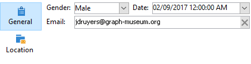
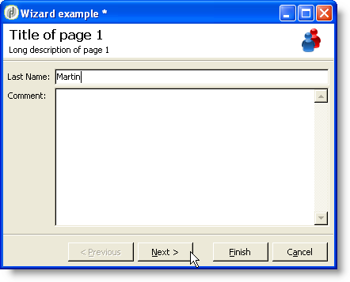

# Struttura di un modulo{#form-structure}


La descrizione di un modulo è un documento XML strutturato che osserva la grammatica dello schema del modulo **xtk:form**.

Il documento XML del modulo di input deve contenere l&#39;elemento principale `<form>` con gli attributi **name** e **namespace** per compilare il nome del modulo e lo spazio dei nomi.

```xml
<form name="form_name" namespace="name_space">
…
</form>
```

Per impostazione predefinita, un modulo è associato allo schema dati con lo stesso nome e lo stesso spazio dei nomi. Per associare un modulo a un nome diverso, impostare l&#39;attributo **entity-schema** dell&#39;elemento `<form>` sul nome della chiave dello schema. Per illustrare la struttura di un modulo di input, descriviamo un’interfaccia utilizzando lo schema di esempio &quot;cus:recipient&quot;:

```xml
<srcSchema name="recipient" namespace="cus">
  <enumeration name="gender" basetype="byte">    
    <value name="unknown" label="Not specified" value="0"/>    
    <value name="male" label="Male" value="1"/>   
    <value name="female" label="Female" value="2"/>   
  </enumeration>

  <element name="recipient">
    <attribute name="email" type="string" length="80" label="Email" desc="Email address of recipient"/>
    <attribute name="birthDate" type="datetime" label="Date"/>
    <attribute name="gender" type="byte" label="Gender" enum="gender"/>
  </element>
</srcSchema>
```

Il modulo di input basato sullo schema di esempio:


```xml
<form name="recipient" namespace="cus">
  <input xpath="@gender"/>
  <input xpath="@birthDate"/>
  <input xpath="@email"/>
</form>
```

La descrizione dei controlli di modifica inizia dall&#39;elemento radice `<form>`. È stato immesso un controllo di modifica in un elemento **`<input>`** con l&#39;attributo **xpath** contenente il percorso del campo nel relativo schema.

Il controllo di modifica si adatta automaticamente al tipo di dati corrispondente e utilizza l&#39;etichetta definita nello schema.

>[!NOTE]
>
>È possibile sovraccaricare l&#39;etichetta definita nel relativo schema di dati aggiungendo l&#39;attributo **label** all&#39;elemento `<input>`:\
>`<input label="Email address" xpath="@name" />`

Per impostazione predefinita, ogni campo viene visualizzato su una sola riga e occupa tutto lo spazio disponibile a seconda del tipo di dati.

## Formattazione {#formatting}

Il layout dei controlli è simile al layout utilizzato nelle tabelle HTML, con la possibilità di dividere un controllo in più colonne, di interlacciare elementi o di specificare l&#39;occupazione dello spazio disponibile. Tenete presente, tuttavia, che la formattazione consente di dividere l&#39;area solo per le proporzioni; non è possibile specificare dimensioni fisse per un oggetto.

Per visualizzare i controlli dell&#39;esempio precedente in due colonne:


```xml
<form name="recipient" namespace="cus">
  <container colcount="2">
    <input xpath="@gender"/>
    <input xpath="@birthDate"/>
    <input xpath="@email"/>
  </container>
</form>
```

L&#39;elemento **`<container>`** con attributo **colcount** consente di forzare la visualizzazione dei controlli figlio in due colonne.

L&#39;attributo **colspan** in un controllo estende il controllo in base al numero di colonne immesse nel relativo valore:


```xml
<form name="recipient" namespace="cus">
  <container colcount="2">
    <input xpath="@gender"/>
    <input xpath="@birthDate"/>
    <input xpath="@email" colspan="2"/>
  </container>
</form> 
```

Compilando l&#39;attributo **type=&quot;frame&quot;**, il contenitore aggiunge un frame intorno ai controlli figlio con l&#39;etichetta contenuta nell&#39;attributo **label**:


```xml
<form name="recipient" namespace="cus">
  <container colcount="2" type="frame" label="General">
    <input xpath="@gender"/>
    <input xpath="@birthDate"/>
    <input xpath="@email" colspan="2"/>
  </container>
</form>
```

È possibile utilizzare un elemento **`<static>`** per formattare il modulo di input:


```xml
<form name="recipient" namespace="cus">
  <static type="separator" colspan="2" label="General"/>
  <input xpath="@gender"/>
  <input xpath="@birthDate"/>
  <input xpath="@email" colspan="2"/>
  <static type="help" label="General information about recipient with date of birth, gender, and email address." colspan="2"/>
</form>
```

Il tag **`<static>`** con tipo **separator** consente di aggiungere una barra di separazione con un&#39;etichetta contenuta nell&#39;attributo **label**.

È stato aggiunto un testo della Guida utilizzando il tag `<static>` con tipo di Guida. Il contenuto del testo viene immesso nell&#39;attributo **label**.

## Contenitori {#containers}

I contenitori consentono di raggruppare un insieme di controlli. Sono rappresentati dall&#39;elemento **`<container>`**. Sono stati utilizzati in precedenza per formattare i controlli su più colonne.

L&#39;attributo **xpath** in un `<container>` consente di semplificare il riferimento ai controlli figlio. Il riferimento ai controlli è quindi relativo all&#39;elemento padre `<container>`.

Esempio di contenitore senza &quot;xpath&quot;:

```xml
<container colcount="2">
  <input xpath="location/@zipCode"/>
  <input xpath="location/@city"/>
</container>
```

Esempio con l’aggiunta di &quot;xpath&quot; all’elemento denominato &quot;location&quot;:

```xml
<container colcount="2" xpath="location">
  <input xpath="@zipCode"/>
  <input xpath="@city"/>
</container>
```

### Tipi di contenitore {#types-of-container}

I contenitori vengono utilizzati per creare controlli complessi utilizzando un set di campi formattati nelle pagine.

#### Contenitore di schede {#tab-container}

Un contenitore di schede formatta i dati nelle pagine accessibili dalle schede.


```xml
<container type="notebook">
  <container colcount="2" label="General">
    <input xpath="@gender"/>
    <input xpath="@birthDate"/>
    <input xpath="@email" colspan="2"/>
  </container>
  <container colcount="2" label="Location">
    …
  </container>
</container>
```

Il contenitore principale è definito dall&#39;attributo **type=&quot;notebook&quot;**. Le schede vengono dichiarate nei contenitori figlio e l&#39;etichetta delle schede viene compilata dall&#39;attributo **label**.


>[!NOTE]
>
>Una funzionalità **style=&quot;down|up**(per impostazione predefinita)**&quot;** forza il posizionamento verticale delle etichette di tabulazione al di sotto o al di sopra del controllo. Questa funzione è facoltativa.
>`<container style="down" type="notebook">  … </container>`

#### Elenco icone {#icon-list}

Questo contenitore visualizza una barra di icone verticale che consente di selezionare le pagine da visualizzare.



```xml
<container type="iconbox">
  <container colcount="2" label="General" img="xtk:properties.png">
    <input xpath="@gender"/>
    <input xpath="@birthDate"/>
    <input xpath="@email" colspan="2"/>
  </container>
  <container colcount="2" label="Location" img="nms:msgfolder.png">
    …
  </container>
</container>
```

Il contenitore principale è definito dall&#39;attributo **type=&quot;iconbox&quot;**. Le pagine associate alle icone vengono dichiarate nei contenitori figlio. L&#39;etichetta delle icone viene compilata dall&#39;attributo **label**.

L&#39;icona di una pagina viene compilata dall&#39;attributo `img="<image>"`, dove `<image>` è il nome dell&#39;immagine corrispondente alla chiave costituita dal nome e dallo spazio dei nomi (ad esempio, &quot;xtk:properties.png&quot;).

Le immagini sono disponibili dal nodo **[!UICONTROL Administration > Configuration > Images]**.

#### Contenitore Visibilità {#visibility-container}

È possibile mascherare un insieme di controlli tramite una condizione dinamica.

Questo esempio illustra la visibilità dei controlli sul valore del campo &quot;Gender&quot;:

```xml
<container type="visibleGroup" visibleIf="@gender=1">
  …
</container>
<container type="visibleGroup" visibleIf="@gender=2">
  …
</container>
```

Un contenitore di visibilità è definito dall&#39;attributo **type=&quot;visibleGroup&quot;**. L&#39;attributo **visibleIf** contiene la condizione di visibilità.

Esempi di sintassi delle condizioni:

* **visibleIf=&quot;@email=&#39;peter.martinezATneeolane.net&#39;&quot;**: verifica l&#39;uguaglianza nei dati di tipo stringa. Il valore di confronto deve essere tra virgolette.
* **visibleIf=&quot;@gender >= 1 e @gender != 2&quot;**: condizione su un valore numerico.
* **visibleIf=&quot;@boolean1=true o @boolean2=false&quot;**: verifica sui campi booleani.

#### Abilitazione del contenitore {#enabling-container}

Questo contenitore ti consente di abilitare o disabilitare un set di dati da una condizione dinamica. La disattivazione di un controllo ne impedisce la modifica. L’esempio seguente illustra l’abilitazione dei controlli dal valore del campo &quot;Genere&quot;:

```xml
<container type="enabledGroup" enabledIf="@gender=1">
  …
</container>
<container type="enabledGroup" enabledIf="@gender=2">
  …
</container>
```

Un contenitore di abilitazione è definito dall&#39;attributo **type=&quot;enabledGroup&quot;**. L&#39;attributo **enabledIf** contiene la condizione di attivazione.

## Modifica di un collegamento {#editing-a-link}

Ricorda che un collegamento viene dichiarato nello schema di dati come segue:

```xml
<element label="Company" name="company" target="cus:company" type="link"/>
```

Il controllo di modifica del collegamento nel relativo modulo di input è il seguente:


```xml
<input xpath="company"/>
```

La selezione del target è accessibile tramite il campo di modifica. L&#39;immissione è assistita dal completamento automatico in modo che un elemento di destinazione possa essere facilmente trovato dai primi caratteri immessi. La ricerca si basa quindi sulla **stringa di calcolo** definita nello schema di destinazione. Se lo schema non esiste dopo la convalida nel controllo, viene visualizzato un messaggio di conferma della creazione immediata del target. La conferma crea un nuovo record nella tabella di destinazione e lo associa al collegamento.

Viene utilizzato un elenco a discesa per selezionare un elemento di destinazione dall’elenco di record già creato.

L&#39;icona **[!UICONTROL Modify the link]** (cartella) avvia un modulo di selezione con l&#39;elenco degli elementi di destinazione e un&#39;area filtro:


L&#39;icona **[!UICONTROL Edit link]** (lente di ingrandimento) avvia il modulo di modifica dell&#39;elemento collegato. Il modulo utilizzato viene dedotto per impostazione predefinita sulla chiave dello schema di destinazione. L&#39;attributo **form** consente di forzare il nome del modulo di modifica (ad esempio, &quot;cus:company2&quot;).

È possibile limitare la scelta degli elementi di destinazione aggiungendo l&#39;elemento **`<sysfilter>`** dalla definizione del collegamento nel modulo di input:

```xml
<input xpath="company">
  <sysFilter>
    <condition expr="[location/@city] =  'Newton"/>
  </sysFilter>
</input>
```

È inoltre possibile ordinare l&#39;elenco con l&#39;elemento **`<orderby>`**:

```xml
<input xpath="company">
  <orderBy>
    <node expr="[location/@zipCode]"/>
  </orderBy>
</input>
```

### Proprietà controllo {#control-properties}

* **noAutoComplete**: disabilita il completamento automatico (con il valore &quot;true&quot;)
* **createMode**: crea il collegamento al volo se non esiste. I valori possibili sono:

   * **none**: disabilita la creazione. Se il collegamento non esiste, viene visualizzato un messaggio di errore
   * **inline**: crea il collegamento con il contenuto nel campo di modifica
   * **edizione**: visualizza il modulo di modifica sul collegamento. Quando il modulo viene convalidato, i dati vengono salvati (modalità predefinita)

* **noZoom**: nessun modulo di modifica sul collegamento (con il valore &quot;true&quot;)
* **modulo**: sovraccarica il modulo di modifica dell&#39;elemento di destinazione

## Elenco dei collegamenti {#list-of-links}

Un collegamento immesso nello schema dati come elemento di raccolta (unbound=&quot;true&quot;) deve scorrere un elenco per visualizzare tutti gli elementi associati.

Il principio consiste nella visualizzazione dell’elenco degli elementi collegati con caricamento dei dati ottimizzato (download per batch di dati, esecuzione dell’elenco solo se è visibile).

Esempio di un collegamento di raccolta in uno schema:

```xml
<element label="Events" name="rcpEvent" target="cus:event" type="link" unbound="true">
…
</element>
```

L’elenco nella sua forma di input:


```xml
 <input xpath="rcpEvent" type="linklist">
  <input xpath="@label"/>
  <input xpath="@date"/>
</input>
```

Il controllo elenco è definito dall&#39;attributo **type=&quot;linklist&quot;**. Il percorso dell’elenco deve fare riferimento al collegamento della raccolta.

Le colonne vengono dichiarate tramite gli elementi **`<input>`** dell&#39;elenco. L&#39;attributo **xpath** fa riferimento al percorso del campo nello schema di destinazione.

Una barra degli strumenti con un’etichetta (definita sul collegamento nello schema) viene automaticamente posizionata sopra l’elenco.

L&#39;elenco può essere filtrato tramite il pulsante **[!UICONTROL Filters]** e configurato per aggiungere e ordinare le colonne.

I pulsanti **[!UICONTROL Add]** e **[!UICONTROL Delete]** ti consentono di aggiungere ed eliminare elementi della raccolta sul collegamento. Per impostazione predefinita, l’aggiunta di un elemento avvia il modulo di modifica dello schema di destinazione.

Il pulsante **[!UICONTROL Detail]** viene aggiunto automaticamente quando l&#39;attributo **zoom=&quot;true&quot;** viene completato nel tag **`<input>`** dell&#39;elenco: consente di avviare il modulo di modifica della riga selezionata.

È possibile applicare filtri e ordinamenti durante il caricamento dell’elenco:

```xml
 <input xpath="rcpEvent" type="linklist">
  <input xpath="@label"/>
  <input xpath="@date"/>
  <sysFilter>
    <condition expr="@type = 1"/>
  </sysFilter>
  <orderBy>
    <node expr="@date" sortDesc="true"/>
  </orderBy>
</input>
```

### Tabella relazioni {#relationship-table}

Una tabella di relazione consente di collegare due tabelle con cardinalità N-N. La tabella delle relazioni contiene solo i collegamenti alle due tabelle.

L’aggiunta di un elemento all’elenco dovrebbe pertanto consentirti di completare un elenco da uno dei due collegamenti nella tabella delle relazioni.

Esempio di tabella di relazioni in uno schema:

```xml
<srcSchema name="subscription" namespace="cus">
  <element name="recipient" type="link" target="cus:recipient" label="Recipient"/>
  <element name="service" type="link" target="cus:service" label="Subscription service"/>
</srcSchema>
```

Nel nostro esempio, iniziamo con il modulo di input dello schema &quot;cus:recipient&quot;. L’elenco deve visualizzare le associazioni con gli abbonamenti ai servizi e deve consentirti di aggiungere un abbonamento selezionando un servizio esistente.


```xml
<input type="linklist" xpath="subscription" xpathChoiceTarget="service" xpathEditTarget="service" zoom="true">
  <input xpath="recipient"/>
  <input xpath="service"/>
</input>
```

L&#39;attributo **xpathChoiceTarget** consente di avviare un modulo di selezione dal collegamento immesso. La creazione del record della tabella delle relazioni aggiornerà automaticamente il collegamento al destinatario corrente e al servizio selezionato.

>[!NOTE]
>
>L&#39;attributo **xpathEditTarget** consente di forzare la modifica della riga selezionata sul collegamento immesso.

### Proprietà elenco {#list-properties}

* **noToolbar**: nasconde la barra degli strumenti (con valore &quot;true&quot;)
* **toolbarCaption**: sovraccarica l&#39;etichetta della barra degli strumenti
* **toolbarAlign**: modifica la geometria verticale o orizzontale della barra degli strumenti (valori possibili: &quot;verticale&quot;|&quot;orizzontale&quot;)
* **img**: visualizza l&#39;immagine associata all&#39;elenco
* **modulo**: sovraccarica il modulo di modifica dell&#39;elemento di destinazione
* **zoom**: aggiunge il pulsante **[!UICONTROL Zoom]** per modificare l&#39;elemento di destinazione
* **xpathEditTarget**: imposta la modifica sul collegamento immesso
* **xpathChoiceTarget**: avvia inoltre il modulo di selezione sul collegamento immesso

## Controlli dell’elenco della memoria {#memory-list-controls}

Gli elenchi di memoria consentono di modificare gli elementi della raccolta utilizzando il precaricamento dei dati dell’elenco. Questo elenco non può essere filtrato o configurato.

Questi elenchi vengono utilizzati su elementi di raccolta XML mappati o su collegamenti di volumi ridotti.

### Elenco colonne {#column-list}

Questo controllo visualizza un elenco di colonne modificabile con una barra degli strumenti contenente i pulsanti Aggiungi ed Elimina.


```xml
<input xpath="rcpEvent" type="list">
  <input xpath="@label"/>
  <input xpath="@date"/>
</input>
```

Il controllo elenco deve essere compilato con l&#39;attributo **type=&quot;list&quot;** e il percorso dell&#39;elenco deve fare riferimento all&#39;elemento della raccolta.

Le colonne sono dichiarate nei tag secondari **`<input>`** dell&#39;elenco. L&#39;etichetta e la dimensione della colonna possono essere forzate con gli attributi **label** e **colSize**.

>[!NOTE]
>
>Le frecce di ordinamento vengono aggiunte automaticamente quando l&#39;attributo **ordered=&quot;true&quot;** viene aggiunto all&#39;elemento di raccolta nello schema dei dati.

I pulsanti della barra degli strumenti possono essere allineati orizzontalmente:


```xml
<input nolabel="true" toolbarCaption="List of events" type="list" xpath="rcpEvent" zoom="true">
  <input xpath="@label"/>
  <input xpath="@date"/>
</input>
```

L&#39;attributo **toolbarCaption** forza l&#39;allineamento orizzontale della barra degli strumenti e immette il titolo sopra l&#39;elenco.

#### Ingrandire un elenco {#zoom-in-a-list}

L&#39;inserimento e la modifica dei dati in un elenco possono essere immessi in un modulo di modifica separato.


```xml
<input nolabel="true" toolbarCaption="List of events" type="list" xpath="rcpEvent" zoom="true" zoomOnAdd="true">
  <input xpath="@label"/>
  <input xpath="@date"/>

  <form colcount="2" label="Event">
    <input xpath="@label"/>
    <input xpath="@date"/>
  </form>
</input>
```

Il modulo di modifica è stato completato dall&#39;elemento `<form>` nella definizione dell&#39;elenco. La sua struttura è identica a quella di un modulo di input. Il pulsante **[!UICONTROL Detail]** viene aggiunto automaticamente quando l&#39;attributo **zoom=&quot;true&quot;** viene completato nel tag **`<input>`** dell&#39;elenco. Questo attributo consente di avviare il modulo di modifica della riga selezionata.

>[!NOTE]
>
>L&#39;aggiunta dell&#39;attributo **zoomOnAdd=&quot;true&quot;** fa sì che il modulo di modifica venga richiamato quando viene inserito un elemento elenco.

### Proprietà elenco {#list-properties-1}

* **noToolbar**: nasconde la barra degli strumenti (con valore &quot;true&quot;)
* **toolbarCaption**: sovraccarica l&#39;etichetta della barra degli strumenti
* **toolbarAlign**: modifica il posizionamento della barra degli strumenti (valori possibili: &quot;verticale&quot;|&quot;orizzontale&quot;)
* **img**: visualizza l&#39;immagine associata all&#39;elenco
* **modulo**: sovraccarica il modulo di modifica dell&#39;elemento di destinazione
* **zoom**: aggiunge il pulsante **[!UICONTROL Zoom]** per modificare l&#39;elemento di destinazione
* **zoomOnAdd**: avvia il modulo di modifica sull&#39;aggiunta
* **xpathChoiceTarget**: avvia inoltre il modulo di selezione sul collegamento immesso

## Campi non modificabili {#non-editable-fields}

Per visualizzare un campo e impedirne la modifica, utilizzare il tag **`<value>`** o completare l&#39;attributo **readOnly=&quot;true&quot;** sul tag **`<input>`**.

Esempio sul campo &quot;Genere&quot;:


```xml
<value value="@gender"/>
<input xpath="@gender" readOnly="true"/>
```

## Pulsante di opzione {#radio-button}

Un pulsante di scelta consente di scegliere tra diverse opzioni. I tag **`<input>`** vengono utilizzati per elencare le opzioni possibili e l&#39;attributo **checkvalue** specifica il valore associato alla scelta.

Esempio sul campo &quot;Genere&quot;:

```xml
<input type="RadioButton" xpath="@gender" checkedValue="0" label="Choice 1"/>
<input type="RadioButton" xpath="@gender" checkedValue="1" label="Choice 2"/>
<input type="RadioButton" xpath="@gender" checkedValue="2" label="Choice 3"/>
```


## Casella di controllo {#checkbox}

Una casella di controllo riflette uno stato booleano (selezionato o meno). Per impostazione predefinita, questo controllo viene utilizzato dai campi &quot;booleani&quot; (true/false). A questo pulsante può essere associata una variabile che assume un valore predefinito pari a 0 o 1. Questo valore può essere sovraccaricato tramite gli attributi **checkValue**.

```xml
<input xpath="@boolean1"/>
<input xpath="@field1" type="checkbox" checkedValue="Y"/>
```


## Elemento “enumeration” {#enumeration}

<!-- to be completed -->

## Modifica gerarchia di navigazione {#navigation-hierarchy-edit}

Questo controllo crea una struttura ad albero su un insieme di campi da modificare.

I controlli da modificare sono raggruppati in un tag **`<container>`** immesso sotto il tag **`<input>`** del controllo struttura:

```xml
<input nolabel="true" type="treeEdit">
  <container label="Text fields">
    <input xpath="@text1"/>
    <input xpath="@text2"/>
  </container>
  <container label="Boolean fields">
    <input xpath="@boolean1"/>
    <input xpath="@boolean2"/>
  </container>
</input>
```


## Campo espressione {#expression-field}

Un campo espressione aggiorna dinamicamente un campo da un&#39;espressione. Il tag **`<input>`** viene utilizzato con un attributo **xpath** per immettere il percorso del campo da aggiornare e un attributo **expo** contenente l&#39;espressione di aggiornamento.

```xml
<!-- Example: updating the boolean1 field from the value contained in the field with path /tmp/@flag -->
<input expr="Iif([/tmp/@flag]=='On', true, false)" type="expr" xpath="@boolean1"/>
<input expr="[/ignored/@action] == 'FCP'" type="expr" xpath="@launchFCP"/>
```

## Contesto dei moduli {#context-of-forms}

L&#39;esecuzione di un modulo di input inizializza un documento XML contenente i dati dell&#39;entità da modificare. Questo documento rappresenta il contesto del modulo e può essere utilizzato come area di lavoro.

### Aggiornamento del contesto {#updating-the-context}

Per modificare il contesto del modulo, utilizzare il tag `<set expr="<value>" xpath="<field>"/>`, dove `<field>` è il campo di destinazione e `<value>` è l&#39;espressione o il valore di aggiornamento.

Esempi di utilizzo del tag `<set>`:

* **`<set expr="'Test'" xpath="/tmp/@test" />`**: posiziona il valore &#39;Test&#39; nella posizione temporanea /tmp/@test1
* **`<set expr="'Test'" xpath="@lastName" />`**: aggiorna l&#39;entità nell&#39;attributo &quot;lastName&quot; con il valore &quot;Test&quot;
* **`<set expr="true" xpath="@boolean1" />`**: imposta il valore del campo &quot;boolean1&quot; su &quot;true&quot;
* **`<set expr="@lastName" xpath="/tmp/@test" />`**: aggiornamenti con il contenuto dell&#39;attributo &quot;lastName&quot;

È possibile aggiornare il contesto del modulo durante l&#39;inizializzazione e la chiusura del modulo tramite i tag **`<enter>`** e **`<leave>`**.

```xml
<form name="recipient" namespace="cus">
  <enter>
    <set…
  </enter>
  …
  <leave>
    <set…
  </leave>
</form>
```

>[!NOTE]
>
>I tag `<enter>` e `<leave>` possono essere utilizzati nei `<container>` di pagine (tipi &quot;blocco appunti&quot; e &quot;iconbox&quot;).

### Linguaggio di espressione {#expression-language-}

Nella definizione del modulo è possibile utilizzare un linguaggio macro per eseguire test condizionali.

Il tag **`<if expr="<expression>" />`** esegue le istruzioni specificate nel tag se l&#39;espressione viene verificata:

```xml
<if expr="([/tmp/@test] == 'Test' or @lastName != 'Doe') and @boolean2 == true">
  <set xpath="@boolean1" expr="true"/>
</if>
```

Il tag **`<check expr="<condition>" />`** combinato con il tag **`<error>`** impedisce la convalida del modulo e visualizza un messaggio di errore se la condizione non viene soddisfatta:

```xml
<leave>
  <check expr="/tmp/@test != ''">
    <error>You must populate the 'Test' field!</error> 
  </check>
</leave>
```

<!-- changer exemple par un exemple plus parlant. cf. vidéo validation 02:27. noter aussi l'attribut required dans l'exemple de la vidéo. -->

## Procedure guidate {#wizards}

Un assistente ti guida attraverso un set di passaggi di immissione dati sotto forma di pagine. I dati immessi vengono salvati al momento della convalida del modulo.

Un assistente ha la seguente struttura:

```xml
<form type="wizard" name="example" namespace="cus" img="nms:rcpgroup32.png" label="Assistant example" entity-schema="nms:recipient">
  <container title="Title of page 1" desc="Long description of page 1">
    <input xpath="@lastName"/>
    <input xpath="comment"/>
  </container>
  <container title="Title of page 2" desc="Long description of page 2">
    …
  </container>
  …
</form>
```



La presenza dell&#39;attributo **type=&quot;wizard&quot;** nell&#39;elemento `<form>` consente di definire la modalità assistente nella costruzione del modulo. Le pagine sono completate da `<container>` elementi, che sono elementi figlio dell&#39;elemento `<form>`. L&#39;elemento `<container>` di una pagina viene compilato con gli attributi del titolo e desc per visualizzare la descrizione sotto il titolo della pagina. I pulsanti **[!UICONTROL Previous]** e **[!UICONTROL Next]** vengono aggiunti automaticamente per consentire la navigazione tra le pagine.

Il pulsante **[!UICONTROL Finish]** consente di salvare i dati immessi e di chiudere il modulo.

### Metodi SOAP {#soap-methods}

L&#39;esecuzione del metodo SOAP può essere avviata da un tag **`<leave>`** popolato alla fine di una pagina.

Il tag **`<soapcall>`** contiene la chiamata per il metodo con i seguenti parametri di input:

```xml
<soapCall name="<name>" service="<schema>">
  <param  type="<type>" exprIn="<xpath>"/>  
  …
</soapCall>
```

Il nome del servizio e il relativo schema di implementazione vengono immessi tramite gli attributi **name** e **service** del tag **`<soapcall>`**.

I parametri di input sono descritti negli elementi **`<param>`** sotto il tag **`<soapcall>`**.

Il tipo di parametro deve essere specificato tramite l&#39;attributo **type**. I tipi possibili sono i seguenti:

* **stringa**: stringa di caratteri
* **booleano**: booleano
* **byte**: numero intero a 8 bit
* **short**: numero intero a 16 bit
* **long**: numero intero a 32 bit
* **short**: numero intero a 16 bit
* **double**: numero a virgola mobile a precisione doppia
* **DOMElement**: nodo di tipo elemento

L&#39;attributo **exprIn** contiene la posizione dei dati da passare come parametro.

**Esempio**:

```xml
<leave>
  <soapCall name="RegisterGroup" service="nms:recipient">         
    <param  type="DOMElement"    exprIn="/tmp/entityList"/>         
    <param  type="DOMElement"    exprIn="/tmp/choiceList"/>         
    <param  type="boolean"       exprIn="true"/>       
  </soapCall>
</leave>
```
