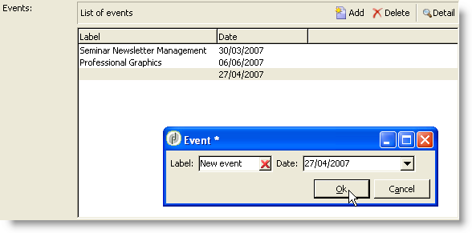

# Struttura di un modulo{#form-structure}

La descrizione di un modulo è un documento XML strutturato che osserva la grammatica dello schema del modulo **xtk:form**.

Il documento XML del modulo di input deve contenere l&#39;elemento `<form>` principale con gli attributi **name** e **namespace** per compilare il nome e lo spazio dei nomi del modulo.

```
<form name="form_name" namespace="name_space">
...
</form>
```

Per impostazione predefinita, un modulo è associato allo schema dati con lo stesso nome e lo stesso spazio dei nomi. Per associare un modulo con un nome diverso, impostare l&#39;attributo **entity-schema** dell&#39; `<form>` elemento sul nome della chiave dello schema. Per illustrare la struttura di un modulo di input, descriviamo un&#39;interfaccia utilizzando lo schema di esempio &quot;cus:Recipient&quot;:

```
<srcSchema name="recipient" namespace="cus">
  <enumeration name="gender" basetype="byte">    
    <value name="unknown" label="Not specified" value="0"/>    
    <value name="male" label="Male" value="1"/>   
    <value name="female" label="Female" value="2"/>   
  </enumeration>

  <element name="recipient">
    <attribute name="email" type="string" length="80" label="Email" desc="E-mail address of recipient"/>
    <attribute name="birthDate" type="datetime" label="Date"/>
    <attribute name="gender" type="byte" label="Gender" enum="gender"/>
  </element>
</srcSchema>
```

Modulo di input basato sullo schema di esempio:


```
<form name="recipient" namespace="cus">
  <input xpath="@gender"/>
  <input xpath="@birthDate"/>
  <input xpath="@email"/>
</form>
```

La descrizione dei controlli di modifica inizia dall&#39;elemento `<form>` principale. Un controllo di modifica viene immesso in un **`<input>`** elemento con l&#39;attributo **xpath** che contiene il percorso del campo nello schema.

Il controllo edit si adatta automaticamente al tipo di dati corrispondente e utilizza l&#39;etichetta definita nello schema.

>[!NOTE]
>
>È possibile sovraccaricare l&#39;etichetta definita nel relativo schema dati aggiungendo l&#39;attributo **label** all&#39; `<input>` elemento:\
>`<input label="E-mail address" xpath="@name" />`

Per impostazione predefinita, ogni campo viene visualizzato su una sola riga e occupa tutto lo spazio disponibile a seconda del tipo di dati.

## Formattazione {#formatting}

Il layout dei controlli è simile al layout utilizzato nelle tabelle HTML, con la possibilità di dividere un controllo in più colonne, elementi di interlacciamento o di specificare l&#39;occupazione dello spazio disponibile. Tenere presente, tuttavia, che la formattazione consente solo di dividere l’area per proporzioni; non è possibile specificare dimensioni fisse per un oggetto.

Per visualizzare i controlli dell&#39;esempio precedente in due colonne:


```
<form name="recipient" namespace="cus">
  <container colcount="2">
    <input xpath="@gender"/>
    <input xpath="@birthDate"/>
    <input xpath="@email"/>
  </container>
</form>
```

L’ **`<container>`** elemento con l’attributo **colcount** consente di forzare la visualizzazione dei controlli secondari su due colonne.

L&#39;attributo **colspan** di un controllo estende il controllo per il numero di colonne immesso nel relativo valore:


```
<form name="recipient" namespace="cus">
  <container colcount="2">
    <input xpath="@gender"/>
    <input xpath="@birthDate"/>
    <input xpath="@email" colspan="2"/>
  </container>
</form> 
```

Compilando l&#39;attributo **type=&quot;frame&quot;** , il contenitore aggiunge una cornice attorno ai controlli secondari con l&#39;etichetta contenuta nell&#39;attributo **label** :


```
<form name="recipient" namespace="cus">
  <container colcount="2" type="frame" label="General">
    <input xpath="@gender"/>
    <input xpath="@birthDate"/>
    <input xpath="@email" colspan="2"/>
  </container>
</form>
```

Un **`<static>`** elemento può essere utilizzato per formattare il modulo di input:


```
<form name="recipient" namespace="cus">
  <static type="separator" colspan="2" label="General"/>
  <input xpath="@gender"/>
  <input xpath="@birthDate"/>
  <input xpath="@email" colspan="2"/>
  <static type="help" label="General information about recipient with date of birth, gender, and e-mail address." colspan="2"/>
</form>
```

Il **`<static>`** tag con il tipo di **separatore** consente di aggiungere una barra di separazione con un&#39;etichetta contenuta nell&#39;attributo **label** .

È stato aggiunto un testo della guida con il `<static>` tag help type. Il contenuto del testo viene immesso nell&#39;attributo **label** .

## Contenitori {#containers}

I contenitori consentono di raggruppare un set di controlli. Sono rappresentati dall&#39; **`<container>`** elemento . Sono stati utilizzati sopra per formattare i controlli su più colonne.

L&#39;attributo **xpath** di un `<container>` oggetto consente di semplificare il riferimento ai controlli secondari. Il riferimento dei controlli è quindi relativo all&#39; `<container>` elemento padre.

Esempio di contenitore senza &quot;xpath&quot;:

```
<container colcount="2">
  <input xpath="location/@zipCode"/>
  <input xpath="location/@city"/>
</container>
```

Esempio con l&#39;aggiunta di &quot;xpath&quot; all&#39;elemento denominato &quot;location&quot;:

```
<container colcount="2" xpath="location">
  <input xpath="@zipCode"/>
  <input xpath="@city"/>
</container>
```

### Tipi di contenitore {#types-of-container}

I contenitori vengono utilizzati per creare controlli complessi utilizzando un set di campi formattati nelle pagine.

#### Contenitore di tabulazione {#tab-container}

Un contenitore tabulazione formatta i dati in pagine accessibili dalle schede.


```
<container type="notebook">
  <container colcount="2" label="General">
    <input xpath="@gender"/>
    <input xpath="@birthDate"/>
    <input xpath="@email" colspan="2"/>
  </container>
  <container colcount="2" label="Location">
    ...
  </container>
</container>
```

Il contenitore principale è definito dall&#39;attributo **type=&quot;blocco appunti&quot;** . Le schede vengono dichiarate nei contenitori secondari e l&#39;etichetta delle schede viene compilata dall&#39;attributo **label** .

>[!NOTE]
>
>Una funzione **style=&quot;down|up**(per impostazione predefinita)**&quot;** forza il posizionamento verticale delle etichette di tabulazione sotto o sopra il controllo. Questa funzione è facoltativa.
>
>`<container style="down" type="notebook">  ... </container>`

#### Elenco icone {#icon-list}

Questo contenitore presenta una barra di icone verticale che consente di selezionare le pagine da visualizzare.


```
<container type="iconbox">
  <container colcount="2" label="General" img="xtk:properties.png">
    <input xpath="@gender"/>
    <input xpath="@birthDate"/>
    <input xpath="@email" colspan="2"/>
  </container>
  <container colcount="2" label="Location" img="nms:msgfolder.png">
    ...
  </container>
</container>
```

Il contenitore principale è definito dall&#39;attributo **type=&quot;iconbox&quot;** . Le pagine associate alle icone sono dichiarate nei contenitori secondari. L&#39;etichetta delle icone viene compilata dall&#39;attributo **label** .

L&#39;icona di una pagina viene compilata dall&#39; `img="<image>"` attributo, dove `<image>` è il nome dell&#39;immagine corrispondente alla chiave costituita dal nome e dallo spazio dei nomi (ad esempio, &quot;xtk:properties.png&quot;).

Le immagini sono disponibili dal **[!UICONTROL Administration > Configuration > Images]** nodo.

#### Contenitore di visibilità {#visibility-container}

È possibile mascherare un set di controlli tramite una condizione dinamica.

Questo esempio illustra la visibilità dei controlli sul valore del campo &quot;Genere&quot;:

```
<container type="visibleGroup" visibleIf="@gender=1">
  ...
</container>
<container type="visibleGroup" visibleIf="@gender=2">
  ...
</container>
```

Un contenitore di visibilità è definito dall&#39;attributo **type=&quot;visibleGroup&quot;**. L&#39;attributo **visibleIf** contiene la condizione di visibilità.

Esempi di sintassi della condizione:

* **visibleIf=&quot;@email=&#39;peter.martinezATneeolane.net&#39;&quot;**: verifica l&#39;uguaglianza nei dati di tipo stringa. Il valore di confronto deve essere racchiuso tra virgolette.
* **visibleIf=&quot;@gender >= 1 e @gender != 2&quot;**: su un valore numerico.
* **visibleIf=&quot;@boolean1==true o @boolean2==false&quot;**: test sui campi booleani.

#### Abilitazione del contenitore {#enabling-container}

Questo contenitore consente di abilitare o disabilitare un set di dati da una condizione dinamica. La disattivazione di un controllo ne impedisce la modifica. L&#39;esempio seguente illustra l&#39;abilitazione dei controlli dal valore del campo &quot;Genere&quot;:

```
<container type="enabledGroup" enabledIf="@gender=1">
  ...
</container>
<container type="enabledGroup" enabledIf="@gender=2">
  ...
</container>
```

Un contenitore di attivazione è definito dall&#39;attributo **type=&quot;enabledGroup&quot;** . L&#39;attributo **enabledIf** contiene la condizione di attivazione.

## Modifica di un collegamento {#editing-a-link}

Ricorda che nello schema dati è dichiarato un collegamento come segue:

```
<element label="Company" name="company" target="cus:company" type="link"/>
```

Il controllo di modifica del collegamento nel relativo modulo di input è il seguente:


```
<input xpath="company"/>
```

La selezione di destinazione è accessibile tramite il campo di modifica. La voce è assistita dal tipo avanti in modo che un elemento di destinazione possa essere facilmente trovato dai primi caratteri immessi. La ricerca si basa quindi sulla stringa **Calcola** definita nello schema di destinazione. Se lo schema non esiste dopo la convalida nel controllo, viene visualizzato un messaggio di conferma della creazione della destinazione al volo. La conferma crea un nuovo record nella tabella di destinazione e lo associa al collegamento.

Un elenco a discesa viene utilizzato per selezionare un elemento di destinazione dall&#39;elenco di record già creati.

L&#39;icona **[!UICONTROL Modify the link]** (cartella) avvia un modulo di selezione con l&#39;elenco degli elementi di destinazione e una zona filtro:


L&#39;icona **[!UICONTROL Edit link]** (lente di ingrandimento) avvia il modulo di modifica dell&#39;elemento collegato. Il modulo utilizzato è dedotto per impostazione predefinita sulla chiave dello schema di destinazione. L’attributo **modulo** consente di forzare il nome del modulo di modifica (ad es. &quot;cus:company2&quot;).

È possibile limitare la scelta degli elementi di destinazione aggiungendo l&#39; **`<sysfilter>`** elemento dalla definizione del collegamento nel modulo di input:

```
<input xpath="company">
  <sysFilter>
    <condition expr="[location/@city] =  'Newton"/>
  </sysFilter>
</input>
```

Potete anche ordinare l’elenco con l’ **`<orderby>`** elemento:

```
<input xpath="company">
  <orderBy>
    <node expr="[location/@zipCode]"/>
  </orderBy>
</input>
```

### Proprietà controllo {#control-properties}

* **noAutoComplete**: disabilita type-ahead (con il valore &quot;true&quot;)
* **createMode**: crea il collegamento al volo, se non esiste. I valori possibili sono:

   * **none**: disabilita la creazione. Se il collegamento non esiste, viene visualizzato un messaggio di errore
   * **in linea**: crea il collegamento con il contenuto nel campo di modifica
   * **edizione**: visualizza il modulo di modifica sul collegamento. Quando il modulo viene convalidato, i dati vengono salvati (modalità predefinita)

* **noZoom**: nessun modulo di modifica sul collegamento (con il valore &quot;true&quot;)
* **modulo**: carica il modulo di modifica dell&#39;elemento di destinazione

## Elenco di collegamenti {#list-of-links}

Un collegamento immesso nello schema dati come elemento di raccolta (unbound=&quot;true&quot;) deve scorrere un elenco per visualizzare tutti gli elementi associati.

Il principio consiste nel visualizzare l&#39;elenco degli elementi collegati con caricamento di dati ottimizzato (scaricamento per batch di dati, esecuzione dell&#39;elenco solo se è visibile).

Esempio di collegamento a una raccolta in uno schema:

```
<element label="Events" name="rcpEvent" target="cus:event" type="link" unbound="true">
...
</element>
```

L&#39;elenco nel relativo modulo di input:


```
 <input xpath="rcpEvent" type="linklist">
  <input xpath="@label"/>
  <input xpath="@date"/>
</input>
```

Il controllo elenco è definito dall&#39;attributo **type=&quot;linklist&quot;** . Il percorso dell&#39;elenco deve fare riferimento al collegamento della raccolta.

Le colonne vengono dichiarate tramite **`<input>`** gli elementi dell&#39;elenco. L&#39;attributo **xpath** fa riferimento al percorso del campo nello schema di destinazione.

Una barra degli strumenti con un&#39;etichetta (definita sul collegamento nello schema) viene automaticamente posizionata sopra l&#39;elenco.

L&#39;elenco può essere filtrato tramite il **[!UICONTROL Filters]** pulsante e configurato per aggiungere e ordinare le colonne.

I **[!UICONTROL Add]** pulsanti e **[!UICONTROL Delete]** i pulsanti consentono di aggiungere ed eliminare elementi della raccolta sul collegamento. Per impostazione predefinita, l&#39;aggiunta di un elemento avvia il modulo di modifica dello schema di destinazione.

Il **[!UICONTROL Detail]** pulsante viene aggiunto automaticamente quando l&#39;attributo **zoom=&quot;true&quot;** viene completato nel **`<input>`** tag dell&#39;elenco: consente di avviare il modulo di modifica della riga selezionata.

Potete applicare il filtro e l&#39;ordinamento al caricamento dell&#39;elenco:

```
 <input xpath="rcpEvent" type="linklist">
  <input xpath="@label"/>
  <input xpath="@date"/>
  <sysFilter>
    <condition expr="@type = 1"/>
  </sysFilter>
  <orderBy>
    <node expr="@date" sortDesc="true"/>
  </orderBy>
</input>
```

### Tabella relazioni {#relationship-table}

Una tabella di relazioni consente di collegare due tabelle con N-N cardinalità. La tabella delle relazioni contiene solo i collegamenti alle due tabelle.

L&#39;aggiunta di un elemento all&#39;elenco dovrebbe pertanto consentire di completare un elenco da uno dei due collegamenti nella tabella delle relazioni.

Esempio di una tabella di relazione in uno schema:

```
<srcSchema name="subscription" namespace="cus">
  <element name="recipient" type="link" target="cus:recipient" label="Recipient"/>
  <element name="service" type="link" target="cus:service" label="Subscription service"/>
</srcSchema>
```

Per il nostro esempio, iniziamo con il modulo di input dello schema &quot;cus:destinatario&quot;. L&#39;elenco deve visualizzare le associazioni con iscrizioni ai servizi e consentire l&#39;aggiunta di un&#39;iscrizione selezionando un servizio esistente.


```
<input type="linklist" xpath="subscription" xpathChoiceTarget="service" xpathEditTarget="service" zoom="true">
  <input xpath="recipient"/>
  <input xpath="service"/>
</input>
```

L&#39;attributo **xpathChoiceTarget** consente di avviare un modulo di selezione dal collegamento immesso. La creazione del record della tabella delle relazioni aggiornerà automaticamente il collegamento al destinatario corrente e al servizio selezionato.

>[!NOTE]
>
>L&#39;attributo **xpathEditTarget** consente di forzare la modifica della riga selezionata sul collegamento immesso.

### Proprietà elenco {#list-properties}

* **noToolbar**: nasconde la barra degli strumenti (con valore &quot;true&quot;)
* **toolbarCaption**: scarica l’etichetta della barra degli strumenti
* **toolbarAlign**: modifica la geometria verticale o orizzontale della barra degli strumenti (valori possibili: &quot;vertical&quot;|&quot;horizontal&quot;)
* **img**: visualizza l&#39;immagine associata all&#39;elenco
* **modulo**: carica il modulo di modifica dell&#39;elemento di destinazione
* **zoom**: aggiunge il **[!UICONTROL Zoom]** pulsante per modificare l&#39;elemento di destinazione
* **xpathEditTarget**: imposta la modifica sul collegamento immesso
* **xpathChoiceTarget**: inoltre, avvia il modulo di selezione sul collegamento inserito

## Controlli dell&#39;elenco di memoria {#memory-list-controls}

Gli elenchi di memoria consentono di modificare gli elementi della raccolta utilizzando il precaricamento dei dati dell&#39;elenco. Impossibile filtrare o configurare l&#39;elenco.

Questi elenchi vengono utilizzati sugli elementi di raccolta mappati XML o su collegamenti di volume basso.

### Elenco colonne {#column-list}

Questo controllo visualizza un elenco di colonne modificabili con una barra degli strumenti contenente i pulsanti Aggiungi ed Elimina.


```
<input xpath="rcpEvent" type="list">
  <input xpath="@label"/>
  <input xpath="@date"/>
</input>
```

Il controllo elenco deve essere compilato con l&#39;attributo **type=&quot;list&quot;** e il percorso dell&#39;elenco deve fare riferimento all&#39;elemento collection.

Le colonne sono dichiarate nei **`<input>`** tag secondari dell&#39;elenco. L’etichetta e la dimensione delle colonne possono essere forzate con gli attributi **label** e **colSize** .

>[!NOTE]
>
>Le frecce di ordinamento vengono aggiunte automaticamente quando l&#39;attributo **ordered=&quot;true&quot;** viene aggiunto all&#39;elemento raccolta nello schema di dati.

I pulsanti della barra degli strumenti possono essere allineati orizzontalmente:


```
<input nolabel="true" toolbarCaption="List of events" type="list" xpath="rcpEvent" zoom="true">
  <input xpath="@label"/>
  <input xpath="@date"/>
</input>
```

L&#39;attributo **toolbarCaption** forza l&#39;allineamento orizzontale della barra degli strumenti e inserisce il titolo sopra l&#39;elenco.

#### Zoom in un elenco {#zoom-in-a-list}

L&#39;inserimento e la modifica dei dati in un elenco possono essere immessi in un modulo di modifica separato.



```
<input nolabel="true" toolbarCaption="List of events" type="list" xpath="rcpEvent" zoom="true" zoomOnAdd="true">
  <input xpath="@label"/>
  <input xpath="@date"/>

  <form colcount="2" label="Event">
    <input xpath="@label"/>
    <input xpath="@date"/>
  </form>
</input>
```

Il modulo di modifica viene completato dall&#39; `<form>` elemento in definizione elenco. La struttura è identica a quella di un modulo di input. Il **[!UICONTROL Detail]** pulsante viene aggiunto automaticamente quando l’attributo **zoom=&quot;true&quot;** viene completato sul **`<input>`** tag dell’elenco. Questo attributo consente di avviare il modulo di modifica della riga selezionata.

>[!NOTE]
>
>Aggiungendo l’attributo **zoomOnAdd=&quot;true&quot;** si forza la chiamata del modulo di modifica quando viene inserito un elemento elenco.

### Proprietà elenco {#list-properties-1}

* **noToolbar**: nasconde la barra degli strumenti (con valore &quot;true&quot;)
* **toolbarCaption**: scarica l’etichetta della barra degli strumenti
* **toolbarAlign**: modifica il posizionamento della barra degli strumenti (valori possibili: &quot;vertical&quot;|&quot;horizontal&quot;)
* **img**: visualizza l&#39;immagine associata all&#39;elenco
* **modulo**: carica il modulo di modifica dell&#39;elemento di destinazione
* **zoom**: aggiunge il **[!UICONTROL Zoom]** pulsante per modificare l&#39;elemento di destinazione
* **zoomOnAdd**: avvia il modulo di modifica sull’aggiunta
* **xpathChoiceTarget**: inoltre, avvia il modulo di selezione sul collegamento inserito

## Campi non modificabili {#non-editable-fields}

Per visualizzare un campo e impedirne la modifica, utilizzate il **`<value>`** tag o completate l&#39;attributo **readOnly=&quot;true&quot;** sul **`<input>`** tag .

Esempio nel campo &quot;Genere&quot;:


```
<value value="@gender"/>
<input xpath="@gender" readOnly="true"/>
```

## Pulsante di scelta {#radio-button}

Un pulsante di scelta consente di scegliere tra diverse opzioni. I **`<input>`** tag vengono utilizzati per elencare le opzioni possibili e l&#39;attributo **checkValue** specifica il valore associato alla scelta.

Esempio nel campo &quot;Genere&quot;:

```
<input type="RadioButton" xpath="@gender" checkedValue="0" label="Choice 1"/>
<input type="RadioButton" xpath="@gender" checkedValue="1" label="Choice 2"/>
<input type="RadioButton" xpath="@gender" checkedValue="2" label="Choice 3"/>
```


## Casella di controllo {#checkbox}

Una casella di controllo riflette uno stato booleano (selezionato o meno). Per impostazione predefinita, questo controllo è utilizzato dai campi &quot;booleani&quot; (true/false). A questo pulsante può essere associata una variabile con un valore predefinito pari a 0 o 1. Questo valore può essere sovraccaricato tramite gli attributi **checkValue** .

```
<input xpath="@boolean1"/>
<input xpath="@field1" type="checkbox" checkedValue="Y"/>
```


## Modifica della gerarchia di navigazione {#navigation-hierarchy-edit}

Questo controllo crea una struttura ad albero su un set di campi da modificare.

I controlli da modificare sono raggruppati in un elemento **`<container>`** immesso sotto il **`<input>`** tag del controllo struttura:

```
<input nolabel="true" type="treeEdit">
  <container label="Text fields">
    <input xpath="@text1"/>
    <input xpath="@text2"/>
  </container>
  <container label="Boolean fields">
    <input xpath="@boolean1"/>
    <input xpath="@boolean2"/>
  </container>
</input>
```


## Campo espressione {#expression-field}

Un campo espressione aggiorna dinamicamente un campo da un&#39;espressione; il **`<input>`** tag viene utilizzato con un attributo **xpath** per immettere il percorso del campo da aggiornare e un attributo **espr** contenente l&#39;espressione update.

```
<!-- Example: updating the boolean1 field from the value contained in the field with path /tmp/@flag -->
<input expr="Iif([/tmp/@flag]=='On', true, false)" type="expr" xpath="@boolean1"/>
<input expr="[/ignored/@action] == 'FCP'" type="expr" xpath="@launchFCP"/>
```

## Contesto dei moduli {#context-of-forms}

L&#39;esecuzione di un modulo di input inizializza un documento XML contenente i dati dell&#39;entità in fase di modifica. Questo documento rappresenta il contesto del modulo e può essere utilizzato come area di lavoro.

### Aggiornamento del contesto {#updating-the-context}

Per modificare il contesto del modulo, utilizzare il **`<set expr="<value>" xpath="<field>"/>`** tag , dove **`<field>`** è il campo di destinazione, ed **`<value>`** è l&#39;espressione o il valore di aggiornamento.

Esempi di utilizzo del **`<set>`** tag:

* **`<set expr="'Test'" xpath="/tmp/@test" />`**: posiziona il valore &#39;Test&#39; nella posizione temporanea /tmp/@test1
* **`<set expr="'Test'" xpath="@lastName" />`**: aggiorna l&#39;entità sull&#39;attributo &quot;lastName&quot; con il valore &quot;Test&quot;
* **`<set expr="true" xpath="@boolean1" />`**: imposta il valore del campo &quot;boolean1&quot; su &quot;true&quot;
* **`<set expr="@lastName" xpath="/tmp/@test" />`**: aggiornamenti relativi al contenuto dell&#39;attributo &quot;lastName&quot;

Il contesto del modulo può essere aggiornato quando si inizializza e si chiude il modulo tramite **`<enter>`** tag e **`<leave>`** .

```
<form name="recipient" namespace="cus">
  <enter>
    <set...
  </enter>
  ...
  <leave>
    <set...
  </leave>
</form>
```

>[!NOTE]
>
>I `<enter>` tag e `<leave>` possono essere utilizzati sulla `<container>` serie di pagine (&quot;blocco appunti&quot; e &quot;iconbox&quot;).

### Lingua delle espressioni {#expression-language-}

Per eseguire test condizionali è possibile utilizzare una macro-lingua nella definizione del modulo.

Il **`<if expr="<expression>" />`** tag esegue le istruzioni specificate sotto il tag se l&#39;espressione è verificata:

```
<if expr="([/tmp/@test] == 'Test' or @lastName != 'Doe') and @boolean2 == true">
  <set xpath="@boolean1" expr="true"/>
</if>
```

Il **`<check expr="<condition>" />`** tag combinato con il **`<error>`** tag impedisce la convalida del modulo e visualizza un messaggio di errore se la condizione non è soddisfatta:

```
<leave>
  <check expr="/tmp/@test != ''">
    <error>You must populate the 'Test' field!</error> 
  </check>
</leave>
```

## Procedure guidate {#wizards}

Una procedura guidata illustra una serie di passaggi per l&#39;immissione dei dati nel modulo delle pagine. I dati immessi vengono salvati al momento della convalida del modulo.

Una procedura guidata ha la struttura seguente:

```
<form type="wizard" name="example" namespace="cus" img="nms:rcpgroup32.png" label="Wizard example" entity-schema="nms:recipient">
  <container title="Title of page 1" desc="Long description of page 1">
    <input xpath="@lastName"/>
    <input xpath="comment"/>
  </container>
  <container title="Title of page 2" desc="Long description of page 2">
    ...
  </container>
  ...
</form>
```


La presenza dell&#39;attributo **type=&quot;Wizard&quot;** sull&#39; `<form>` elemento consente di definire la modalità guidata nella costruzione del modulo. Le pagine vengono completate da `<container>` elementi secondari dell&#39; `<form>` elemento. L&#39; `<container>` elemento di una pagina viene popolato con gli attributi title per il titolo e desc per visualizzare la descrizione sotto il titolo della pagina. I **[!UICONTROL Previous]** pulsanti e **[!UICONTROL Next]** vengono aggiunti automaticamente per consentire la navigazione tra le pagine.

Il **[!UICONTROL Finish]** pulsante salva i dati immessi e chiude il modulo.

### Metodi SOAP {#soap-methods}

L&#39;esecuzione del metodo SOAP può essere avviata da un **`<leave>`** tag popolato alla fine di una pagina.

Il **`<soapcall>`** tag contiene la chiamata per il metodo con i seguenti parametri di input:

```
<soapCall name="<name>" service="<schema>">
  <param type="<type>" exprIn="<xpath>"/>  
  ...
</soapCall>
```

Il nome del servizio e il relativo schema di implementazione vengono immessi tramite gli attributi **name** e **service** del **`<soapcall>`** tag.

I parametri di input sono descritti sugli **`<param>`** elementi sotto il **`<soapcall>`** tag .

Il tipo di parametro deve essere specificato tramite l&#39;attributo **type** . I tipi possibili sono i seguenti:

* **stringa**: stringa di caratteri
* **booleano**: Booleano
* **byte**: Numero intero a 8 bit
* **short**: Numero intero a 16 bit
* **long**: Numero intero a 32 bit
* **short**: Numero intero a 16 bit
* **double**: numero a virgola mobile a doppia precisione
* **DOMElement**: element-type node

L&#39;attributo **exprIn** contiene la posizione dei dati da trasmettere come parametro.

**Esempio**:

```
<leave>
  <soapCall name="RegisterGroup" service="nms:recipient">         
    <param type="DOMElement" exprIn="/tmp/entityList"/>         
    <param type="DOMElement" exprIn="/tmp/choiceList"/>         
    <param type="boolean"    exprIn="true"/>       
  </soapCall>
</leave>
```

