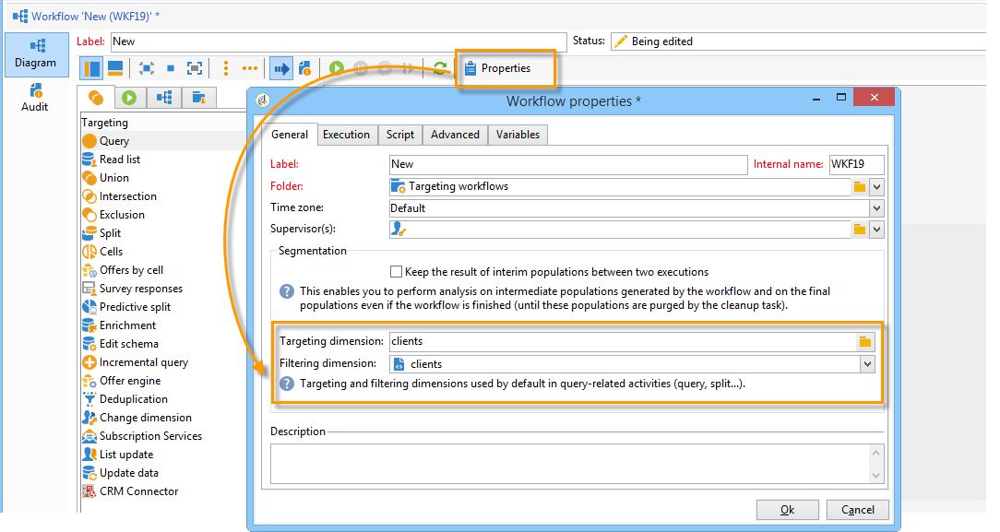

# Gestione dei flussi di lavoro{#managing-workflows}

Per impostazione predefinita, i nuovi flussi di lavoro si basano su un modello di flusso di lavoro preconfigurato e basato su una tabella dei destinatari (nms:recipient). Per basarli automaticamente sulla tabella personalizzata dei destinatari a cui si fa riferimento nel **Nms_DefaultRcpSchema** (vedere [Configurazione dell’interfaccia](../../configuration/using/configuring-the-interface.md) sezione ), è necessario creare un nuovo modello di workflow.

Creare un nuovo modello tramite **[!UICONTROL Resources > Templates > Workflow templates]** nodo. Nelle proprietà del modello, le dimensioni fornite corrispondono alla tabella dei destinatari esterni.

Basando i nuovi flussi di lavoro su un modello creato di recente, la tabella personalizzata verrà selezionata per impostazione predefinita per le dimensioni di targeting e filtro globali del flusso di lavoro.

Tutte le attività utilizzate nel flusso di lavoro utilizzeranno quindi la tabella personalizzata senza richiedere alcuna configurazione manuale aggiuntiva.

Per ulteriori informazioni sui flussi di lavoro, consulta [questa sezione](../../workflow/using/about-workflows.md).

