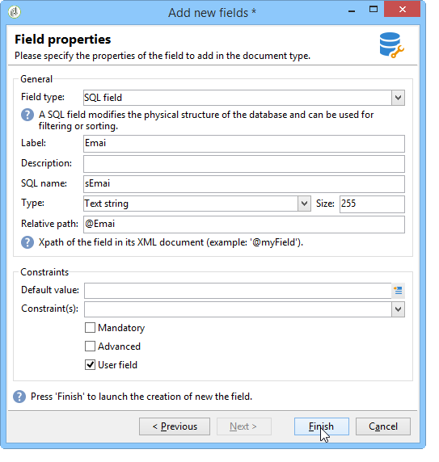

# Nuovo assistente ai campi{#new-field-wizard}


Un assistente accessibile tramite **[!UICONTROL Tools > Advanced > Add new fields]** consente di aggiungere uno o più campi a una tabella nel database.

La convalida dell&#39;assistente aggiorna lo schema di estensione della tabella da estendere e avvia lo script SQL per modificare la struttura fisica del database.

Questo assistente ha il vantaggio di aggiungere rapidamente un campo senza dover conoscere la struttura di uno schema di dati.

Lo svantaggio principale è la limitazione dei dati e delle proprietà da estendere.

Le schermate dell’assistente contengono i seguenti passaggi:

1. La prima pagina consente di immettere il nome dello schema da estendere e lo spazio dei nomi dello schema di estensione in cui verranno salvate le modifiche:

   

1. Nella pagina successiva è possibile immettere le proprietà del campo da aggiungere.

   

1. Per confermare le modifiche, fare clic sul pulsante **[!UICONTROL Finish]**.

Nel nostro esempio, viene creato automaticamente un file di estensione denominato &quot;cus:recipient&quot; e viene eseguito lo script SQL corrispondente:

```
<srcSchema extendedSchema="nms:recipient" label="Recipients" name="recipient"  namespace="cus">  
  <element name="recipient">    
    <attribute belongsTo="cus:recipient" dataPolicy="email" label="Email" length="80" name="email1" sqlname="sEmail1" type="string" user="true"/>  
  </element>
</srcSchema>
```

>[!NOTE]
>
>Per impostazione predefinita, i campi aggiunti sono dichiarati con la proprietà **user** (con il valore &quot;true&quot;). Questo consente di visualizzare e modificare il campo nel modulo di input dello schema esteso utilizzando un controllo di tipo &quot;treeEdit&quot; (fare riferimento a Modulo di input).
