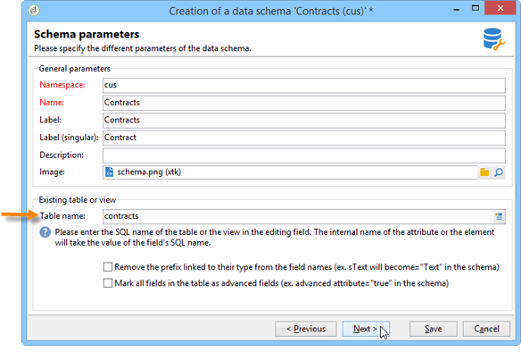

# Schema di una tabella esistente{#schema-of-an-existing-table}

## Panoramica {#overview}

Quando l’applicazione deve accedere ai dati di una tabella esistente, di una vista SQL o di dati provenienti da un database remoto, crea lo schema in Adobe Campaign con i dati seguenti:

* Nome della tabella: immettere il nome della tabella (con il relativo alias quando si utilizza un collegamento dblink) con l&#39;attributo &quot;sqltable&quot;.
* chiave dello schema: fare riferimento ai campi di riconciliazione,
* indici: utilizzati per generare query,
* I campi e la loro posizione nella struttura XML: compilare solo i campi utilizzati nell’applicazione,
* collegamenti: se sono presenti join con le altre tabelle della base.

## Implementazione {#implementation}

Per creare lo schema corrispondente, attieniti alle seguenti fasi:

1. Modifica il **[!UICONTROL Administration>Configuration>Data schemas]** nodo della struttura Adobe Campaign e fai clic su **[!UICONTROL New]** .
1. Seleziona la **[!UICONTROL Access data from an existing table or an SQL view]** e fai clic su **[!UICONTROL Next]** .

   

1. Scegliere la tabella o la vista esistente:

   

1. Adatta il contenuto dello schema in base alle tue esigenze.

   

   Lo schema deve essere compilato con l’attributo view=&quot;true&quot; sul `<srcSchema>` per non generare uno script SQL per la creazione di tabelle.

**Esempio** :

```
<srcSchema name="recipient" namespace="cus" view="true">
  <element name="recipient" sqltable="dbsrv.recipient">
    <key name="email">
      <keyfield xpath="@email"/>
    </key>   
    <attribute name="email" type="string" length="80" sqlname="email"/>
  </element>
</srcSchema>
```

## Accesso a un database esterno {#accessing-an-external-database}

Il **Federated Data Access - FDA** consente di accedere ai dati memorizzati in un database esterno.

La configurazione da eseguire sugli schemi per accedere ai dati in un database esterno è descritta in [questa pagina](../../installation/using/creating-data-schema.md).
