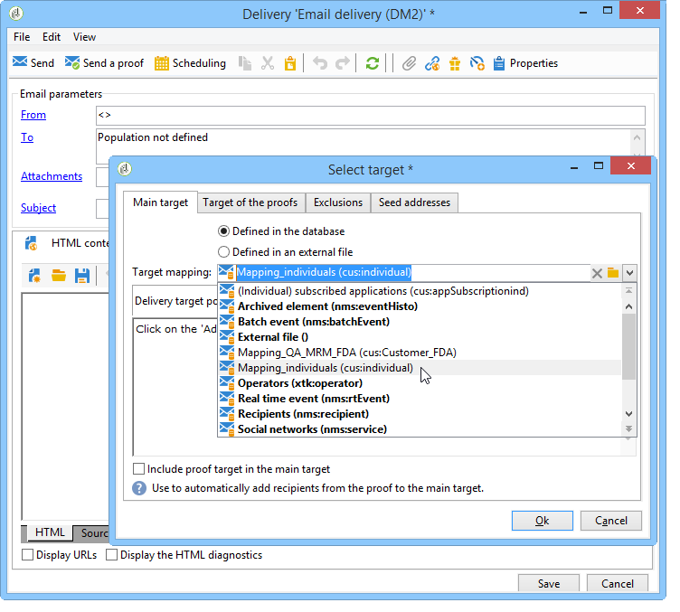

# Mappatura del target{#target-mapping}


La creazione della mappatura di destinazione è necessaria in due casi:

* se utilizzi una tabella dei destinatari diversa da quella fornita da Adobe Campaign,
* se configuri una dimensione di filtro diversa dalla dimensione di targeting standard nella schermata di mappatura della destinazione.

La procedura guidata per la creazione della mappatura di destinazione consente di creare tutti gli schemi necessari per utilizzare la tabella personalizzata.

## Creazione e configurazione di schemi collegati alla tabella personalizzata {#creating-and-configuring-schemas-linked-to-the-custom-table}

Prima di creare una mappatura di destinazione, sono necessarie diverse configurazioni affinché Adobe Campaign possa funzionare con un nuovo schema di dati dei destinatari.

A questo scopo, esegui i seguenti passaggi:

1. Crea un nuovo schema di dati che integra i campi della tabella personalizzata che desideri utilizzare.

   Per ulteriori informazioni, consulta [Riferimento schema (xtk:srcSchema)](../../configuration/using/about-schema-reference.md).

   Nel nostro esempio, creeremo uno schema cliente, una tabella molto semplice contenente i campi seguenti: ID, nome, cognome, indirizzo e-mail, numero di telefono cellulare. L&#39;obiettivo è quello di poter inviare avvisi via e-mail o SMS alle persone memorizzate in questa tabella.

   Esempio di schema (cus:individuale)

   ```
   <srcSchema name="individual" namespace="cus" label="Individuals">
     <element name="individual">
       <key name="id" internal="true">
         <keyfield xpath="@id"/>
       </key>
       <attribute name="id" type="long" length="32"/>
       <attribute name="lastName" type="string" length="100"/>
       <attribute name="firstName" type="string" length="100"/>
       <attribute name="email" type="string" length="100"/>
       <attribute name="mobile" type="string" length="100"/>
     </element>
   </srcSchema>
   ```

1. Dichiara lo schema come visualizzazione esterna utilizzando l’attributo =&quot;true&quot;. Fare riferimento a [L&#39;attributo di visualizzazione](../../configuration/using/schema-characteristics.md#the-view-attribute).

   ```
    <srcSchema desc="External recipient table" namespace="cus" view="true"....>
      ...
    </srcSchema>
   ```

1. Se devi aggiungere un indirizzo di direct mailing, utilizza il seguente tipo di struttura:

   ```
   <element advanced="true" name="postalAddress" template="nms:common:postalAddress">
        <attribute expr="SubString(JuxtWords(Smart([../infos/@firstname]), Upper([../infos/@name])), 1, 80)"
                   name="line1"/>
        <attribute expr="Upper([../address/@line2])" name="line2"/>
        <attribute expr="Upper([../address/@line])" name="line3"/>
        <attribute expr="Upper([../address/@line])" name="line4"/>
        <attribute expr="Upper([../address/@line])" name="line5"/>
        <attribute expr="Upper([../address/@line])" name="line6"/>
        <attribute _operation="delete" name="line7"/>
        <attribute _operation="delete" name="addrErrorCount"/>
        <attribute _operation="delete" name="addrQuality"/>
        <attribute _operation="delete" name="addrLastCheck"/>
        <element expr="@line1+'n'+@line2+'n'+@line3+'n'+@line4+'n'+@line5+'n'+@line6"
                 name="serialized"/>
        <attribute expr="AllNonNull2([../address/@line], [../infos/@name])" name="addrDefined"/>
      </element>
   ```

1. Fai clic sul nodo **[!UICONTROL Administration > Campaign management > Target mappings]** .
1. Fai clic sul pulsante **Nuovo** per aprire la procedura guidata per la creazione della mappatura di destinazione.
1. Inserisci il campo **Etichetta** e seleziona lo schema appena creato nel campo **Dimensione di targeting** .

   

1. Nella finestra **Modifica moduli indirizzo**, seleziona i campi dello schema che corrispondono ai vari indirizzi di consegna. In questo caso, possiamo mappare i campi **@email** e **@mobile** .

   

1. Nella seguente finestra **Archiviazione**, immetti il suffisso **Suffisso del campo degli schemi di estensione** per distinguere i nuovi schemi dagli schemi predefiniti forniti da Adobe Campaign.

   Fai clic su **[!UICONTROL Define new additional fields]** per selezionare la dimensione di destinazione nella consegna.

   Per impostazione predefinita, la gestione dell’esclusione viene memorizzata nella stessa tabella dei messaggi.

   Se desideri configurare lo spazio di archiviazione per il tracciamento collegato alla mappatura di destinazione, seleziona la casella **Genera uno schema di archiviazione per il tracciamento** .

   

   >[!IMPORTANT]
   >
   >Adobe Campaign non supporta più schemi di destinatari, noti come schemi di targeting, collegati agli stessi schemi di registro di trasmissione e/o di trackinglog. In caso contrario, si potrebbero verificare successivamente anomalie nella riconciliazione dei dati. Per ulteriori informazioni, consulta la pagina [Consiglio e limitazioni](../../configuration/using/about-custom-recipient-table.md) .

1. Nella finestra **Estensioni**, seleziona gli schemi facoltativi che desideri generare (l’elenco degli schemi disponibili dipende dai moduli installati sulla piattaforma Adobe Campaign).

   

1. Fai clic sul pulsante **Salva** per chiudere la procedura guidata.

   La procedura guidata utilizza lo schema di avvio per creare tutti gli altri schemi necessari per il funzionamento della nuova mappatura di destinazione.

   

## Utilizzo della mappatura di destinazione {#using-target-mapping}

Esistono due modi per utilizzare il nuovo schema come destinazione di una consegna:

* Creare uno o più modelli di consegna basati sulla mappatura
* Seleziona la mappatura direttamente durante la selezione della destinazione durante la creazione di una consegna, come illustrato di seguito:



**Argomento correlato**

* [Rispondere rapidamente alle richieste dei clienti per accedere ai loro dati](https://helpx.adobe.com/campaign/kb/simplifying-campaign-management-acc.html#Quicklyrespondtocustomerrequeststoaccesstheirdata)
