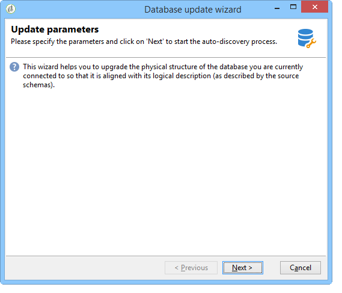
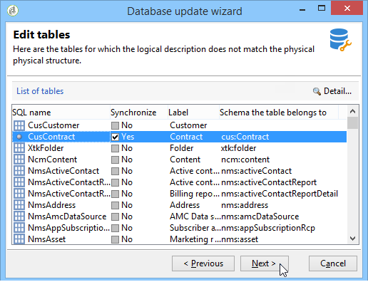

# Aggiornamento della struttura del database{#updating-the-database-structure}

Per applicare le modifiche apportate agli schemi, avviare l&#39;Assistente all&#39;aggiornamento del database. L&#39;assistente è accessibile tramite **[!UICONTROL Tools > Advanced > Update database structure]**. Controlla se la struttura fisica del database corrisponde alla relativa descrizione logica ed esegue gli script di aggiornamento SQL.

I moduli nel database vengono compilati e attivati automaticamente.

Le opzioni **[!UICONTROL Add stored procedures]** e **[!UICONTROL Import initialization data]** vengono utilizzate per avviare gli script SQL iniziali e i pacchetti di dati eseguiti al momento della creazione del database.

Puoi importare un set di dati da un pacchetto di dati esterno. A tale scopo, selezionare **[!UICONTROL Import a package]** e immettere il file XML del pacchetto.

Seguire la procedura riportata di seguito e visualizzare lo script SQL di aggiornamento del database:

>[!NOTE]
>
>Si trova in un campo di modifica e può essere modificato per eliminare o aggiungere codice SQL.

Quindi, avviare l&#39;aggiornamento del database:

