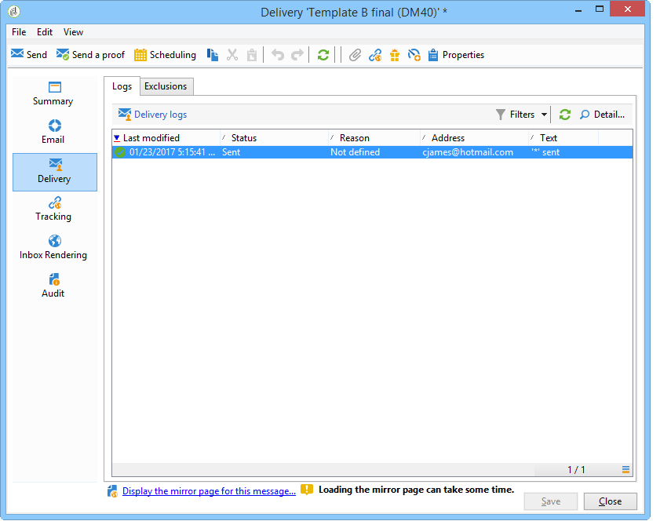

# Analisi del risultato {#step-8--analyzing-the-result}

Una volta inviate le consegne di test, potete verificare a quali destinatari sono stati inviati e se sono stati aperti o meno.

* Per scoprire quali destinatari sono stati assegnati, apri una consegna tramite il dashboard della campagna e fai clic sulla scheda **[!UICONTROL Delivery]**.

   

* Per verificare se la consegna è stata aperta, andate alla scheda **[!UICONTROL Tracking]**.

   

* Confronta con l&#39;altra consegna.

   

Nel nostro esempio, la consegna B ha ottenuto il massimo tasso di apertura. Ciò significa che il contenuto B verrà utilizzato per la distribuzione finale.

