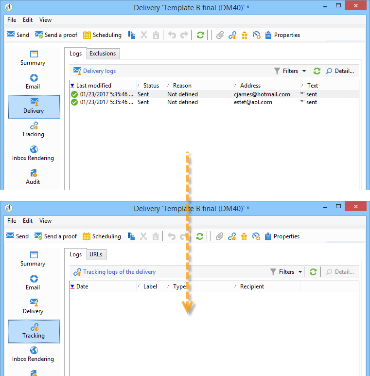

# Test AB: analizzare il risultato {#step-8--analyzing-the-result}

Una volta inviate le consegne di test, puoi verificare a quali destinatari sono state inviate e se sono state aperte o meno.

* Per individuare i destinatari target, apri una consegna tramite il dashboard della campagna e fai clic su **[!UICONTROL Delivery]** scheda.

  

* Per scoprire se la consegna è stata aperta, vai al **[!UICONTROL Tracking]** scheda.

  

* Confronta con l’altra consegna.

  

Nel nostro esempio, la consegna B ha ottenuto il punteggio più alto per il tasso di apertura. Ciò significa che il contenuto B verrà utilizzato per la consegna finale.

