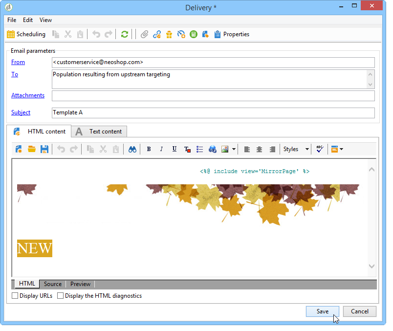
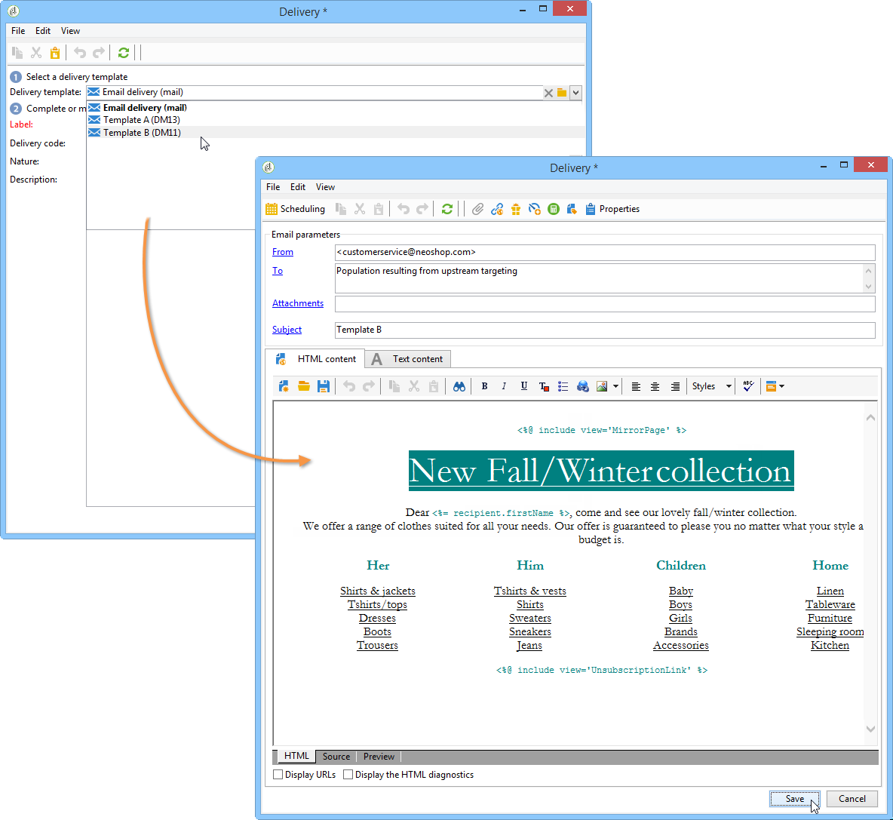
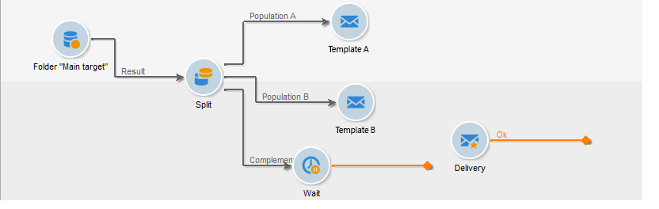
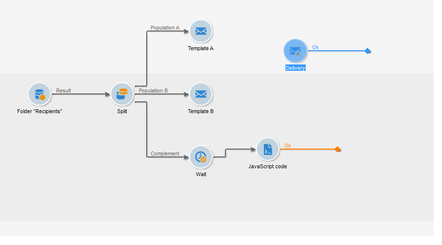

# Test AB: configurare le consegne nel flusso di lavoro {#step-4--configuring-the-deliveries-in-the-workflow}

Una volta create [le popolazioni](a-b-testing-uc-population-samples.md), puoi configurare le consegne. In questo caso d’uso, le prime due consegne ti consentono di inviare contenuti diversi alla popolazione A e B. La terza consegna è la consegna di riserva: verrà inviata ai destinatari che non appartengono ad A né a B. Il suo contenuto verrà calcolato da uno script e sarà identico ad A o B, a seconda di quale ha ottenuto il punteggio più alto per il tasso di apertura. È necessario configurare un periodo di attesa per la terza consegna, per scoprire il risultato delle consegne A e B. Per questo motivo la terza consegna include un&#39;attività **[!UICONTROL Wait]**.

1. Vai all&#39;attività **[!UICONTROL Split]** e collega la transizione destinata alla popolazione A a una delle consegne e-mail già nel flusso di lavoro.

   

1. Fai doppio clic sulla consegna per aprirla.
1. Utilizzando l’elenco a discesa, seleziona il modello per la consegna A.

   

1. Fai clic su **[!UICONTROL Continue]** per visualizzare la consegna, quindi salvala.

   

1. Collega la transizione dell&#39;attività **[!UICONTROL Split]** destinata alla popolazione B alla seconda consegna e-mail.

   

1. Apri la consegna e seleziona il modello nella consegna B, quindi salva la consegna.

   

1. Collega all&#39;attività **[!UICONTROL Wait]** la transizione destinata al gruppo rimanente.

   

1. Apri l&#39;attività **[!UICONTROL Wait]** e configura un periodo di attesa di 5 giorni.

   

1. Collega l&#39;attività **[!UICONTROL Wait]** all&#39;attività **[!UICONTROL JavaScript code]**.

   

Ora puoi creare lo script. [Ulteriori informazioni](a-b-testing-uc-script.md).
