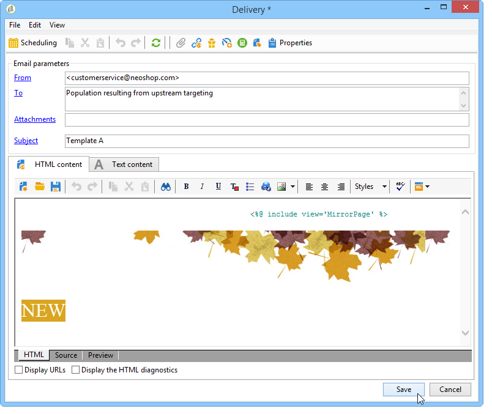

# Configurazione delle consegne nel flusso di lavoro {#step-4--configuring-the-deliveries-in-the-workflow}

Il passo successivo consiste nel configurare le consegne. Sono destinati alle tre popolazioni create nella fase precedente: [Passaggio 2: Configurazione dei campioni popolazione](#step-2--configuring-population-samples). Le prime due consegne consentono di inviare contenuti diversi alla popolazione A e B. La terza consegna è destinata alla popolazione che non ha ricevuto né A né B. Il contenuto verrà calcolato da uno script e sarà identico a A o B, a seconda di quale dei due avrà ottenuto il punteggio più alto. Dobbiamo configurare un periodo di attesa per la terza consegna, per conoscere il risultato delle consegne A e B. Questo è il motivo per cui il terzo invio include un&#39;attività **[!UICONTROL Wait]**.

1. Andate all&#39;attività **[!UICONTROL Split]** e collegate la transizione per la popolazione A a una delle consegne di e-mail già presenti nel flusso di lavoro.

   

1. Fate doppio clic sulla consegna per aprirla.
1. Utilizzando l&#39;elenco a discesa, selezionate il modello per la consegna A.

   

1. Fare clic su **[!UICONTROL Continue]** per visualizzare la consegna, quindi salvarla.

   

1. Collegate la transizione dell&#39;attività **[!UICONTROL Split]** destinata alla popolazione B alla seconda consegna tramite e-mail.

   

1. Aprite la consegna e selezionate il modello nella consegna B, quindi salvate la consegna.

   

1. Collegare la transizione destinata alla popolazione rimanente all&#39;attività **[!UICONTROL Wait]**.

   

1. Aprite l&#39;attività **[!UICONTROL Wait]** e configurate un periodo di attesa di 5 giorni.

   

1. Collegate l&#39;attività **[!UICONTROL Wait]** all&#39;attività **[!UICONTROL JavaScript code]**.

   
