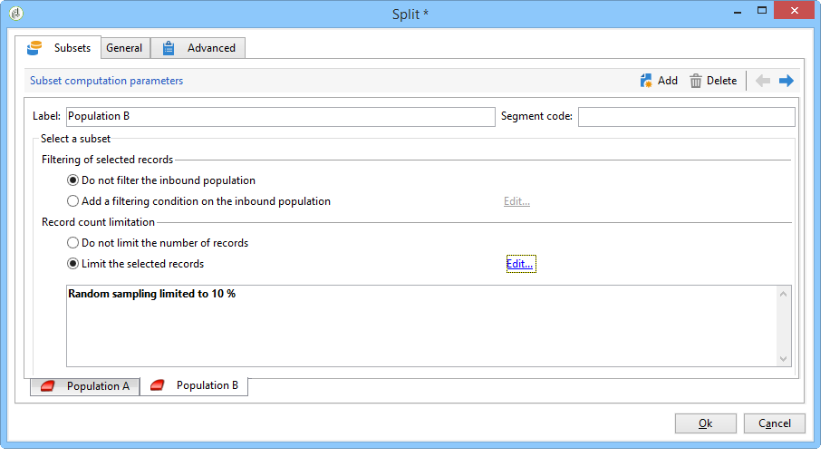

# Test AB: configurare i campioni di popolazione {#step-2--configuring-population-samples}

## Configurare l’attività Query {#configuring-the-query-activity}

* Fare doppio clic sull&#39;attività **[!UICONTROL Query]**.

  

* Fai clic sul collegamento **[!UICONTROL Edit query]** e seleziona i destinatari di cui desideri eseguire il targeting.

  

* Collega l&#39;attività **[!UICONTROL Query]** all&#39;attività **[!UICONTROL Split]**.

  

## Configurare l’attività Dividi {#configuring-the-split-activity}

Questa attività ti consente di creare diverse popolazioni: quella che riceve la consegna A, quella che riceve la consegna B e la popolazione rimanente. L’utilizzo della selezione casuale consente di eseguire il targeting di solo una parte della popolazione di ogni consegna.

1. Creazione della popolazione A:

   * Fare doppio clic sull&#39;attività **[!UICONTROL Split]**.

     

   * Nella scheda esistente, modifica l’etichetta in popolazione A.

     

   * Selezionare l&#39;opzione **[!UICONTROL Limit the selected records]**.

     

   * Fare clic sul collegamento **[!UICONTROL Edit]**, selezionare **[!UICONTROL Activate random sampling]** e fare clic su **[!UICONTROL Next]**.

     

   * Impostare la soglia su 10%, quindi fare clic su **[!UICONTROL Finish]**.

     

1. Creazione della popolazione B:

   * Fare clic su **[!UICONTROL Add]** per creare una nuova scheda per la popolazione B.

     

   * Limita la popolazione al 10% come in precedenza.

     

1. Creazione della popolazione rimanente:

   * Passa alla scheda **[!UICONTROL General]**.

     

   * Seleziona **[!UICONTROL Generate complement]**.

     

   * Modificare l&#39;etichetta per specificare che il gruppo non include né A né B e fare clic su **[!UICONTROL OK]** per chiudere l&#39;attività.

     

Ora puoi creare i due modelli di consegna. [Ulteriori informazioni](a-b-testing-uc-delivery-templates.md)).
