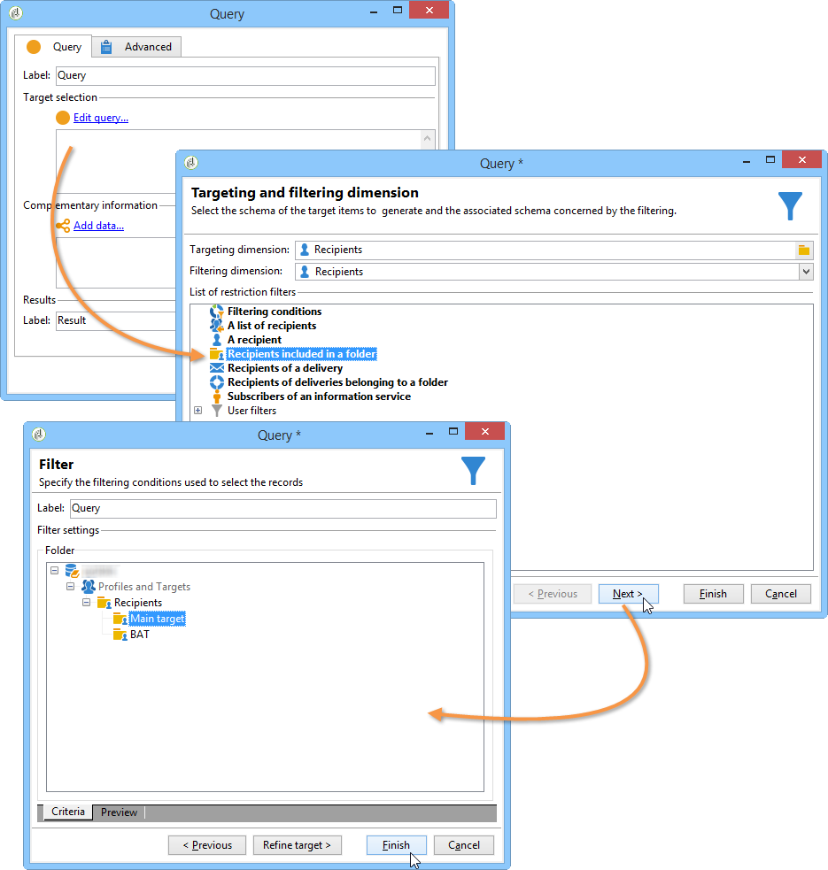
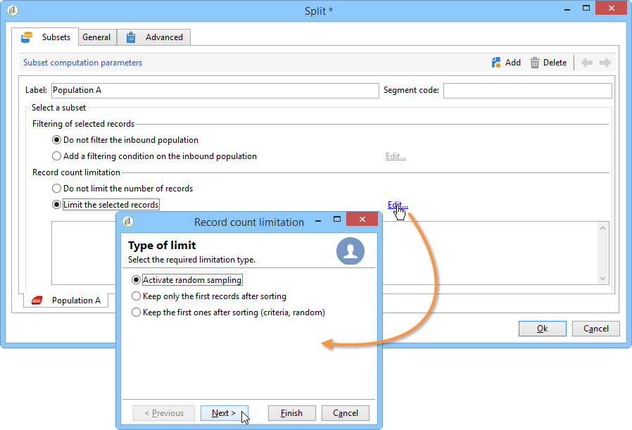

# Configurazione dei campioni popolazione {#step-2--configuring-population-samples}

## Configurazione dell&#39;attività Query {#configuring-the-query-activity}

* Fate doppio clic sull&#39;attività **[!UICONTROL Query]**.

   

* Fare clic sul collegamento **[!UICONTROL Edit query]** e selezionare i destinatari desiderati.

   

* Collegate l&#39;attività **[!UICONTROL Query]** all&#39;attività **[!UICONTROL Split]**.

   

## Configurazione dell&#39;attività divisa {#configuring-the-split-activity}

Questa attività consente di creare diverse popolazioni: quella che riceve la consegna A, quella che riceve la consegna B, e la popolazione rimanente. Utilizzando la selezione casuale è possibile eseguire il targeting di una parte della popolazione di ciascuna consegna.

1. Creazione popolazione A:

   * Fate doppio clic sull&#39;attività **[!UICONTROL Split]**.

      

   * Nella scheda esistente, modificare l&#39;etichetta nella popolazione A.

      

   * Selezionare l&#39;opzione **[!UICONTROL Limit the selected records]**.

      

   * Fare clic sul collegamento **[!UICONTROL Edit]**, selezionare **[!UICONTROL Activate random sampling]**, quindi fare clic su **[!UICONTROL Next]**.

      

   * Impostate la soglia su 10%, quindi fate clic su **[!UICONTROL Finish]**.

      

1. Creazione popolazione B:

   * Fare clic su **[!UICONTROL Add]** per creare una nuova scheda per la popolazione B.

      

   * Limitare la popolazione al 10% come in precedenza.

      

1. Creazione della popolazione rimanente:

   * Vai alla scheda **[!UICONTROL General]**. 

      

   * Seleziona **[!UICONTROL Generate complement]**.

      

   * Modificate l&#39;etichetta per specificare che la popolazione non include né A né B, quindi fate clic su **[!UICONTROL OK]** per chiudere l&#39;attività.

      
