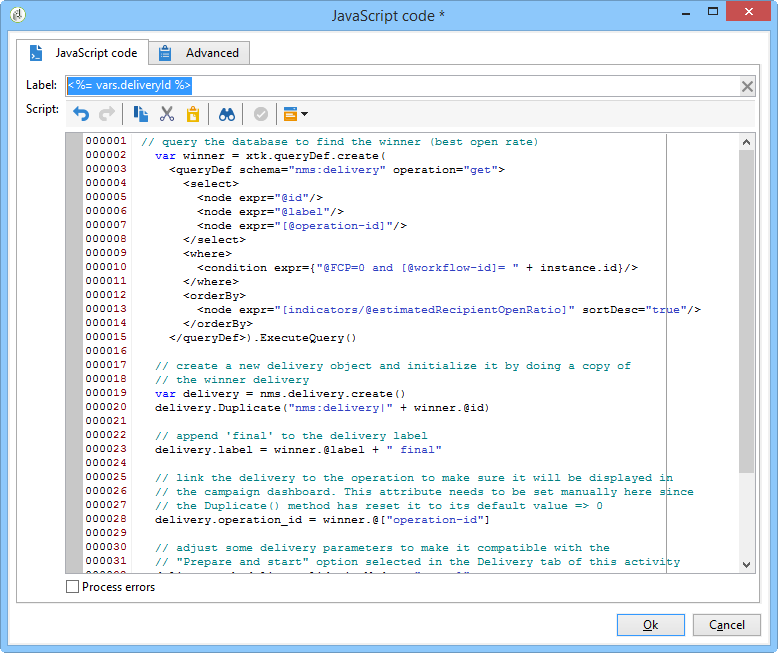

# Creazione dello script {#step-5--creating-the-script}

La scelta del contenuto di distribuzione destinato alla popolazione rimanente viene calcolata da uno script. Questo script recupera le informazioni relative alla distribuzione con la frequenza più elevata di aperture e copia il contenuto nella distribuzione finale.

## Esempio di script {#example-of-a-script}

Lo script seguente può essere utilizzato come nel flusso di lavoro di targeting. Per ulteriori informazioni, vedere [Implementazione](#implementation).

```
 // query the database to find the winner (best open rate)
   var winner = xtk.queryDef.create(
     <queryDef schema="nms:delivery" operation="get">
       <select>
         <node expr="@id"/>
         <node expr="@label"/>
         <node expr="[@operation-id]"/>
         <node expr="[@workflow-id]"/>
       </select>
       <where>
         <condition expr={"@FCP=0 and [@workflow-id]= " + instance.id}/>
       </where>
       <orderBy>
         <node expr="[indicators/@estimatedRecipientOpenRatio]" sortDesc="true"/>
       </orderBy>
     </queryDef>).ExecuteQuery()
   
   // create a new delivery object and initialize it by doing a copy of
   // the winner delivery
   var delivery = nms.delivery.create()
   delivery.Duplicate("nms:delivery|" + winner.@id)

   // append 'final' to the delivery label
   delivery.label = winner.@label + " final"

   // link the delivery to the operation to make sure it will be displayed in
   // the campaign dashboard. This attribute needs to be set manually here since 
   // the Duplicate() method has reset it to its default value => 0
   delivery.operation_id = winner.@["operation-id"]
   delivery.workflow_id = winner.@["workflow-id"]

   // adjust some delivery parameters to make it compatible with the 
   // "Prepare and start" option selected in the Delivery tab of this activity
   delivery.scheduling.validationMode = "manual"
   delivery.scheduling.delayed = 0
 
   // save the delivery in database
   delivery.save()
 
   // store the new delivery Id in event variables
   vars.deliveryId = delivery.id
```

Per una spiegazione dettagliata dello script, fare riferimento a [Dettagli dello script](#details-of-the-script).

## Implementazione {#implementation}

1. Aprite l&#39;attività **[!UICONTROL JavaScript code]**.
1. Copiare lo script offerto in [Esempio di script](#example-of-a-script) nella finestra **[!UICONTROL JavaScript code]**.

   

1. Nel campo **[!UICONTROL Label]**, immettere il nome dello script, ovvero

   ```
   <%= vars.deliveryId %>
   ```

   

1. Chiudere l&#39;attività **[!UICONTROL JavaScript code]**.
1. Salva il flusso di lavoro.

## Dettagli dello script {#details-of-the-script}

In questa sezione vengono descritte le varie parti dello script e la relativa modalità operativa.

* La prima parte dello script è una query. Il comando **queryDef** consente di recuperare dalla tabella **NmsDelivery** le consegne create mediante l&#39;esecuzione del flusso di lavoro di targeting e di ordinarle in base al tasso stimato di apertura, quindi le informazioni relative alla consegna con il tasso più alto di aperture vengono recuperate.

   ```
   // query the database to find the winner (best open rate)
      var winner = xtk.queryDef.create(
        <queryDef schema="nms:delivery" operation="get">
          <select>
            <node expr="@id"/>
            <node expr="@label"/>
            <node expr="[@operation-id]"/>
          </select>
          <where>
            <condition expr={"@FCP=0 and [@workflow-id]= " + instance.id}/>
          </where>
          <orderBy>
            <node expr="[indicators/@estimatedRecipientOpenRatio]" sortDesc="true"/>
          </orderBy>
        </queryDef>).ExecuteQuery()
   ```

* La distribuzione con la frequenza più elevata di aperture viene duplicata.

   ```
    // create a new delivery object and initialize it by doing a copy of
    // the winner delivery
   var delivery = nms.delivery.create()
   delivery.Duplicate("nms:delivery|" + winner.@id)
   ```

* L&#39;etichetta della consegna duplicata viene modificata e vi viene aggiunta la parola **final**.

   ```
   // append 'final' to the delivery label
   delivery.label = winner.@label + " final"
   ```

* La distribuzione viene copiata nel dashboard della campagna.

   ```
   // link the delivery to the operation to make sure it will be displayed in
   // the campaign dashboard. This attribute needs to be set manually here since 
   // the Duplicate() method has reset it to its default value => 0
   delivery.operation_id = winner.@["operation-id"]
   delivery.workflow_id = winner.@["workflow-id"]
   ```

   ```
   // adjust some delivery parameters to make it compatible with the 
   // "Prepare and start" option selected in the Delivery tab of this activity
   delivery.scheduling.validationMode = "manual"
   delivery.scheduling.delayed = 0
   ```

* La consegna viene salvata nel database.

   ```
   // save the delivery in database
   delivery.save()
   ```

* L’identificatore univoco della consegna duplicata viene memorizzato nella variabile del flusso di lavoro.

   ```
   // store the new delivery Id in event variables
   vars.deliveryId = delivery.id
   ```

## Altri criteri di selezione {#other-selection-criteria}

L&#39;esempio precedente consente di selezionare il contenuto di una consegna in base al tasso di apertura delle e-mail. Puoi adattarlo in base ad altri indicatori specifici per la consegna:

* Velocità effettiva clic ottimale: `[indicators/@recipientClickRatio]`,
* Velocità di reattività più elevata (apertura e clic dell’e-mail nel messaggio): `[indicators/@reactivity]`,
* Tasso di reclamo più basso: `[indicators/@refusedRatio]` (utilizzate il valore false per l&#39;attributo sortDesc),
* Tasso di conversione più elevato: `[indicators/@transactionRatio]`,
* Numero di pagine visitate dopo la ricezione di un messaggio: `[indicators/@totalWebPage]`,
* Tasso di annullamento sottoscrizione inferiore: `[indicators/@optOutRatio]`,
* Importo transazione: `[indicators/@amount]`.
