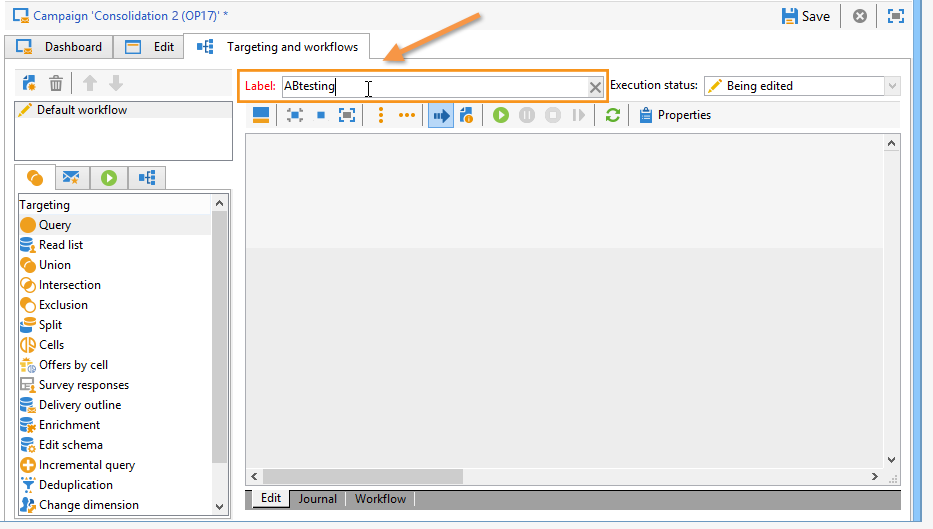
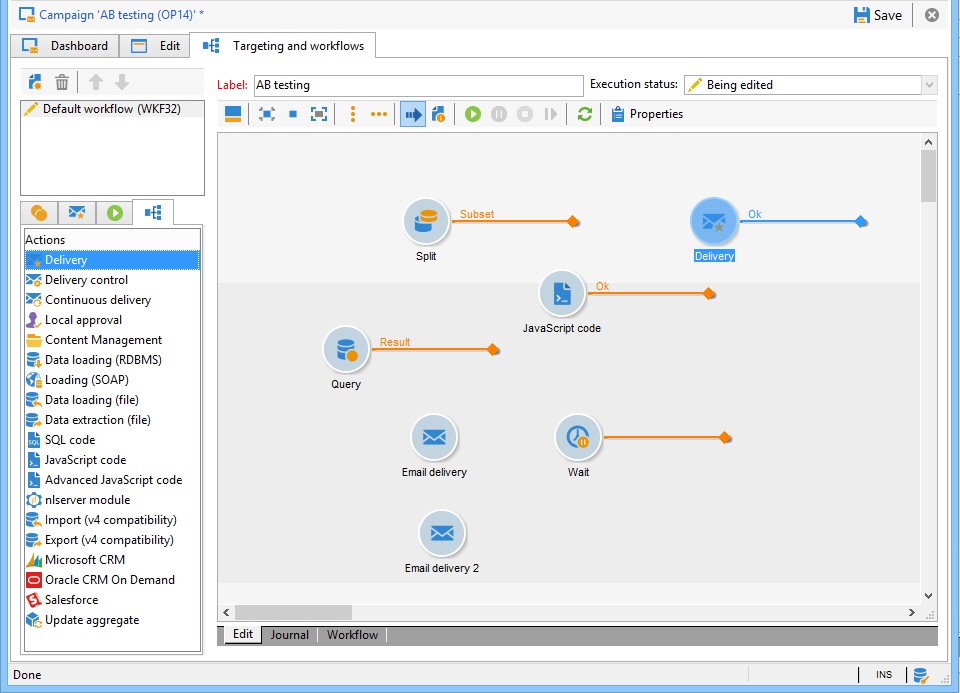

# Test AB: creare un flusso di lavoro di targeting {#step-1--creating-a-targeting-workflow}

È necessario creare il flusso di lavoro nella scheda **[!UICONTROL Targeting and Workflows]** di una campagna. È costituita da un&#39;attività **[!UICONTROL Query]**, un&#39;attività **[!UICONTROL Split]** collegata a due attività **[!UICONTROL Email delivery]**, un&#39;attività **[!UICONTROL Wait]**, un&#39;attività **[!UICONTROL JavaScript code]** e un&#39;attività **[!UICONTROL Delivery]**.

1. Se non lo hai già fatto, crea una campagna. Per ulteriori informazioni, fai riferimento alla [documentazione di Campaign v8](https://experienceleague.adobe.com/docs/campaign/automation/campaign-orchestration/set-up-campaigns.html?lang=it){target=_blank}.

   

1. Vai alla scheda **[!UICONTROL Targeting and Workflows]**.

   

1. Modifica l&#39;etichetta del flusso di lavoro esistente o fai clic su **[!UICONTROL Add]** per crearne una nuova (per ulteriori informazioni, consulta la [documentazione di Campaign v8](https://experienceleague.adobe.com/docs/campaign/automation/campaign-orchestration/marketing-campaign-target.html?lang=it){target="_blank"}.

   

1. Utilizzare il mouse per trascinare le attività nel diagramma del flusso di lavoro, incluse una scheda **[!UICONTROL Query]** (**[!UICONTROL Target]**), una scheda **[!UICONTROL Split]** (**[!UICONTROL Target]**), due schede **[!UICONTROL Email deliveries]** (**[!UICONTROL Deliveries]**), un&#39;attività **[!UICONTROL Wait]** (**[!UICONTROL Flow Control]**), un&#39;attività **[!UICONTROL JavaScript code]** (**[!UICONTROL Actions]**) e un&#39;attività **[!UICONTROL Delivery]** (**[!UICONTROL Actions]**).

Ora puoi configurare i campioni di popolazione. [Ulteriori informazioni](a-b-testing-uc-population-samples.md).
