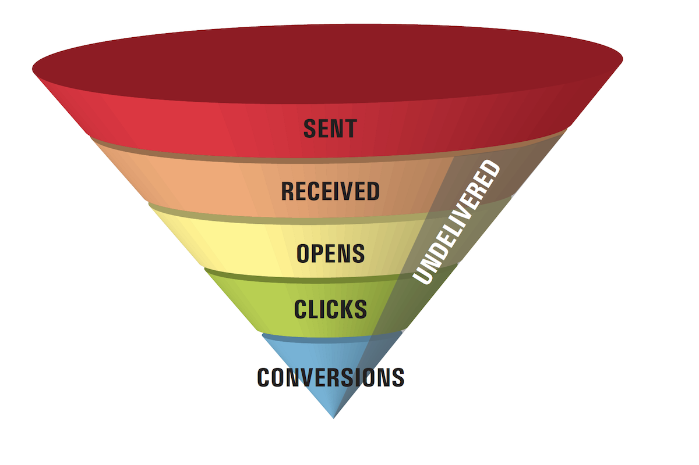

# Informazioni sul recapito messaggi{#about-deliverability}

Adobe Campaign offre un certo numero di strumenti per monitorare le prestazioni di recapito della tua piattaforma. In questa sezione vengono inoltre evidenziati i principi principali da tenere a mente per la gestione e l&#39;ottimizzazione della recapito.

## Configurazione {#configuration}

Questa funzione è disponibile tramite un pacchetto dedicato in Adobe Campaign. Per utilizzarlo, il pacchetto deve essere installato. Al termine, riavviate il server per prendere in considerazione il pacchetto.
* Per i client ospitati e ibridi, il monitoraggio **della** recapito è configurato sull&#39;istanza dall&#39;assistenza tecnica e dai consulenti Adobe. Per ulteriori informazioni, contattate il vostro responsabile commerciale di Adobe.

* Per le installazioni in sede, è necessario installare il **[!UICONTROL Deliverability monitoring (Email Deliverability)]** pacchetto tramite il menu **[!UICONTROL Tools]** > **[!UICONTROL Advanced]** > **[!UICONTROL Import package]** . Per ulteriori informazioni, consulta [Installazione dei pacchetti](../../installation/using/installing-campaign-standard-packages.md)standard di Campaign Classic.

In Adobe Campaign Classic, il monitoraggio della **recapito** è gestito dal **[!UICONTROL Refresh for deliverability]** flusso di lavoro. È installato per impostazione predefinita in tutte le istanze e consente di inizializzare l&#39;elenco delle regole di qualificazione della posta indesiderata, l&#39;elenco dei domini e l&#39;elenco di MX. Una volta installato il **[!UICONTROL Deliverability monitoring (Email Deliverability)]** pacchetto, il flusso di lavoro viene eseguito ogni notte per aggiornare regolarmente l&#39;elenco delle regole e consente di gestire attivamente la distribuzione della piattaforma.

## Sfondo {#background}

La possibilità di distribuire e-mail rappresenta una grande sfida per gli addetti al marketing, che inviino migliaia di messaggi o diversi miliardi. Un messaggio su cinque non arriva mai alla inbox né al destinatario previsto.

Una volta relegata come &quot;questione tecnica&quot; per il reparto IT, la possibilità di inviare e-mail continua a crescere nell&#39;agenda di marketing. Questo perché gli esperti di marketing esperti riconoscono che, sebbene molti dei suoi elementi siano di natura tecnica, la recapito è in definitiva un problema aziendale con importanti implicazioni di fatturato.

Considerate l&#39;imbuto di marketing delle e-mail. La recapito determina il numero di messaggi ricevuti, che a sua volta influisce su ogni fase successiva dell&#39;imbuto. Meno e-mail ricevute determinano un numero inferiore di aperture, meno clic e meno conversioni. **Per le aziende con un grande database, la differenza tra la media e la grande consegnabilità potrebbe letteralmente significare tra centinaia di migliaia e milioni di dollari di ricavi.**

Impostando la possibilità di una consegna media (80%), gli esperti di marketing stanno lasciando sul tavolo conversioni significative - e dollari -.

Cos&#39;è esattamente la recapito delle e-mail? E come possono i professionisti del marketing migliorare i tassi di recapito per ampliare la bocca del funnel e ottenere più risultati dalle campagne e-mail?

Per &quot;recapito e-mail&quot; si intende l&#39;insieme di caratteristiche che determinano la capacità di un messaggio di raggiungere la sua destinazione, tramite un indirizzo e-mail personale, entro breve tempo e con la qualità prevista in termini di contenuto e formato. Queste caratteristiche sono suddivise in quattro categorie principali: qualità dei dati, messaggi e contenuti, infrastruttura di invio e reputazione. Insieme, costituiscono la base di un programma di recapito e-mail di successo. Questa panoramica illustra i quattro principi fondamentali del successo della distribuzione delle e-mail e offre le best practice per raggiungere la inbox e incrementare i ricavi derivanti dai programmi di e-mail marketing.

<!---->
